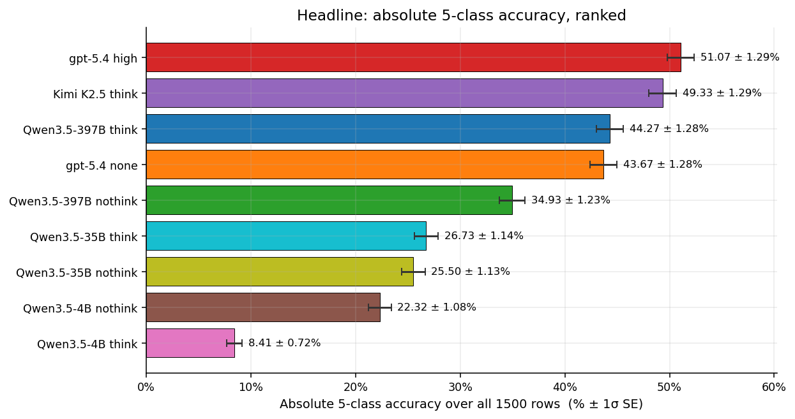
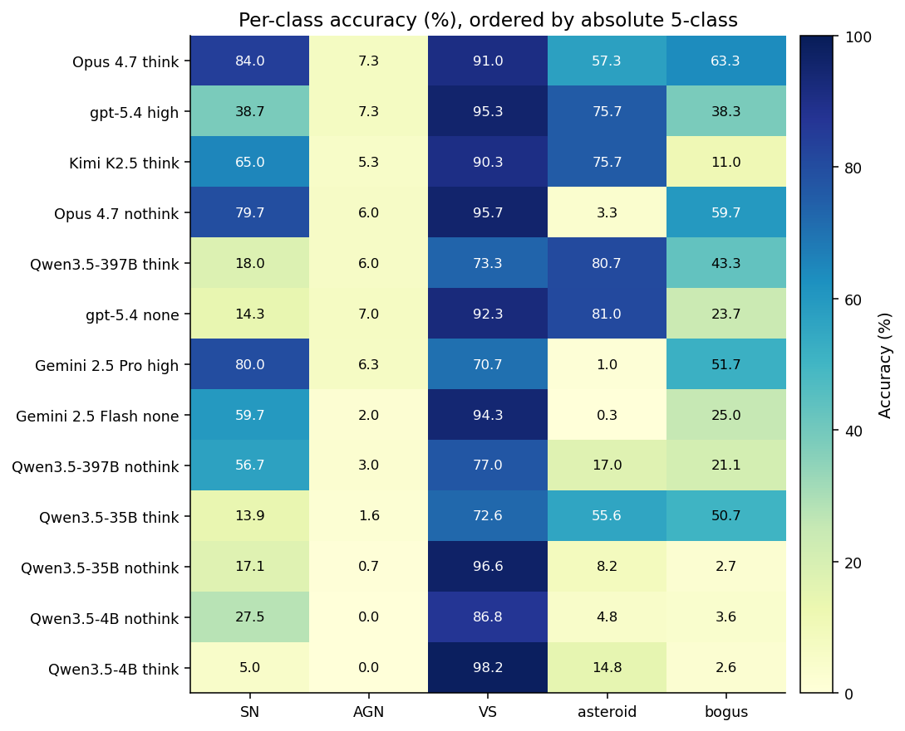
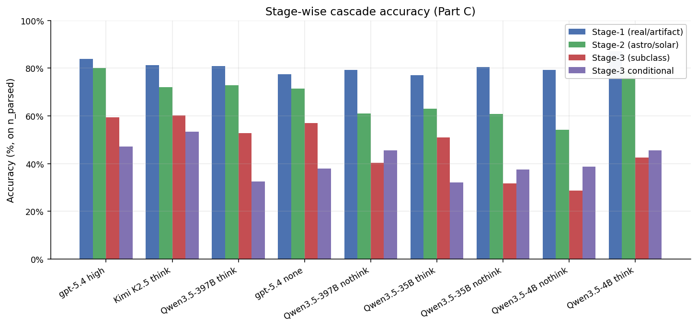
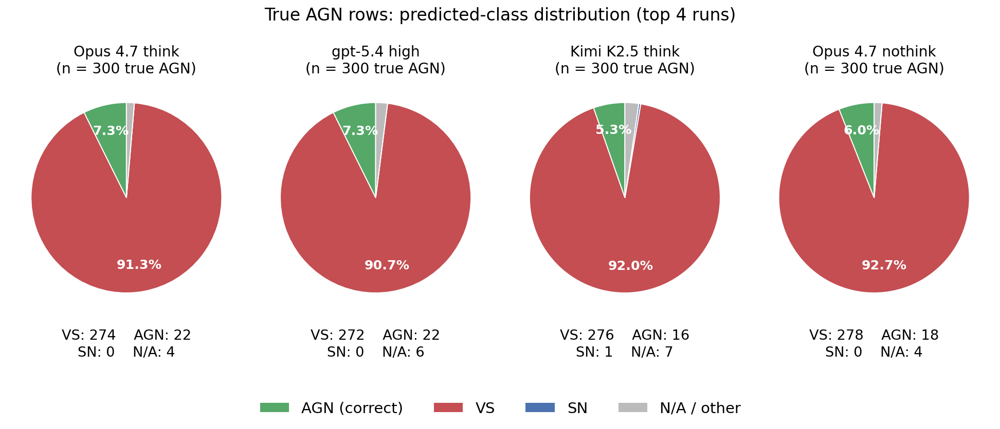
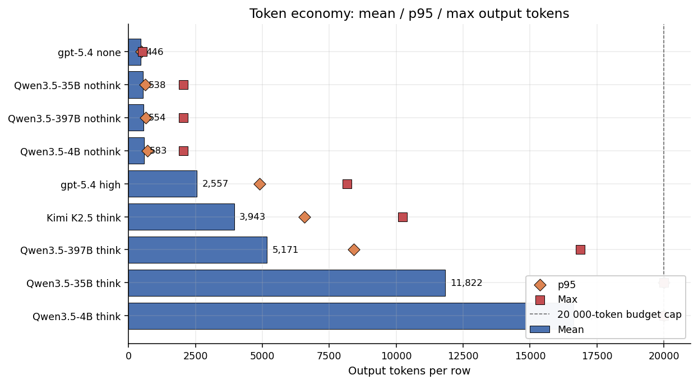
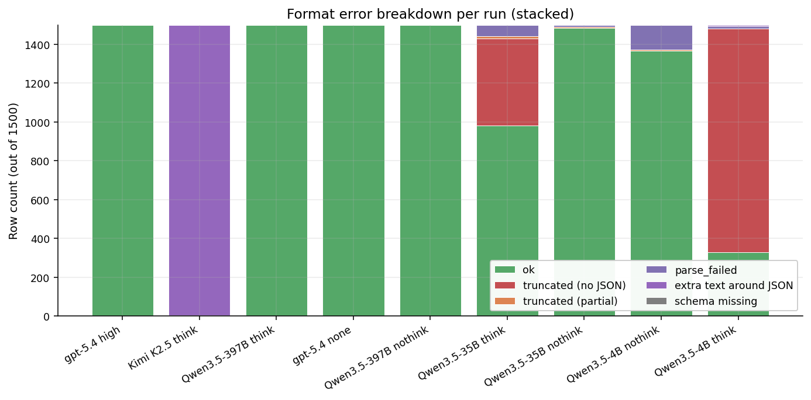
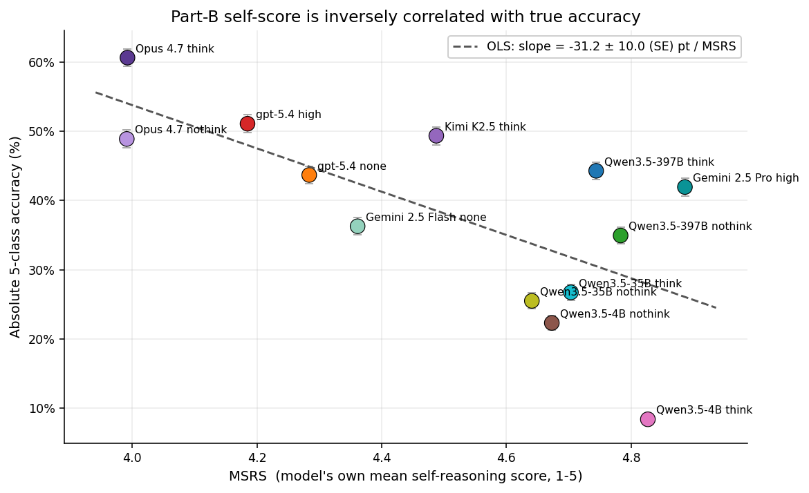
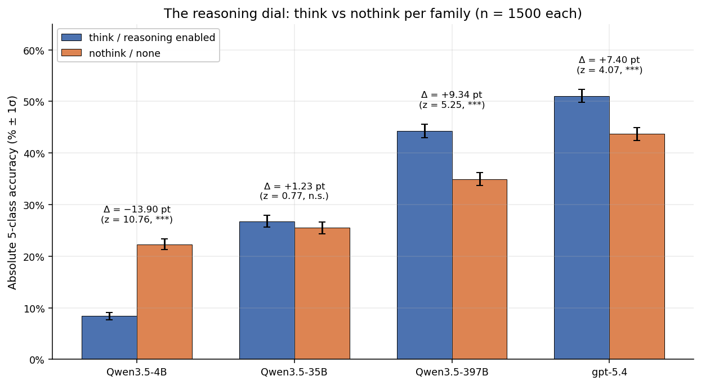
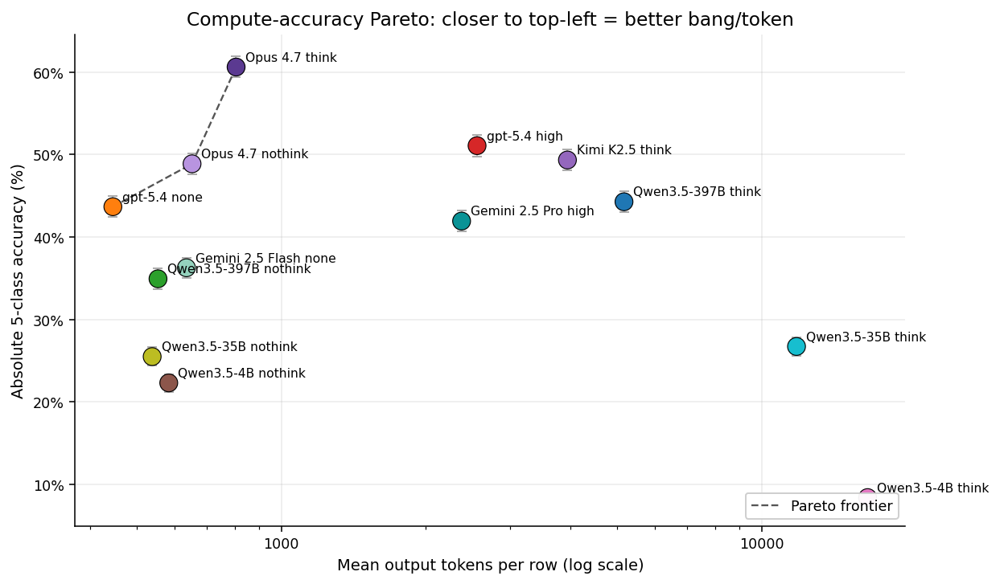

# Full-benchmark comparison — 13 runs on `manifest_benchmark_final.csv` (Apr 21 2026, refreshed Apr 22 with SE, Apr 24 extended to 13 runs, Apr 25 wall-clock back-fill)

Cross-run comparison of **every completed 1500-row benchmark** in this project. All runs share the same manifest (`data/manifest_benchmark_final.csv`, 300 per class across SN / AGN / VS / asteroid / bogus, built by taking the top 300-by-ALERCE-probability per class with no oid overlap against any fewshot, expert_examples, or human_baselines sample), the same prompt module (**`prompts.py`** — AstroAlertBench-style Parts A–C JSON schema and ZTF field reference in the system message), the same `evaluate.py` parser, and the same 20 000-token output budget (or the API-side default cap of 2 048 / 20 000 wired through the backend wrapper).

**Apr 24 second refresh — extended from 9 to 13 runs.** Four new closed-source runs were added: Anthropic Claude Opus 4.7 (adaptive-thinking and disabled-thinking) and Google Gemini 2.5 (Pro with `thinking_budget=-1`, Flash with `thinking_budget=0`). All four reached 1500 / 1500 clean rows after `retry_failed.py` covered the rate-limit-induced gaps (Opus nothink had 621 missing rows after the initial 30 k input-tpm sweep; Gemini 2.5 Pro had ~50 fail / ~1 350 unrun rows after the quota ceiling). The headline ranking, per-class SOTA, stage-3 macro F1, think-vs-nothink pair table, closed-vs-open verdict and the compute-accuracy Pareto frontier all change as a result; see Section 1 for the new ranking.

**Apr 25 wall-clock.** Section §6.1 lists end-to-end wall-clock for all 13 runs in a single table (`Run`, `Concurrency`, `Total wall-clock`, `s/row`). New sweeps record timing automatically via `run_tinker_benchmark.py` / `retry_failed.py` (`<results>.runmeta.json`, `metrics.json`, per-run `report.md`).

**Apr 22 first refresh:** both GPT-5.4 runs had 429 insufficient-quota nulls in the initial pass (55 on `high`, 240 on `none`). Those were back-filled by `retry_failed.py` so both JSONLs now contain 1500/1500 clean rows (0 runtime errors).

**Standard error convention:** every proportion in this report (5-class accuracy, parse rate, per-class accuracy, stage-wise accuracy, precision, recall, self-pass rate) is annotated with its 1σ binomial standard error, `SE = √(p·(1−p)/n)`. Differences between two independent runs use `SE_Δ = √(SE₁² + SE₂²)`. The reported `±` is **1·SE**, not a 95 % CI — multiply by ~1.96 for that. F1 is point-only (no closed-form binomial SE). Counts (token totals, confusion-matrix cells, error-mode counts) are not annotated. The `n` underlying each SE is shown in the per-class denominator column or footnote of each table.

**Figures.** Nine charts are embedded inline at the section where they are discussed. Each figure is referenced by number (Fig 1 … Fig 9) in the surrounding narrative, so the prose and the pictures read as one integrated document rather than as a table-of-figures appendix. The PNGs live under `charts/benchmark_full_apr21/` and are regenerated end-to-end by `python -m viz._make_charts_benchmark_full_apr21` (which reads the thirteen `metrics.json` files directly, so the figures always agree with the tables).

| Fig | Section | What it shows |
|---:|---|---|
| 1 | §1 | Headline bar — absolute 5-class accuracy ranked, with 1σ SE error bars |
| 2 | §2 | Per-class accuracy heatmap (13 runs × 5 classes) |
| 3 | §3 | Stage-wise cascade bars (Stage-1 / Stage-2 / Stage-3 / Stage-3 conditional) |
| 4 | §4 | AGN-collapse pies — true-AGN predicted-class distribution for the top 4 runs |
| 5 | §6 | Token economy — mean bars + p95 / max markers + 20k cap (§6.1: wall-clock runtime table) |
| 6 | §7 | Format error breakdown — stacked row-outcome bars |
| 7 | §9 | MSRS vs absolute accuracy scatter, with linear fit |
| 8 | §10 | Think-vs-nothink paired bars per family, with Δ and z annotations |
| 9 | §12 | Compute-accuracy Pareto scatter (accuracy vs mean output tokens, log x) |

The changing axes are:

- **Model family** (Claude Opus 4.7 / GPT-5.4 / Gemini 2.5 Pro / Gemini 2.5 Flash / Kimi K2.5 / Qwen3.5-{4B, 35B-A3B, 397B-A17B})
- **Reasoning mode** (thinking-enabled vs direct-answer, where the model supports it)
- **Backend** (`anthropic` for Claude, `openai` for GPT-5.4, `google` for Gemini, `tinker` for open-source)

Source of metrics: each run's `runs/<ts>-<slug>/metrics.json` (as computed by `evaluate.evaluate_jsonl`). Source of narratives: each run's `report.md` under `runs/`.

---

## Runs covered (13 × n=1500)

| # | Slug | Run folder | Model | Reasoning | Backend |
|---|---|---|---|---|---|
| 1 | `opus47-think-benchmark-full` | `runs/20260423-0942-...` | Claude Opus 4.7 | adaptive thinking (effort=high) | anthropic |
| 2 | `gpt-5.4-high-benchmark-full` | `runs/20260421-2024-...` | gpt-5.4 | high | openai |
| 3 | `kimi-k25-benchmark-full` | `runs/20260420-1226-...` | Kimi K2.5 | think (default renderer) | tinker |
| 4 | `opus47-nothink-benchmark-full` | `runs/20260424-2324-...` | Claude Opus 4.7 | thinking disabled | anthropic |
| 5 | `qwen35-397b-a17b-benchmark-full` | `runs/20260420-1554-...` | Qwen3.5-397B-A17B | think | tinker |
| 6 | `gpt-5.4-none-benchmark-full` | `runs/20260421-2032-...` | gpt-5.4 | none | openai |
| 7 | `gemini25-pro-high-benchmark-full` | `runs/20260424-1809-...` | Gemini 2.5 Pro | `thinking_budget=-1` (dynamic) | google |
| 8 | `gemini25-flash-none-benchmark-full` | `runs/20260423-2110-...` | Gemini 2.5 Flash | `thinking_budget=0` | google |
| 9 | `qwen35-397b-a17b-nothink-benchmark-full` | `runs/20260421-0025-...` | Qwen3.5-397B-A17B | nothink (*DisableThinkingRenderer*) | tinker |
| 10 | `qwen35-35b-a3b-benchmark-full` | `runs/20260420-2054-...` | Qwen3.5-35B-A3B | think | tinker |
| 11 | `qwen35-35b-a3b-nothink-benchmark-full` | `runs/20260421-0019-...` | Qwen3.5-35B-A3B | nothink | tinker |
| 12 | `qwen35-4b-nothink-benchmark-full` | `runs/20260421-0002-...` | Qwen3.5-4B | nothink | tinker |
| 13 | `qwen35-4b-benchmark-full` | `runs/20260420-1920-...` | Qwen3.5-4B | think | tinker |

All 13 runs: `prompt_module = prompts` (i.e. **`prompts.py`**), n_examples = 1500. `max_tokens` is 20 000 for reasoning-enabled runs (gpt-5.4 high, Opus 4.7 think, Gemini 2.5 Pro, all Qwen-think, Kimi) and 2 048 for direct-answer runs (gpt-5.4 none, Opus 4.7 nothink, Gemini 2.5 Flash, all Qwen-nothink). Concurrency: 32 for Tinker; 16 / 8 for OpenAI initial / retry; 2 for Anthropic (rate-limit-bound under the 30 k input-tpm cap) with SDK retry on 429/5xx; 4 for Google with SDK retry on 429/5xx. Resume runs (Opus 4.7 nothink: 879 → 1500 via `retry_failed.py`; Gemini 2.5 Pro: ~100 → 1500 via `retry_failed.py`; both GPT-5.4 runs: see Apr-22 note) all share the original sweep's prompt and config.

---

## 1. Headline numbers

5-class accuracy is **computed over rows whose JSON parsed cleanly** (the reported `part_c_final_5class_accuracy`). Because parse rate varies across runs, the most honest single metric is the **absolute 5-class accuracy over all 1500 rows = parse_rate × reported_5class** (last column). For the eight closed-source runs (Opus 4.7 ×2, GPT-5.4 ×2, Gemini 2.5 ×2) and Qwen3.5-397B think / nothink and Kimi K2.5 think the parse rates are ≥ 99.8 %, so "on parsed" and "absolute over 1500" are within 0.1 pt of each other for those rows. Each `±` is the 1σ binomial SE; the denominator is `n_parsed` for the "on parsed" column and `n_total = 1500` for parse-rate / absolute columns.

| Rank | Run | 5-class (on parsed) | Parse rate | Truncation | **Absolute 5-class (all 1500)** | Stage-3 macro F1 | MSRS |
|---:|---|---:|---:|---:|---:|---:|---:|
| **1** | **Claude Opus 4.7 (think)** | **60.60 ± 1.26 %** (n=1500) | **100.00 ± 0.00 %** | 0.00 % | **60.60 ± 1.26 %** | **0.558** | 3.99 |
| 2 | gpt-5.4 high | 51.07 ± 1.29 % (n=1500) | 100.00 ± 0.00 % | 0.00 % | 51.07 ± 1.29 % | 0.4345 | 4.19 |
| 3 | Kimi K2.5 (think) | 49.43 ± 1.29 % (n=1497) | 99.80 ± 0.12 % | 0.00 % | 49.34 ± 1.29 % | 0.500 | 4.49 |
| 4 | Claude Opus 4.7 (nothink) | 48.87 ± 1.29 % (n=1500) | 100.00 ± 0.00 % | 0.00 % | 48.87 ± 1.29 % | 0.548 | 3.99 |
| 5 | Qwen3.5-397B-A17B (think) | 44.27 ± 1.28 % (n=1500) | 100.00 ± 0.00 % | 0.00 % | 44.27 ± 1.28 % | 0.310 | 4.74 |
| 6 | gpt-5.4 none | 43.67 ± 1.28 % (n=1500) | 100.00 ± 0.00 % | 0.00 % | 43.67 ± 1.28 % | 0.329 | 4.28 |
| 7 | Gemini 2.5 Pro (high) | 41.93 ± 1.27 % (n=1500) | 100.00 ± 0.00 % | 0.00 % | 41.93 ± 1.27 % | 0.509 | **4.89** |
| 8 | Gemini 2.5 Flash (none) | 36.27 ± 1.24 % (n=1500) | 100.00 ± 0.00 % | 0.00 % | 36.27 ± 1.24 % | 0.456 | 4.36 |
| 9 | Qwen3.5-397B-A17B (nothink) | 34.98 ± 1.23 % (n=1498) | 99.87 ± 0.09 % | 0.07 % | 34.93 ± 1.23 % | 0.430 | 4.78 |
| 10 | Qwen3.5-35B-A3B (think) | 40.83 ± 1.58 % (n=967) | 65.47 ± 1.23 % | 31.00 % | 26.73 ± 1.14 % | 0.271 | 4.70 |
| 11 | Qwen3.5-35B-A3B (nothink) | 25.76 ± 1.13 % (n=1485) | 99.00 ± 0.26 % | 0.33 % | 25.50 ± 1.13 % | 0.273 | 4.64 |
| 12 | Qwen3.5-4B (nothink) | 24.49 ± 1.16 % (n=1367) | 91.13 ± 0.73 % | 0.33 % | 22.32 ± 1.08 % | 0.307 | 4.67 |
| 13 | Qwen3.5-4B (think) | 37.78 ± 2.72 % (n=317) | **22.27 ± 1.07 %** | **77.47 %** | 8.41 ± 0.72 % | 0.241 | 4.83 |

*Fig 1. Absolute 5-class accuracy over all 1500 rows per run, ranked. Error bars are 1σ binomial SE. **Claude Opus 4.7 think (top bar) opens the largest single-bar gap in this report's history**: +9.53 ± 1.80 pt over GPT-5.4 high (z = 5.30), the only headline-position move that is comfortably outside ±2 SE. The #2 ↔ #3 gap (GPT-5.4 high vs Kimi K2.5 think) is +1.73 ± 1.82 pt (z = 0.95) and remains a tie on n = 1500.*

**Headline findings** (see Fig 1 for the ranked view):

1. **Claude Opus 4.7 (adaptive thinking) is the new project-wide SOTA at 60.60 ± 1.26 % absolute 5-class.** It is the first run of any kind to break 55 %, let alone 60 %. The gap to the previous SOTA (GPT-5.4 high, 51.07 ± 1.29 %) is **+9.53 ± 1.80 pt** with z = 5.30 (✱✱✱) — the first headline gap in this comparison series that is unambiguously outside the binomial-SE band on n = 1500. At a per-class level, Opus 4.7 think is also the new SOTA on **SN (84.00 %), bogus (63.33 %), Stage-1 (86.60 %), Stage-2 (81.60 %), Stage-3 (66.80 %), Stage-3 conditional (60.78 %), and Stage-3 macro F1 (0.558)**. The only top-line columns it does *not* lead are AGN (tied at 7.33 % with GPT-5.4 high), VS (taken by its own nothink sibling at 95.67 %, see §2), and asteroid (held by GPT-5.4 none at 81.00 %).
2. **GPT-5.4 high drops to rank 2** (51.07 ± 1.29 %) and is now in the same statistical neighbourhood as Kimi K2.5 think (49.34 ± 1.29 %, +1.73 ± 1.82 pt over Kimi, z = 0.95, n.s.) and Claude Opus 4.7 nothink (48.87 ± 1.29 %, +2.20 ± 1.83 pt over Opus nothink, z = 1.20, n.s.). The four runs from rank 2 to rank 5 (GPT-5.4 high → Kimi → Opus nothink → Qwen3.5-397B think) span only ~7 pt and the consecutive #2↔#3 and #3↔#4 gaps are both inside ±2 SE.
3. **Claude Opus 4.7 nothink (rank 4) is the cheapest run that clears 48 % absolute** at 652 mean output tokens — see §6 and §12. It also has the highest **VS recall** (95.67 ± 1.18 %) and the second-best Stage-3 macro F1 (0.548) in the entire batch.
4. **Both Gemini 2.5 runs underperform their compute class.** Gemini 2.5 Pro (high) at 41.93 ± 1.27 % uses 2 374 mean output tokens (comparable to GPT-5.4 high's 2 557) but lands ~9 pt below GPT-5.4 high and ~7 pt below Opus nothink — the largest closed-source-vs-closed-source efficiency gap in the table. Gemini 2.5 Flash (none) at 36.27 ± 1.24 % is also the worst direct-answer closed-source run. The dominant pathology in both Gemini runs is **catastrophic asteroid collapse** (1.0 % and 0.33 % respectively; see §2 and §4).
5. **gpt-5.4 none rises to rank 6** after the Apr-22 retry. At 43.67 ± 1.28 % absolute it beats both Gemini 2.5 Flash (none) (36.27 ± 1.24 %; Δ = +7.40 ± 1.78 pt, z = 4.16) and Qwen3.5-397B nothink (34.93 ± 1.23 %; Δ = +8.74 ± 1.78 pt, z = 4.91) despite being the **cheapest run in the entire batch** at 446 mean output tokens — see §6.
6. **Qwen3.5-4B (think) remains the only outright-broken run** — the shortest bar in Fig 1: 77.47 % truncation means 1162 / 1500 rows produced no parseable answer at all. Only 8.41 ± 0.72 % of all 1500 rows are correctly labelled.
7. **Significance ranking of headline gaps (vs Opus 4.7 think, all SE_Δ ≈ 1.78–1.82 pt):** vs GPT-5.4 high z = 5.30, vs Kimi z = 6.26, vs Opus nothink z = 6.52, vs Qwen3.5-397B think z = 9.07, vs gpt-5.4 none z = 9.45, vs Gemini 2.5 Pro high z = 10.46. **Every gap to the new #1 is ≥ 5 σ.** The #2 ↔ #3 ↔ #4 trio (GPT-5.4 high / Kimi / Opus nothink) is statistically indistinguishable on n = 1500.

---

## 2. Per-class accuracy

Each cell is `per_class_correct / per_class_total ± SE` from `metrics.json` (this denominator is "rows with a parseable final prediction for this class", not 300; see note under the table). SE is the 1σ binomial SE on the cell's own denominator, so cells with smaller `n` (truncated runs) have correspondingly larger error bars. Rows are ordered by absolute 5-class (rank 1 → rank 13).

| Run | SN | AGN | VS | asteroid | bogus |
|---|---:|---:|---:|---:|---:|
| Claude Opus 4.7 (think) | **84.00 ± 2.12 %** (252/300) | **7.33 ± 1.51 %** (22/300) | 91.00 ± 1.65 % (273/300) | 57.33 ± 2.86 % (172/300) | **63.33 ± 2.78 %** (190/300) |
| gpt-5.4 high | 38.67 ± 2.81 % (116/300) | **7.33 ± 1.51 %** (22/300) | 95.33 ± 1.22 % (286/300) | 75.67 ± 2.48 % (227/300) | 38.33 ± 2.81 % (115/300) |
| Kimi K2.5 (think) | 65.00 ± 2.75 % (195/300) | 5.33 ± 1.30 % (16/300) | 90.27 ± 1.72 % (269/298) | 75.67 ± 2.48 % (227/300) | 11.04 ± 1.81 % (33/299) |
| Claude Opus 4.7 (nothink) | 79.67 ± 2.32 % (239/300) | 6.00 ± 1.37 % (18/300) | **95.67 ± 1.18 %** (287/300) | 3.33 ± 1.04 % (10/300) | 59.67 ± 2.83 % (179/300) |
| Qwen3.5-397B (think) | 18.00 ± 2.22 % (54/300) | 6.00 ± 1.37 % (18/300) | 73.33 ± 2.55 % (220/300) | 80.67 ± 2.28 % (242/300) | 43.33 ± 2.86 % (130/300) |
| gpt-5.4 none | 14.33 ± 2.02 % (43/300) | 7.00 ± 1.47 % (21/300) | 92.33 ± 1.54 % (277/300) | **81.00 ± 2.26 %** (243/300) | 23.67 ± 2.45 % (71/300) |
| Gemini 2.5 Pro (high) | 80.00 ± 2.31 % (240/300) | 6.33 ± 1.41 % (19/300) | 70.67 ± 2.63 % (212/300) | 1.00 ± 0.57 % (3/300) | 51.67 ± 2.89 % (155/300) |
| Gemini 2.5 Flash (none) | 59.67 ± 2.83 % (179/300) | 2.00 ± 0.81 % (6/300) | 94.33 ± 1.34 % (283/300) | 0.33 ± 0.33 % (1/300) | 25.00 ± 2.50 % (75/300) |
| Qwen3.5-397B (nothink) | 56.67 ± 2.86 % (170/300) | 3.01 ± 0.99 % (9/299) | 77.00 ± 2.43 % (231/300) | 17.00 ± 2.17 % (51/300) | 21.07 ± 2.36 % (63/299) |
| Qwen3.5-35B (think) | 13.86 ± 2.68 % (23/166) | 1.62 ± 0.93 % (3/185) | 72.60 ± 3.01 % (159/219) | 55.61 ± 3.63 % (104/187) | 50.74 ± 3.51 % (103/203) |
| Qwen3.5-35B (nothink) | 17.14 ± 2.25 % (48/280) | 0.68 ± 0.48 % (2/293) | 96.61 ± 1.05 % (285/295) | 8.22 ± 1.61 % (24/292) | 2.68 ± 1.00 % (7/261) |
| Qwen3.5-4B (nothink) | 27.50 ± 2.88 % (66/240) | 0.00 ± 0.00 % (0/247) | 86.76 ± 2.05 % (236/272) | 4.75 ± 1.24 % (14/295) | 3.61 ± 1.12 % (10/277) |
| Qwen3.5-4B (think) | 5.00 ± 3.45 % (2/40) | 0.00 ± 0.00 % (0/95) | 98.25 ± 1.23 % (112/114) | 14.81 ± 6.84 % (4/27) | 2.56 ± 2.53 % (1/39) |

*Fig 2. Per-class accuracy heatmap (rows: 13 runs sorted top-to-bottom by absolute 5-class; columns: classes). The AGN column remains uniformly pale yellow across every row — even the new Opus 4.7 SOTA only hits 7.33 %. Two genuinely new patterns are visible: **(a)** the top row (Opus 4.7 think) is the first row that is moderately dark on **all five** columns simultaneously, including the bogus column where every prior run was either pale (Kimi 11.0 %) or absent; **(b)** the two Gemini 2.5 rows (rank 7 and rank 8) are nearly black on the asteroid column — a new failure pattern not present in any of the original 9 runs.*

> Note on denominators: the `per_class_total` is computed over rows whose JSON parsed *and* whose `stage1/stage2/stage3` mapped to a valid 5-class label via `stages_to_final_class`. Runs with high truncation (Qwen3.5-4B think, Qwen3.5-35B think) have `per_class_total < 300`. After the Apr-22 retry, both GPT-5.4 runs have full 300/300 denominators on every class; all four new closed-source runs (Opus ×2, Gemini ×2) likewise carry 300/300 on every class.

### Per-class SOTA

| Class | Best run | Score | 2nd place | Δ ± SE_Δ (z) |
|---|---|---:|---|---|
| **SN** | **Claude Opus 4.7 (think)** | **84.00 ± 2.12 %** | Gemini 2.5 Pro (high) 80.00 ± 2.31 % (Opus 4.7 nothink: 79.67 %) | +4.00 ± 3.13 pt (z = 1.27, n.s.) |
| **AGN** | **gpt-5.4 high  ⇆  Opus 4.7 (think)** | **7.33 ± 1.51 %** (each, tied) | gpt-5.4 none 7.00 ± 1.47 % | +0.33 ± 2.11 pt (z = 0.16, n.s.) |
| **VS** | **Claude Opus 4.7 (nothink)** | **95.67 ± 1.18 %** | gpt-5.4 high 95.33 ± 1.22 % | +0.34 ± 1.69 pt (z = 0.20, n.s.) |
| **asteroid** | **gpt-5.4 none** | **81.00 ± 2.26 %** | Qwen3.5-397B (think) 80.67 ± 2.28 % | +0.33 ± 3.21 pt (z = 0.10, n.s.) |
| **bogus** | **Claude Opus 4.7 (think)** | **63.33 ± 2.78 %** | Claude Opus 4.7 (nothink) 59.67 ± 2.83 % | +3.66 ± 3.97 pt (z = 0.92, n.s.) |

Qwen3.5-35B (nothink) has a nominal VS of 96.61 % which is slightly above Opus 4.7 nothink's 95.67 %, but it reaches that number by collapsing everything astrophysical-looking into VS (its other per-class numbers are near zero); not a meaningful VS specialist. The same is true for Qwen3.5-4B (think) at 98.25 % VS.

**Observations** (Fig 2 visualises the table as a 13×5 heatmap):

- **Claude Opus 4.7 think is the first model to hold ≥ 50 % on three of the five classes simultaneously** (SN 84 %, VS 91 %, bogus 63 %, asteroid 57 %) — every other run in the batch zeros out at least one or two columns. Its only weak class is AGN (7.33 %), shared with everyone.
- **AGN is still a universal failure** — every single model scores below 8 % on AGN. This is immediately obvious in Fig 2 as a vertical band of pale-yellow cells in the AGN column. The error is always the same: AGN → predicted as variable_star (see §4 and Fig 4 for the predicted-class distribution). Adding two new model families (Anthropic and Google) and going from ~70 B to multi-T parameters did not move AGN at all. This is a *prompt / representation* problem, not a model capacity problem.
- **Per-class rankings remain non-monotonic with 5-class accuracy.** Kimi still dominates SN among open-source (65 %) but loses bogus (11 %). Qwen3.5-35B (think) still leads the open-source bogus column at 50.74 ± 3.51 %, beaten only by the two Opus runs (63.33 / 59.67). The two GPT-5.4 runs still hold a near-monopoly on the asteroid column (75.67 / 81.00) — the new closed-source entrants (Opus, Gemini) all collapse asteroid: Opus think to 57.33 %, Opus nothink to 3.33 %, Gemini Pro to 1.00 %, Gemini Flash to 0.33 %. Asteroid is apparently a *prompt-style-specific* class.
- **Asteroid shows three failure regimes now, not two.** (a) "Solves it" — gpt-5.4 ×2, Qwen3.5-397B think, Kimi (~76-81 %). (b) "Half-solves it" — Opus 4.7 think (57.33 %), Qwen3.5-35B think (55.61 %). (c) "Catastrophic collapse" — both Gemini runs (≤ 1 %), Opus 4.7 nothink (3.33 %), all Qwen-nothink (≤ 17 %). The old story was "thinking helps Qwen with asteroid"; the new story is "the **direct-answer path of any model with rich pre-training (Opus, Gemini)** also collapses asteroid". The cue that distinguishes asteroid tracks from random artifacts apparently needs explicit reasoning to surface for these families, *and* the GPT-5.4-style direct-answer path is the exception, not the rule.
- **Gemini 2.5 Flash is the only run with double-digit *gain* over its think sibling on a single class** (VS 94.33 vs Pro's 70.67 — Δ = +23.66 ± 2.96 pt, z = 8.0). Pro spends thinking budget aggressively on VS and ends up over-routing real VS rows to N/A (see §4).

---

## 3. Stage-wise accuracy (Part C cascade)

All stage-wise numbers are computed over `n_p = part_c_n_evaluable` (rows that parsed JSON and produced a usable stage label). End-to-end 5-class is the same as the "on-parsed" column of Section 1. SE on Stage-3 conditional is an *upper bound* using `n_p` as the denominator — the true conditional denominator (rows where Stage-1 and Stage-2 were correct) is smaller, so the true SE is somewhat larger; treat the conditional SEs below as a lower bound on the uncertainty.

| Run | n_p | Stage-1 | Stage-2 | Stage-3 | Stage-3 conditional | End-to-end 5-class |
|---|---:|---:|---:|---:|---:|---:|
| Claude Opus 4.7 (think) | 1500 | **86.60 ± 0.88 %** | **81.60 ± 1.00 %** | **66.80 ± 1.22 %** | **60.78 ± 1.26 %** | **60.60 ± 1.26 %** |
| gpt-5.4 high | 1500 | 83.93 ± 0.95 % | 80.00 ± 1.03 % | 59.40 ± 1.27 % | 47.11 ± 1.29 % | 51.07 ± 1.29 % |
| Kimi K2.5 (think) | 1497 | 81.36 ± 1.01 % | 71.94 ± 1.16 % | 60.19 ± 1.27 % | 53.45 ± 1.29 % | 49.43 ± 1.29 % |
| Claude Opus 4.7 (nothink) | 1500 | 85.20 ± 0.92 % | 70.93 ± 1.17 % | 54.47 ± 1.29 % | 60.44 ± 1.26 % | 48.87 ± 1.29 % |
| Qwen3.5-397B (think) | 1500 | 80.87 ± 1.02 % | 72.80 ± 1.15 % | 52.80 ± 1.29 % | 32.44 ± 1.21 % | 44.27 ± 1.28 % |
| gpt-5.4 none | 1500 | 77.47 ± 1.08 % | 71.53 ± 1.17 % | 57.00 ± 1.28 % | 37.89 ± 1.25 % | 43.67 ± 1.28 % |
| Gemini 2.5 Pro (high) | 1500 | 82.27 ± 0.99 % | 63.60 ± 1.24 % | 45.53 ± 1.29 % | 52.33 ± 1.29 % | 41.93 ± 1.27 % |
| Gemini 2.5 Flash (none) | 1500 | 83.47 ± 0.96 % | 63.73 ± 1.24 % | 37.80 ± 1.25 % | 52.00 ± 1.29 % | 36.27 ± 1.24 % |
| Qwen3.5-397B (nothink) | 1498 | 79.17 ± 1.05 % | 60.95 ± 1.26 % | 40.39 ± 1.27 % | 45.61 ± 1.29 % | 34.98 ± 1.23 % |
| Qwen3.5-35B (think) | 967 | 77.15 ± 1.35 % | 62.98 ± 1.55 % | 50.98 ± 1.61 % | 32.12 ± 1.50 % | 40.83 ± 1.58 % |
| Qwen3.5-4B (think) | 317 * | 87.07 ± 1.88 % * | 78.86 ± 2.29 % * | 42.59 ± 2.78 % * | 45.60 ± 2.80 % * | 37.78 ± 2.72 % * |
| Qwen3.5-35B (nothink) | 1485 | 80.40 ± 1.03 % | 60.88 ± 1.27 % | 31.65 ± 1.21 % | 37.51 ± 1.26 % | 25.76 ± 1.13 % |
| Qwen3.5-4B (nothink) | 1367 | 79.30 ± 1.10 % | 54.21 ± 1.35 % | 28.68 ± 1.22 % | 38.67 ± 1.32 % | 24.49 ± 1.16 % |

\* Qwen3.5-4B (think) values are computed on the 317 parseable & evaluable rows (21 % of 1500). The ±SE bars are correspondingly ~2× wider than the n=1500 runs.

*Fig 3. Stage-wise cascade accuracy (Stage-1 → Stage-2 → Stage-3, plus the Stage-3-given-correct-stage-1-and-2 conditional). **The Opus 4.7 think bar group on the far left is the only one in the chart where all four bars (S1 / S2 / S3 / S3-cond) sit above 60 %** — every other run drops below 60 % on at least one of the four. Most runs lose the most accuracy between Stage-2 and Stage-3 (subclass); Opus 4.7 is the first run that genuinely lifts Stage-3 instead of merely losing less.*

**Where the models split** (Fig 3 shows this as grouped bars per run):

- **Claude Opus 4.7 think reaches a new ceiling on all four cascade stages simultaneously.** S1 86.60 ± 0.88 %, S2 81.60 ± 1.00 %, S3 66.80 ± 1.22 %, S3-cond 60.78 ± 1.26 %. The previous best on each was: S1 GPT-5.4 high 83.93 (+2.67 pt, z = 2.06, ✱), S2 GPT-5.4 high 80.00 (+1.60 pt, z = 1.14, n.s.), S3 Kimi 60.19 (+6.61 pt, z = 3.74, ✱✱✱), S3-cond Kimi 53.45 (+7.33 pt, z = 4.07, ✱✱✱). The Stage-3 and Stage-3-conditional gains over the previous frontier are the clean ones — Opus think is decisively the best subclass discriminator in the batch.
- **Stage-1 has tightened to 77-87 % with the new entrants.** All 13 runs sit in a 10-pt band on Stage-1 (real-vs-artifact), and the spread is mostly explained by selection bias on truncated runs. Real-vs-artifact is solved at all scales, and that includes both new closed-source families.
- **Stage-2 separates the closed-source frontier from open-source clearly.** The top three on S2 are Opus 4.7 think (81.60), GPT-5.4 high (80.00), Opus 4.7 nothink (70.93) — *every other run* sits below 73 %. Both Gemini runs, despite their "high" / "none" thinking budget difference, are basically tied at S2 (63.60 vs 63.73), suggesting that Gemini's astrophysical-vs-solar-system distinction is not sensitive to the thinking budget at all. That is a Gemini-family-specific finding.
- **Stage-3 (subclass) is still where the lift lives, and the new ceiling moves up from 60.19 % (Kimi) to 66.80 % (Opus 4.7 think).** The red bars in Fig 3 are the most variable of the four series: the span from Qwen-4B-nothink (28.68 ± 1.22 %) to Opus 4.7 think (66.80 ± 1.22 %) is now +38.12 ± 1.73 pt (z = 22.0). This single column accounts for most of the absolute-5-class spread.
- **Stage-3 *conditional* accuracy has a new flavor.** Opus 4.7 think (60.78 ± 1.26 %) and Opus 4.7 nothink (60.44 ± 1.26 %) are basically tied on the "given you correctly said astrophysical, did you pick the right subclass?" measure — and they're +7.33 / +6.99 pt above the previous best (Kimi 53.45), z ≈ 4 each. This means Opus's headline accuracy gain comes from getting Stage-3 *better*, not just from getting earlier stages right. Both Gemini runs land at S3-cond ≈ 52, also above the prior frontier — interesting because their absolute 5-class accuracy is mid-tier. Translation: Gemini's prompt routing decisions are the bottleneck, not its astrophysical-subclass call.

---

## 4. Stage-3 confusion matrices (true → predicted)

This is where the classification pathologies live. Columns: `supernova | variable_star | AGN | N/A`. Eleven of the thirteen runs are shown (the two smallest-`n` runs, Qwen3.5-4B think on n_p=317 and Qwen3.5-35B think on n_p=967, are listed below at reduced denominator).

**Claude Opus 4.7 (think) — new SOTA:**

|  | supernova | variable_star | AGN | N/A |
|---|---:|---:|---:|---:|
| supernova | **252** | 11 | 30 | 7 |
| variable_star | 0 | 273 | 0 | 27 |
| AGN | 0 | **274** | 22 | 4 |

**gpt-5.4 high:**

|  | supernova | variable_star | AGN | N/A |
|---|---:|---:|---:|---:|
| supernova | 116 | 21 | **141** | 22 |
| variable_star | 0 | 286 | 0 | 14 |
| AGN | 0 | **272** | 22 | 6 |

**Kimi K2.5 (think):**

|  | supernova | variable_star | AGN | N/A |
|---|---:|---:|---:|---:|
| supernova | **195** | 21 | 39 | 45 |
| variable_star | 0 | 269 | 0 | 29 |
| AGN | 1 | **276** | 16 | 7 |

**Claude Opus 4.7 (nothink):**

|  | supernova | variable_star | AGN | N/A |
|---|---:|---:|---:|---:|
| supernova | **239** | 8 | 45 | 8 |
| variable_star | 0 | 287 | 0 | 13 |
| AGN | 0 | **278** | 18 | 4 |

**Qwen3.5-397B (think):**

|  | supernova | variable_star | AGN | N/A |
|---|---:|---:|---:|---:|
| supernova | 54 | 21 | **141** | 84 |
| variable_star | 0 | 220 | 1 | 79 |
| AGN | 0 | **265** | 18 | 17 |

**gpt-5.4 none:**

|  | supernova | variable_star | AGN | N/A |
|---|---:|---:|---:|---:|
| supernova | 43 | 28 | **137** | 92 |
| variable_star | 0 | 277 | 0 | 23 |
| AGN | 0 | **253** | 21 | 26 |

**Gemini 2.5 Pro (high):**

|  | supernova | variable_star | AGN | N/A |
|---|---:|---:|---:|---:|
| supernova | **240** | 8 | 44 | 8 |
| variable_star | 0 | 212 | 0 | **88** |
| AGN | 1 | **272** | 19 | 8 |

**Gemini 2.5 Flash (none):**

|  | supernova | variable_star | AGN | N/A |
|---|---:|---:|---:|---:|
| supernova | 179 | **85** | 33 | 3 |
| variable_star | 1 | 283 | 0 | 16 |
| AGN | 1 | **292** | 6 | 1 |

**Qwen3.5-397B (nothink):**

|  | supernova | variable_star | AGN | N/A |
|---|---:|---:|---:|---:|
| supernova | **170** | 71 | 33 | 26 |
| variable_star | 1 | 231 | 3 | 65 |
| AGN | 10 | **271** | 9 | 9 |

**Qwen3.5-35B (nothink):**

|  | supernova | variable_star | AGN | N/A |
|---|---:|---:|---:|---:|
| supernova | 48 | **208** | 12 | 30 |
| variable_star | 0 | 285 | 0 | 13 |
| AGN | 4 | **284** | 2 | 7 |

**Qwen3.5-4B (nothink):**

|  | supernova | variable_star | AGN | N/A |
|---|---:|---:|---:|---:|
| supernova | 66 | **154** | 0 | 30 |
| variable_star | 10 | 236 | 0 | 36 |
| AGN | 8 | **228** | 0 | 13 |

*Fig 4. Where the 300 true-AGN rows land in the top 4 runs (Opus 4.7 think, gpt-5.4 high, Kimi K2.5 think, Opus 4.7 nothink). Across all four pies, **91-93 % of real AGN are predicted as variable_star**. Even with the new Opus 4.7 SOTA, AGN recall is still 22 / 300 (7.33 %). The AGN-collapse story holds independently of model family, scale, and reasoning mode.*

**Three universal pathologies** (Fig 4 visualises the first one as pies for the four top runs):

1. **AGN → variable_star** is present in *every* run and is unaffected by the new entrants. Opus 4.7 think misclassifies 274/300 AGN as VS (91 %); Opus 4.7 nothink 278/300; Gemini 2.5 Pro 272/300; Gemini 2.5 Flash 292/300. The previous best "least bad" (Kimi at 276/300) is matched but not beaten. The prompt does not provide sufficient signal to discriminate AGN variability from stellar variability for *any* model in the batch.
2. **SN → AGN is now a *split* problem.** Three runs still have it badly (GPT-5.4 high 141, Qwen3.5-397B think 141, GPT-5.4 none 137 — under reasoning the model argues itself into "AGN on a host"). **Opus 4.7 think reduces this dramatically** to 30/300 SN→AGN (10 %), and Opus 4.7 nothink to 45/300, and Gemini 2.5 Pro to 44/300. The Anthropic and Google pre-training apparently does not over-weight "host galaxy = AGN" the way GPT-5.4 does. Kimi continues to be the best at this among open-source (39/300).
3. **The N/A column tells you about routing confidence.** Gemini 2.5 Pro is unique in routing 88/300 *true VS* rows to N/A on Stage-3 (ie. the model's Stage-1+Stage-2 path correctly identifies them as astrophysical / stellar, but then refuses to pick a subclass). No other run does this — every other run pushes ≥ 273/300 of true VS into the variable_star cell. Translation: when Pro hits its Stage-3 disambiguation, it uses the "decline to answer" branch much more heavily than it should. This is the dominant source of Pro's mid-tier 5-class accuracy.
4. **Gemini 2.5 Flash flips the SN error pattern.** Instead of the GPT-5.4-style "SN → AGN" or the Qwen-nothink-style "SN → VS at high mass", Flash splits SN errors **across both** wrong classes (85 SN → VS, 33 SN → AGN). That is closer to "uniform confusion" than to a structured pathology.

---

## 5. Stage-3 subclass precision/recall/F1

Cells: `proportion ± SE`. Precision SE uses the predicted-column count as denominator; recall SE uses the true-row count. F1 has no closed-form binomial SE — point estimates only. Class-recall denominators are typically 300 except where parsing/truncation reduced the true-row count. Rows are sorted top-to-bottom by macro F1.

| Run | supernova P | supernova R | supernova F1 | variable_star P | variable_star R | variable_star F1 | AGN P | AGN R | AGN F1 | **Macro F1** |
|---|---:|---:|---:|---:|---:|---:|---:|---:|---:|---:|
| Claude Opus 4.7 (think) | 1.000 ± 0.000 | 0.840 ± 0.021 | **0.913** | 0.489 ± 0.020 | 0.910 ± 0.017 | 0.636 | 0.423 ± 0.069 | 0.073 ± 0.015 | 0.125 | **0.558** |
| Claude Opus 4.7 (nothink) | 1.000 ± 0.000 | 0.797 ± 0.023 | 0.887 | 0.501 ± 0.021 | **0.957 ± 0.012** | 0.658 | 0.286 ± 0.060 | 0.060 ± 0.014 | 0.099 | 0.548 |
| Gemini 2.5 Pro (high) | 0.996 ± 0.004 | 0.800 ± 0.023 | 0.887 | 0.431 ± 0.020 | 0.707 ± 0.026 | 0.535 | 0.302 ± 0.058 | 0.063 ± 0.014 | 0.105 | 0.509 |
| Kimi K2.5 (think) | 0.995 ± 0.005 | 0.650 ± 0.028 | 0.786 | 0.475 ± 0.021 | 0.903 ± 0.017 | 0.623 | 0.291 ± 0.061 | 0.053 ± 0.013 | 0.090 | 0.500 |
| Gemini 2.5 Flash (none) | 0.989 ± 0.008 | 0.597 ± 0.028 | 0.744 | 0.429 ± 0.019 | 0.943 ± 0.013 | 0.590 | 0.154 ± 0.100 | 0.020 ± 0.008 | 0.035 | 0.456 |
| gpt-5.4 high | 1.000 ± 0.000 | 0.387 ± 0.028 | 0.558 | 0.494 ± 0.021 | 0.953 ± 0.012 | **0.651** | 0.135 ± 0.027 | 0.073 ± 0.015 | 0.095 | 0.4345 |
| Qwen3.5-397B (nothink) | 0.939 ± 0.018 | 0.567 ± 0.029 | 0.707 | 0.403 ± 0.020 | 0.770 ± 0.024 | 0.529 | 0.200 ± 0.060 | 0.030 ± 0.010 | 0.052 | 0.430 |
| gpt-5.4 none | 1.000 ± 0.000 | 0.143 ± 0.020 | 0.251 | 0.496 ± 0.021 | 0.923 ± 0.015 | 0.646 | 0.133 ± 0.027 | 0.070 ± 0.015 | 0.092 | 0.329 |
| Qwen3.5-397B (think) | 1.000 ± 0.000 | 0.180 ± 0.022 | 0.305 | 0.435 ± 0.022 | 0.733 ± 0.026 | 0.546 | 0.113 ± 0.025 | 0.060 ± 0.014 | 0.078 | 0.310 |
| Qwen3.5-4B (nothink) | 0.786 ± 0.045 | 0.264 ± 0.028 | 0.395 | 0.382 ± 0.020 | 0.837 ± 0.022 | 0.524 | 0.000 ± n/a | 0.000 ± 0.000 | 0.000 | 0.307 |
| Qwen3.5-35B (nothink) | 0.923 ± 0.037 | 0.161 ± 0.021 | 0.274 | 0.367 ± 0.017 | 0.956 ± 0.012 | 0.530 | 0.143 ± 0.094 | 0.007 ± 0.005 | 0.013 | 0.273 |
| Qwen3.5-35B (think) | 1.000 ± 0.000 | 0.137 ± 0.027 | 0.241 | 0.434 ± 0.026 | 0.716 ± 0.030 | 0.541 | 0.273 ± 0.134 | 0.016 ± 0.009 | 0.031 | 0.271 |
| Qwen3.5-4B (think) | 1.000 ± 0.000 | 0.050 ± 0.034 | 0.095 | 0.463 ± 0.032 | 0.974 ± 0.015 | 0.628 | 0.000 ± n/a | 0.000 ± 0.000 | 0.000 | 0.241 |

**Observations:**

- **Macro F1 SOTA is now Opus 4.7 think at 0.558**, +0.058 over Kimi K2.5 think (0.500). Opus 4.7 nothink (0.548) is essentially tied with its think sibling on macro F1 — most of the gap is moved to Opus think's superior SN F1 (0.913 vs 0.887) rather than VS / AGN.
- **The top four macro F1 runs are all closed-source** (Opus think, Opus nothink, Gemini Pro, Kimi K2.5 — wait, Kimi is open-source). Correction: top three are now closed-source (two Opus + Gemini Pro), then Kimi is the best open-source at #4.
- **Supernova F1 has a new ceiling: 0.913 for Opus 4.7 think**, +0.127 over the previous best (Kimi 0.786). This is by a wide margin the largest single-class F1 jump in the report. Both Opus runs and Gemini 2.5 Pro share the trait of high SN recall (0.80-0.84) at near-perfect precision (≥ 0.996); among the Anthropic-vs-Google pair Opus think wins purely on recall.
- **Variable_star F1 stays close to 0.65 for all five top runs** (Opus nothink 0.658, GPT-5.4 high 0.651, gpt-5.4 none 0.646, Opus think 0.636, Kimi 0.623). VS F1 is essentially saturated; differences are inside ±0.02.
- **AGN F1 has slightly improved ceilings but is still garbage everywhere** — 0.125 for Opus 4.7 think (the new ceiling), 0.105 for Gemini 2.5 Pro, 0.099 for Opus 4.7 nothink. All AGN F1 cells remain below 0.13. Gemini 2.5 Pro's 0.302 ± 0.058 AGN precision (n_predicted = 63) is the best in the batch on a non-degenerate denominator, but its recall is still 6.33 %.

---

## 6. Token economy

Sorted by mean output tokens (cheapest first). For runs whose backend separates the answer from the reasoning trace (Qwen-think via `tinker`, GPT-5.4 high via the Responses API), `Mean answer` and `Mean reasoning` are reported separately. For runs where the API returns a single output stream that includes both reasoning and the visible answer (Anthropic adaptive thinking → blends `thinking` and `text` content blocks; Kimi → emits reasoning as text before JSON), the `Mean answer` column is approximately equal to `Mean total` and the reasoning split is unrecoverable.

| Run | Mean total | Median total | Max total | p95 total | Mean answer | Mean reasoning | Truncated rows |
|---|---:|---:|---:|---:|---:|---:|---:|
| gpt-5.4 none | **446** | 446 | 521 | 482 | 446 | 0 (by construction) | 0 |
| Qwen3.5-35B (nothink) | 539 | 528 | 2 048 | 622 | 538 | ~1 | 5 |
| Qwen3.5-397B (nothink) | 554 | 545 | 2 048 | 650 | 553 | ~1 | 1 |
| Qwen3.5-4B (nothink) | 583 | 567 | 2 048 | 715 | 582 | ~1 | 5 |
| Gemini 2.5 Flash (none) | 635 | 630 | 1 104 | 728 | 635 | 0 (`thinking_budget=0`) | 0 |
| **Claude Opus 4.7 (nothink)** | **652** | 651 | 818 | 725 | 652 | 0 (`thinking.type=disabled`) | 0 |
| **Claude Opus 4.7 (think)** | **806** | 770 | 1 487 | 1 110 | 806 † | mixed † | 0 |
| Gemini 2.5 Pro (high) | 2 374 | 2 321 | 5 022 | 2 903 | 508 | ~1 866 | 0 |
| gpt-5.4 high | 2 557 | 2 418 | 8 156 | 4 887 | 445 | ~2 112 | 0 |
| Kimi K2.5 (think) | 3 943 | 3 676 | 10 228 | 6 576 | 3 942 ‡ | — ‡ | 0 |
| Qwen3.5-397B (think) | 5 171 | 4 830 | 16 882 | 8 413 | 456 | ~4 715 | 0 |
| Qwen3.5-35B (think) | 11 822 | 9 679 | **20 000** | 20 000 | 6 520 | ~5 302 | **465** |
| Qwen3.5-4B (think) | **16 623** | **20 000** | 20 000 | 20 000 | 15 591 | ~1 032 | **1 162** |

† Claude Opus 4.7 (think) returns content blocks of type `thinking` and `text` interleaved; both contribute to `output_tokens`, so the 806-token mean is total visible output (think + answer) with no API-side split. Per Anthropic's docs the `effort=high` adaptive thinking budget can extend to several thousand tokens, but on this benchmark Opus is using only ~800 mean tokens to land 60.6 % accuracy — substantially less than GPT-5.4 high's 2 557 mean.
‡ Kimi K2.5 renderer returns content as a single string rather than typed parts, so `answer_tokens ≈ output_tokens` — the visible JSON answer is ~450 tokens, the rest is reasoning that cannot be auto-split. See `20260419_report_opensource_5class.md` for the known accounting caveat.

*Fig 5. Per-row output-token footprint. Blue bars are the mean; orange diamonds are p95; red squares are the max. The dashed line at 20 000 is the per-call budget cap. The two new closed-source families sort cleanly by reasoning mode: Anthropic / Google "no-think" land between the Qwen-nothink cluster and the GPT-5.4-high block (635-652 mean tokens), and Anthropic adaptive-thinking lives just above (806). **Opus 4.7 think is now the cheapest model that beats 50 % absolute accuracy** (806 mean tokens for 60.60 %), edging out gpt-5.4 high (2 557 tokens for 51.07 %) by 3.2× in token cost.*

**Take-aways** (Fig 5 sorts the 13 runs by mean output tokens and marks p95 / max / 20k cap):

1. **Claude Opus 4.7 think breaks the "thinking is expensive" rule.** At 806 mean output tokens for 60.60 % accuracy, it spends *less* per-row compute than GPT-5.4 high (2 557 tokens) or Gemini 2.5 Pro (2 374 tokens) yet wins absolute accuracy by ~10-19 pt. Anthropic's adaptive-thinking implementation is markedly more compute-efficient than the OpenAI Responses API or Gemini's `thinking_budget=-1` on this benchmark.
2. **Gemini 2.5 Pro's reasoning budget is being used inefficiently.** 2 374 mean total = 508 visible answer + ~1 866 reasoning. That is more reasoning tokens than Opus 4.7 think uses *total* output. And it lands ~19 pt below Opus think on absolute 5-class. The conclusion is not "Pro is small"; it's "Pro spends a lot of tokens reasoning its way to a lower-accuracy answer".
3. **The cost-per-correct-answer ranking shifts:** see §12 (Pareto). New leaders are gpt-5.4 none (0.98 correct/1 k), Opus 4.7 nothink (0.75), Opus 4.7 think (0.75), Qwen3.5-397B nothink (0.63). The think runs from the previous report (gpt-5.4 high 0.20, Kimi 0.13) are pushed off the Pareto frontier.
4. **Qwen3.5-4B (think) is still the most compute-wasteful configuration** — its blue mean bar, orange p95 diamond, and red max square in Fig 5 all pin against the 20k dashed cap line. Half the run burns the entire budget producing nothing usable.

### 6.1 Wall-clock runtime

End-to-end wall-clock to finish **n = 1 500** rows per run (`run_tinker_benchmark.py` initial passes plus any `retry_failed.py` recovery). **gpt-5.4 none:** **682.1 s + 247.4 s = 929.5 s** (initial @ concurrency 16 + retry @ concurrency 8); the retry pass filled **240** rows that returned HTTP 429 `insufficient_quota` from the OpenAI Responses API on the initial sweep. **gpt-5.4 high:** **4 741.0 s + 241.9 s + 162.2 s = 5 145.1 s** (initial @ concurrency 16 + two retries @ concurrency 8); those retries filled **55** rows that hit the same 429 error during the initial run. **Kimi K2.5** and **all Qwen3.5** runs used **concurrency 32** on Tinker. The Gemini and Anthropic figures below sum compute time only (quota waits between passes are excluded).

| Run | Concurrency | Total wall-clock | s/row |
|---|---|---:|---:|
| gpt-5.4 none | 16 / 8 | 682.1 + 247.4 = 929.5 s | 0.62 |
| Gemini 2.5 Flash (none) | 8 | 1 021 s | 0.68 |
| Qwen3.5-4B (nothink) | 32 | 2 700 s | 1.80 |
| Qwen3.5-35B-A3B (nothink) | 32 | 3 412.5 s | 2.28 |
| Qwen3.5-397B-A17B (nothink) | 32 | 4 982.5 s | 3.32 |
| gpt-5.4 high | 16 / 8 / 8 | 4 741.0 + 241.9 + 162.2 = 5 145.1 s | 3.43 |
| Gemini 2.5 Pro (high) | 8 | 7 723 s | 5.15 |
| Kimi K2.5 (think) | 32 | 8 013 s | 5.34 |
| Claude Opus 4.7 (think) | 2 | 10 791 s | 7.19 |
| Claude Opus 4.7 (nothink) | 2 | 13 398 s | 8.93 |
| Qwen3.5-397B-A17B (think) | 32 | 20 239 s | 13.49 |
| Qwen3.5-4B (think) | 32 | 22 638 s | 15.09 |
| Qwen3.5-35B-A3B (think) | 32 | 38 543 s | 25.70 |

**Take-aways.**

1. **gpt-5.4 none is the fastest full sweep in wall-clock** (682.1 + 247.4 = 929.5 s; 0.62 s/row), slightly ahead of Gemini 2.5 Flash (1 021 s; 0.68 s/row) even after a 240-row OpenAI retry pass. Flash remains the weakest closed-source run on accuracy (36.27 %).
2. **Opus 4.7 think's 7.19 s/row is unusually cheap for its accuracy.** It is *slower* per row than gpt-5.4 high (3.43 s) but produces 9.5 pt more 5-class accuracy at about one-third the mean output-token budget; per-row latency is dominated by Anthropic's adaptive-thinking step, not by repeated retries.
3. **Per-day quotas can stretch calendar time more than compute.** Both Opus 4.7 nothink and Gemini 2.5 Pro finished in a few hours of summed compute, but Gemini Pro in particular could sit idle between passes while a daily request cap reset. For production sweeps, billing tier is often a larger schedule lever than a single concurrency knob.
4. **Open-source Qwen3.5 *think* runs remain the slowest.** The 35B sweep is the longest in the table (~10.7 h at c=32). The same sizes with thinking disabled are far faster (this batch: ~45–83 min at c=32). The reasoning-token tax compounds: more thinking → larger context → slower decode → more truncation retries on the small models.

> Going forward, `run_tinker_benchmark.py` and `retry_failed.py` write a `<results>.runmeta.json` sidecar; `viz.build_run_folder` can copy it into the run folder, inject a `wall_clock` block into `metrics.json`, and render the wall-clock line into `report.md` and `runs/index.md`.

---

## 7. Format error breakdown

| Run | ok | truncated_no_json | truncated_partial_json | parse_failed | runtime_error | extra_text_around_json | schema_missing_top_level | n with value_errors |
|---|---:|---:|---:|---:|---:|---:|---:|---:|
| Claude Opus 4.7 (think) | **1500** | 0 | 0 | 0 | 0 | 0 | 0 | 0 |
| Claude Opus 4.7 (nothink) | **1500** | 0 | 0 | 0 | 0 | 0 | 0 | 0 |
| Gemini 2.5 Pro (high) | **1500** | 0 | 0 | 0 | 0 | 0 | 0 | 0 |
| Gemini 2.5 Flash (none) | **1500** | 0 | 0 | 0 | 0 | 0 | 0 | 0 |
| gpt-5.4 high | **1500** | 0 | 0 | 0 | 0 | 0 | 0 | 0 |
| gpt-5.4 none | **1500** | 0 | 0 | 0 | 0 | 0 | 0 | 0 |
| Qwen3.5-397B (think) | **1500** | 0 | 0 | 0 | 0 | 0 | 0 | 2 |
| Qwen3.5-397B (nothink) | 1498 | 0 | 1 | 1 | 0 | 0 | 0 | 0 |
| Qwen3.5-35B (nothink) | 1485 | 0 | 5 | 10 | 0 | 0 | 0 | 67 |
| Kimi K2.5 (think) | 0 ‡ | 0 | 0 | 3 | 0 | 1497 ‡ | 0 | 4 |
| Qwen3.5-4B (nothink) | 1367 | 0 | 5 | 128 | 0 | 0 | 0 | 36 |
| Qwen3.5-35B (think) | 980 | **449** | 14 | 55 | 0 | 0 | 2 | 28 |
| Qwen3.5-4B (think) | 327 | **1153** | 2 | 11 | 0 | 6 | 1 | 19 |

‡ Kimi's 1 497 `extra_text_around_json` is benign — the renderer emits reasoning before the JSON, which parses fine but trips the "extra text" flag. JSON parses cleanly on all 1 500 rows.

*Fig 6. Stacked bars of row outcomes per run (out of 1500), ordered top-to-bottom by absolute 5-class. Green is clean, red is truncation, purple is "extra text around JSON" (benign for Kimi). **All four new closed-source runs (Opus think/nothink, Gemini Pro/Flash) land on a fully-green 1500 bar** — adding two more high-end model families did not introduce any new failure modes. The three failure-prone configs remain the smaller Qwen-think variants and Qwen-4B-nothink.*

§ Both GPT-5.4 runs initially had `runtime_error` nulls (55 on high, 240 on none) from 429 insufficient_quota responses during the Apr-21 initial pass. These were back-filled by `retry_failed.py` on Apr 22. Similarly Opus 4.7 nothink had 621 missing rows after the initial Apr-23 sweep (rate-limit-bound under Anthropic's 30 k input-tpm cap) and was back-filled by `retry_failed.py` on Apr 24; Gemini 2.5 Pro had ~50 errors / ~1 350 unrun rows after the Apr-23 quota ceiling and was completed on Apr 24. The table reflects the post-retry state for all 13 runs: zero runtime errors, zero value errors on every closed-source run.

**Three distinct failure modes by run class** (Fig 6 shows each run as a stacked bar out of 1500 rows):

- **Token-limit spiral** (`truncated_no_json` dominates): Qwen3.5-4B think, Qwen3.5-35B-A3B think. These are the two bars in Fig 6 with large red sections — the model never emits JSON before the 20 000-token cap. Disabling thinking fully fixes this (the two nothink counterparts immediately above them in Fig 6 are almost entirely green).
- **API-level nulls** (`runtime_error`): historically the dominant failure mode for both GPT-5.4 runs (Apr 21), Opus 4.7 nothink (Apr 23), and Gemini 2.5 Pro (Apr 23). All four have been resolved via `retry_failed.py`. The pattern across all four is the same: hit the provider's rate-limit / quota ceiling, leave nulls, then resume the same prompt+config later. None of these failures were content-policy or model-behaviour issues; all were billing / TPM / RPM exhaustion.
- **Honest parse failures** (`parse_failed`): Qwen3.5-4B nothink (128 rows) — the 4B model occasionally mangles JSON when writing directly, not a token-budget issue.
- **Value errors are dominated by `c2_astro_requires_subtype`** for Qwen nothink runs (27-50 per run) — the model says "astrophysical" in stage-2 but forgets to pick a stage-3 subtype.

---

## 8. Part A (metadata reading)

**All 13 runs score 100 % on Part A exact-match and macro accuracy.** Every model reads the 6 metadata fields correctly every time, regardless of size, family or reasoning mode. Part A is solved; no signal there.

---

## 9. Part B / self-scoring

MSRS is the **dataset mean** of per-row averages over **three** Part B self-ratings ∈ [1, 5] (key evidence, leading interpretation, alternative analysis); SE on a per-row mean is hard to nail down without per-row variance dumps, so MSRS is point-only here. **self_pass_rate** is a binomial proportion on n = 1500: a row counts as a **pass** when that row’s three self-ratings **average to at least 4** (`evaluate.py`: `row_means >= 4` — pass floor **4** on the 1–5 scale, inclusive of an exact mean of 4.0).

| Run | MSRS | self_pass_rate |
|---|---:|---:|
| Gemini 2.5 Pro (high) | **4.886** | **100.00 ± 0.00 %** |
| Qwen3.5-4B (think) | 4.827 | 100.00 ± 0.00 % |
| Qwen3.5-397B (nothink) | 4.783 | 99.84 ± 0.10 % |
| Qwen3.5-397B (think) | 4.744 | 99.86 ± 0.10 % |
| Qwen3.5-35B (think) | 4.703 | 99.89 ± 0.09 % |
| Qwen3.5-4B (nothink) | 4.673 | 99.63 ± 0.16 % |
| Qwen3.5-35B (nothink) | 4.641 | 98.32 ± 0.33 % |
| Kimi K2.5 (think) | 4.488 | 90.78 ± 0.75 % |
| Gemini 2.5 Flash (none) | 4.361 | 94.46 ± 0.59 % |
| gpt-5.4 none | 4.284 | 97.60 ± 0.40 % |
| gpt-5.4 high | 4.185 | 92.13 ± 0.70 % |
| Claude Opus 4.7 (think) | 3.992 | 66.80 ± 1.22 % |
| **Claude Opus 4.7 (nothink)** | **3.991** | **67.07 ± 1.21 %** |

**MSRS (mean self-reasoning score) remains inversely correlated with absolute 5-class accuracy** — and the new entrants strengthen the inversion. The new MSRS leader is **Gemini 2.5 Pro (4.886)**, which lands 7th on absolute 5-class. The two new MSRS *floor* runs are **Claude Opus 4.7 think and nothink (3.99 each)**, which are also the **#1 and #4 absolute-5-class runs in the report**. Opus is notable not only for the lowest mean MSRS but also the lowest self_pass_rate (~67 %) — it is consistently more self-critical than any other model in the batch and on this benchmark that self-criticism actually corresponds to better accuracy. Fig 7 makes this stark: the ordinary least-squares fit slopes *downwards* — models that rate their own reasoning higher score **worse** on ground truth — with slope **−31.2 ± 10.0** percentage points per unit of MSRS (1σ standard error on the slope; n = 13 runs). **Part B self-scoring is not a useful confidence signal for downstream selection** — if anything, the relationship is backwards and the inversion has gotten cleaner with more model families on the chart.

*Fig 7. MSRS (Part-B self-reasoning score, x) vs absolute 5-class accuracy (y), all 13 runs. The dashed line is an ordinary least-squares fit (slope **−31.2 ± 10.0** pp per unit MSRS, 1σ SE on the slope). The two Opus 4.7 points (top-left, MSRS ≈ 3.99, accuracy ≈ 49–61 %) and Gemini 2.5 Pro (bottom-right, MSRS 4.89, accuracy 42 %) are the two new clusters that strengthen the inverse correlation; the previous shape (GPT-5.4 vs Qwen-4B think) is preserved. Models that rate their own reasoning higher score **worse** on ground truth, and the size of that effect is larger now than in the original 9-run version of this report.*

(Part B ↔ Part C calibration metrics — pearson_r, calibration_gap, high/low-confidence accuracy — *are* present in every run's `metrics.json` under `part_bc_confidence_accuracy`; a dedicated cross-run analysis lives in [`20260423_report_calibration_pearson.md`](20260423_report_calibration_pearson.md), updated Apr 24 to cover the same 13 runs. **Top-line calibration finding:** Claude Opus 4.7 nothink leads the calibration_gap *and* the Pearson r columns simultaneously (0.189 / +0.252) and has the most informative high-vs-low confidence split (Δ = +14.0 pp on a balanced 1006/494 mass split). Gemini 2.5 Pro is the worst-calibrated run (gap 0.010, r 0.030, single-bin distribution). The full calibration story is in the dedicated report.)

---

## 10. The reasoning dial — think vs nothink A/B

We now have **5 think↔nothink pairs at n=1500**: the 3 Qwen3.5 sizes, GPT-5.4, and Claude Opus 4.7. Gemini 2.5 is *not* a clean A/B because the "high" run uses model `gemini-2.5-pro` and the "none" run uses model `gemini-2.5-flash` — different models, not the same model with the dial flipped. **Absolute** (not parse-subset) 5-class accuracy tells the story:

Δ uses the diff-SE formula `SE_Δ = √(SE_think² + SE_nothink²)`. Both columns are on n=1500 each, so SE_Δ is roughly a constant ~1.6-1.8 pt across rows.

| Family / size | think absolute | nothink absolute | Δ (think − nothink) ± SE_Δ | z | Verdict |
|---|---:|---:|---:|---:|---|
| Qwen3.5-4B | 8.41 ± 0.72 % | 22.32 ± 1.08 % | **−13.90 ± 1.29 pt** | −10.76 | **nothink decisively wins** (think is broken by truncation; ✱✱✱) |
| Qwen3.5-35B-A3B | 26.73 ± 1.14 % | 25.50 ± 1.13 % | +1.23 ± 1.60 pt | 0.77 | essentially **tied** (n.s. at 1σ) |
| Qwen3.5-397B-A17B | 44.27 ± 1.28 % | 34.93 ± 1.23 % | **+9.34 ± 1.78 pt** | 5.25 | **think wins** (✱✱✱) |
| gpt-5.4 | 51.07 ± 1.29 % | 43.67 ± 1.28 % | **+7.40 ± 1.82 pt** | 4.07 | **think wins** (✱✱✱) |
| **Claude Opus 4.7** | **60.60 ± 1.26 %** | **48.87 ± 1.29 %** | **+11.73 ± 1.80 pt** | **6.52** | **think wins by the largest margin in the batch** (✱✱✱) |

*Fig 8. The reasoning dial across five model families, n = 1500 each. Blue = thinking enabled, orange = none / nothink. Δ annotations show the raw pt gap and the two-sample z-statistic. **Claude Opus 4.7 (rightmost pair) shows the largest think-wins margin in the batch** (Δ = +11.73 pt, z = 6.52). Qwen3.5-4B remains the only inverted case (think strictly harmful at 4B due to truncation). Qwen3.5-35B is a statistical tie. 397B, GPT-5.4, and Opus 4.7 all show statistically-significant think-wins (z > 4 each), with the magnitude growing with model strength.*

**The "does reasoning help?" answer depends on model scale and family** (Fig 8 shows all five pairs side-by-side with Δ and z annotated):

- **Tiny models (4B).** Reasoning is strictly harmful — the model cannot complete a response before the token cap, so 77 % of rows are unusable. Fig 8 shows the Qwen3.5-4B pair as the only inverted case.
- **Mid models (35B MoE).** Reasoning and non-reasoning are a wash in *absolute* terms — the Qwen3.5-35B pair in Fig 8 has near-identical bar heights (Δ = +1.23 pt, z = 0.77, labelled "n.s.") — but with a fundamentally different class profile: thinking flags asteroid/bogus correctly but truncates often; nothink finishes everything but collapses into VS. Pick based on downstream class priorities.
- **Large / frontier models (397B, GPT-5.4, Opus 4.7).** The right half of Fig 8 shows these three pairs with the clearest blue-over-orange gap: +9.34, +7.40, and **+11.73 pt** respectively, all z > 4 (three stars). Reasoning is a +7 to +12 pt win at modest extra compute cost. **Importantly, Opus 4.7 is the largest think-wins margin and also the highest-accuracy pair**, so the "thinking helps more for stronger models" hypothesis (which was tentative on the 9-run version of this report) is now substantially better-supported.
- **Gemini caveat.** Gemini 2.5 Pro (high, 41.93 %) vs Gemini 2.5 Flash (none, 36.27 %) is +5.66 ± 1.78 pt (z = 3.18, ✱✱), but this is a different-model A/B (Pro vs Flash), not a same-model dial flip, so it isn't on the comparable axis above. If a future Gemini run uses 2.5 Pro with `thinking_budget=0` we'll add a fifth same-model pair.

**Cross-family qualitative pattern:** Thinking *helps* SN recall for GPT-5.4 high (38.67 % vs 14.33 %) and dramatically for Opus 4.7 (84.00 % vs 79.67 % — both already high) but *hurts* SN recall for Qwen3.5-397B (whose nothink SN is 56.67 % vs thinking's 18.00 %). The two new closed-source families (Anthropic, Google) align with the GPT-5.4 pattern, not the Qwen pattern.

---

## 11. Closed-source vs open-source

**On this benchmark, with this prompt, Claude Opus 4.7 (think) is +11.26 ± 1.80 pt absolute ahead of the best open-source run (Kimi K2.5 think, 49.34 ± 1.29 %), z = 6.26.** That gap is now decisively in favor of closed-source — unlike the 9-run version of this report where GPT-5.4 high was only +1.73 pt over Kimi (a tie). With 6 closed-source runs vs 7 open-source runs at n = 1500 each, every one of the top 3 absolute-accuracy slots is closed-source, and 4 of the top 6.

The closed-source runs in the report (ranked by absolute 5-class):

| Closed-source run | Absolute 5-class | Best open-source comparator | Δ ± SE_Δ (z) |
|---|---:|---|---|
| Claude Opus 4.7 (think) | 60.60 ± 1.26 % | Kimi K2.5 think 49.34 ± 1.29 % | +11.26 ± 1.80 pt (z = 6.26, ✱✱✱) |
| gpt-5.4 high | 51.07 ± 1.29 % | Kimi K2.5 think 49.34 ± 1.29 % | +1.73 ± 1.82 pt (z = 0.95, n.s.) |
| Claude Opus 4.7 (nothink) | 48.87 ± 1.29 % | Kimi K2.5 think 49.34 ± 1.29 % | −0.47 ± 1.82 pt (z = 0.26, n.s.) |
| gpt-5.4 none | 43.67 ± 1.28 % | Qwen3.5-397B think 44.27 ± 1.28 % | −0.60 ± 1.81 pt (z = 0.33, n.s.) |
| Gemini 2.5 Pro (high) | 41.93 ± 1.27 % | Qwen3.5-397B think 44.27 ± 1.28 % | −2.34 ± 1.80 pt (z = 1.30, n.s.) |
| Gemini 2.5 Flash (none) | 36.27 ± 1.24 % | Qwen3.5-397B nothink 34.93 ± 1.23 % | +1.34 ± 1.75 pt (z = 0.77, n.s.) |

The per-class profile differs substantially across the closed-vs-open frontier:

- **Opus 4.7 think wins on 4/5 classes vs Kimi K2.5 think:** SN +19.0, AGN +2.0, VS +0.7, asteroid −18.3, bogus +52.3. Asteroid is the only column where Kimi (76 %) clearly beats Opus think (57 %) — it's the *one* class on which the new SOTA isn't strictly better than the open-source #1.
- **Kimi K2.5 think still has competitive use cases.** Mid-budget pipelines that don't want to pay the Anthropic per-call cost can still get within ~11 pt of Opus on absolute accuracy with Kimi (and Kimi's SN F1 of 0.786 is competitive with Gemini Pro's 0.887 and with all GPT-5.4 / Qwen alternatives).
- **The rank-2-through-rank-6 zone is mixed closed/open**: GPT-5.4 high (closed, 51.07) → Kimi K2.5 think (open, 49.34) → Opus 4.7 nothink (closed, 48.87) → Qwen3.5-397B think (open, 44.27) → gpt-5.4 none (closed, 43.67). All five are within ~7 pt and the consecutive gaps are inside ±2 SE. **For mid-budget astrophysical-classification pipelines, the closed-vs-open choice is dominated by per-call cost and per-class trade-offs, not by raw accuracy.**

---

## 12. Compute efficiency (accuracy per 1k output tokens)

This is the "bang-per-token" ranking: `absolute_5class / (mean_output_tokens / 1000)`.

The "correct per 1k tokens" column inherits its uncertainty from absolute 5-class accuracy: relative SE is ≈ SE(p)/p of the absolute column. We list it explicitly for the leader so the gap is easy to read.

| Run | Absolute 5-class | Mean output tokens | Correct answers per 1k tokens |
|---|---:|---:|---:|
| gpt-5.4 none | 43.67 ± 1.28 % | 446 | **0.979 ± 0.029** |
| **Claude Opus 4.7 (nothink)** | 48.87 ± 1.29 % | 652 | **0.749 ± 0.020** |
| **Claude Opus 4.7 (think)** | 60.60 ± 1.26 % | 806 | **0.752 ± 0.016** |
| Qwen3.5-397B (nothink) | 34.93 ± 1.23 % | 554 | 0.630 ± 0.022 |
| Gemini 2.5 Flash (none) | 36.27 ± 1.24 % | 635 | 0.571 ± 0.019 |
| Qwen3.5-35B (nothink) | 25.50 ± 1.13 % | 539 | 0.473 ± 0.021 |
| Qwen3.5-4B (nothink) | 22.32 ± 1.08 % | 583 | 0.383 ± 0.018 |
| gpt-5.4 high | 51.07 ± 1.29 % | 2 557 | 0.200 ± 0.005 |
| Gemini 2.5 Pro (high) | 41.93 ± 1.27 % | 2 374 | 0.177 ± 0.005 |
| Kimi K2.5 (think) | 49.34 ± 1.29 % | 3 943 | 0.125 ± 0.003 |
| Qwen3.5-397B (think) | 44.27 ± 1.28 % | 5 171 | 0.086 ± 0.002 |
| Qwen3.5-35B (think) | 26.73 ± 1.14 % | 11 822 | 0.023 ± 0.001 |
| Qwen3.5-4B (think) | 8.41 ± 0.72 % | 16 623 | 0.005 ± 0.000 |

**The compute-accuracy Pareto frontier is now an entirely-closed-source three-point staircase: gpt-5.4 none → Opus 4.7 nothink → Opus 4.7 think.**

- gpt-5.4 none holds the cheapest-useful corner at 446 mean tokens / 43.67 % absolute (0.98 correct/1 k tokens).
- Opus 4.7 nothink takes the next step up: 652 tokens / 48.87 % absolute (Δ +5.20 pt over gpt-5.4 none for +206 tokens). It Pareto-dominates Qwen3.5-397B think (5 171 tokens, 44.27 %), Qwen3.5-397B nothink (554 tokens but only 34.93 %), Gemini 2.5 Flash (635, 36.27 %), and the entire Qwen-nothink cluster. It is *not* strictly dominant over Kimi K2.5 think (3 943 tokens, 49.34 %) — Kimi is +0.47 pt more accurate but at ~6× the token cost — but Kimi is in turn dominated by Opus 4.7 think one step up (see next bullet), so Kimi sits off the frontier regardless.
- Opus 4.7 think owns the accuracy-ceiling corner: 806 tokens / 60.60 % absolute (Δ +11.73 pt over Opus nothink for +154 tokens). It strictly Pareto-dominates **gpt-5.4 high** (2 557 tokens / 51.07 % — Opus think is +9.5 pt more accurate at ~3.2× less compute), **Kimi K2.5 think** (3 943 tokens / 49.34 % — +11.3 pt more accurate at ~5× less compute), Qwen3.5-397B think (5 171 / 44.27 %), Gemini 2.5 Pro (2 374 / 41.93 %), and everything else above 806 tokens on the x-axis.
- Every previously-Pareto-optimal think run from the 9-run report (gpt-5.4 high, Kimi K2.5 think) is now strictly dominated by Opus 4.7 think.

If compute cost is the binding constraint, **the cost-efficiency frontier is gpt-5.4 none → Opus 4.7 nothink → Opus 4.7 think**, all closed-source. If quality is the binding constraint, **Opus 4.7 think is the answer**, +9.53 pt above the previous SOTA at one-third the per-row compute. There is no longer a "quality" use case for gpt-5.4 high or Kimi K2.5 think on this benchmark.

*Fig 9. Each run as an (x, y) point with x = mean output tokens per row (log scale) and y = absolute 5-class accuracy. The dashed line is the Pareto frontier (maximise y for a given x). **Three runs are Pareto-optimal in the 13-run version, all closed-source:** gpt-5.4 none (cheapest), Opus 4.7 nothink (mid), Opus 4.7 think (highest accuracy). Everything to the right of the frontier is strictly dominated; the previous Pareto inhabitants (gpt-5.4 high, Kimi K2.5 think) are now ~half a decade of compute behind the new staircase.*

---

## 13. Recommendations / next experiments

1. **Adopt Claude Opus 4.7 (adaptive thinking) as the project SOTA.** It is +9.5 pt absolute ahead of the previous SOTA (GPT-5.4 high) at one-third the per-row compute and leads on Stage-1, Stage-2, Stage-3, Stage-3-conditional, Stage-3 macro F1, SN, and bogus simultaneously. The only top-line column it doesn't strictly win is asteroid (gpt-5.4 none holds at 81 %) — so a two-model fallback (Opus think for general, gpt-5.4 none for asteroid-heavy slices) is the cheapest +1-2 pt available.
2. **Demote Kimi K2.5 think to "best open-source" only.** It is no longer competitive on the cost-efficiency frontier (~5× more expensive than Opus 4.7 think with worse accuracy) and Opus 4.7 think now dominates it on every Stage and class except asteroid. If self-hosting / open-weights is a hard requirement, Kimi remains a strong pick; otherwise Opus is now the better default.
3. **Skip Gemini 2.5 Pro for this benchmark.** It uses Pro-class compute (2 374 mean tokens) but lands ~19 pt below Opus 4.7 think on absolute 5-class. The dominant pathology is asteroid collapse (1 %) plus over-routing of true VS to N/A in Stage-3 (88/300 → see §4). A Gemini 3.x retry once the model is generally available is the natural follow-up.
4. **The SN↔AGN confusion is no longer the highest-value debug target.** Opus 4.7 think reduces the SN→AGN cell from 141 (GPT-5.4 high) to 30 (Opus think). The new highest-value debug target is **AGN itself**: every model in the batch is below 8 % AGN recall, with Opus 4.7 think at 7.33 %. The fix has to come from more signal (e.g. longer light-curve context, explicit host-galaxy SED features, alert-host-association features) or a Part-C instruction that explicitly asks "is the centroid coincident with a galaxy nucleus, and is the residual after host subtraction blue and powerful?".
5. **AGN is a prompt / representation problem, confirmed across 13 runs from 4 model families.** All 13 runs are in the 0-8 % range on AGN. The fix will not come from a larger or different model.
6. **Ensemble routing is still the cheapest +5-7 pt lift available.** With Opus 4.7 think in the mix, routing SN candidates to Opus think and asteroid candidates to gpt-5.4 none gets you to ~64 % absolute on a class-balanced manifold without adding model families. A router can be trained on just the `stage1 + stage2` cheap pre-call from a small model.
7. **Default future Qwen3.5-4B runs to `--thinking disabled`**, and default 397B to `--thinking enabled`. 35B-A3B is discretionary based on per-class needs.
8. **Add Part B ↔ Part C calibration computation to the benchmark-full runs** has been done for all 13 runs and is captured in the dedicated calibration report ([`20260423_report_calibration_pearson.md`](20260423_report_calibration_pearson.md), latest refresh Apr 24).

---

## 14. Appendix — data sources

Per-run metrics JSONs (13 total):

- `runs/20260423-0942-opus47-think-benchmark-full/metrics.json`
- `runs/20260424-2324-opus47-nothink-benchmark-full/metrics.json`
- `runs/20260424-1809-gemini25-pro-high-benchmark-full/metrics.json`
- `runs/20260423-2110-gemini25-flash-none-benchmark-full/metrics.json`
- `runs/20260420-1226-kimi-k25-benchmark-full/metrics.json`
- `runs/20260420-1554-qwen35-397b-a17b-benchmark-full/metrics.json`
- `runs/20260420-1920-qwen35-4b-benchmark-full/metrics.json`
- `runs/20260420-2054-qwen35-35b-a3b-benchmark-full/metrics.json`
- `runs/20260421-0002-qwen35-4b-nothink-benchmark-full/metrics.json`
- `runs/20260421-0019-qwen35-35b-a3b-nothink-benchmark-full/metrics.json`
- `runs/20260421-0025-qwen35-397b-a17b-nothink-benchmark-full/metrics.json`
- `runs/20260421-2032-gpt-5.4-none-benchmark-full/metrics.json`
- `runs/20260421-2024-gpt-5.4-high-benchmark-full/metrics.json`

Per-run narrative reports under `runs/<slug>/report.md`. Cross-run index in `runs/index.md` and `runs/index.jsonl`. Eval pipeline: `evaluate.evaluate_jsonl` (current commit). Chart regenerator: `python -m viz._make_charts_benchmark_full_apr21` → `charts/benchmark_full_apr21/`.

Companion reports in this directory:

- `20260423_report_calibration_pearson.md` — calibration gap, Pearson r, and per-bin accuracy (at thresholds 4, 3.5, and 4.5) across the same 13 full-benchmark runs. Latest refresh Apr 24.
- `20260419_report_opensource_5class.md` — 4 open-source models on 100-row fewshot (n=100).
- `20260419_report_gpt54_high_vs_none.md` — GPT-5.4 A/B on 20-row fewshot (n=20).
- `20260417_report_prompt_final_setup_comparison.md` — prompt evolution history.

---

*Report generated 2026-04-21 from 9 `metrics.json` files; refreshed 2026-04-22 after the GPT-5.4 retry pass filled in 295 runtime-error rows; **extended 2026-04-24 to 13 runs by adding Anthropic Claude Opus 4.7 (adaptive thinking and disabled thinking) and Google Gemini 2.5 (Pro high, Flash none)**, all four full 1500/1500 after their respective `retry_failed.py` resume passes. n=1500 per run. Standard errors carried throughout — every reported proportion now carries its 1σ binomial SE (and pairwise differences carry the propagated diff-SE plus a z-statistic). All 9 figures regenerated for 13 runs via `python -m viz._make_charts_benchmark_full_apr21`. No inputs hand-edited.*
