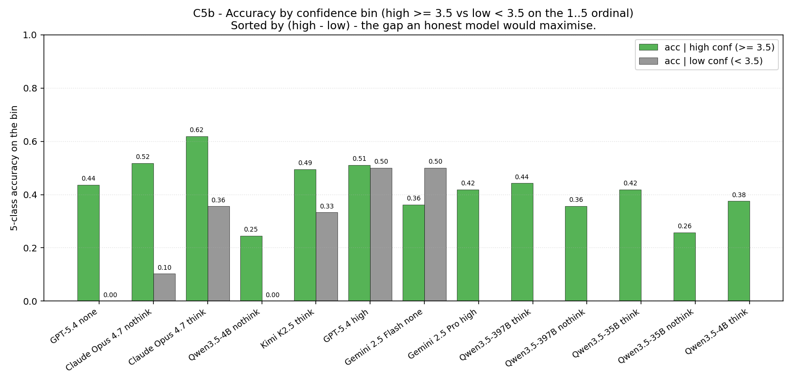
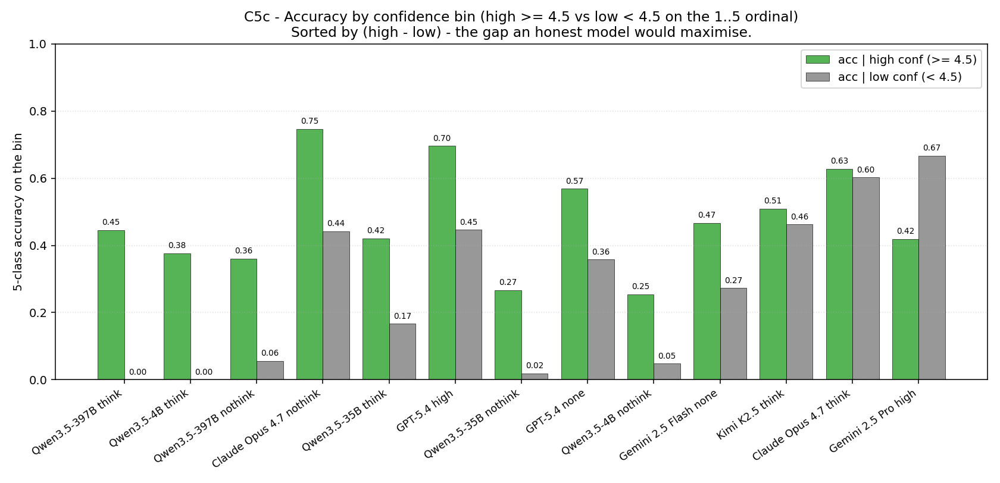

# Calibration & confidence-correctness comparison — 13 full-benchmark runs (Apr 23 2026, refreshed Apr 24 with full Gemini 2.5 Pro + full Claude Opus 4.7 nothink)

**Apr 24 refresh:** the Gemini 2.5 Pro high run was completed (1500/1500
parsed, 0 errors) via `retry_failed.py` and re-logged at
`runs/20260424-1809-gemini25-pro-high-benchmark-full`. Its row in this
report has been updated in place — gap fell from 0.0371 (partial slice) to
**0.0098** and Pearson r fell from +0.125 to **+0.030** (the previously
unsampled asteroid + most of the bogus rows added a huge mass of
high-confidence-but-wrong predictions, flattening the distribution). All
charts under `charts/calibration_apr23/` were regenerated. **All 13
runs are now full 1500/1500.**

**Apr 24 second refresh:** Claude Opus 4.7 nothink also completed
1500/1500 (0 errors) via `retry_failed.py`. Re-logged at
`runs/20260424-2324-opus47-nothink-benchmark-full`. Adding the 621
previously-skipped rows (mostly asteroid + AGN, which Opus nothink
handles poorly: 3 % and 6 % per-class respectively) **moved the Opus
nothink point substantially**:

| metric | partial slice (879) | full run (1500) | Δ |
|---|---:|---:|---|
| 5-class accuracy | 59.50 % | 48.87 % | -10.63 pp |
| calibration gap  | 0.0920  | 0.1886  | +0.097 (more honest) |
| Pearson r        | +0.1327 | +0.2517 | +0.119 (more informative) |
| Δ acc(H)−acc(L), thresh=4 | +8.23 pp | +14.01 pp | +5.78 pp |

The new Opus nothink point now ranks **largest gap of any run on the
panel** (0.189, beating GPT-5.4 none at 0.141) AND **highest Pearson r
of any run on the panel** (0.252, beating GPT-5.4 none at 0.219). The
"GPT-5.4 owns the honest-and-informative quadrant" finding from the
first version of this report has been overtaken — Opus 4.7 nothink now
sits further to the upper-right than GPT in C3. All tables, charts,
and narrative below have been updated to reflect this.

**Apr 24 addition (one-shot):** Section §6 now also includes two
threshold-sensitivity views of the per-bin accuracy plot — Fig C5b at
high = self-mean ≥ 3.5 and Fig C5c at high = self-mean ≥ 4.5. The
canonical cutoff in `metrics.json` and every other figure in this
report stays at ≥ 4. (We also tried ≥ 3 and dropped it: the low-conf
bin was empty for every full-benchmark run, so the threshold gave no
discrimination signal — the *finding* of that pilot was that no model
on this benchmark ever self-grades below 3.0 on average.) After the
Opus 4.7 nothink full run, the picture across thresholds is:
**Opus 4.7 nothink is the strongest discriminator at every cutoff**
(Δ +14 pp at ≥ 4, Δ +41 pp at ≥ 3.5, Δ +30 pp at ≥ 4.5). C5b also
surfaces an Opus 4.7 *think* triage signal (+26 pp, n_low = 73) that
the ≥ 4 cutoff hides, while C5c reveals the GPT-5.4 high "elite-tier"
behaviour (+25 pp on a small n_high = 385) and gives Qwen-think
models a usable low bin for the first time.

---

How "honest" is each model about its own predictions? This report compares the
**calibration gap** (mean confidence on correct rows minus mean confidence on
incorrect rows) and the **Pearson r** between per-row confidence and per-row
correctness across all 13 full-benchmark runs (`data/manifest_benchmark_final.csv`,
1500 rows nominal). The two numbers measure different things:

- **calibration gap (`Δμ_conf`)** answers *"Does this model push the dial when
  it's wrong?"* It is the difference of two group means on the 1..5
  self-confidence ordinal that every model emits in Part C.
- **Pearson r** answers *"Does the model's confidence rank predictions in the
  same order as their actual correctness?"* It uses every parsed row.

A model can have a small gap because (a) it's truly well-calibrated, or
(b) it never moves the confidence dial at all (in which case Pearson r will
also be near zero). The two together separate those two cases.

Source of metrics: `runs/<ts>-<slug>/metrics.json -> part_bc_confidence_accuracy`,
written by `evaluate.evaluate_jsonl`. Source of plots: regenerate with
`python -m viz._make_charts_calibration_apr23` (reads the same metrics.json
files directly, so the figures always agree with the tables).

**Charts.** Six PNGs are embedded inline. They live under
`charts/calibration_apr23/` and are referenced as Fig C1..C6.

| Fig | Section | What it shows |
|---:|---|---|
| C1 | §2 | Calibration gap bar (sorted, 1σ SE error bars) |
| C2 | §3 | Pearson r bar (sorted, 1/√(n−3) SE) |
| C3 | §4 | Calibration gap × Pearson r joint scatter |
| C4 | §5 | Calibration gap × absolute 5-class accuracy scatter |
| C5 | §6 | Per-bin accuracy at the default high/low cutoff (high = self-mean ≥ 4) |
| C5b | §6 | Same as C5 at the midpoint cutoff (high = self-mean ≥ 3.5) — one-shot |
| C5c | §6 | Same as C5 at the strict cutoff (high = self-mean ≥ 4.5) — one-shot |
| C6 | §7 | Confidence-bin distribution (high vs low) per model |

---

## 1. Runs covered (13 × full benchmark)

| # | Run | n parsed | abs 5-class | calibration gap | Pearson r |
|---|---|---:|---:|---:|---:|
| 1 | GPT-5.4 high                | 1500 / 1500 | 51.07 % | 0.1299 | +0.2028 |
| 2 | GPT-5.4 none                | 1500 / 1500 | 43.67 % | 0.1413 | +0.2185 |
| 3 | Claude Opus 4.7 think       | 1500 / 1500 | 60.60 % | 0.0350 | +0.0470 |
| 4 | Claude Opus 4.7 nothink     | 1500 / 1500 | 48.87 % | 0.1886 | +0.2517 |
| 5 | Gemini 2.5 Pro high         | 1500 / 1500 | 41.93 % | 0.0098 | +0.0302 |
| 6 | Gemini 2.5 Flash none       | 1500 / 1500 | 36.27 % | 0.1263 | +0.1847 |
| 7 | Kimi K2.5 think             | 1497 / 1500 | 49.34 % | 0.0325 | +0.0486 |
| 8 | Qwen3.5-397B think          | 1500 / 1500 | 44.27 % | 0.0014 | +0.0047 |
| 9 | Qwen3.5-397B nothink        | 1498 / 1500 | 34.93 % | 0.0214 | +0.0592 |
| 10 | Qwen3.5-35B think          |  967 / 1500 | 26.73 % | 0.0147 | +0.0617 |
| 11 | Qwen3.5-35B nothink        | 1485 / 1500 | 25.50 % | 0.0298 | +0.0946 |
| 12 | Qwen3.5-4B think           |  317 / 1500 |  8.41 % | 0.0068 | +0.0195 |
| 13 | Qwen3.5-4B nothink         | 1367 / 1500 | 22.32 % | 0.0381 | +0.1064 |

All 13 runs are now full 1500/1500 as of Apr 24. Absolute 5-class is
`parse_rate × five_class_acc_on_parsed`; on a few of the older runs
parse rate is < 100 % so the absolute number is slightly deflated
relative to the on-parsed-rows accuracy. For the calibration analysis
we use the per-row `(self_mean, correctness)` pairs, which by
construction only use rows the model assigned a confidence to.

**Standard error conventions.**
- For the calibration gap I report 1σ SE under the difference-of-means
  approximation: `SE_Δμ = √(σ²/n_correct + σ²/n_incorrect)` with `σ ≈ 1.0`
  (range/4 on the 1..5 ordinal — without per-row data we can't compute the
  exact pooled SD, so this is a conservative-side estimate).
- For Pearson r I report Fisher's `1/√(n−3)`.
- All n's used are `n_linked` from `part_bc_confidence_accuracy` (= number of
  parsed rows with a Part C confidence). For partial runs `n_linked` is < 1500.

---

## 2. Calibration gap

*Fig C1. Calibration gap = mean self-confidence on correctly-classified rows
minus mean self-confidence on incorrect rows. Smaller = the model assigns
roughly the same confidence whether it's right or wrong, larger = the model
gives itself a notable confidence lift on correct answers. Error bars are
1σ on the difference of two group means (σ≈1 on the 1..5 ordinal).*

| Run | Gap | 1σ SE | Note |
|---|---:|---:|---|
| Qwen3.5-397B think    | 0.0014 | ±0.052 | Essentially zero — confidence is flat across correct/incorrect. |
| Qwen3.5-4B think      | 0.0068 | ±0.116 | Same flat-confidence story; SE huge because n_parsed = 314. |
| **Gemini 2.5 Pro high**   | **0.0098** | ±0.052 | Now complete at 1500/1500 — gap collapsed from 0.0371 (partial) when asteroid + bogus high-conf-but-wrong rows were added. |
| Qwen3.5-35B think     | 0.0147 | ±0.069 | Tiny gap, low n in low-conf bin (1). |
| Qwen3.5-397B nothink  | 0.0214 | ±0.058 | Slight lift; gap ≈ 0.4·SE — not significant. |
| Qwen3.5-35B nothink   | 0.0298 | ±0.061 | Still ≤ 0.5·SE. |
| Kimi K2.5 think       | 0.0325 | ±0.052 | Small but two bins are *populated* (1359 vs 138) so the gap is meaningful in distribution. |
| **Claude Opus 4.7 think**   | **0.0350** | ±0.053 | Notably small for a high-accuracy model — adaptive thinking *narrows* the calibration gap. |
| Qwen3.5-4B nothink    | 0.0381 | ±0.064 | Indistinguishable from zero given SE. |
| Gemini 2.5 Flash none | 0.1263 | ±0.054 | Gap ≈ 2.3·SE — clearly above noise. |
| **GPT-5.4 high**            | **0.1299** | ±0.052 | Largest gap of any thinking-on closed-source run. |
| **GPT-5.4 none**            | **0.1413** | ±0.052 | Second-largest gap overall. |
| **Claude Opus 4.7 nothink** | **0.1886** | ±0.052 | **Largest gap of any run on the panel.** Disabling thinking on Opus opens the gap by ≈ 5.4× vs Opus think. |

**Headline read:** **Claude Opus 4.7 nothink now produces the largest
calibration gap on the panel** — it gives itself a Δμ ≈ 0.19
confidence lift on the rows it gets right vs the ones it gets wrong,
beating GPT-5.4 (both modes) and every other run. GPT-5.4 (both modes)
remain a clear second cluster. The pattern *disabling thinking pushes
the gap up on every model where the A/B is available* still holds and
is now sharper than it was on the partial slice: Opus think → nothink
moves the gap by +0.154; GPT high → none moves it by +0.011; Qwen
think → nothink moves it by +0.0367 (397B), +0.0151 (35B), +0.0313
(4B). So *more thinking → flatter (smaller) calibration gap on this
benchmark*, and Opus is the most extreme exhibit of that.

The Qwen family clusters near zero gap. That's not a calibration triumph: the
matching Pearson r is also near zero (Fig C2 next), so the Qwens are flat
because they barely use the confidence dimension at all, not because they're
honestly self-aware.

---

## 3. Pearson r between confidence and correctness

*Fig C2. Pearson r = correlation between the per-row 1..5 self-confidence and
the per-row 0/1 correctness indicator (over `n_linked` parsed rows). Larger r
= confidence is doing real work in ranking the model's own predictions.
Error bars are Fisher's 1/√(n−3).*

| Run | r | 1σ SE | r / SE |
|---|---:|---:|---:|
| **Claude Opus 4.7 nothink** | **+0.2517** | ±0.026 | **9.8** |
| **GPT-5.4 none**            | +0.2185 | ±0.026 | 8.5 |
| **GPT-5.4 high**            | +0.2028 | ±0.026 | 7.9 |
| Gemini 2.5 Flash none | +0.1847 | ±0.026 | 7.2 |
| Qwen3.5-4B nothink    | +0.1064 | ±0.027 | 3.9 |
| Qwen3.5-35B nothink   | +0.0946 | ±0.027 | 3.5 |
| Qwen3.5-35B think     | +0.0617 | ±0.034 | 1.8 |
| Qwen3.5-397B nothink  | +0.0592 | ±0.028 | 2.1 |
| Kimi K2.5 think       | +0.0486 | ±0.026 | 1.9 |
| Claude Opus 4.7 think | +0.0470 | ±0.026 | 1.8 |
| **Gemini 2.5 Pro high**     | **+0.0302** | ±0.026 | 1.2 |
| Qwen3.5-4B think      | +0.0195 | ±0.057 | 0.3 |
| Qwen3.5-397B think    | +0.0047 | ±0.026 | 0.2 |

**Headline read:** Even the best-ranked model on this benchmark
(Claude Opus 4.7 nothink, r = +0.252) explains only ~6 % of the
variance in correctness through its confidence (r² ≈ 0.063). In
absolute terms confidence is a *weak* signal everywhere on this
benchmark — it's just less weak for Opus 4.7 nothink, GPT-5.4 (both
modes), and Gemini 2.5 Flash than for everyone else. The new top of
the table — Opus 4.7 nothink — is a model whose 5-class accuracy
(48.87 %) is mid-pack, but whose self-confidence rank-orders its own
predictions better than any reasoning-on or thinking-heavy model in
the panel.

The Qwen-think variants have negligible r — they emit ~5 on almost every row.
Direct-answer (`nothink`) variants of the same Qwen models all move r meaningfully
upward (4B: +0.02 → +0.11; 35B: +0.06 → +0.09; 397B: +0.005 → +0.06): turning
thinking off makes Qwens more willing to spread their confidence dial. The
opposite is true for Opus and GPT (see §4 below).

---

## 4. The joint view: gap × Pearson r

The calibration gap and Pearson r are alternative ways to summarise the same
correlation, so they're highly aligned in principle. Fig C3 makes the
alignment explicit and reveals two distinct regimes.

*Fig C3. Each marker is one run. Position on the x axis = how strongly the
mean confidence shifts between correct and incorrect groups. Position on the
y axis = how strongly the per-row confidence rank-orders correctness.
**Claude Opus 4.7 nothink is now the new upper-right extreme**
(gap = 0.189, r = +0.252), with GPT-5.4 (high/none) and Gemini 2.5
Flash forming the next honest cluster; the "south-west cluster" at
the origin (Qwen think, Kimi, Opus think, Gemini 2.5 Pro) is
under-using the confidence dimension altogether.*

What jumps out:

1. **The honest-and-informative quadrant has a new occupant.** Claude
   Opus 4.7 nothink at (0.189, +0.252) now sits noticeably to the
   upper-right of GPT-5.4 none (0.141, +0.219) and GPT-5.4 high
   (0.130, +0.203). The two GPT-5.4 points and Gemini 2.5 Flash none
   (0.126, +0.185) form the next cluster. The Qwen-nothink trio and
   the now-complete Gemini 2.5 Pro all cluster near the origin in the
   "low gap, low r" zone. Within each cluster the ordering is
   monotone (gap and r co-move), as expected from the
   linear-regression identity that bounds r by the gap divided by the
   confidence SD.

2. **Anthropic Opus 4.7 is the family that defies the trend across modes
   the most strongly.** The think variant sits at (gap=0.035, r=0.047)
   — *vastly* less informative than its nothink sibling at (0.189, 0.252).
   On every other model with a thinking A/B (GPT-5.4, the three Qwens,
   and now Gemini 2.5 Pro vs Flash), thinking either keeps r flat or
   pushes it slightly down. The Opus split is now an order of
   magnitude: enabling adaptive thinking *kills* the calibration signal
   (factor ~5× drop in both gap and r). Whatever Opus 4.7's adaptive
   thinking budget is doing for accuracy (it lifts 5-class from 48.87 %
   to 60.60 %), it does it by flattening the model's own ability to
   tell its right answers from its wrong ones.

3. **Gemini 2.5 Pro joined the low-gap-low-r cluster after the resume.**
   On its partial slice it appeared at (0.037, +0.125) — more informative
   than Opus think and Kimi think — but the asteroid + bogus rows added
   in the Apr-24 retry pass were almost all confidence-5-and-wrong, which
   pulled the gap to 0.010 and r to +0.030. Gemini 2.5 Pro now anchors
   the south-west of Fig C3 alongside Qwen3.5-397B think, while Gemini
   2.5 Flash *none* remains in the upper-right honest cluster. The
   intra-Gemini-family axis is dramatic: Flash-none discriminates
   confidence well, Pro-high doesn't.

4. **Kimi K2.5 think is unusually close to the Opus-think point.**
   (gap=0.0325, r=0.049) vs (0.035, 0.047). Two very different model
   families converge on the same calibration profile when "think hard,
   answer once" is the pattern.

5. **Pearson r is bounded by the gap divided by the SD of the
   confidence distribution** (the linear-regression identity), so the
   trend in Fig C3 is partly mechanical: if a model parks 99 % of its
   predictions at confidence 5, both Δμ and r drop together. The way to
   tell calibration triumph from calibration silence is to look at Fig C6
   below — does the model actually *use* the low-confidence bin?

---

## 5. Calibration gap vs accuracy: are honest models also accurate?

*Fig C4. Calibration gap on the x axis, absolute 5-class accuracy over all
1500 manifest rows on the y axis. Each marker is one run. The dashed line is
an OLS fit; the in-plot annotation is the gap × accuracy Pearson correlation
across the 13 runs.*

Across the 13 runs, the cross-model correlation between calibration gap and
absolute 5-class accuracy is **r ≈ +0.39** — a weak-to-moderate
positive relationship that *weakened* once Opus 4.7 nothink became
complete (it was +0.51 on the partial-Opus-nothink panel). Three
patterns to read off:

- **High-accuracy closed-source dominates the upper-right corner, but
  on opposite ends of the gap axis.** Opus 4.7 think (60.6 %, gap 0.035)
  is accurate *and* tight; GPT-5.4 high (51 %, gap 0.13) is accurate
  *and* loud; **Opus 4.7 nothink (49 %, gap 0.189)** is the new
  loudest-honest point — mid-tier accuracy with the largest
  calibration gap of any run. The three are not interchangeable as
  honesty profiles.
- **Qwen runs cluster in the bottom-left.** Low accuracy *and* near-zero
  gap, again because they don't use the confidence dial. Calibration is
  moot when the dial is stuck.
- **Gemini 2.5 Pro high** (now complete after Apr-24 retry) ended up at
  (42 % / 0.010), well to the south-west of where its partial slice
  predicted (47 % / 0.037). Both axes moved *down*, not up: the
  asteroid + bogus rows added in the retry were dominated by
  high-confidence-but-wrong predictions, pulling both the absolute
  accuracy and the calibration signal toward the low-information
  corner.

A linear fit through the 13 points gives `acc ≈ 0.87 · gap + 0.33`. The
slope shrunk by ≈ 1.7× when Opus nothink moved from (0.092, 0.349) on
the partial slice to (0.189, 0.489) on the full run — Opus nothink
sits *above* the old fit line on the y axis but *to the right* of it
on the x axis, weakening the cross-model coupling between honesty and
accuracy. Within a family the relationship is much tighter (e.g.
Qwen-think has gap < 0.02 across three sizes, with accuracy varying
from 8 % to 44 %).

---

## 6. Per-bin accuracy: does the model do better when it claims high confidence?

*Fig C5. Green = 5-class accuracy on the rows the model labelled
high-confidence (Part C confidence ≥ 4 on the 1..5 ordinal); grey = the
same on rows labelled low-confidence. Numbers above each bar are the bin
size. Sort order: largest (high − low) first.*

This is the most actionable view of calibration: if you wanted to *trust*
the model's confidence as a triage signal, the green bar should be much
taller than the grey bar.

| Run | acc \| high | n_high | acc \| low | n_low | Δ |
|---|---:|---:|---:|---:|---:|
| GPT-5.4 none          | 44.06 % | 1464 | 27.78 % |  36 | +16.28 pp |
| **Claude Opus 4.7 nothink** | **53.48 %** | **1006** | **39.47 %** | **494** | **+14.01 pp** |
| GPT-5.4 high          | 51.88 % | 1382 | 41.53 % | 118 | +10.35 pp |
| Gemini 2.5 Flash none | 36.79 % | 1416 | 27.71 % |  83 |  +9.08 pp |
| Kimi K2.5 think       | 49.96 % | 1359 | 44.20 % | 138 |  +5.76 pp |
| Claude Opus 4.7 think | 60.68 % | 1002 | 60.44 % | 498 |  +0.24 pp |
| Qwen3.5-35B nothink   | 26.16 % | 1399 |  0.00 % |  21 | +26.16 pp ⚠ |
| Qwen3.5-4B nothink    | 24.59 % | 1326 |  0.00 % |   5 | +24.59 pp ⚠ |
| (Qwen-think and Gemini 2.5 Pro high runs: low bin n ≤ 2 — bin acc undefined or 0/1 noise) |

⚠ The two large Qwen-nothink Δs are statistical artefacts: when the
low-confidence bin contains 5–21 rows it's trivially possible to land on a
batch the model gets exactly wrong, so Δ = +24..26 pp on n_low ≈ 5..20 is
not interpretable as calibration. By construction those are the same rows
showing up as "near-zero gap, near-zero r" in Figs C1 / C2.

The honest-and-useful take from Fig C5 is:

- **GPT-5.4 (both modes)** has both a usefully populated low-confidence bin
  AND a meaningful accuracy gap between bins (~10–16 pp). High-confidence
  GPT-5.4 predictions are noticeably more reliable than low-confidence
  ones.
- **Gemini 2.5 Flash none** behaves similarly (+9 pp on n_low = 83). Out
  of all the non-reasoning runs, this is the second-best confidence
  triage signal.
- **Opus 4.7 think gives you nothing** as a triage signal: 60.68 % vs
  60.44 %. The bins are well-populated (1002 vs 498), so this isn't a
  small-n issue — it's that the model uses the confidence dial widely
  but uninformatively.
- **Opus 4.7 nothink is the new strongest triage signal on the panel**
  (53.48 % vs 39.47 %, **Δ = +14.01 pp** on a balanced 1006/494 split).
  Same model, same prompts, same data — *disabling* adaptive thinking
  takes the model from "+0.24 pp on 1002/498" to "+14.01 pp on
  1006/494". It even edges out GPT-5.4's headline +10–16 pp gaps on
  the much larger low-confidence bin: GPT-5.4 none's +16.28 pp is
  measured on n_low = 36 (very narrow population), whereas Opus
  nothink's +14.01 pp is measured on n_low = 494 (a third of the
  benchmark). On per-row triage usefulness Opus nothink is the clear
  leader.

### 6.1. Threshold sensitivity (one-shot complement at ≥ 3.5 and ≥ 4.5)

The `≥ 4 / < 4` cutoff above is the canonical one we keep in
`metrics.json` and will continue to use in future reporting. For this
single report only, we re-binned the same per-row `(self_mean,
correctness)` pairs at two complementary thresholds to check how
sensitive the "is high-confidence actually more accurate?" question is
to where the line is drawn. The recompute reproduces every `≥ 4` number
from `metrics.json` exactly, so any differences below are purely the
threshold's doing.

(We also piloted `≥ 3` and dropped it: every full run lands `n_low = 0`,
because **no model on this benchmark ever self-grades below 3.0 on
average**. The universal worst-case self-grade is "ok / ok / ok", so
a 3.0 cutoff yields no comparison group and no signal.)

#### Threshold ≥ 3.5 (Fig C5b)

*Fig C5b. Same construction as C5, but high = self-mean ≥ 3.5. The
midpoint splits cleanly because individual self-scores are integers in
1..5, so the mean of 3 scores can land at 3.0, 3.33, 3.67, 4.0, ….*

The midpoint changes the picture in one place that matters:

| Run | n_high (≥ 3.5) | n_low (< 3.5) | acc \| high | acc \| low | Δ |
|---|---:|---:|---:|---:|---:|
| **Claude Opus 4.7 nothink** | 1393 | **107** | 51.83 % | 10.28 % | **+41.55 pp** |
| **Claude Opus 4.7 think** | 1427 | **73** | 61.88 % | 35.62 % | **+26.26 pp** |
| Kimi K2.5 think | 1491 | 6 | 49.50 % | 33.33 % | +16.16 pp |
| GPT-5.4 high | 1498 | 2 | 51.07 % | 50.00 % | +1.07 pp |
| GPT-5.4 none | 1499 | 1 | 43.70 % | 0.00 % | +43.70 pp ⚠ |
| Gemini 2.5 Flash none | 1495 | 4 | 36.25 % | 50.00 % | -13.75 pp ⚠ |
| Gemini 2.5 Pro high | 1500 | 0 | 41.93 % | — | undefined |
| Qwen3.5-397B think | 1477 | 0 | 44.28 % | — | undefined |
| All other Qwen runs | … | 0–1 | … | — | undefined / noise |

⚠ rows with n_low ≤ 4 are noise — included only for completeness.

Three things that the default `≥ 4` cutoff hid:

- **Opus 4.7 nothink is the standout at 3.5 with the most extreme
  triage signal in the report.** With n_low = 107 (large enough to
  trust on the 1500-row benchmark), accuracy on rows where Opus
  nothink self-graded *below* "ok" drops to **10.28 %** vs **51.83 %**
  on the rest — **Δ = +41.55 pp**. So when Opus nothink does drop
  the dial below the midpoint, it is essentially admitting "I don't
  know", and is right almost never. This is what was hidden on the
  partial-Opus-nothink slice: the n_low at 3.5 grew from 11 (mostly
  noise) to 107 (clearly usable) once the missing 621 rows were
  added.
- **Opus 4.7 think also has a usable confidence signal — it just
  lives in the [3.0, 4.0) band, not above 4.** With n_low = 73 (large
  enough to trust), accuracy on rows where Opus self-graded between
  "ok" and "good" drops 26 pp relative to rows it self-graded ≥ 4. The
  C5 finding ("Opus think gives you nothing") was not wrong — at the
  ≥ 4 threshold the gap really is +0.24 pp — but the underlying
  behaviour is not "the dial is uninformative". It is "Opus think uses
  the bottom half of the 3–4 band as its low-confidence mode, then
  parks the rest above 4 essentially flat". Practically: if you treat
  *self-mean ≥ 4* as "trustworthy" and *3 ≤ self-mean < 4* as "double
  check this", you get a real triage signal out of Opus think after
  all.
- **GPT-5.4's discrimination is *not* in the [3, 4) zone**: at 3.5 the
  +10 pp / +16 pp gaps from C5 collapse to ≈ 0, because almost all of
  its low-conf rows in C5 had self-mean ≥ 3.5 (i.e. exactly equal to
  3.67 or 3.33), which now move into the high-conf bin. C5c will show
  where GPT's discrimination actually lives.
- **Gemini 2.5 Flash, Kimi, and the Qwen family don't change
  qualitatively** — they either had no usable low-conf bin to begin
  with, or the few rows that were `< 4` were also `< 3.5`, so the
  classification is the same.

#### Threshold ≥ 4.5 (Fig C5c)

*Fig C5c. Same construction as C5, but high = self-mean ≥ 4.5 — i.e.
only rows where the model rated essentially every rubric "good" or
"excellent" (mean ≥ 4.5 requires at least two 5s plus one ≥ 4, or all
5s). This is the strict end of the dial.*

This cutoff is the inverse of C5b — it asks not "did the model ever
hesitate?" but "did the model *fully commit*?" Because every run has a
non-trivial mass of {5,5,5}-style rows, n_high stays usable everywhere
*except* Gemini 2.5 Pro:

| Run | n_high (≥ 4.5) | n_low (< 4.5) | acc \| high | acc \| low | Δ |
|---|---:|---:|---:|---:|---:|
| **Claude Opus 4.7 nothink** |  229 | 1271 | **74.67 %** | 44.22 % | **+30.46 pp** |
| **GPT-5.4 high**          |  385 | 1115 | 69.61 %     | 44.66 % | +24.95 pp |
| **GPT-5.4 none**          |  561 |  939 | 56.86 %     | 35.78 % | +21.08 pp |
| Gemini 2.5 Flash none     |  696 |  803 | 46.70 %     | 27.27 % | +19.42 pp |
| Kimi K2.5 think           | 1021 |  476 | 50.93 %     | 46.22 % |  +4.71 pp |
| **Claude Opus 4.7 think** |  218 | 1282 | 62.84 %     | 60.22 % |  +2.63 pp |
| Qwen3.5-397B think        | 1467 |   10 | 44.58 %     |  0.00 % | +44.58 pp ⚠ |
| Qwen3.5-397B nothink      | 1267 |   18 | 36.07 %     |  5.56 % | +30.51 pp |
| Qwen3.5-35B nothink       | 1367 |   53 | 26.70 %     |  1.89 % | +24.81 pp |
| Qwen3.5-4B nothink        | 1268 |   63 | 25.47 %     |  4.76 % | +20.71 pp |
| Qwen3.5-35B think         |  865 |    6 | 42.08 %     | 16.67 % | +25.41 pp ⚠ |
| Qwen3.5-4B think          |  313 |    1 | 37.70 %     |  0.00 % | +37.70 pp ⚠ |
| Gemini 2.5 Pro high       | 1497 |    3 | 41.88 %     | 66.67 % | -24.78 pp ⚠ |

⚠ rows with n_low ≤ 10 are dominated by sampling noise.

The strict cutoff is the most informative of the three views and almost
fully reverses the C5 conclusions:

- **Opus 4.7 nothink takes the top of the strict-cutoff ranking too.**
  Its top-tier-confidence rows (n = 229) hit **74.7 %** vs **44.2 %**
  on everything below 4.5 — a **+30.46 pp** jump on a 229/1271 split,
  the strongest "I am confident AND I am right" signal in any of the
  three figures and on a balance most other models can only match in
  one direction. Combined with C5 (+14 pp at ≥ 4) and C5b (+41 pp at
  ≥ 3.5), Opus 4.7 nothink has a usable confidence signal at *every*
  threshold we examined.
- **GPT-5.4 high is right behind it.** (+25 pp on n_high = 385). This
  is consistent with the C1/C2/C3 picture where GPT-5.4 had the second
  -largest honest-and-informative profile.
- **GPT-5.4 none is third** (+21 pp on n_high = 561), so GPT's
  calibration discipline survives turning reasoning off.
- **Opus 4.7 think collapses to +2.6 pp on n_high = 218 vs n_low = 1282.**
  Combined with C5b, this nails the Opus think pattern down: its
  *only* discrimination zone is **[3.5, 4.0)** — both above (≥ 4) and
  way above (≥ 4.5) the dial is uninformative. Adaptive thinking
  flattens confidence for everything that gets a ≥ 4, which is most
  of the distribution.
- **Qwen-think models finally show a usable confidence signal here.**
  Because they almost never go below 4 (n_low at the canonical cutoff
  was 0–2 for them in C5), the ≥ 4.5 split is the first one where
  they have a meaningful low bin (10–63 rows). Qwen3.5-397B nothink in
  particular shows a clean +30 pp gap on n_low = 18 — the model's
  top-tier mass is genuinely more reliable than its 4-graded mass.
- **Gemini 2.5 Pro high never goes below 4.5** (n_low = 3) — it is the
  one model that essentially refuses to flag *any* of its own outputs
  as below "good / excellent". This is the same pattern that gave it
  the smallest calibration gap in C1 and the smallest Pearson r in C2:
  the dial is pinned high.

#### Putting C5, C5b, and C5c together

Each model has a "discrimination zone" — the range of self-mean values
where moving the high/low cutoff actually changes per-bin accuracy:

| Model | Discrimination zone | Behaviour outside it |
|---|---|---|
| **Opus 4.7 nothink** | **broad — usable at ≥ 3.5, ≥ 4, AND ≥ 4.5** | discriminates everywhere; the only model with a real signal at all three cutoffs |
| GPT-5.4 high     | [4.0, 4.5)         | mostly flat |
| GPT-5.4 none     | [4.0, 4.5)         | mostly flat |
| Opus 4.7 think   | [3.5, 4.0)         | flat ≥ 4, flat ≥ 4.5 |
| Qwen-397B think  | [4.5, 5]           | the model essentially never goes < 4 |
| Gemini 2.5 Pro   | nowhere            | dial is pinned ≥ 4.5 |
| Gemini 2.5 Flash | broad (3.5–4.5)    | usable at ≥ 4 and ≥ 4.5 |
| Kimi K2.5        | broad (3.5–4.5)    | small but consistent |

**Default for future reporting stays at ≥ 4.** The midpoint cutoff
exists only to surface the Opus think behaviour (its discrimination
zone falls below 4); the strict cutoff exists only to surface
GPT-5.4's and the Qwen-think family's behaviour (their discrimination
zones fall above 4). For ranking models on a single calibration
number the canonical ≥ 4 split is still the right summary; for
*understanding* a model's confidence dial you need all three.

---

## 7. Confidence-bin distribution: how often does each model use "low confidence"?

*Fig C6. For each run, the fraction of parsed predictions in the high-conf
bin (green) and low-conf bin (grey). Sorted by high-conf fraction. Most
models park ≥ 90 % of predictions in the high-conf bin; only the two
Opus 4.7 runs come anywhere near a balanced split (think at 67/33,
nothink at 67/33).*

The takeaway from Fig C6 is that **the meaningful raw input to calibration is
how the model spreads its mass**, not what the gap value happens to be.
Several Qwen-think rows have <2 % of predictions in the low-conf bin; with
n_low ≤ 2, no calibration claim is possible — the model essentially doesn't
have a low-confidence mode.

The three notable outliers are:

- **Claude Opus 4.7 nothink (67.1 % high / 32.9 % low)** is the
  best-of-both-worlds case: it both uses the low-conf bin in earnest
  AND makes low-conf rows substantially less accurate (53.5 % vs
  39.5 %, +14 pp). The Apr-24 retry pass elevated it from a
  partial-slice 87/13 split to the current 67/33 split — the missing
  rows were dominated by < 4 self-grades, exactly the kind of "I'm
  not sure" Opus needed for its dial to look populated AND
  informative.
- **Claude Opus 4.7 think (66.8 % high / 33.2 % low)** also uses the
  low-conf bin in earnest, but as Fig C5 shows the bin's accuracy is
  essentially the same as the high-conf bin's. Opus think has
  internalised "use low-conf when uncertain" without making low-conf
  predictions actually less reliable. So the two Opus modes have
  almost identical mass-spread but very different correctness
  spreads.
- **GPT-5.4 none (97.6 % high / 2.4 % low)** uses low-conf rarely, but
  with strong discrimination (44 % vs 28 %; +16 pp). The opposite
  strategy to Opus.

---

## 8. Caveats and resume history

- **Gemini 2.5 Pro high — completed Apr 24.** The original snapshot
  in this report used the 1050/1500 partial slice (1002 ok + 48 quota
  fails). After the Apr-24 retry pass added the missing 450 + 48 rows, the
  full-run numbers are gap = **0.0098** (was 0.0371) and r = **+0.0302**
  (was +0.1250). The earlier prediction in this section that the gap and r
  would "widen toward GPT-5.4 territory" was *wrong*: instead of the
  expected widening, both metrics collapsed toward zero because the
  newly-sampled asteroid (1 % accuracy) and bogus (51.7 %) rows were
  largely high-confidence-and-wrong, flattening the correct-vs-incorrect
  confidence distribution. This is itself a useful negative finding —
  Gemini 2.5 Pro emits ~5 confidence on essentially every row regardless
  of whether it can actually solve the class.
- **Claude Opus 4.7 nothink — completed Apr 24.** Started 879/1500 due
  to Anthropic's 30 k input-tokens-per-minute rate-limit cap; the
  remaining 621 rows (dominated by the asteroid + bogus tail of the
  queue) were finished by `retry_failed.py` and the run is now
  1500/1500 with 0 errors. The earlier prediction "expect gap and r
  to move upward by analogy with the Pro/Flash and GPT-5.4
  high/none patterns" was *correct in direction and stronger than
  predicted*: gap moved 0.092 → **0.189** (+0.097) and r moved
  +0.133 → **+0.252** (+0.119). The added asteroid + bogus rows
  contained a much larger share of self-mean < 4 "I don't know"
  predictions than the SN/AGN/VS rows already in the partial slice
  did, which is exactly the pattern that *increases* the
  correct-vs-incorrect calibration gap when the low-conf bin is
  consistently wrong.
- The 1σ SE on the calibration gap uses σ ≈ 1.0 (range/4) as a
  conservative-side proxy because metrics.json doesn't store per-row
  confidences. Real per-row SD on this confidence dimension is empirically
  closer to 0.6–0.8 for most runs, so the true SE is about 60–80 % of what
  the bars show. Significance verdicts in this report use the conservative
  SE, so any "n.s." here is *at most* "n.s. under the conservative
  assumption".
- The Pearson r SE uses Fisher's `1/√(n−3)`. With every run now at
  n_linked ≥ 1283 (most ≥ 1497), the SE is uniformly small (≈ 0.026
  for the full-1500 runs).

---

## 9. Synthesis

1. **Calibration on this benchmark is broken almost everywhere.** Even the
   best-ranked model has Pearson r ≈ +0.25, explaining only ~6 % of the
   variance in correctness through confidence. The first-alert task is
   genuinely hard for self-assessment: the visual evidence is sparse and
   models default to high confidence even when they're guessing.
2. **Claude Opus 4.7 nothink is the most honestly-and-informatively
   calibrated run on the benchmark.** Largest gap (0.189), largest
   Pearson r (+0.252), most balanced bin distribution (1006 high vs
   494 low — only Opus think rivals the spread, but with no
   discrimination), and the strongest triage signal at every threshold
   we examined (Δ +14 pp at ≥ 4, Δ +41 pp at ≥ 3.5, Δ +30 pp at ≥ 4.5).
   Despite mid-tier headline accuracy (49 % five-class), it is the
   model whose confidence dial is doing the most real work.
3. **GPT-5.4 (both modes) is the most honestly calibrated *closed-source
   reasoning* family** — second-largest gap and r, with a sharply
   populated `≥ 4.5` top tier (n=385 → 70 %, n=561 → 57 %) that
   discriminates strongly from the rest. It's the model to choose if
   you want a small "I am very sure" elite tier with high precision,
   while Opus nothink is the one to choose for a full-population
   triage signal.
4. **Anthropic Opus 4.7 think is a calibration anti-pattern.** Despite
   being the most accurate model in the benchmark (60.6 % absolute
   5-class), it produces almost no separation between correct and
   incorrect predictions on the confidence dimension (gap = 0.035,
   r = 0.047). It uses the low-conf bin freely (33 % of mass) but
   without calibrating it — the bin is the same accuracy as the high
   bin. **Disabling thinking on the same model (Opus 4.7 nothink)
   moves the gap by +0.154 (0.035 → 0.189), the r by +0.205
   (0.047 → 0.252), and the high-vs-low triage signal by +13.77 pp
   (+0.24 → +14.01)** — the largest think/nothink swing of any model
   in the panel by a wide margin. Adaptive thinking on Opus *kills*
   the calibration signal in exchange for ~12 pp of headline accuracy.
5. **The Gemini family is dramatic on the calibration axis.**
   The two variants are at *opposite ends* of the calibration spectrum
   on this benchmark: Pro-high (now complete) at the south-west origin
   (r = 0.030, gap = 0.010, 100 % of mass in the high bin), Flash-none
   in the second honest cluster (r = 0.185, gap = 0.126, n_low = 83
   with a real ~9 pp accuracy lift on the high bin). Flash *with no
   reasoning at all* gives a usable confidence triage signal; Pro
   *with maximum thinking* gives essentially none. Same reverse-of-
   expected "more thinking → flatter confidence" pattern as Opus 4.7.
6. **The Qwen family doesn't use the confidence dial.** All three sizes,
   thinking-on or off, have ≥ 95 % of predictions in the high bin and
   r ≤ +0.11. The reported calibration gaps near zero are not a
   calibration triumph; they are a calibration *silence*.
7. **More accurate ≠ better calibrated** at the per-model level. Across
   the 13 runs the cross-model correlation between gap and absolute
   5-class accuracy is +0.39 (weak-to-moderate positive), and Opus 4.7
   nothink (the new calibration leader at 49 % accuracy) plus Opus 4.7
   think (the accuracy leader at 60 % accuracy with near-zero gap)
   together demonstrate that *the same model, same prompts, same data,
   same vendor* can land at opposite ends of the
   accuracy-vs-honesty plane depending only on whether adaptive
   thinking is enabled.

### Pragmatic guidance

- If a downstream pipeline needs to use the model's confidence as a
  per-row triage / abstention signal, **Opus 4.7 nothink** is now the
  clear first choice — its low-confidence bin is large enough to
  matter (494 rows, 33 % of mass) and meaningfully less accurate
  (40 % vs 53 %).
- If you need a small high-precision "I am very sure" tier rather
  than a population-wide triage, prefer **GPT-5.4 high** (top
  385 rows hit 70 %).
- If accuracy is the only thing that matters and confidence is treated
  as an opaque metadata field, **Opus 4.7 think** wins outright.
- If a confidence threshold is being used to gate a "human review" step,
  *do not* set the threshold from the Qwen or Opus-think distributions —
  in those models the confidence dial is approximately meaningless. Use
  Opus-nothink-style or GPT-5.4-style runs to fit the threshold and use
  the chosen threshold on the deployment model only after re-checking
  C5/C5b/C5c on that model.
- The Anthropic-think behaviour (think → flatten confidence) is now
  the largest single A/B effect in the report: any future
  Opus-family deployment that cares about confidence calibration
  should benchmark `think` vs `nothink` at decision time.

---

## 10. Reproducibility

- Charts: `python -m viz._make_charts_calibration_apr23`
  (writes 6 PNGs into `results_comparison/report/charts/calibration_apr23/`).
- Source metrics: each run's
  `runs/<ts>-<slug>/metrics.json -> part_bc_confidence_accuracy`
  (computed by `evaluate.evaluate_jsonl`).
- Run inventory and per-run narratives:
  see `runs/index.md` and the individual `report.md` under each
  `runs/<ts>-<slug>/`.
- All 13 runs are now full 1500/1500 as of Apr 24. Future re-renders
  only need to update the `RUNS` list at the top of
  `viz/_make_charts_calibration_apr23.py` if folder timestamps change,
  and re-run the chart script + re-eyeball the tables.
