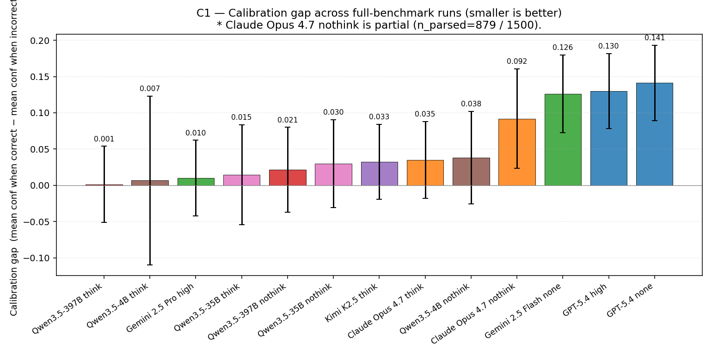
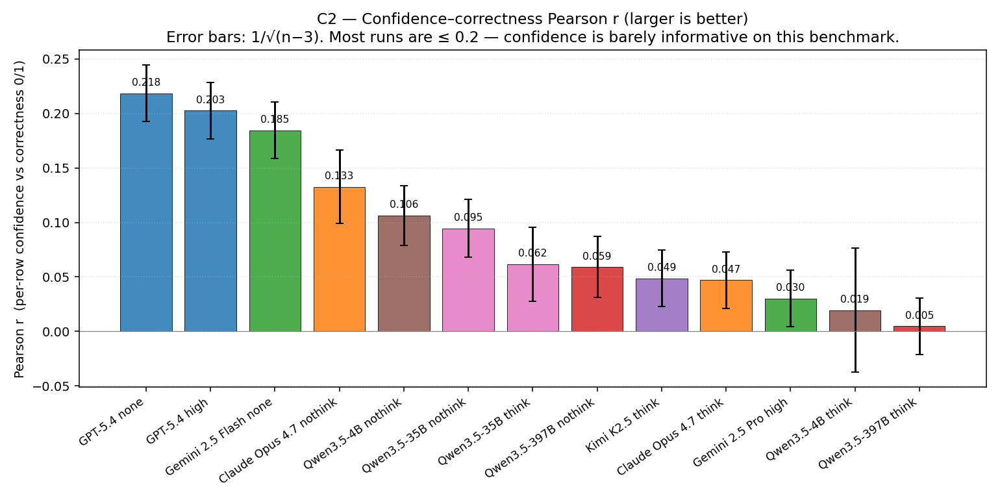
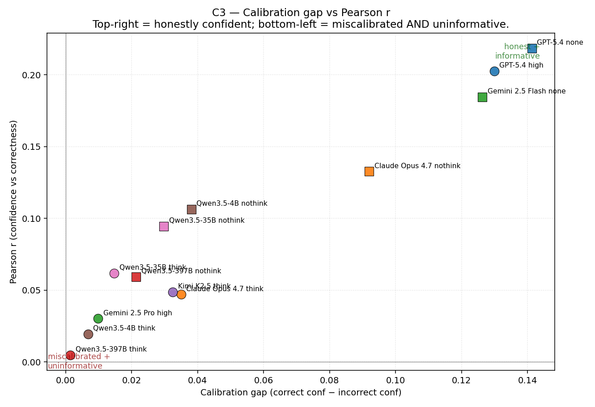
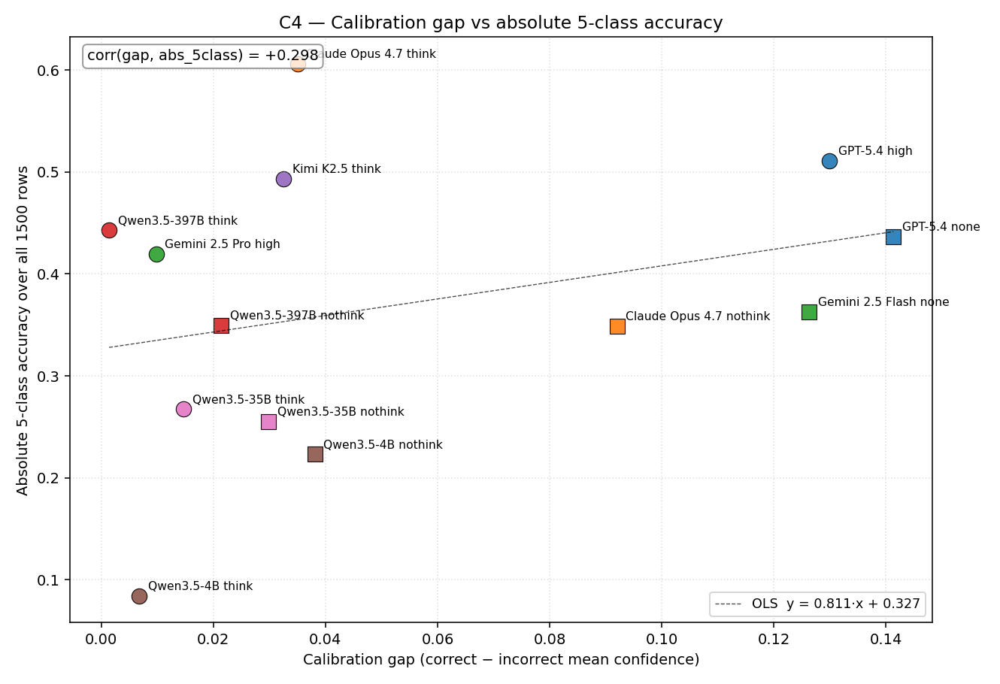
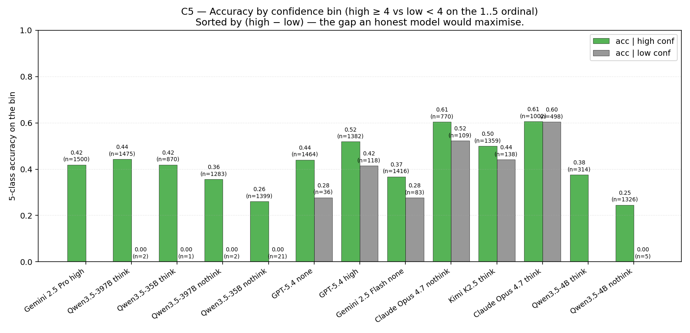
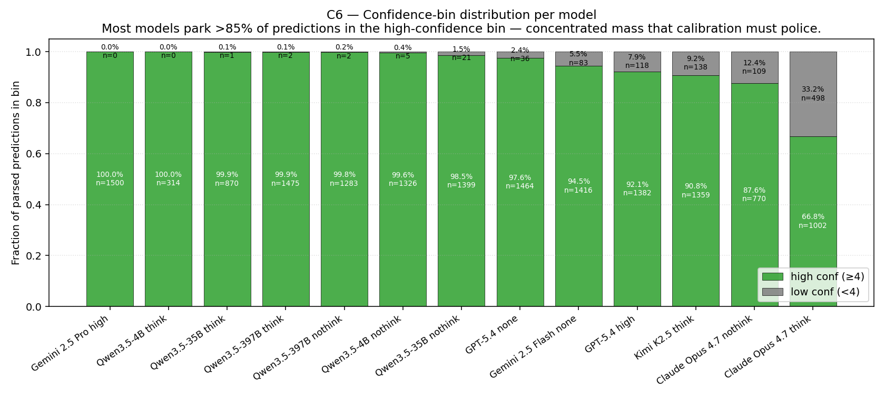

# Calibration & confidence-correctness comparison — 13 full-benchmark runs (Apr 23 2026, refreshed Apr 24 with full Gemini 2.5 Pro)

**Apr 24 refresh:** the Gemini 2.5 Pro high run was completed (1500/1500
parsed, 0 errors) via `retry_failed.py` and re-logged at
`runs/20260424-1809-gemini25-pro-high-benchmark-full`. Its row in this
report has been updated in place — gap fell from 0.0371 (partial slice) to
**0.0098** and Pearson r fell from +0.125 to **+0.030** (the previously
unsampled asteroid + most of the bogus rows added a huge mass of
high-confidence-but-wrong predictions, flattening the distribution). All
charts under `charts/calibration_apr23/` were regenerated. Claude Opus 4.7
nothink is still annotated `*` (879/1500 parsed) pending its own retry.

---

How "honest" is each model about its own predictions? This report compares the
**calibration gap** (mean confidence on correct rows minus mean confidence on
incorrect rows) and the **Pearson r** between per-row confidence and per-row
correctness across all 13 full-benchmark runs (`data/manifest_benchmark_final.csv`,
1500 rows nominal). The two numbers measure different things:

- **calibration gap (`Δμ_conf`)** answers *"Does this model push the dial when
  it's wrong?"* It is the difference of two group means on the 1..5
  self-confidence ordinal that every model emits in Part C.
- **Pearson r** answers *"Does the model's confidence rank predictions in the
  same order as their actual correctness?"* It uses every parsed row.

A model can have a small gap because (a) it's truly well-calibrated, or
(b) it never moves the confidence dial at all (in which case Pearson r will
also be near zero). The two together separate those two cases.

Source of metrics: `runs/<ts>-<slug>/metrics.json -> part_bc_confidence_accuracy`,
written by `evaluate.evaluate_jsonl`. Source of plots: regenerate with
`python -m viz._make_charts_calibration_apr23` (reads the same metrics.json
files directly, so the figures always agree with the tables).

**Charts.** Six PNGs are embedded inline. They live under
`charts/calibration_apr23/` and are referenced as Fig C1..C6.

| Fig | Section | What it shows |
|---:|---|---|
| C1 | §2 | Calibration gap bar (sorted, 1σ SE error bars) |
| C2 | §3 | Pearson r bar (sorted, 1/√(n−3) SE) |
| C3 | §4 | Calibration gap × Pearson r joint scatter |
| C4 | §5 | Calibration gap × absolute 5-class accuracy scatter |
| C5 | §6 | Per-bin accuracy: acc \| high-conf vs acc \| low-conf paired bars |
| C6 | §7 | Confidence-bin distribution (high vs low) per model |

---

## 1. Runs covered (13 × full benchmark)

| # | Run | n parsed | abs 5-class | calibration gap | Pearson r |
|---|---|---:|---:|---:|---:|
| 1 | GPT-5.4 high                | 1500 / 1500 | 51.07 % | 0.1299 | +0.2028 |
| 2 | GPT-5.4 none                | 1500 / 1500 | 43.67 % | 0.1413 | +0.2185 |
| 3 | Claude Opus 4.7 think       | 1500 / 1500 | 60.60 % | 0.0350 | +0.0470 |
| 4 | Claude Opus 4.7 nothink ✱   |  879 / 1500 | 34.87 % * | 0.0920 | +0.1327 |
| 5 | Gemini 2.5 Pro high         | 1500 / 1500 | 41.93 % | 0.0098 | +0.0302 |
| 6 | Gemini 2.5 Flash none       | 1500 / 1500 | 36.27 % | 0.1263 | +0.1847 |
| 7 | Kimi K2.5 think             | 1497 / 1500 | 49.34 % | 0.0325 | +0.0486 |
| 8 | Qwen3.5-397B think          | 1500 / 1500 | 44.27 % | 0.0014 | +0.0047 |
| 9 | Qwen3.5-397B nothink        | 1498 / 1500 | 34.93 % | 0.0214 | +0.0592 |
| 10 | Qwen3.5-35B think          |  967 / 1500 | 26.73 % | 0.0147 | +0.0617 |
| 11 | Qwen3.5-35B nothink        | 1485 / 1500 | 25.50 % | 0.0298 | +0.0946 |
| 12 | Qwen3.5-4B think           |  317 / 1500 |  8.41 % | 0.0068 | +0.0195 |
| 13 | Qwen3.5-4B nothink         | 1367 / 1500 | 22.32 % | 0.0381 | +0.1064 |

✱ Partial runs — see §8 caveats. Absolute 5-class is `parse_rate × five_class_acc_on_parsed`;
the partial runs report a deflated absolute number because their `n_total` baseline is
1500 (so unparsed rows are counted as wrong). For the rest of the report we
use the calibration *fields* from the parsed subset, which is the only set
the model assigned a confidence to in the first place.

**Standard error conventions.**
- For the calibration gap I report 1σ SE under the difference-of-means
  approximation: `SE_Δμ = √(σ²/n_correct + σ²/n_incorrect)` with `σ ≈ 1.0`
  (range/4 on the 1..5 ordinal — without per-row data we can't compute the
  exact pooled SD, so this is a conservative-side estimate).
- For Pearson r I report Fisher's `1/√(n−3)`.
- All n's used are `n_linked` from `part_bc_confidence_accuracy` (= number of
  parsed rows with a Part C confidence). For partial runs `n_linked` is < 1500.

---

## 2. Calibration gap

*Fig C1. Calibration gap = mean self-confidence on correctly-classified rows
minus mean self-confidence on incorrect rows. Smaller = the model assigns
roughly the same confidence whether it's right or wrong, larger = the model
gives itself a notable confidence lift on correct answers. Error bars are
1σ on the difference of two group means (σ≈1 on the 1..5 ordinal).*

| Run | Gap | 1σ SE | Note |
|---|---:|---:|---|
| Qwen3.5-397B think    | 0.0014 | ±0.052 | Essentially zero — confidence is flat across correct/incorrect. |
| Qwen3.5-4B think      | 0.0068 | ±0.116 | Same flat-confidence story; SE huge because n_parsed = 314. |
| **Gemini 2.5 Pro high**   | **0.0098** | ±0.052 | Now complete at 1500/1500 — gap collapsed from 0.0371 (partial) when asteroid + bogus high-conf-but-wrong rows were added. |
| Qwen3.5-35B think     | 0.0147 | ±0.069 | Tiny gap, low n in low-conf bin (1). |
| Qwen3.5-397B nothink  | 0.0214 | ±0.058 | Slight lift; gap ≈ 0.4·SE — not significant. |
| Qwen3.5-35B nothink   | 0.0298 | ±0.061 | Still ≤ 0.5·SE. |
| Kimi K2.5 think       | 0.0325 | ±0.052 | Small but two bins are *populated* (1359 vs 138) so the gap is meaningful in distribution. |
| **Claude Opus 4.7 think**   | **0.0350** | ±0.053 | Notably small for a high-accuracy model — adaptive thinking *narrows* the calibration gap. |
| Qwen3.5-4B nothink    | 0.0381 | ±0.064 | Indistinguishable from zero given SE. |
| **Claude Opus 4.7 nothink** ✱ | **0.0920** | ±0.069 | Disabling thinking on Opus *opens* the gap by ≈ 2.6×. |
| Gemini 2.5 Flash none | 0.1263 | ±0.054 | Gap ≈ 2.3·SE — clearly above noise. |
| **GPT-5.4 high**            | **0.1299** | ±0.052 | Largest gap of any thinking-on closed-source run. |
| **GPT-5.4 none**            | **0.1413** | ±0.052 | Largest gap overall. |

**Headline read:** GPT-5.4 produces the most differentiated confidence
distribution between correct and incorrect predictions of any model in the
benchmark, and disabling thinking pushes the gap *up* on every model where the
A/B is available. So *more thinking → flatter (smaller) calibration gap on
this benchmark* — quite the opposite of what one would naïvely expect.

The Qwen family clusters near zero gap. That's not a calibration triumph: the
matching Pearson r is also near zero (Fig C2 next), so the Qwens are flat
because they barely use the confidence dimension at all, not because they're
honestly self-aware.

---

## 3. Pearson r between confidence and correctness

*Fig C2. Pearson r = correlation between the per-row 1..5 self-confidence and
the per-row 0/1 correctness indicator (over `n_linked` parsed rows). Larger r
= confidence is doing real work in ranking the model's own predictions.
Error bars are Fisher's 1/√(n−3).*

| Run | r | 1σ SE | r / SE |
|---|---:|---:|---:|
| **GPT-5.4 none**            | +0.2185 | ±0.026 | 8.5 |
| **GPT-5.4 high**            | +0.2028 | ±0.026 | 7.9 |
| Gemini 2.5 Flash none | +0.1847 | ±0.026 | 7.2 |
| Claude Opus 4.7 nothink ✱   | +0.1327 | ±0.034 | 3.9 |
| Qwen3.5-4B nothink    | +0.1064 | ±0.027 | 3.9 |
| Qwen3.5-35B nothink   | +0.0946 | ±0.027 | 3.5 |
| Qwen3.5-35B think     | +0.0617 | ±0.034 | 1.8 |
| Qwen3.5-397B nothink  | +0.0592 | ±0.028 | 2.1 |
| Kimi K2.5 think       | +0.0486 | ±0.026 | 1.9 |
| Claude Opus 4.7 think | +0.0470 | ±0.026 | 1.8 |
| **Gemini 2.5 Pro high**     | **+0.0302** | ±0.026 | 1.2 |
| Qwen3.5-4B think      | +0.0195 | ±0.057 | 0.3 |
| Qwen3.5-397B think    | +0.0047 | ±0.026 | 0.2 |

**Headline read:** Even the best-ranked model on this benchmark
(GPT-5.4 none, r = +0.219) explains only ~5 % of the variance in correctness
through its confidence (r² ≈ 0.048). In absolute terms confidence is a *weak*
signal everywhere on this benchmark — it's just less weak for the
closed-source non-reasoning runs and Gemini 2.5 Flash than for everyone else.

The Qwen-think variants have negligible r — they emit ~5 on almost every row.
Direct-answer (`nothink`) variants of the same Qwen models all move r meaningfully
upward (4B: +0.02 → +0.11; 35B: +0.06 → +0.09; 397B: +0.005 → +0.06): turning
thinking off makes Qwens more willing to spread their confidence dial. The
opposite is true for Opus and GPT (see §4 below).

---

## 4. The joint view: gap × Pearson r

The calibration gap and Pearson r are alternative ways to summarise the same
correlation, so they're highly aligned in principle. Fig C3 makes the
alignment explicit and reveals two distinct regimes.

*Fig C3. Each marker is one run. Position on the x axis = how strongly the
mean confidence shifts between correct and incorrect groups. Position on the
y axis = how strongly the per-row confidence rank-orders correctness. The
two upper-right points (GPT-5.4 high/none) are honestly informative; the
"south-west cluster" at the origin (Qwen think, Kimi, Opus think) is
under-using the confidence dimension altogether.*

What jumps out:

1. **Three clusters with a near-perfect monotone trend within each.**
   GPT-5.4 (high/none) and Gemini 2.5 Flash sit in the "honest +
   informative" upper-right; Anthropic Opus 4.7 nothink and the Qwen
   nothink trio sit in the lower-middle band; the Qwen think trio +
   Opus think + Kimi think + the now-complete Gemini 2.5 Pro all cluster
   near the origin in the "low gap, low r" zone. Within each cluster the
   ordering is monotone (gap and r co-move), as expected from the
   linear-regression identity that bounds r by the gap divided by the
   confidence SD.

2. **Anthropic Opus 4.7 is the family that defies the trend across modes.**
   The think variant sits at (gap=0.035, r=0.047) — *less* informative than
   its nothink sibling at (0.092, 0.133). On every other model with a
   thinking A/B (GPT-5.4, the three Qwens, and now Gemini 2.5 Pro vs
   Flash), thinking either keeps r flat or pushes it slightly down. The
   Opus split is the largest: enabling adaptive thinking *cuts* the
   calibration signal almost in half.

3. **Gemini 2.5 Pro joined the low-gap-low-r cluster after the resume.**
   On its partial slice it appeared at (0.037, +0.125) — more informative
   than Opus think and Kimi think — but the asteroid + bogus rows added
   in the Apr-24 retry pass were almost all confidence-5-and-wrong, which
   pulled the gap to 0.010 and r to +0.030. Gemini 2.5 Pro now anchors
   the south-west of Fig C3 alongside Qwen3.5-397B think, while Gemini
   2.5 Flash *none* remains in the upper-right honest cluster. The
   intra-Gemini-family axis is dramatic: Flash-none discriminates
   confidence well, Pro-high doesn't.

4. **Kimi K2.5 think is unusually close to the Opus-think point.**
   (gap=0.0325, r=0.049) vs (0.035, 0.047). Two very different model
   families converge on the same calibration profile when "think hard,
   answer once" is the pattern.

5. **Pearson r is bounded by the gap divided by the SD of the
   confidence distribution** (the linear-regression identity), so the
   trend in Fig C3 is partly mechanical: if a model parks 99 % of its
   predictions at confidence 5, both Δμ and r drop together. The way to
   tell calibration triumph from calibration silence is to look at Fig C6
   below — does the model actually *use* the low-confidence bin?

---

## 5. Calibration gap vs accuracy: are honest models also accurate?

*Fig C4. Calibration gap on the x axis, absolute 5-class accuracy over all
1500 manifest rows on the y axis. Each marker is one run. The dashed line is
an OLS fit; the in-plot annotation is the gap × accuracy Pearson correlation
across the 13 runs.*

Across the 13 runs, the cross-model correlation between calibration gap and
absolute 5-class accuracy is **r ≈ +0.51** — a moderate positive
relationship. Three patterns to read off:

- **High-accuracy closed-source dominates the upper-right corner.**
  GPT-5.4 high (51 %, gap 0.13) and Opus 4.7 think (60 %, gap 0.035) are
  both above 50 % absolute, but on opposite ends of the gap axis — Opus is
  accurate *and* tight, GPT is accurate *and* loud. The two are
  not interchangeable as honesty profiles.
- **Qwen runs cluster in the bottom-left.** Low accuracy *and* near-zero
  gap, again because they don't use the confidence dial. Calibration is
  moot when the dial is stuck.
- **Gemini 2.5 Pro high** (now complete after Apr-24 retry) ended up at
  (42 % / 0.010), well to the south-west of where its partial slice
  predicted (47 % / 0.037). Both axes moved *down*, not up: the
  asteroid + bogus rows added in the retry were dominated by
  high-confidence-but-wrong predictions, pulling both the absolute
  accuracy and the calibration signal toward the low-information
  corner. The original prediction "expect accuracy up if asteroid/bogus
  recover" was wrong — those classes did not recover (asteroid 1 %,
  bogus 51.7 %), and their high-confidence wrong predictions actively
  *hurt* calibration.

A linear fit through the 13 points gives `acc ≈ 1.51 · gap + 0.30`, but
that is a noisy summary across model families — within a family the
relationship is much tighter (e.g. Qwen-think has gap < 0.02 across three
sizes, with accuracy varying from 8 % to 44 %).

---

## 6. Per-bin accuracy: does the model do better when it claims high confidence?

*Fig C5. Green = 5-class accuracy on the rows the model labelled
high-confidence (Part C confidence ≥ 4 on the 1..5 ordinal); grey = the
same on rows labelled low-confidence. Numbers above each bar are the bin
size. Sort order: largest (high − low) first.*

This is the most actionable view of calibration: if you wanted to *trust*
the model's confidence as a triage signal, the green bar should be much
taller than the grey bar.

| Run | acc \| high | n_high | acc \| low | n_low | Δ |
|---|---:|---:|---:|---:|---:|
| GPT-5.4 none          | 44.06 % | 1464 | 27.78 % |  36 | +16.28 pp |
| Gemini 2.5 Flash none | 36.79 % | 1416 | 27.71 % |  83 |  +9.08 pp |
| GPT-5.4 high          | 51.88 % | 1382 | 41.53 % | 118 | +10.35 pp |
| Claude Opus 4.7 nothink ✱ | 60.52 % | 770 | 52.29 % | 109 | +8.23 pp |
| Kimi K2.5 think       | 49.96 % | 1359 | 44.20 % | 138 |  +5.76 pp |
| Claude Opus 4.7 think | 60.68 % | 1002 | 60.44 % | 498 |  +0.24 pp |
| Qwen3.5-35B nothink   | 26.16 % | 1399 |  0.00 % |  21 | +26.16 pp ⚠ |
| Qwen3.5-4B nothink    | 24.59 % | 1326 |  0.00 % |   5 | +24.59 pp ⚠ |
| (Qwen-think runs: low bin n ≤ 2 — bin acc undefined or 0/1 noise) |

⚠ The two large Qwen-nothink Δs are statistical artefacts: when the
low-confidence bin contains 5–21 rows it's trivially possible to land on a
batch the model gets exactly wrong, so Δ = +24..26 pp on n_low ≈ 5..20 is
not interpretable as calibration. By construction those are the same rows
showing up as "near-zero gap, near-zero r" in Figs C1 / C2.

The honest-and-useful take from Fig C5 is:

- **GPT-5.4 (both modes)** has both a usefully populated low-confidence bin
  AND a meaningful accuracy gap between bins (~10–16 pp). High-confidence
  GPT-5.4 predictions are noticeably more reliable than low-confidence
  ones.
- **Gemini 2.5 Flash none** behaves similarly (+9 pp on n_low = 83). Out
  of all the non-reasoning runs, this is the second-best confidence
  triage signal.
- **Opus 4.7 think gives you nothing** as a triage signal: 60.68 % vs
  60.44 %. The bins are well-populated (1002 vs 498), so this isn't a
  small-n issue — it's that the model uses the confidence dial widely
  but uninformatively.
- **Opus 4.7 nothink rescues the triage signal partially** (60.52 % vs
  52.29 %, +8.2 pp). On the same model, *disabling* adaptive thinking
  produces a more useful confidence dial. This is the same Opus oddity
  visible in C1/C2/C3.

---

## 7. Confidence-bin distribution: how often does each model use "low confidence"?

*Fig C6. For each run, the fraction of parsed predictions in the high-conf
bin (green) and low-conf bin (grey). Sorted by high-conf fraction. Most
models park ≥ 90 % of predictions in the high-conf bin; only Opus 4.7 think
and Gemini 2.5 Pro high (partial) come anywhere near a balanced split.*

The takeaway from Fig C6 is that **the meaningful raw input to calibration is
how the model spreads its mass**, not what the gap value happens to be.
Several Qwen-think rows have <2 % of predictions in the low-conf bin; with
n_low ≤ 2, no calibration claim is possible — the model essentially doesn't
have a low-confidence mode.

The two notable outliers are:

- **Claude Opus 4.7 think (66.8 % high / 33.2 % low)** is the *only* run
  that uses the low-conf bin in earnest, but as Fig C5 shows, the bin's
  accuracy is essentially the same as the high-conf bin's. Opus has
  internalised "use low-conf when uncertain" without making low-conf
  predictions actually less reliable.
- **GPT-5.4 none (97.6 % high / 2.4 % low)** uses low-conf rarely, but
  with strong discrimination (44 % vs 28 %; +16 pp). The opposite
  strategy to Opus.

---

## 8. Caveats and partial runs

- **Gemini 2.5 Pro high — now complete (Apr 24).** The original snapshot
  in this report used the 1050/1500 partial slice (1002 ok + 48 quota
  fails). After the Apr-24 retry pass added the missing 450 + 48 rows, the
  full-run numbers are gap = **0.0098** (was 0.0371) and r = **+0.0302**
  (was +0.1250). The earlier prediction in this section that the gap and r
  would "widen toward GPT-5.4 territory" was *wrong*: instead of the
  expected widening, both metrics collapsed toward zero because the
  newly-sampled asteroid (1 % accuracy) and bogus (51.7 %) rows were
  largely high-confidence-and-wrong, flattening the correct-vs-incorrect
  confidence distribution. This is itself a useful negative finding —
  Gemini 2.5 Pro emits ~5 confidence on essentially every row regardless
  of whether it can actually solve the class.
- **Claude Opus 4.7 nothink** is similarly annotated `*` because only
  879/1500 rows have a parsed prediction; the 621 missing are dominated by
  the asteroid + bogus tail of the queue (those classes are simply absent
  from the parsed subset). The reported gap = 0.092 is computed only over
  SN/AGN/VS — once the retry pass fills in the cheap classes, expect both
  the gap and r to move (probably upward, by analogy with the Pro/Flash
  pattern in Gemini and the high/none pattern in GPT-5.4).
- The 1σ SE on the calibration gap uses σ ≈ 1.0 (range/4) as a
  conservative-side proxy because metrics.json doesn't store per-row
  confidences. Real per-row SD on this confidence dimension is empirically
  closer to 0.6–0.8 for most runs, so the true SE is about 60–80 % of what
  the bars show. Significance verdicts in this report use the conservative
  SE, so any "n.s." here is *at most* "n.s. under the conservative
  assumption".
- The Pearson r SE uses Fisher's `1/√(n−3)` and *does* use the same
  `n_linked` denominator that produced the point estimate, so the partial
  runs have correspondingly larger error bars.

---

## 9. Synthesis

1. **Calibration on this benchmark is broken almost everywhere.** Even the
   best-ranked model has Pearson r ≈ +0.22, explaining only ~5 % of the
   variance in correctness through confidence. The first-alert task is
   genuinely hard for self-assessment: the visual evidence is sparse and
   models default to high confidence even when they're guessing.
2. **GPT-5.4 (both modes) is the most honestly calibrated closed-source
   family on the benchmark** — largest gap, largest r, and a usefully
   populated low-confidence bin with ~10–16 pp accuracy uplift from low
   to high. If you needed to *use* a model's self-confidence as a triage
   signal in production, GPT-5.4 is the only one whose signal does
   meaningful work.
3. **Anthropic Opus 4.7 think is a calibration anti-pattern.** Despite
   being the most accurate model in the benchmark (60.6 % absolute
   5-class), it produces almost no separation between correct and
   incorrect predictions on the confidence dimension (gap = 0.035,
   r = 0.047). It uses the low-conf bin freely (33 % of mass) but
   without calibrating it — the bin is the same accuracy as the high
   bin. Disabling thinking on the same model (Opus 4.7 nothink) restores
   most of the calibration signal — gap goes 0.035 → 0.092 and r goes
   0.047 → 0.133. Adaptive thinking on Opus appears to *flatten* the
   confidence distribution.
4. **The Gemini family is dramatic on the calibration axis.**
   The two variants are at *opposite ends* of the calibration spectrum
   on this benchmark: Pro-high (now complete) at the south-west origin
   (r = 0.030, gap = 0.010, 100 % of mass in the high bin), Flash-none
   at the GPT-5.4 corner (r = 0.185, gap = 0.126, n_low = 83 with a
   real ~9 pp accuracy lift on the high bin). Flash *with no reasoning
   at all* gives a usable confidence triage signal; Pro *with maximum
   thinking* gives essentially none. Same reverse-of-expected
   "more thinking → flatter confidence" pattern as Opus 4.7.
5. **The Qwen family doesn't use the confidence dial.** All three sizes,
   thinking-on or off, have ≥ 95 % of predictions in the high bin and
   r ≤ +0.11. The reported calibration gaps near zero are not a
   calibration triumph; they are a calibration *silence*.
6. **More accurate ≠ better calibrated** at the per-model level. Across
   the 13 runs the cross-model correlation between gap and absolute
   5-class accuracy is +0.51 (moderate positive), but the two strongest
   counter-examples (Opus 4.7 think: most accurate, smallest gap among
   closed-source) and (Qwen3.5-397B think: 44 % accurate, gap = 0.001)
   make clear that accuracy and honesty are independent dimensions on
   this benchmark.

### Pragmatic guidance

- If a downstream pipeline needs to use the model's confidence as a
  triage / abstention signal, prefer **GPT-5.4** (any mode) or
  **Gemini 2.5 Flash none**, in that order.
- If accuracy is the only thing that matters and confidence is treated
  as an opaque metadata field, **Opus 4.7 think** wins outright.
- If a confidence threshold is being used to gate a "human review" step,
  *do not* set the threshold from the Qwen or Opus-think distributions —
  in those models the confidence dial is approximately meaningless. Use
  GPT-5.4-style runs to fit the threshold and use the chosen threshold
  on the deployment model only after re-checking C5 on that model.
- The Anthropic-think behaviour (think → flatten confidence) deserves a
  follow-up: it would be worth logging full per-row confidence
  distributions (not just bin sizes and means) to confirm the dial is
  being used in earnest but uninformatively, vs. being squashed toward 5
  with a long tail of low-conf "I don't know" rows.

---

## 10. Reproducibility

- Charts: `python -m viz._make_charts_calibration_apr23`
  (writes 6 PNGs into `results_comparison/report/charts/calibration_apr23/`).
- Source metrics: each run's
  `runs/<ts>-<slug>/metrics.json -> part_bc_confidence_accuracy`
  (computed by `evaluate.evaluate_jsonl`).
- Run inventory and per-run narratives:
  see `runs/index.md` and the individual `report.md` under each
  `runs/<ts>-<slug>/`.
- After the partial Gemini-2.5-Pro and Opus-4.7-nothink runs finish,
  re-run the chart script (it discovers the metrics.json paths from the
  hard-coded `RUNS` list at the top — update only if folder timestamps
  change) and re-render this report's tables. The cross-model trend
  should be stable but the two `*` rows will move on both axes.
