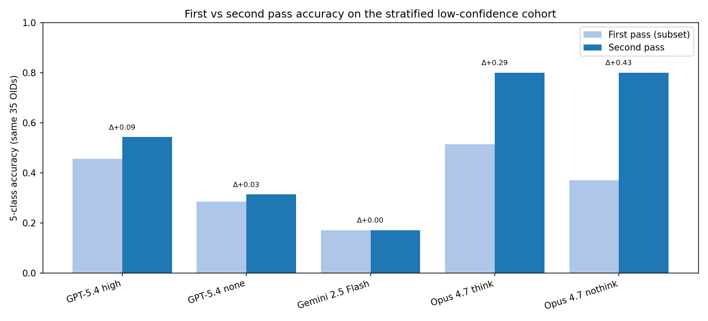
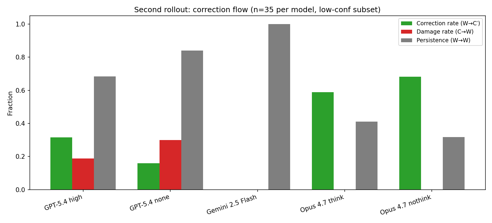
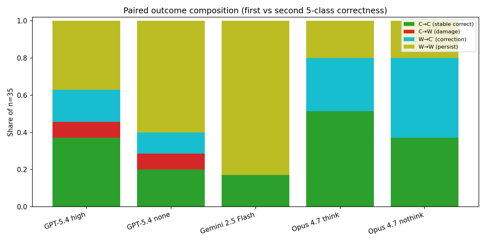
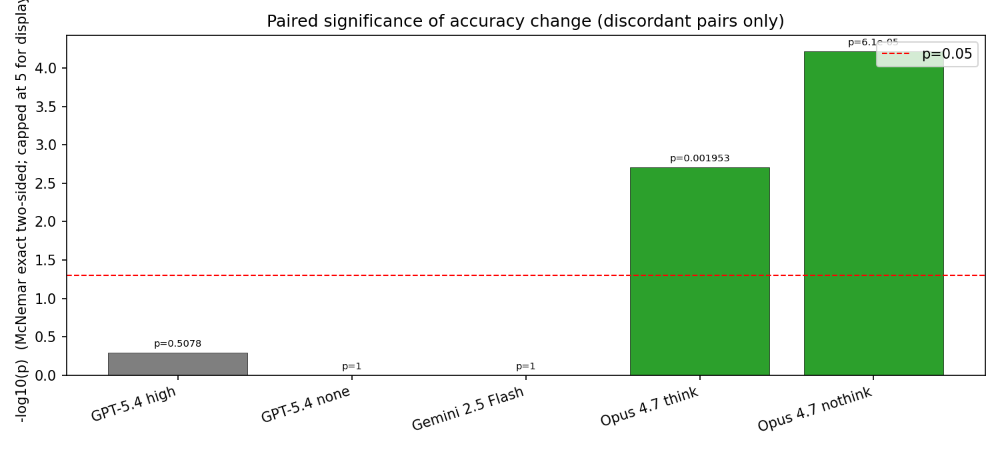
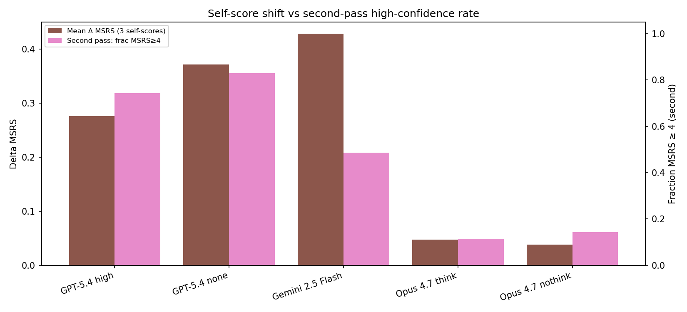
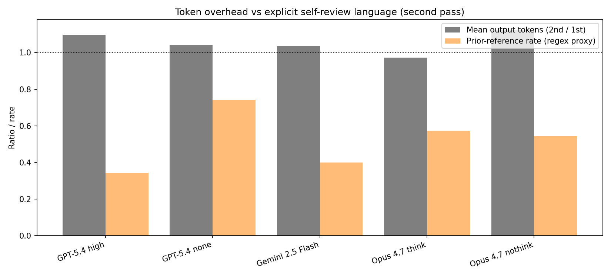

# Second-rollout low-confidence ablation — five closed models (2026-04-25)

Paired re-trial on **n = 35** alerts per model, each drawn from that model’s **own** first-pass benchmark cohort where **mean Part B self-score (three rubric dimensions) &lt; 4** and Part C was parseable to a valid 5-class label. Gold class stratification within the low-confidence **pool** follows Hamilton largest-remainder quotas (exactly 35 rows per model; **the 35 OIDs differ across models** because low-confidence sets differ). Second pass: same images + metadata as the original benchmark, plus **verbatim first-pass JSON** embedded in the user prompt (`prompts_second_roll_out_ablation.py`); models were **not** told whether the first answer was correct.

**Sources:** `results/second_rollout_*_n35.jsonl`, `evaluate_second_rollout.py` metrics JSONs, `data_second_roll_out_ablation/ablation_summary.json` (pool sizes), figures generated by `python -m viz._make_charts_second_rollout_apr25`.

**Figures.** Six PNGs are embedded inline in §§1–6 below, each where that quantity is named in a table. The index lists section placement and role; the prose and images read as one document rather than a separate gallery. PNGs live under `charts/second_rollout_apr25/`.

| Fig | Section | What it shows |
|---:|---|---|
| 1 | §2 | Correction vs damage vs persistence (three-rate bars per model) |
| 2 | §1 | Subset accuracy before / after the second pass, with Δ annotation |
| 3 | §4 | McNemar exact two-sided *p* on discordant pairs (−log₁₀ scale; α = 0.05 dashed) |
| 4 | §3 | Normalized paired-outcome stack (C→C / C→W / W→C′ / W→W) |
| 5 | §5 | Mean ΔMSRS and fraction with second-pass MSRS ≥ 4 |
| 6 | §6 | Output-token ratio (2nd/1st) vs prior-reference regex rate |

---

## 1. Headline comparison (n = 35 each)

| Model | Acc₁ (subset) | Acc₂ | ΔAcc | Correction (W→C′) | Damage (C→W) | Persistence (W→W) | McNemar *p* | ΔMSRS | Out tok 2/1 | Prior-ref rate | Stage3 flip | 2nd MSRS≥4 |
|---|---:|---:|---:|---:|---:|---:|---:|---:|---:|---:|---:|---:|
| GPT-5.4 high | 45.71 % | 54.29 % | **+8.57 pp** | 31.58 % | 18.75 % | 68.42 % | 0.508 | +0.276 | 1.10 | 34.29 % | 17.14 % | 74.29 % |
| GPT-5.4 none | 28.57 % | 31.43 % | +2.86 pp | 16.00 % | 30.00 % | 84.00 % | 1.000 | +0.371 | 1.04 | **74.29 %** | 11.43 % | 82.86 % |
| Gemini 2.5 Flash | 17.14 % | 17.14 % | **0.00 pp** | 0.00 % | 0.00 % | 100.00 % | 1.000 | +0.429 | 1.03 | 40.00 % | 0.00 % | 48.57 % |
| Claude Opus 4.7 think | 51.43 % | **80.00 %** | **+28.57 pp** | 58.82 % | **0.00 %** | 41.18 % | **0.00195** | +0.048 | 0.97 | 57.14 % | 20.00 % | 11.43 % |
| Claude Opus 4.7 nothink | 37.14 % | **80.00 %** | **+42.86 pp** | **68.18 %** | **0.00 %** | 31.82 % | **6.1×10⁻⁵** | +0.038 | 1.12 | 54.29 % | **34.29 %** | 14.29 % |

**Take-away in one sentence:** On this deliberately hard slice, **Claude Opus 4.7** (think and nothink) shows **large, statistically supported** accuracy gains with **zero damage** to initially-correct rows; **GPT‑5.4 high** gains modestly but with **material damage** and a **non-significant** McNemar *p*; **GPT‑5.4 none** barely moves; **Gemini 2.5 Flash** is **flat** on accuracy despite higher self-scores second pass.

*Fig 2. First-pass (Acc₁) vs second-pass (Acc₂) accuracy on the stratified low-confidence subset. The visual separates **three regimes**: (i) **Opus think / nothink** — large upward steps to 80 % with the largest positive Δ; (ii) **GPT‑5.4 high** — modest +8.6 pp; (iii) **GPT‑5.4 none** — small +2.9 pp; **Gemini 2.5 Flash** — a flat line (no vertical movement). The chart matches the table’s story: only Opus moves the **classification** outcome strongly on this slice, while Gemini moves **self-scores** (see §5) but not the accuracy bar.*

**How to read this with the table:** Use Fig 2 for **magnitude and ordering** of second-pass lift; the numeric columns in the same section supply correction/damage, significance (*p*), and auxiliary rates (MSRS, tokens) developed in the following sections.

---

## 2. Correction, damage, and persistence (paired dynamics)

Paired rates are defined on first-pass **correct (C)** vs **wrong (W)**. **Correction (W→C′)** = wrong first, right second. **Damage (C→W)** = right first, wrong second. **Persistence (W→W)** = still wrong. Full definitions: `data_second_roll_out_ablation/METRICS_SPEC.md`.

*Fig 1. Three-rate bar view of second-pass **outcomes conditional on the first pass**. **Opus** (both modes) shows **tall green (correction)**, **zero or negligible red (damage)**, and moderate “still wrong” (gray). **GPT‑5.4 high** trades real corrections against **substantial damage** (red) — a visible “fixes some / breaks some” bar pattern. **GPT‑5.4 none** has low correction and high damage relative to the gain. **Gemini 2.5 Flash** stacks entirely in **persistence** on wrong rows: no green segment for repairs and no red for new mistakes — the model simply **does not flip** any row’s correctness class on retry here.*

**Bridge to the headline table:** The Opus bar shapes line up with **ΔAcc** and **Acc₂ = 80 %**; the GPT‑5.4 high red segment quantifies the “~1 in 5” cost to initially-correct rows mentioned in the synthesis (§8).

---

## 3. Normalized composition of paired outcomes (C→C / C→W / W→C′ / W→W)

The stacked view shows **where each first-pass stratum** (correct vs wrong) ends up after the second pass, as **fractions of all 35 rows** (hence the four areas sum to 100 % for each model).

*Fig 4. Stacked, **population-normalized** trajectories. **Opus** devotes a **large** slice to W→C′ (moves from wrong to right) and keeps the C→C band intact — there is no visible **C→W** sliver. **GPT‑5.4 high** shows a **C→W** band that is absent for Opus: that is the “collateral damage” regime. **Gemini** is dominated by W→W plus the correct rows that **stay** correct (C→C); the chart makes the “**no** cross-trajectory flips for wrong rows” fact obvious as the absence of a W→C′ wedge from the bottom stratum.*

Together, Fig 1 (rates among discordant-relevant subgroups) and Fig 4 (row-mass in each quadrant of the 2×2) answer the same question at two scales: **mechanism** (Fig 1) vs **cumulative share of the 35** (Fig 4).

---

## 4. McNemar (discordant-pair) significance

McNemar uses **only** discordant pairs: W→C′ vs C→W. The plot shows −log₁₀(*p*); the dashed line marks *p* = 0.05.

*Fig 3. **Opus think** and **Opus nothink** sit **above** the α = 0.05 line: the **asymmetry** of discordant flips (more W→C′ than C→W) is unlikely under a null of symmetric error. **GPT‑5.4 high** and **none** sit **below** the line — the point estimates favor improvement on discordants, but *n* = 35 and the imbalance in discordant counts leave *p* non-significant for high; none is essentially tied. **Gemini 2.5 Flash** has **zero** discordant pairs, so the test is **degenerate** (*p* = 1) — the bar position is a numeric artifact, not “evidence of no effect” (discordant counts in §12).*

**Statistical caveat (unchanged in spirit):** *n* = 35 and **different OID sets** per model mean you should compare **design and magnitudes** across models, not treat McNemar *p* values as if they were one pooled A/B.

---

## 5. MSRS: mean shift and “high confidence” on the second pass

Mean self-rubric score (MSRS) aggregates the three Part B self-dimensions. A positive **ΔMSRS** means the model **grades itself more generously** on the second pass, averaged over the 35 rows.

*Fig 5. **Vertical axis (ΔMSRS)**: all models nudge self-scores **up** on the second trial (positive mean Δ). **Horizontal axis (fraction with second MSRS ≥ 4)**: the fraction that crosses into the “high” self-grade band after retry. **Opus** shows **small** mean Δ but **huge** accuracy gains (Fig 2) and **low** high-confidence rates second pass (most rows stay self-critical even when correct) — a **decoupling** between **classification** update and **modest** score inflation. **Gemini** combines the **largest** ΔMSRS in the table with a **~50 %** high-confidence second-pass rate, yet **zero** accuracy change: the most striking **calibration/behavior** split in this cohort. **GPT‑5.4 none** drives **very high** second MSRS≥4 (83 %) without reliable repair.*

---

## 6. Output length and “prior answer” language

**Out tok 2/1** = mean second-pass output tokens ÷ mean first-pass tokens (same 35 OIDs, first pass taken from the benchmark run). **Prior-ref rate** = fraction of second-pass rows matching a **regex** for explicit reference to the prior JSON / “previous answer” (exact pattern in the evaluation script’s metrics export).

*Fig 6. **GPT‑5.4 none** is an **outlier** on the x-axis: **~74 %** of rows show explicit prior-reference phrasing, while second-pass output length is only marginally above the first (ratio ≈ 1.04). That supports the interpretation that **naming the prior** is a rhetorical habit, not a proxy for a consistent repair — accuracy remains near flat (§1). **Opus** modes sit in the **mid-50s %** prior-ref with ratios near 1.0 (think) to **1.12** (nothink). **Gemini** is moderate on prior-ref; token ratio ≈ 1.03, consistent with a second pass that **rephrases and re-scores** more than it **re-traces** a long new chain-of-thought.*

---

## 7. Design recap (for readers reproducing the study)

1. **First-pass pool:** For each model, all benchmark rows with valid Part B triple self-scores, mean &lt; 4, and evaluable Part C → 5-class label (`evaluate_second_rollout.py` / `viz/build_second_rollout_ablation.py`).
2. **Stratified n = 35:** Class quotas ∝ low-conf pool histogram (Hamilton remainder); random tie-break within class (`--random-seed 42` at build time).
3. **Prompt:** `prompts_second_roll_out_ablation.py` — same system rubric as `prompts.py`, plus second-trial instructions and the model’s **own** prior JSON (no gold revealed).
4. **Paired metrics:** As in §2–3; McNemar as in §4.

---

## 8. Low-confidence pool sizes (first pass, before n=35 draw)

From `ablation_summary.json` (illustrates how “hard” each model’s slice is):

| Model | \|Low-conf pool\| | Notes on class mass in pool |
|---|---:|---|
| GPT-5.4 high | 118 | Strong bogus + asteroid representation; only **1** VS in pool → **0** VS in the n=35 table. |
| GPT-5.4 none | 36 | Very small pool (almost entire slice used for sampling); no VS in pool. |
| Gemini 2.5 Flash | 83 | See summary file for per-class histogram. |
| Opus think | 109 | Balanced enough for all five classes in the n=35 draw. |
| Opus nothink | 121 | Similar. |

The **sample class counts** embedded in each metrics JSON (reproduced implicitly in §1) confirm the stratified n=35 breakdown per model.

---

## 9. Interpretation by model family (synthesis)

The figures above already state the **numbers**; this subsection ties **mechanism** to **families** without re-deriving every cell.

### 9.1 Claude Opus 4.7 (think & nothink)

- **Largest ΔAcc** on the cohort (+28.6 pp think, +42.9 pp nothink), second-pass accuracy **80 %** for both (Fig 2).
- **Damage = 0** for both (Fig 1, Fig 4): no initially-correct alert was broken on retry.
- **McNemar:** think *p* ≈ 0.0020; nothink *p* ≈ 6×10⁻⁵ (Fig 3) — the shift on discordant pairs is not random splitting.
- **MSRS (Fig 5):** mean Δ is small positive while accuracy jumps; **second MSRS≥4** stays **low** (11–14 %), so many rows remain self-critical even when **correct** after retry — consistent with **honest** self-grading under revision rather than indiscriminate score inflation.
- **Stage3 flip** is higher for nothink (34 %) than think (20 %): direct-answer mode more often **revises the fine subclass** when forced to re-read the first JSON.

### 9.2 GPT-5.4 (high vs none)

- **High:** net +8.6 pp (Fig 2) but **damage 18.8 %** (Fig 1) — roughly **1 in 5** initially-correct low-conf rows regresses. McNemar *p* ≈ 0.51 (Fig 3) — **no** significant paired improvement at α = 0.05 despite a positive point estimate.
- **None:** +2.9 pp only; damage still **30 %**; McNemar *p* = 1. **Prior-reference rate is highest** (74 %, Fig 6) — explicit talk about the prior answer does not translate into reliable repair (see also §1 table).

### 9.3 Gemini 2.5 Flash (none / thinking off)

- **ΔAcc = 0**; correction and damage rates are **0** (Fig 1) — every row stays in the same correctness class (**6** stayed correct, **29** stayed wrong). Fig 4 has **no** W→C′ mass from the wrong stratum.
- McNemar *p* = 1 because there are **zero discordant pairs** (Fig 3) — the test is **uninformative** when no paired flips occur, not a proof of “no effect possible.”
- **MSRS** rises (+0.43 mean) and **second MSRS≥4** is near coin-flip (48.6 %, Fig 5) — the model **re-grades** more **confidently** without **changing** the staged classification, the clearest **calibration–behavior decoupling** in this ablation.

---

## 10. Cross-cutting themes

1. **“Second chance” ≠ guaranteed repair.** Only Opus (both modes) delivers **large, significant** gains with **no collateral damage** on this design (Figs 1–4). GPT‑5.4 high shows **trade-off**: some wrongs fix, some rights break.
2. **Self-score inflation without accuracy gain (Gemini).** Largest **ΔMSRS** and a high “second MSRS≥4” share (Fig 5), yet **no** vertical movement in Fig 2 — worth a dedicated sentence in any calibration-focused write-up.
3. **Statistical scope:** *n* = 35 and **different OIDs** per model → treat cross-model *p* comparisons as **narrative**, not a single pooled experiment.
4. **McNemar with zero discordants (Gemini):** report *p* = 1 but explain that **no** correct row became wrong and **no** wrong row became correct (§4).

---

## 11. Artifact paths

| Artifact | Path |
|---|---|
| Manifests + priors | `data_second_roll_out_ablation/metadata/`, `data_second_roll_out_ablation/priors/` |
| Second-pass JSONL | `results/second_rollout_<slug>_n35.jsonl` |
| Metrics JSON | `results/second_rollout_<slug>_n35.metrics.json` |
| Chart generator | `viz/_make_charts_second_rollout_apr25.py` |

---

## 12. Appendix — discordant pairs (for McNemar transparency)

| Model | W→C′ | C→W |
|---|---:|---:|
| GPT-5.4 high | 6 | 3 |
| GPT-5.4 none | 4 | 3 |
| Gemini 2.5 Flash | 0 | 0 |
| Opus 4.7 think | 10 | 0 |
| Opus 4.7 nothink | 15 | 0 |

---

*End of report — 2026-04-25.*
