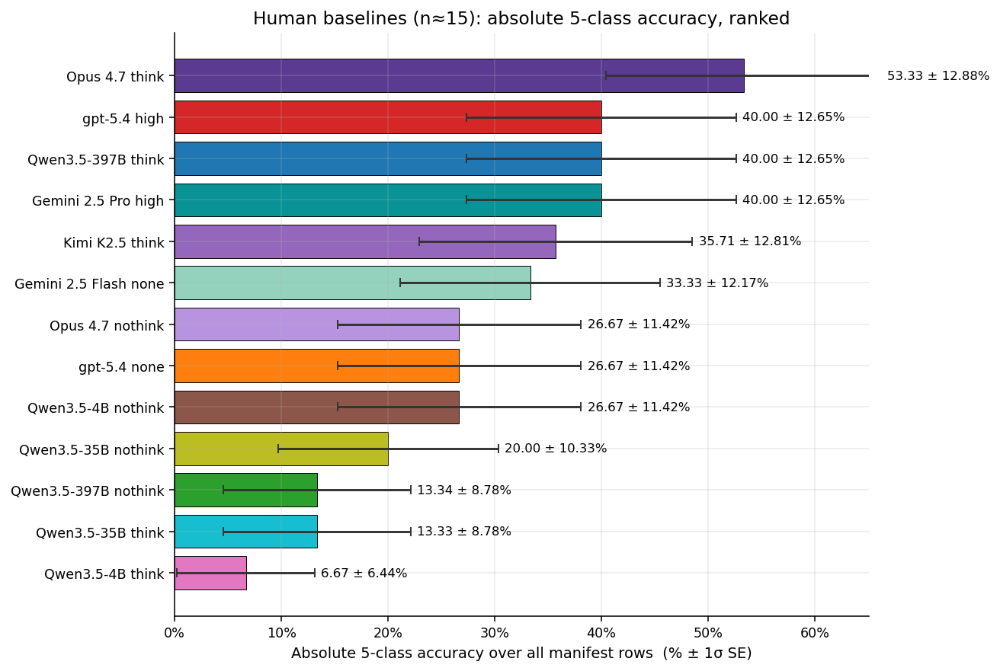
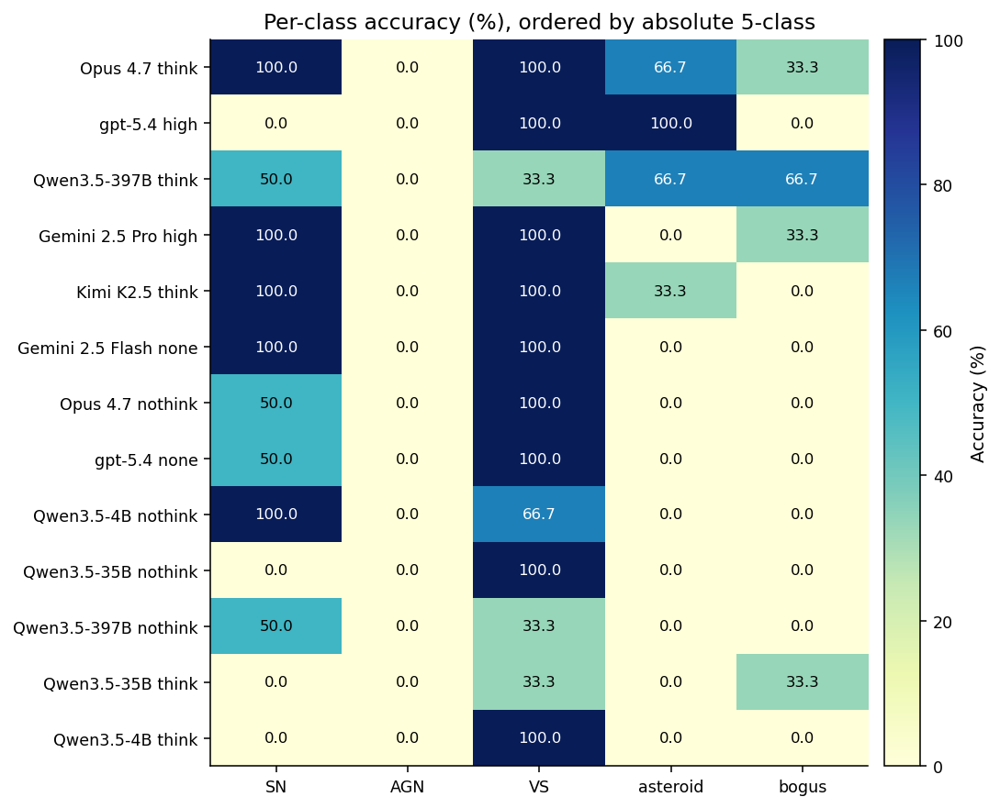
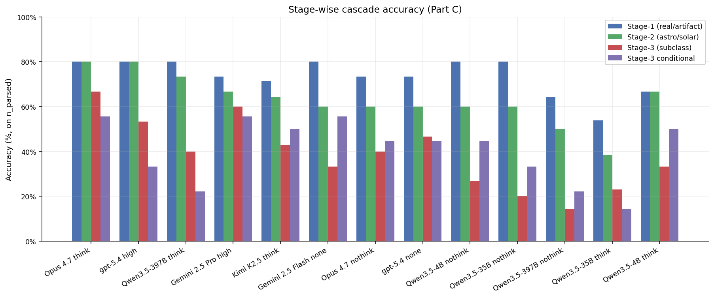
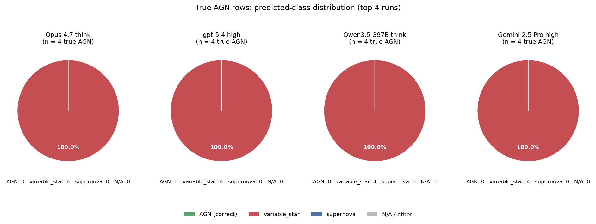
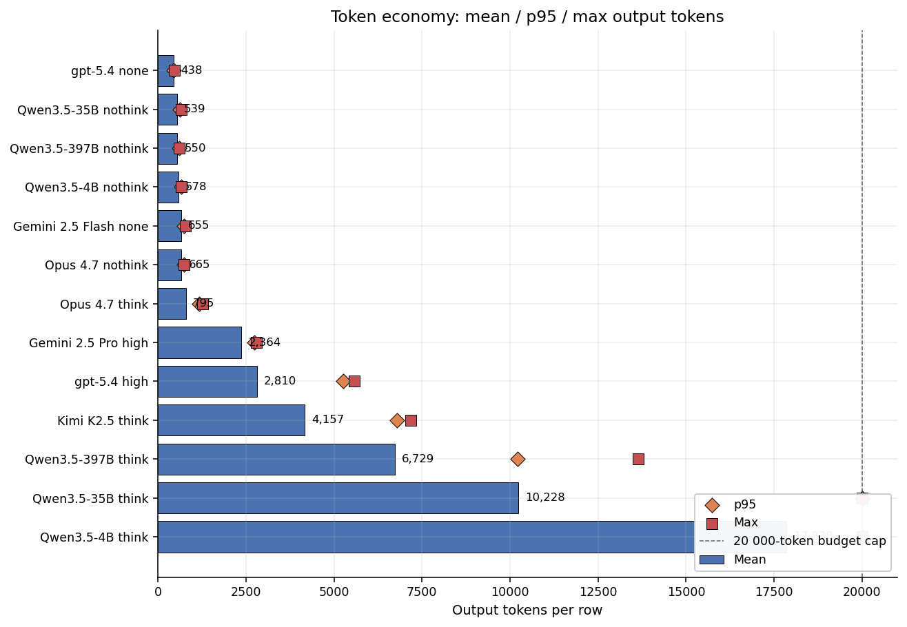
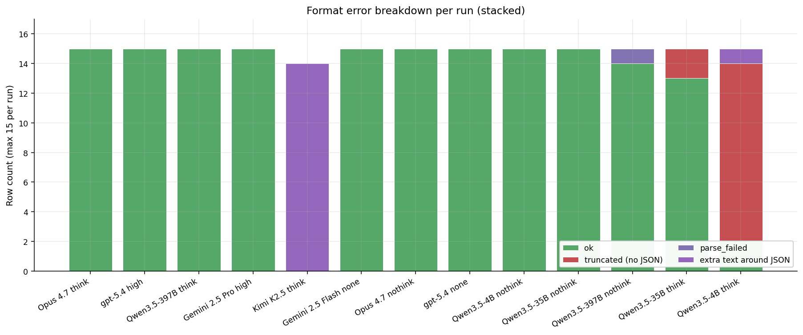
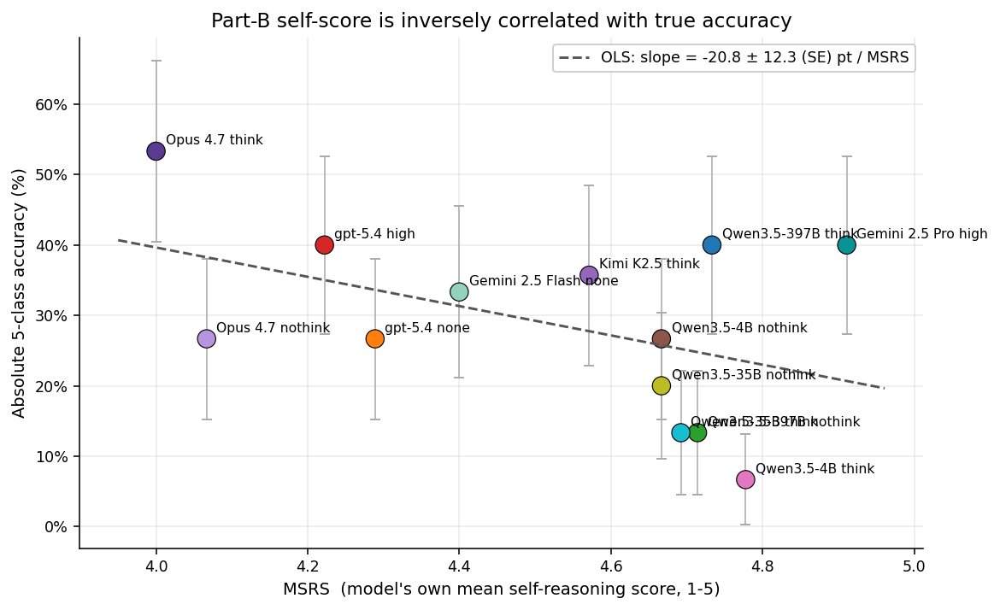
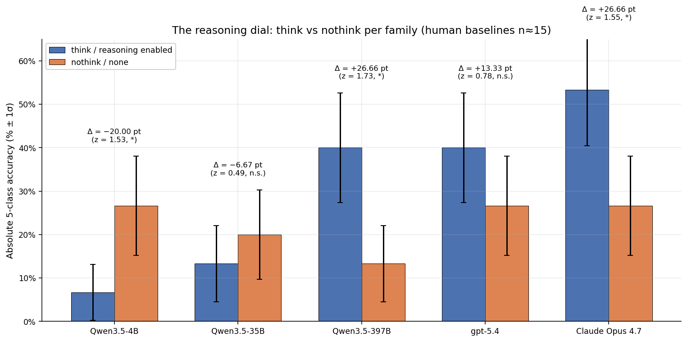
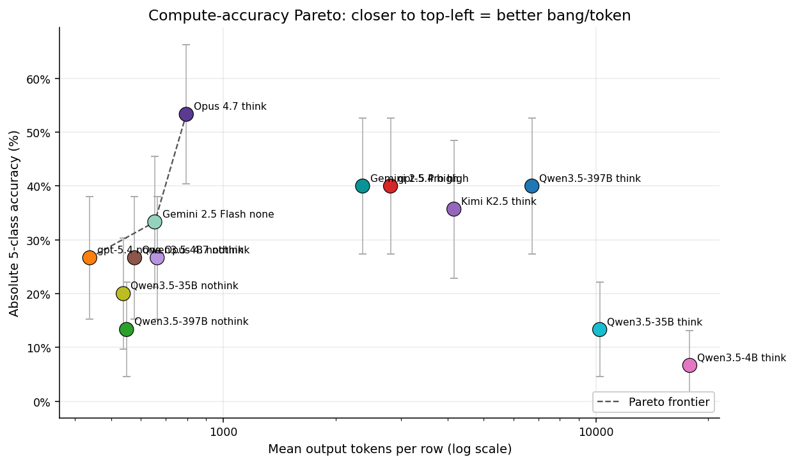

# Human-baselines comparison — 13 runs on `manifest_human_baselines_15.csv` (Apr 28–29 2026)

Cross-run comparison of the **same 13 model configurations** as [`20260421_report_benchmark_full_all_runs.md`](20260421_report_benchmark_full_all_runs.md), evaluated on **`data/manifest_human_baselines_15.csv`** — **15** human-curated cutouts (metadata under `human_samples/human_baselines/`; gold class counts: **AGN 5, VS 3, SN 2, bogus 3, asteroid 3** — see `data/manifest_human_baselines_15.md`). Prompt module is **`prompts.py`** (same AstroAlertBench-style Parts A–C JSON as the full benchmark); montages default to **`stamps_llm_updated/`** (`prompts.STAMPS_LLM_DIRNAME`). Metrics come from `evaluate.evaluate_jsonl` and each run’s `runs/<timestamp>-<slug>/metrics.json`.

**Small-n warning.** With **n ≈ 15** rows per sweep (Kimi K2.5 has **14** API rows in `run.jsonl`; two Qwen runs have **parse/evaluable n < 15**), binomial **1σ SE on absolute accuracy is ~10–13 percentage points** near 50 % correctness. Head-to-head gaps below **~25 pt** are usually **not** significant at |z| > 2; treat this report as a **sanity / qualitative** check on the human slice, not a replacement for the 1500-row benchmark.

**Standard error convention:** same as the full-benchmark report: `SE = √(p·(1−p)/n)` for proportions; **1σ** bars in figures and tables. OLS slope SE on MSRS vs accuracy (Fig 7) is the usual regression standard error (homoskedastic), **n = 13** points.

**Figures.** Nine charts in `charts/human_baselines_15/`, same numbering as the full-benchmark report. Regenerate with `python -m viz._make_charts_human_baselines_15`.

| Fig | Section | What it shows |
|---:|---|---|
| 1 | §1 | Absolute 5-class accuracy ranked (± 1σ SE) |
| 2 | §2 | Per-class accuracy heatmap (13 × 5) |
| 3 | §3 | Stage-wise cascade |
| 4 | §4 | True-AGN predicted distribution, top 4 runs |
| 5 | §6 | Token economy (mean / p95 / max) |
| 6 | §7 | Format error breakdown (stacked counts) |
| 7 | §9 | MSRS vs absolute accuracy + OLS |
| 8 | §10 | Think vs nothink paired bars (5 families) |
| 9 | §12 | Compute–accuracy Pareto (log mean tokens) |

---

## Runs covered (13; human baselines)

| # | Slug | Run folder | Model | Notes |
|---|---|---|---|---|
| 1 | `opus47-think-human-baselines-15` | `20260428-2356-opus47-think-human-baselines-15` | Claude Opus 4.7 think | n=15 |
| 2 | `gpt-5.4-high-human-baselines-15` | `20260428-2358-gpt-5.4-high-human-baselines-15` | gpt-5.4 high | n=15 |
| 3 | `kimi-k25-human-baselines-15` | `20260428-2349-kimi-k25-human-baselines-15` | Kimi K2.5 think | **n=14** in JSONL |
| 4 | `opus47-nothink-human-baselines-15` | `20260428-2357-opus47-nothink-human-baselines-15` | Claude Opus 4.7 nothink | n=15 |
| 5 | `qwen35-397b-a17b-human-baselines-15` | `20260428-2348-qwen35-397b-a17b-human-baselines-15` | Qwen3.5-397B think | n=15 |
| 6 | `gpt-5.4-none-human-baselines-15` | `20260428-2359-gpt-5.4-none-human-baselines-15` | gpt-5.4 none | n=15 |
| 7 | `gemini25-pro-high-human-baselines-15` | `20260428-2356-gemini25-pro-high-human-baselines-15` | Gemini 2.5 Pro high | n=15 |
| 8 | `gemini25-flash-none-human-baselines-15` | `20260429-0042-gemini25-flash-none-human-baselines-15` | Gemini 2.5 Flash none | n=15 |
| 9 | `qwen35-397b-a17b-nothink-human-baselines-15` | `20260428-2330-qwen35-397b-a17b-nothink-human-baselines-15` | Qwen3.5-397B nothink | n=15 (n_e=14) |
| 10 | `qwen35-35b-a3b-human-baselines-15` | `20260429-0019-qwen35-35b-a3b-human-baselines-15` | Qwen3.5-35B think | n=15 (n_e=13) |
| 11 | `qwen35-35b-a3b-nothink-human-baselines-15` | `20260428-2357-qwen35-35b-a3b-nothink-human-baselines-15` | Qwen3.5-35B nothink | n=15 |
| 12 | `qwen35-4b-nothink-human-baselines-15` | `20260428-2356-qwen35-4b-nothink-human-baselines-15` | Qwen3.5-4B nothink | n=15 |
| 13 | `qwen35-4b-human-baselines-15` | `20260429-0026-qwen35-4b-human-baselines-15` | Qwen3.5-4B think | n=15 (heavy trunc.; n_e=3) |

---

## 1. Headline numbers

Absolute 5-class accuracy = **parse_rate × part_c_final_5class_accuracy** over `n_examples` from each `metrics.json`. Denominator for SE on the absolute column is **`n_examples`** (total manifest rows in that run’s JSONL).

| Rank | Run | 5-class (on parsed) | Parse rate | Truncation | **Absolute** | Macro F1 | MSRS |
|---:|---|---:|---:|---:|---:|---:|---:|
| 1 | Opus 4.7 think | 53.33 ± 12.88 % (n=15) | 100.00 ± 0.00 % | 0.00 % | **53.33 ± 12.88 %** (n=15) | 0.5333 | 4.00 |
| 2 | gpt-5.4 high | 40.00 ± 12.65 % (n=15) | 100.00 ± 0.00 % | 0.00 % | **40.00 ± 12.65 %** (n=15) | 0.2000 | 4.22 |
| 3 | Qwen3.5-397B think | 40.00 ± 12.65 % (n=15) | 100.00 ± 0.00 % | 0.00 % | **40.00 ± 12.65 %** (n=15) | 0.3056 | 4.73 |
| 4 | Gemini 2.5 Pro high | 40.00 ± 12.65 % (n=15) | 100.00 ± 0.00 % | 0.00 % | **40.00 ± 12.65 %** (n=15) | 0.5333 | 4.91 |
| 5 | Kimi K2.5 think | 35.71 ± 12.81 % (n=14) | 100.00 ± 0.00 % | 0.00 % | **35.71 ± 12.81 %** (n=14) | 0.5000 | 4.57 |
| 6 | Gemini 2.5 Flash none | 33.33 ± 12.17 % (n=15) | 100.00 ± 0.00 % | 0.00 % | **33.33 ± 12.17 %** (n=15) | 0.5333 | 4.40 |
| 7 | Opus 4.7 nothink | 26.67 ± 11.42 % (n=15) | 100.00 ± 0.00 % | 0.00 % | **26.67 ± 11.42 %** (n=15) | 0.4222 | 4.07 |
| 8 | gpt-5.4 none | 26.67 ± 11.42 % (n=15) | 100.00 ± 0.00 % | 0.00 % | **26.67 ± 11.42 %** (n=15) | 0.4222 | 4.29 |
| 9 | Qwen3.5-4B nothink | 26.67 ± 11.42 % (n=15) | 100.00 ± 0.00 % | 0.00 % | **26.67 ± 11.42 %** (n=15) | 0.4148 | 4.67 |
| 10 | Qwen3.5-35B nothink | 20.00 ± 10.33 % (n=15) | 100.00 ± 0.00 % | 0.00 % | **20.00 ± 10.33 %** (n=15) | 0.1667 | 4.67 |
| 11 | Qwen3.5-397B nothink | 14.29 ± 9.35 % (n=14) | 93.33 ± 6.44 % | 0.00 % | **13.34 ± 8.78 %** (n=15) | 0.2963 | 4.71 |
| 12 | Qwen3.5-35B think | 15.38 ± 10.01 % (n=13) | 86.67 ± 8.78 % | 13.33 % | **13.33 ± 8.78 %** (n=15) | 0.0952 | 4.69 |
| 13 | Qwen3.5-4B think | 33.33 ± 27.22 % (n=3) | 20.00 ± 10.33 % | 86.67 % | **6.67 ± 6.44 %** (n=15) | 0.2222 | 4.78 |

*Fig 1. Ranked absolute 5-class on the human-baseline slice. **Opus 4.7 think** leads at 53.3 ± 12.9 %, but error bars overlap most of the mid-pack — this is expected at n ≈ 15.*

**Takeaway.** Opus 4.7 think remains the best single point on this slice, but **gpt-5.4 high**, **Qwen3.5-397B think**, and **Gemini 2.5 Pro** tie at **40 %** absolute within ±1σ. **Qwen3.5-4B think** repeats the full-benchmark failure mode: **86.7 % truncation** and only **three** evaluable Part-C rows.

---

## 2. Per-class accuracy

Cells: `correct/total ± SE` with binomial SE on that cell’s `total`. Gold counts follow each run’s `per_class_total` (subset of the 15 rows with a parseable staged prediction for that class). **Do not** compare to the 300/× full-benchmark denominators.

| Run | SN | AGN | VS | asteroid | bogus |
|---|---:|---:|---:|---:|---:|
| Opus 4.7 think | 2/2 (100.00 ± 0.00 %) | 0/4 (0.00 ± 0.00 %) | 3/3 (100.00 ± 0.00 %) | 2/3 (66.67 ± 27.22 %) | 1/3 (33.33 ± 27.22 %) |
| gpt-5.4 high | 0/2 (0.00 ± 0.00 %) | 0/4 (0.00 ± 0.00 %) | 3/3 (100.00 ± 0.00 %) | 3/3 (100.00 ± 0.00 %) | 0/3 (0.00 ± 0.00 %) |
| Qwen3.5-397B think | 1/2 (50.00 ± 35.36 %) | 0/4 (0.00 ± 0.00 %) | 1/3 (33.33 ± 27.22 %) | 2/3 (66.67 ± 27.22 %) | 2/3 (66.67 ± 27.22 %) |
| Gemini 2.5 Pro high | 2/2 (100.00 ± 0.00 %) | 0/4 (0.00 ± 0.00 %) | 3/3 (100.00 ± 0.00 %) | 0/3 (0.00 ± 0.00 %) | 1/3 (33.33 ± 27.22 %) |
| Kimi K2.5 think | 2/2 (100.00 ± 0.00 %) | 0/4 (0.00 ± 0.00 %) | 2/2 (100.00 ± 0.00 %) | 1/3 (33.33 ± 27.22 %) | 0/3 (0.00 ± 0.00 %) |
| Gemini 2.5 Flash none | 2/2 (100.00 ± 0.00 %) | 0/4 (0.00 ± 0.00 %) | 3/3 (100.00 ± 0.00 %) | 0/3 (0.00 ± 0.00 %) | 0/3 (0.00 ± 0.00 %) |
| Opus 4.7 nothink | 1/2 (50.00 ± 35.36 %) | 0/4 (0.00 ± 0.00 %) | 3/3 (100.00 ± 0.00 %) | 0/3 (0.00 ± 0.00 %) | 0/3 (0.00 ± 0.00 %) |
| gpt-5.4 none | 1/2 (50.00 ± 35.36 %) | 0/4 (0.00 ± 0.00 %) | 3/3 (100.00 ± 0.00 %) | 0/3 (0.00 ± 0.00 %) | 0/3 (0.00 ± 0.00 %) |
| Qwen3.5-4B nothink | 2/2 (100.00 ± 0.00 %) | 0/4 (0.00 ± 0.00 %) | 2/3 (66.67 ± 27.22 %) | 0/3 (0.00 ± 0.00 %) | 0/3 (0.00 ± 0.00 %) |
| Qwen3.5-35B nothink | 0/2 (0.00 ± 0.00 %) | 0/4 (0.00 ± 0.00 %) | 3/3 (100.00 ± 0.00 %) | 0/3 (0.00 ± 0.00 %) | 0/3 (0.00 ± 0.00 %) |
| Qwen3.5-397B nothink | 1/2 (50.00 ± 35.36 %) | 0/4 (0.00 ± 0.00 %) | 1/3 (33.33 ± 27.22 %) | 0/2 (0.00 ± 0.00 %) | 0/3 (0.00 ± 0.00 %) |
| Qwen3.5-35B think | 0/1 (0.00 ± 0.00 %) | 0/3 (0.00 ± 0.00 %) | 1/3 (33.33 ± 27.22 %) | 0/3 (0.00 ± 0.00 %) | 1/3 (33.33 ± 27.22 %) |
| Qwen3.5-4B think | — | 0/1 (0.00 ± 0.00 %) | 1/1 (100.00 ± 0.00 %) | — | 0/1 (0.00 ± 0.00 %) |

*Fig 2. Heatmap (same layout as full-benchmark report). Sparse denominators make individual cells noisy.*

---

## 3. Stage-wise accuracy (Part C cascade)

| Run | n_p | Stage-1 | Stage-2 | Stage-3 | S3 cond. | End-to-end |
|---|---:|---:|---:|---:|---:|---:|
| Opus 4.7 think | 15 | 80.00 ± 10.33 % | 80.00 ± 10.33 % | 66.67 ± 12.17 % | 55.56 ± 12.83 % | 53.33 ± 12.88 % |
| gpt-5.4 high | 15 | 80.00 ± 10.33 % | 80.00 ± 10.33 % | 53.33 ± 12.88 % | 33.33 ± 12.17 % | 40.00 ± 12.65 % |
| Qwen3.5-397B think | 15 | 80.00 ± 10.33 % | 73.33 ± 11.42 % | 40.00 ± 12.65 % | 22.22 ± 10.73 % | 40.00 ± 12.65 % |
| Gemini 2.5 Pro high | 15 | 73.33 ± 11.42 % | 66.67 ± 12.17 % | 60.00 ± 12.65 % | 55.56 ± 12.83 % | 40.00 ± 12.65 % |
| Kimi K2.5 think | 14 | 71.43 ± 12.07 % | 64.29 ± 12.81 % | 42.86 ± 13.23 % | 50.00 ± 13.36 % | 35.71 ± 12.81 % |
| Gemini 2.5 Flash none | 15 | 80.00 ± 10.33 % | 60.00 ± 12.65 % | 33.33 ± 12.17 % | 55.56 ± 12.83 % | 33.33 ± 12.17 % |
| Opus 4.7 nothink | 15 | 73.33 ± 11.42 % | 60.00 ± 12.65 % | 40.00 ± 12.65 % | 44.44 ± 12.83 % | 26.67 ± 11.42 % |
| gpt-5.4 none | 15 | 73.33 ± 11.42 % | 60.00 ± 12.65 % | 46.67 ± 12.88 % | 44.44 ± 12.83 % | 26.67 ± 11.42 % |
| Qwen3.5-4B nothink | 15 | 80.00 ± 10.33 % | 60.00 ± 12.65 % | 26.67 ± 11.42 % | 44.44 ± 12.83 % | 26.67 ± 11.42 % |
| Qwen3.5-35B nothink | 15 | 80.00 ± 10.33 % | 60.00 ± 12.65 % | 20.00 ± 10.33 % | 33.33 ± 12.17 % | 20.00 ± 10.33 % |
| Qwen3.5-397B nothink | 14 | 64.29 ± 12.81 % | 50.00 ± 13.36 % | 14.29 ± 9.35 % | 22.22 ± 11.11 % | 14.29 ± 9.35 % |
| Qwen3.5-35B think | 13 | 53.85 ± 13.83 % | 38.46 ± 13.49 % | 23.08 ± 11.69 % | 14.29 ± 9.71 % | 15.38 ± 10.01 % |
| Qwen3.5-4B think | 3 | 66.67 ± 27.22 % | 66.67 ± 27.22 % | 33.33 ± 27.22 % | 50.00 ± 28.87 % | 33.33 ± 27.22 % |

*Fig 3. Cascade bars. Stage definitions match `evaluate.py`.*

---

## 4. Stage-3 confusion — top 4 runs (true AGN rows)

Mirroring the full report, Fig 4 shows where **true AGN gold** rows land in predicted stage-3 labels for the **top four** runs by absolute accuracy. Counts come from `part_c_stage3_confusion_matrix['AGN']`.

*Fig 4. AGN → predicted (top 4).* 

**Opus 4.7 think** — AGN row counts: {'supernova': 0, 'variable_star': 4, 'AGN': 0, 'N/A': 0}

**gpt-5.4 high** — AGN row counts: {'supernova': 0, 'variable_star': 4, 'AGN': 0, 'N/A': 0}

**Qwen3.5-397B think** — AGN row counts: {'supernova': 0, 'variable_star': 4, 'AGN': 0, 'N/A': 0}

**Gemini 2.5 Pro high** — AGN row counts: {'supernova': 0, 'variable_star': 4, 'AGN': 0, 'N/A': 0}

---

## 5. Stage-3 subclass F1 (point estimates)

`part_c_stage3_macro_f1` from each `metrics.json` (no binomial SE). Macro-F1 is extremely volatile at n ≈ 15.

| Run | Macro F1 |
|---|---:|
| Opus 4.7 think | 0.5333 |
| gpt-5.4 high | 0.2000 |
| Qwen3.5-397B think | 0.3056 |
| Gemini 2.5 Pro high | 0.5333 |
| Kimi K2.5 think | 0.5000 |
| Gemini 2.5 Flash none | 0.5333 |
| Opus 4.7 nothink | 0.4222 |
| gpt-5.4 none | 0.4222 |
| Qwen3.5-4B nothink | 0.4148 |
| Qwen3.5-35B nothink | 0.1667 |
| Qwen3.5-397B nothink | 0.2963 |
| Qwen3.5-35B think | 0.0952 |
| Qwen3.5-4B think | 0.2222 |

---

## 6. Token economy

| Run | Mean | p95 | Max |
|---|---:|---:|---:|
| Opus 4.7 think | 796 | 1179 | 1277 |
| gpt-5.4 high | 2810 | 5262 | 5582 |
| Qwen3.5-397B think | 6730 | 10209 | 13644 |
| Gemini 2.5 Pro high | 2365 | 2727 | 2789 |
| Kimi K2.5 think | 4157 | 6788 | 7179 |
| Gemini 2.5 Flash none | 655 | 746 | 779 |
| Opus 4.7 nothink | 665 | 740 | 749 |
| gpt-5.4 none | 438 | 454 | 461 |
| Qwen3.5-4B nothink | 578 | 656 | 666 |
| Qwen3.5-35B nothink | 539 | 624 | 653 |
| Qwen3.5-397B nothink | 550 | 605 | 609 |
| Qwen3.5-35B think | 10229 | 20000 | 20000 |
| Qwen3.5-4B think | 17839 | 20000 | 20000 |

### 6.1 Wall-clock (run folder)

| Run | Wall-clock |
|---|:---|
| Gemini 2.5 Flash none | 7 m 5 s |
| Gemini 2.5 Pro high | 47 s |
| Kimi K2.5 think | 24 m 24 s |
| Opus 4.7 nothink | 26 s |
| Opus 4.7 think | 35 s |
| Qwen3.5-35B nothink | 2 m 16 s |
| Qwen3.5-35B think | 24 m 31 s |
| Qwen3.5-397B nothink | 3 m 19 s |
| Qwen3.5-397B think | 20 m 42 s |
| Qwen3.5-4B nothink | 1 m 48 s |
| Qwen3.5-4B think | 31 m 8 s |
| gpt-5.4 high | 2 m 45 s |
| gpt-5.4 none | 20 s |

---

## 7. Format error breakdown

*Fig 6. Stacked `error_breakdown.format` counts. Qwen3.5-4B (think) is almost entirely **truncated_no_json** on this slice.*

---

## 8. Part A

All completed runs report **100 %** `part_a_macro_accuracy` and **100 %** `part_a_exact_match_rate` on this slice — same as the full benchmark. Part A is not the discriminator here.

---

## 9. Part B / self-scoring

MSRS and **self_pass_rate** (pass = row mean of three Part B self-ratings **≥ 4**, see full-benchmark §9). OLS on absolute accuracy vs MSRS: slope **-20.8 ± 12.3** pp per MSRS unit (n = 13).

| Run | MSRS | self_pass_rate |
|---|---:|---:|
| Gemini 2.5 Pro high | 4.9111 | 100.00 ± 0.00 % |
| Qwen3.5-4B think | 4.7778 | 100.00 ± 0.00 % |
| Qwen3.5-397B think | 4.7333 | 100.00 ± 0.00 % |
| Qwen3.5-397B nothink | 4.7143 | 100.00 ± 0.00 % |
| Qwen3.5-35B think | 4.6923 | 100.00 ± 0.00 % |
| Qwen3.5-4B nothink | 4.6667 | 100.00 ± 0.00 % |
| Qwen3.5-35B nothink | 4.6667 | 100.00 ± 0.00 % |
| Kimi K2.5 think | 4.5714 | 100.00 ± 0.00 % |
| Gemini 2.5 Flash none | 4.4000 | 100.00 ± 0.00 % |
| gpt-5.4 none | 4.2889 | 100.00 ± 0.00 % |
| gpt-5.4 high | 4.2222 | 93.33 ± 6.44 % |
| Opus 4.7 nothink | 4.0667 | 73.33 ± 11.42 % |
| Opus 4.7 think | 4.0000 | 60.00 ± 12.65 % |

*Fig 7. MSRS vs accuracy with OLS line.*

---

## 10. Think vs nothink (paired)

*Fig 8. Same five families as the full-benchmark report (Qwen 4B / 35B / 397B, GPT-5.4, Opus 4.7). Δ and z are **not** interpreted at n ≈ 15 — shown for visual parity only.*

---

## 11. Closed-source vs open-source (informal)

On this slice, **Opus**, **GPT-5.4**, and **Gemini** runs sit mid-pack together with **Qwen3.5-397B think** — no clean closed-vs-open separation with these error bars. The main **outlier** remains **Qwen3.5-4B think** (truncation).

---

## 12. Compute efficiency (Pareto)

*Fig 9. Mean output tokens (log x) vs absolute accuracy. Frontier is illustrative only at n ≈ 15.*

---

## 13. Recommendations

1. **Do not** conclude model ordering from this slice alone — use [`20260421_report_benchmark_full_all_runs.md`](20260421_report_benchmark_full_all_runs.md) for ranking. 2. **Use human baselines** to catch gross regressions (e.g. truncation, asteroid collapse on visually curated examples) cheaply. 3. **Complete the Kimi row** to n = 15 if a missing OID is unintended (`run.jsonl` currently has 14 lines). 4. Rebuild figures after any `metrics.json` refresh: `python -m viz._make_charts_human_baselines_15`.

---

## 14. Appendix — sources

- Manifest: `data/manifest_human_baselines_15.csv` (see also `data/manifest_human_baselines_15.md`).
- Per-run JSONL + `metrics.json`: `runs/*-human-baselines-15/`.
- Chart generator: `viz/_make_charts_human_baselines_15.py`.
- This file: regenerated by `python -m viz._render_human_baselines_15_report`.
