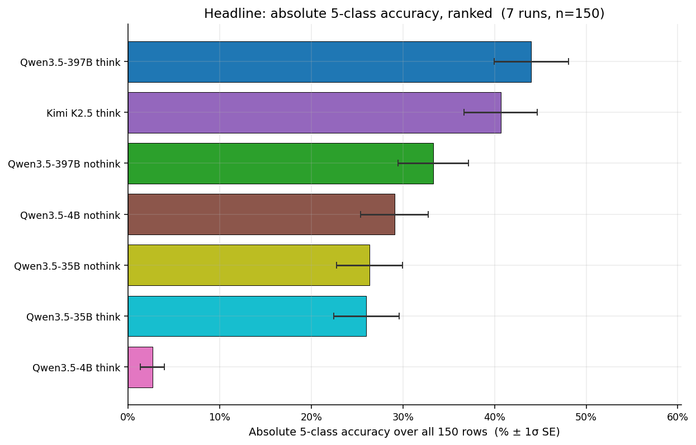
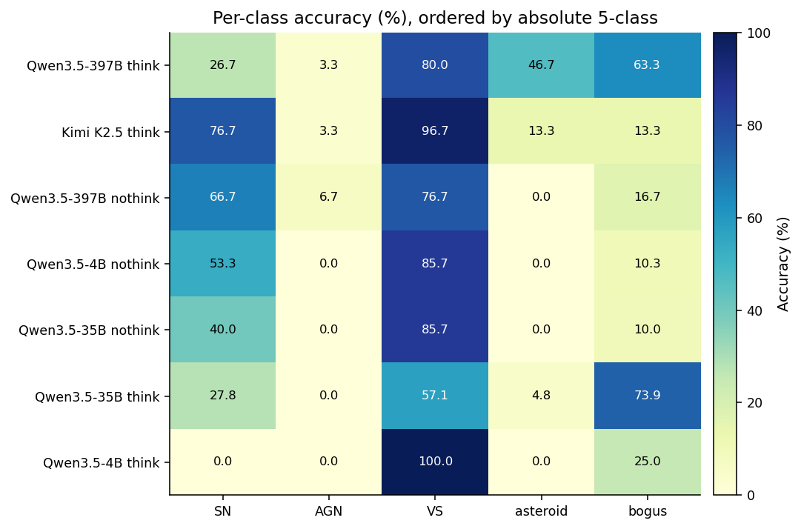
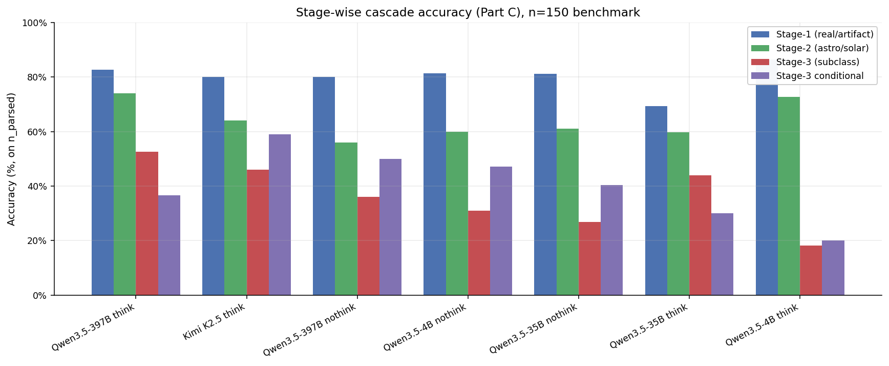
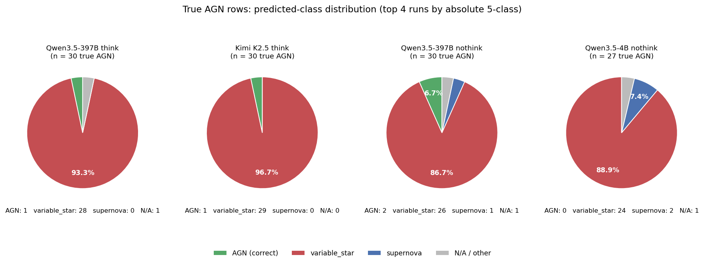
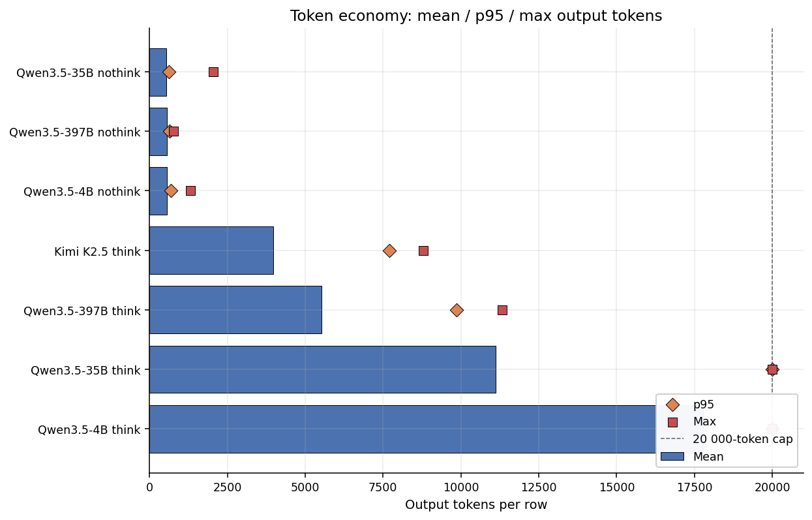
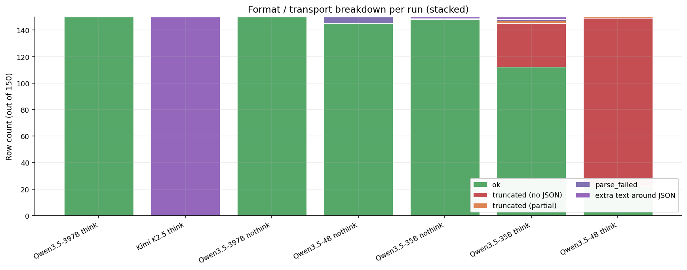
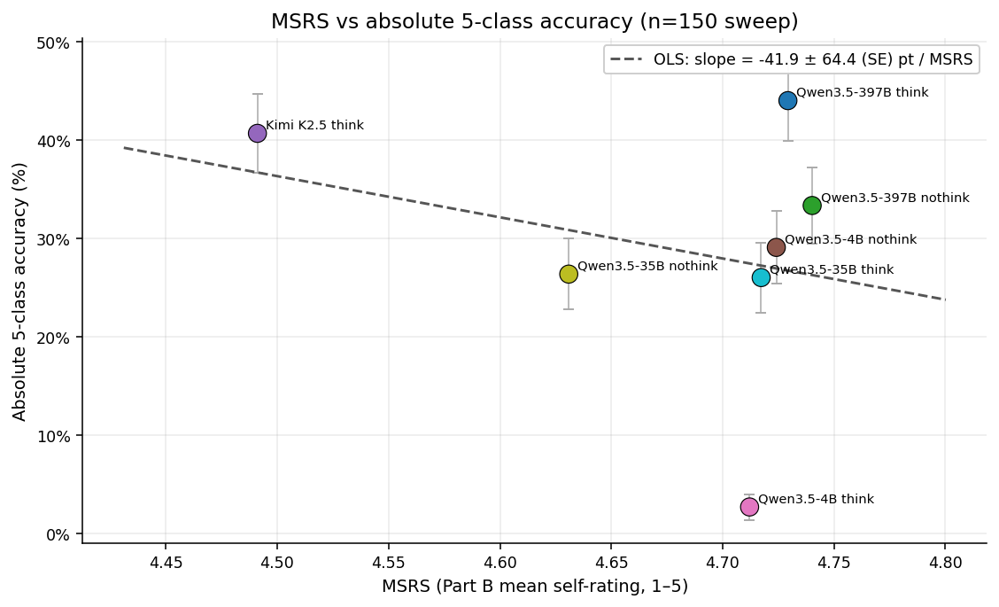
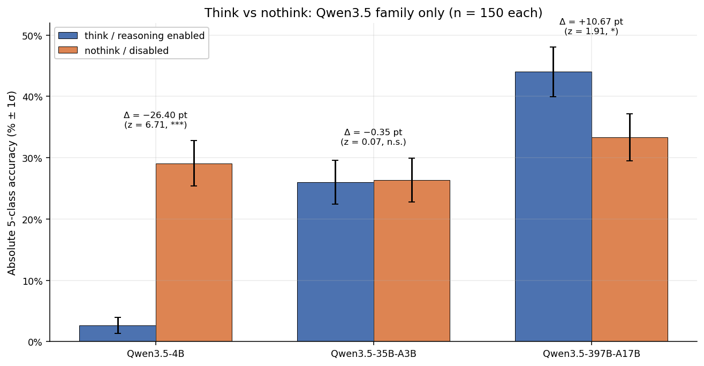
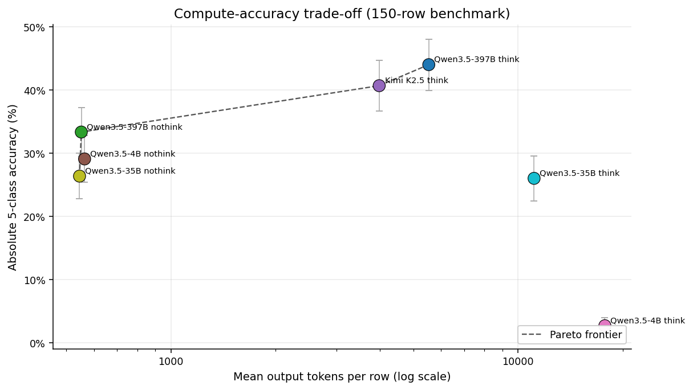

# Expert-example ablation slice — 7 runs on `manifest_benchmark_150.csv` (Apr 30 2026)

Cross-run comparison of **every completed 150-row “benchmark-150” evaluation** logged under `runs/*-benchmark-150` (timestamps 20260429). All seven share the same manifest (`data/manifest_benchmark_150.csv`: **30 objects per class** × {SN, AGN, VS, asteroid, bogus}, i.e. **n = 150 total**), the same AstroAlertBench-style **Parts A–C JSON** contract and `evaluate.py` scoring, and Tinker-backed open models (**`moonshotai/Kimi-K2.5`** or **Qwen3.5** at 4B / 35B-A3B / 397B-A17B). This report is the short-bench analogue to [`20260421_report_benchmark_full_all_runs.md`](20260421_report_benchmark_full_all_runs.md) (n = 1500, `prompts.py` only); here the focus is the **rapid-turnaround 150-object slice** used for expert-conditioned few-shot / ablation work (companion prompt construction in `prompts_expert_example_ablation.py`). *Individual launchers may pass `--prompts prompts` or the ablation module — check each JSONL / `runmeta.json` if you need exact CLI parity.*

**Standard error convention:** proportions carry **1σ binomial** SE, √(p(1−p)/n). **Absolute** 5-class accuracy uses **n = 150** rows in the denominator. **“On parsed”** 5-class uses **n = part_c_n_evaluable** (evaluable Part C rows). Pairwise Δ uses SE_Δ = √(SE₁² + SE₂²).

**Figures.** Nine charts live in `charts/benchmark_150_expert_ablation_apr30/` and are regenerated by:

`python -m viz._make_charts_benchmark_150_expert_ablation_apr30`

| Fig | Section | What it shows |
|---:|---|---|
| 1 | §1 | Headline bar — absolute 5-class accuracy ranked, ±1σ SE |
| 2 | §2 | Per-class accuracy heatmap (7 runs × 5 classes) |
| 3 | §3 | Stage-wise cascade (Stage-1 … Stage-3 conditional) |
| 4 | §4 | AGN routing pies — true-AGN → predicted distribution (top 4 runs) |
| 5 | §6 | Token economy — mean + p95 + max + 20k cap |
| 6 | §7 | Row-outcome stacked bars (`error_breakdown.format`) |
| 7 | §9 | MSRS vs absolute accuracy (OLS line, n = 7) |
| 8 | §10 | Think vs nothink paired bars — **Qwen3.5 only** (three sizes) |
| 9 | §12 | Accuracy vs mean output tokens (log x) + Pareto stairs |

---

## Runs covered (7 × n = 150)

| # | Slug | Run folder | Model | Reasoning | Backend |
|---:|---|---|---|---|---|
| 1 | `qwen35-397b-a17b-think-benchmark-150` | `runs/20260429-2118-…` | Qwen3.5-397B-A17B | enabled | tinker |
| 2 | `kimi-k25-think-benchmark-150` | `runs/20260429-2037-…` | Kimi K2.5 | enabled | tinker |
| 3 | `qwen35-397b-a17b-nothink-benchmark-150` | `runs/20260429-2031-…` | Qwen3.5-397B-A17B | disabled | tinker |
| 4 | `qwen35-4b-nothink-benchmark-150` | `runs/20260429-2028-…` | Qwen3.5-4B | disabled | tinker |
| 5 | `qwen35-35b-a3b-nothink-benchmark-150` | `runs/20260429-2017-…` | Qwen3.5-35B-A3B | disabled | tinker |
| 6 | `qwen35-35b-a3b-think-benchmark-150` | `runs/20260429-2145-…` | Qwen3.5-35B-A3B | enabled | tinker |
| 7 | `qwen35-4b-think-benchmark-150` | `runs/20260429-2145-…` | Qwen3.5-4B | enabled | tinker |

All runs used **concurrency 32** on Tinker where noted in `runmeta.json`. **max_tokens** is **20 000** for thinking-enabled Qwen/Kimi configs and **2 048** for Qwen nothink (see per-run `report.md`).

---

## 1. Headline numbers

**Absolute** 5-class accuracy = json_valid_rate × part_c_final_5class_accuracy over **all 150** rows. The right-most column is the fairest single-number comparison when parse rates differ.

| Rank | Run | 5-class (on parsed) | Parse rate | Truncation | **Absolute 5-class** | Stage-3 macro F1 | MSRS |
|---:|---|---:|---:|---:|---:|---:|---:|
| **1** | ** Qwen3.5-397B (think) ** | **44.00 ± 4.05 %** (n=150) | **100.00 ± 0.00 %** | 0.00 % | **44.00 ± 4.05 %** | 0.349 | 4.729 |
| 2 | Kimi K2.5 (think) | 40.67 ± 4.01 % (n=150) | 100.00 ± 0.00 % | 0.00 % | 40.67 ± 4.01 % | **0.523** | 4.491 |
| 3 | Qwen3.5-397B (nothink) | 33.33 ± 3.85 % (n=150) | 100.00 ± 0.00 % | 0.00 % | 33.33 ± 3.85 % | 0.482 | 4.740 |
| 4 | Qwen3.5-4B (nothink) | 30.07 ± 3.82 % (n=145) | 96.67 ± 1.44 % | 0.00 % | 29.07 ± 3.71 % | 0.387 | 4.724 |
| 5 | Qwen3.5-35B (nothink) | 26.53 ± 3.63 % (n=149) | 99.33 ± 0.67 % | 0.67 % | 26.35 ± 3.60 % | 0.345 | 4.631 |
| 6 | Qwen3.5-35B (think) | 34.21 ± 4.45 % (n=114) | 76.00 ± 3.48 % | 24.67 % | 26.00 ± 3.58 % | 0.295 | 4.717 |
| 7 | Qwen3.5-4B (think) | 18.18 ± 8.25 % (n=22) | 14.67 ± 2.89 % | 85.33 % | **2.67 ± 1.32 %** | 0.111 | 4.712 |

*Fig 1. Absolute 5-class accuracy (all 150 rows), ranked. Error bars are 1σ binomial on n = 150. **Qwen3.5-397B think** leads the batch; **Qwen3.5-4B think** is dominated by truncation (only 22 / 150 rows yield a usable Part C chain).*

**Headline findings**

1. **Best absolute accuracy is Qwen3.5-397B with reasoning enabled** at **44.00 ± 4.05 %**, **+3.33 ± 5.70 pt** ahead of Kimi K2.5 think (40.67 ± 4.01 %; z = 0.58, n.s. at 2σ on this small bench).
2. **Kimi posts the highest Stage-3 macro F1 (0.523)** despite ranking second on absolute 5-class — it wins SN / VS precision–recall balance but **collapses bogus and asteroid** on this slice (§2).
3. **Thinking helps Qwen3.5-397B** by **+10.67 ± 5.62 pt** absolute (44.00 vs 33.33 %; z = 1.91, marginal). The same dial **destroys Qwen3.5-4B** (−26.40 pt; z = 6.71, §10) and is **neutral on 35B-A3B** (−0.35 pt; z = 0.07).
4. **Sample-size caveat:** SEs are ~**4 pt** on n = 150; headline gaps need the full 1500-row manifest to replicate the tight z-scores seen in [`20260421_report_benchmark_full_all_runs.md`](20260421_report_benchmark_full_all_runs.md).

---

## 2. Per-class accuracy

Cells are **correct / total ± 1σ SE** from each `metrics.json`. **Totals can be < 30** when parsing collapses (especially Qwen3.5-4B think). Rows follow §1 rank.

| Run | SN | AGN | VS | asteroid | bogus |
|---|---:|---:|---:|---:|---:|
| Qwen3.5-397B (think) | 26.67 ± 8.07 % (8/30) | 3.33 ± 3.28 % (1/30) | 80.00 ± 7.30 % (24/30) | 46.67 ± 9.11 % (14/30) | 63.33 ± 8.80 % (19/30) |
| Kimi K2.5 (think) | **76.67 ± 7.72 %** (23/30) | 3.33 ± 3.28 % (1/30) | **96.67 ± 3.28 %** (29/30) | 13.33 ± 6.21 % (4/30) | 13.33 ± 6.21 % (4/30) |
| Qwen3.5-397B (nothink) | 66.67 ± 8.61 % (20/30) | **6.67 ± 4.55 %** (2/30) | 76.67 ± 7.72 % (23/30) | 0.00 ± 0.00 % (0/30) | 16.67 ± 6.80 % (5/30) |
| Qwen3.5-4B (nothink) | 53.33 ± 9.11 % (16/30) | 0.00 ± 0.00 % (0/26) | 85.71 ± 6.61 % (24/28) | 0.00 ± 0.00 % (0/30) | 10.34 ± 5.66 % (3/29) |
| Qwen3.5-35B (nothink) | 40.00 ± 8.94 % (12/30) | 0.00 ± 0.00 % (0/30) | 85.71 ± 6.61 % (24/28) | 0.00 ± 0.00 % (0/29) | 10.00 ± 5.48 % (3/30) |
| Qwen3.5-35B (think) | 27.78 ± 10.56 % (5/18) | 0.00 ± 0.00 % (0/24) | 57.14 ± 9.35 % (16/28) | 4.76 ± 4.65 % (1/21) | **73.91 ± 9.16 %** (17/23) |
| Qwen3.5-4B (think) | 0.00 ± 0.00 % (0/2) | 0.00 ± 0.00 % (0/10) | 100.00 ± 0.00 % (3/3) | 0.00 ± 0.00 % (0/3) | 25.00 ± 21.65 % (1/4) |

*Fig 2. Heatmap of per-class accuracy. **Kimi** is dark on SN/VS and pale on bogus/asteroid. **Qwen3.5-397B think** is the most balanced row.**

### Per-class highlights (n = 30 intended)

| Class | Best run | Score | Comment |
|---:|---|---|---|
| SN | Kimi K2.5 think | 76.67 % | +50 pt vs Qwen3.5-397B think on this slice |
| AGN | Qwen3.5-397B nothink | 6.67 % (2/30) | Still ≤ 7 % — same qualitative ceiling as the 1500-row report |
| VS | Kimi K2.5 think | 96.67 % | Tied top with near-perfect VS routing |
| asteroid | Qwen3.5-397B think | 46.67 % | Hybrid thinking wins the rare-class column here |
| bogus | Qwen3.5-35B think | 73.91 % (conditional on tiny n) | High bogus score driven by truncated-run class counts — interpret cautiously |

---

## 3. Stage-wise accuracy (Part C cascade)

Computed on **part_c_n_evaluable** rows. **Stage-3 conditional** matches `metrics.json` (accuracy of Stage-3 given earlier stages as defined in `evaluate.py`).

| Run | n_p | Stage-1 | Stage-2 | Stage-3 | Stage-3 conditional | End-to-end 5-class |
|---:|---:|---:|---:|---:|---:|---:|
| Qwen3.5-397B (think) | 150 | 82.67 % | 74.00 % | 52.67 % | 36.67 % | 44.00 % |
| Kimi K2.5 (think) | 150 | 80.00 % | 64.00 % | 46.00 % | **58.89 %** | 40.67 % |
| Qwen3.5-397B (nothink) | 150 | 80.00 % | 56.00 % | 36.00 % | 50.00 % | 33.33 % |
| Qwen3.5-4B (nothink) | 145 | 81.38 % | 60.00 % | 31.03 % | 47.06 % | 30.07 % |
| Qwen3.5-35B (nothink) | 149 | 81.21 % | 61.07 % | 26.85 % | 40.45 % | 26.53 % |
| Qwen3.5-35B (think) | 114 | 69.30 % | 59.65 % | 43.86 % | 30.00 % | 34.21 % |
| Qwen3.5-4B (think) | 22 | 86.36 % * | 72.73 % * | 18.18 % * | 20.00 % * | 18.18 % * |

\* **Qwen3.5-4B think** cascade is on **22** surviving rows only.

*Fig 3. The cascade shows where reasoning helps 397B (Stage-2 / Stage-3 lift vs nothink) and where 4B think collapses before JSON (Fig 6).*

---

## 4. Stage-3 confusion (true → predicted)

Subset of the full 3×3(+N/A) matrices for the **top three absolute-accuracy runs**.

**Qwen3.5-397B (think)**

|  | supernova | variable_star | AGN | N/A |
|---|---:|---:|---:|---:|
| supernova | 8 | 0 | 17 | 5 |
| variable_star | 0 | 24 | 0 | 6 |
| AGN | 0 | 28 | 1 | 1 |

**Kimi K2.5 (think)**

|  | supernova | variable_star | AGN | N/A |
|---|---:|---:|---:|---:|
| supernova | **23** | 2 | 4 | 1 |
| variable_star | 0 | 29 | 0 | 1 |
| AGN | 0 | 29 | 1 | 0 |

**Qwen3.5-397B (nothink)**

|  | supernova | variable_star | AGN | N/A |
|---|---:|---:|---:|---:|
| supernova | 20 | 6 | 1 | 3 |
| variable_star | 0 | 23 | 0 | 7 |
| AGN | 1 | 26 | 2 | 1 |

**Pattern.** True **AGN → variable_star** still absorbs **≈ 90 %** of Kimi’s AGN rows on this draw (Fig 4). **Qwen3.5-397B think** trades that for **SN → AGN** leakage (17 / 30), echoing the physics-of-host-galaxy confusion discussed in the 1500-row report.

*Fig 4. Predicted class for the **30 true-AGN** objects, top four runs by absolute accuracy. Dominant wedge is **variable_star** in every panel.*

---

## 5. Stage-3 subclass precision / recall / F1

Sorted by **macro F1** (point estimates; no closed-form SE). Qwen 4B think omitted from ranking commentary — degenerate denominators.

| Run | SN F1 | VS F1 | AGN F1 | Macro F1 |
|---|---:|---:|---:|---:|
| Kimi K2.5 (think) | **0.868** | 0.644 | 0.057 | **0.523** |
| Qwen3.5-397B (nothink) | 0.784 | 0.541 | 0.121 | 0.482 |
| Qwen3.5-397B (think) | 0.421 | 0.585 | 0.042 | 0.349 |
| Qwen3.5-4B (nothink) | 0.627 | 0.533 | 0.000 | 0.387 |
| Qwen3.5-35B (nothink) | 0.545 | 0.490 | 0.000 | 0.345 |
| Qwen3.5-35B (think) | 0.435 | 0.451 | 0.000 | 0.295 |
| Qwen3.5-4B (think) | 0.000 | 0.333 | 0.000 | 0.111 |

**Take-away:** Kimi’s macro F1 lead is **SN/VS quality**; Qwen3.5-397B nothink is the best **AGN F1** of the batch — still only **0.121**.

---

## 6. Token economy

Sorted by **mean output tokens** (cheap → expensive). Qwen nothink runs sit **~540–565** mean tokens; Kimi **~4.0k**; Qwen3.5-397B think **~5.5k**; 35B think **~11k**; **4B think hugs the 20k cap**.

| Run | Mean total | Median | p95 | Max | Mean answer† | Trunc rows |
|---|---:|---:|---:|---:|---:|---:|
| Qwen3.5-35B (nothink) | 545 | 523 | 627 | 2 048 | 544 | 1 |
| Qwen3.5-397B (nothink) | 552 | 550 | 638 | 760 | 551 | 0 |
| Qwen3.5-4B (nothink) | 564 | 552 | 688 | 1 319 | 563 | 0 |
| Kimi K2.5 (think) | 3 980 | 3 412 | 7 695 | 8 786 | 3 979 | 0 |
| Qwen3.5-397B (think) | 5 530 | 5 085 | 9 862 | 11 322 | 456 | 0 |
| Qwen3.5-35B (think) | 11 115 | 8 565 | 20 000 | 20 000 | 5 276 | 37 |
| Qwen3.5-4B (think) | 17 774 | 20 000 | 20 000 | 20 000 | 17 128 | 128 |

† `answer_tokens` from Tinker metadata — for thinking renderers this is only the **JSON tail**, not hidden chain-of-thought.

*Fig 5. Mean / p95 / max output tokens. **Qwen3.5-4B think** pins **p95 = max = 20k** — consistent with Fig 6 truncation bars.*

### 6.1 Wall-clock (initial passes)

From `runmeta.json` / `runs/index.md` (single workstation sweep; retries collapsed).

| Run | Concurrency | Wall-clock | s / row |
|---|---|---:|---:|
| Qwen3.5-4B (nothink) | 32 | 245.6 s | 1.64 |
| Qwen3.5-35B (nothink) | 32 | 312.4 s | 2.08 |
| Kimi K2.5 (think) | 32 | 714.1 s | 4.76 |
| Qwen3.5-397B (nothink) | 32 | 891.0 s (two logged passes) | 5.94 |
| Qwen3.5-397B (think) | 32 | 2 961.7 s | 19.74 |
| Qwen3.5-4B (think) | 32 | 3 675.4 s | 24.50 |
| Qwen3.5-35B (think) | 32 | 3 727.7 s | 24.85 |

---

## 7. Format / transport breakdown

Counts come from `error_breakdown.format` after evaluation. **Kimi** flags **extra_text_around_json** on all 150 rows (reasoning-before-JSON), but **JSON still parses** — the bar is violet, not a failure.

| Run | ok | truncated (no JSON) | truncated (partial) | parse_failed | extra_text |
|---|---:|---:|---:|---:|---:|
| Qwen3.5-397B (think) | 150 | 0 | 0 | 0 | 0 |
| Kimi K2.5 (think) | 0 | 0 | 0 | 0 | **150** |
| Qwen3.5-397B (nothink) | 150 | 0 | 0 | 0 | 0 |
| Qwen3.5-4B (nothink) | 145 | 0 | 0 | 5 | 0 |
| Qwen3.5-35B (nothink) | 148 | 0 | 0 | 1 | 1 |
| Qwen3.5-35B (think) | 112 | 33 | 2 | 1 | 2 |
| Qwen3.5-4B (think) | 22 | **127** | 1 | 0 | 0 |

*Fig 6. **Qwen3.5-4B think** is almost entirely **truncated_no_json**; **Qwen3.5-35B think** loses **33** rows the same way. Nothink removes that failure mode at the cost of reasoning depth.*

---

## 8. Part A (metadata reading)

Every run with **clean Part A statistics in `metrics.json`** scores **100 %** macro / exact-match on the six Part A fields — Part A remains a solved sub-task even when Part C collapses.

---

## 9. Part B / self-scoring (MSRS)

MSRS is the dataset mean of the three Part B self ratings (1–5). **self_pass_rate** = fraction of rows whose three scores average **≥ 4**.

| Run | MSRS | self_pass_rate |
|---|---:|---:|
| Qwen3.5-397B (nothink) | **4.740** | 100.00 % |
| Qwen3.5-397B (think) | 4.729 | 100.00 % |
| Qwen3.5-35B (think) | 4.717 | 100.00 % |
| Qwen3.5-4B (nothink) | 4.724 | 100.00 % |
| Qwen3.5-4B (think) | 4.712 | 100.00 % |
| Qwen3.5-35B (nothink) | 4.631 | 97.99 % |
| Kimi K2.5 (think) | 4.491 | 94.00 % |

With only **seven** points, the MSRS–accuracy regression is **ill-conditioned** (OLS slope ≈ **−41.9 ± 64.4** pp / MSRS unit — **not significant**). The scatter is still useful visually.

*Fig 7. MSRS (x) vs absolute 5-class % (y). **Kimi** sits high on accuracy but lower MSRS / pass-rate — qualitatively similar to the inverse trend in the 13-run full-benchmark figure, but **do not over-interpret** the slope on n = 7.*

---

## 10. Think vs nothink (Qwen3.5 only)

There is **no** nothink Kimi run on this slice — Fig 8 shows **three** paired families on **n = 150**.

| Family | think absolute | nothink absolute | Δ (think − nothink) ± SE_Δ | z |
|---|---:|---:|---:|---:|
| Qwen3.5-4B | 2.67 ± 1.32 % | 29.07 ± 3.71 % | **−26.40 ± 3.93 pt** | 6.71 |
| Qwen3.5-35B-A3B | 26.00 ± 3.58 % | 26.35 ± 3.60 % | −0.35 ± 5.07 pt | 0.07 |
| Qwen3.5-397B-A17B | 44.00 ± 4.05 % | 33.33 ± 3.85 % | **+10.67 ± 5.62 pt** | 1.90 |

*Fig 8. Paired absolute accuracy. **4B** mirrors the catastrophic truncation story from the 1500-row report; **397B** shows a **~11 pt** think advantage that nearly reaches conventional significance if one treats z ≈ 2 as exploratory on this n.*

---

## 11. Open-source scope

All seven rows are **open-weight / API-open** frontier models (Tinker-hosted **Qwen3.5** and **Kimi K2.5**). There is **no** closed-source run in this comparison — for GPT / Claude / Gemini parity, re-use [`20260421_report_benchmark_full_all_runs.md`](20260421_report_benchmark_full_all_runs.md).

---

## 12. Compute efficiency (accuracy per 1k output tokens)

| Run | Absolute 5-class | Mean output tok | Correct / 1k tok |
|---|---:|---:|---:|
| Qwen3.5-397B (nothink) | 33.33 % | 552 | **60.4** |
| Qwen3.5-4B (nothink) | 29.07 % | 564 | 51.5 |
| Qwen3.5-35B (nothink) | 26.35 % | 545 | 48.3 |
| Kimi K2.5 (think) | 40.67 % | 3 980 | 10.2 |
| Qwen3.5-397B (think) | 44.00 % | 5 530 | 8.0 |
| Qwen3.5-35B (think) | 26.00 % | 11 115 | 2.3 |
| Qwen3.5-4B (think) | 2.67 % | 17 774 | 0.15 |

*Fig 9. Accuracy vs mean tokens (log x). **Qwen3.5-397B nothink** dominates on **bang-per-token** while **Qwen3.5-397B think** pushes the accuracy frontier rightward.*

---

## 13. Recommendations / next steps

1. **Treat n = 150 as directional only** — SE bars are ~4 pt; replicate on `manifest_benchmark_final.csv` before drawing model-selection conclusions.
2. **Keep Qwen3.5-4B on nothink** for any JSON-contract workload at 20k tokens; the think run is unusable here.
3. **Run a Kimi nothink / low-reasoning paired row** if you need a fair “reasoning dial” comparison within Moonshot’s renderer options.
4. **Mine the Qwen3.5-397B think vs nothink gap** — if it survives at n = 1500, it strengthens the case for reasoning on the largest MoE variant.
5. **Align launcher `--prompts` with the intended ablation** (`prompts` vs `prompts_expert_example_ablation`) and annotate `runmeta.json` so downstream reports do not have to infer prompt provenance from filenames alone.

---

## 14. Appendix — data sources

Per-run metrics JSON:

- `runs/20260429-2118-qwen35-397b-a17b-think-benchmark-150/metrics.json`
- `runs/20260429-2037-kimi-k25-think-benchmark-150/metrics.json`
- `runs/20260429-2031-qwen35-397b-a17b-nothink-benchmark-150/metrics.json`
- `runs/20260429-2028-qwen35-4b-nothink-benchmark-150/metrics.json`
- `runs/20260429-2017-qwen35-35b-a3b-nothink-benchmark-150/metrics.json`
- `runs/20260429-2145-qwen35-35b-a3b-think-benchmark-150/metrics.json`
- `runs/20260429-2145-qwen35-4b-think-benchmark-150/metrics.json`

Charts: `python -m viz._make_charts_benchmark_150_expert_ablation_apr30` → `results_comparison/report/charts/benchmark_150_expert_ablation_apr30/`.

Companion wide-bench comparison: [`20260421_report_benchmark_full_all_runs.md`](20260421_report_benchmark_full_all_runs.md).

---

*Report generated **2026-04-30** from seven `metrics.json` files (n = 150 each). Figures produced programmatically; narrative numbers cross-checked against `evaluate.evaluate_jsonl` outputs in the listed run folders.*
