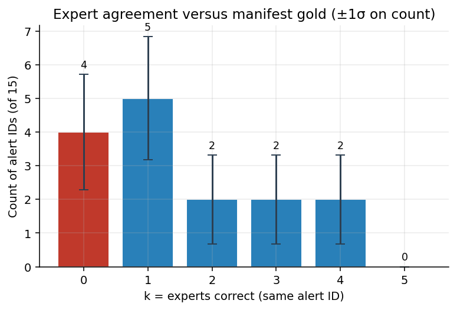
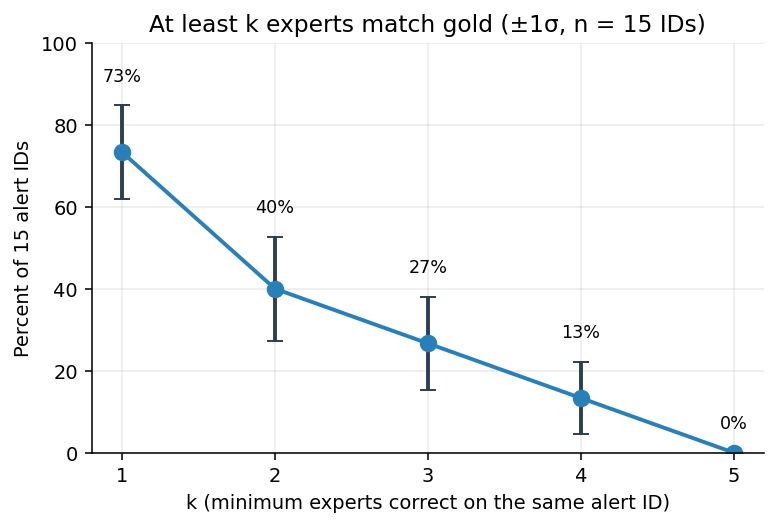
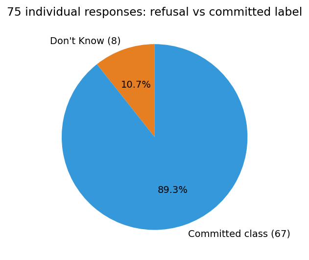
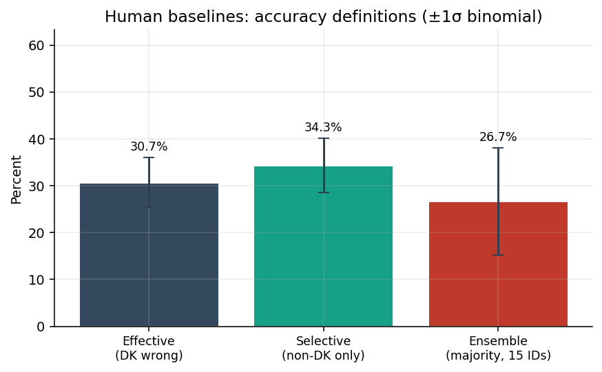
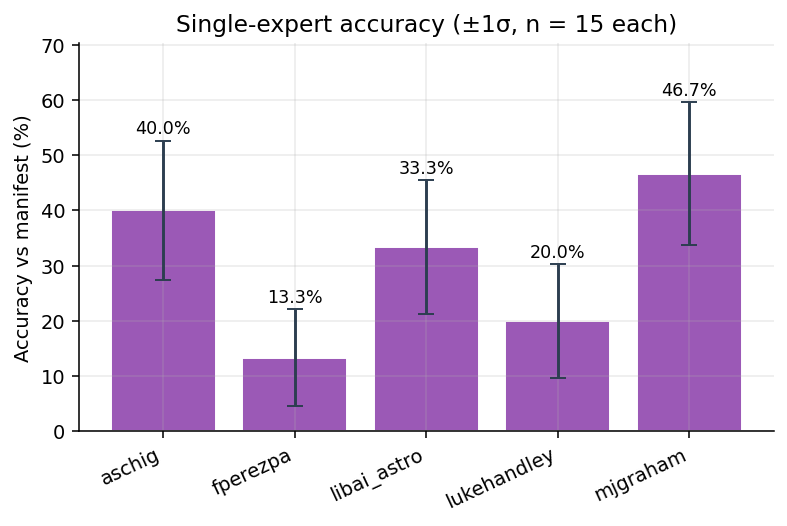
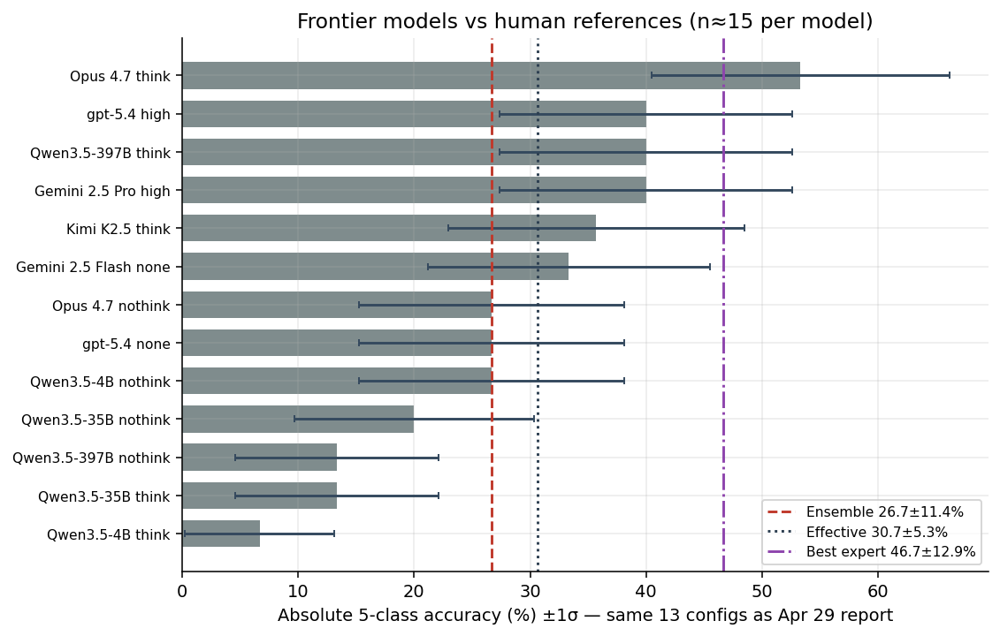

# Human baseline examples — experts vs manifest gold vs frontier models (30 Apr 2026)

Companion to [`20260429_report_human_baselines_15_all_runs.md`](20260429_report_human_baselines_15_all_runs.md): the same **15** alert IDs in `data/manifest_human_baselines_15.csv`, the same **13** VLM/LLM configurations, but here the focus is **Zooniverse “Human Baseline (Final)”** classifications after hygiene on the export (see below), plus **calibration-style** metrics aligned with your main-text vs appendix framing.

**Small-n warning (unchanged).** Absolute accuracy on **n ≈ 15** IDs has binomial **1** standard error (1σ) of order **10–13 percentage points** near 50 %. Treat gaps smaller than **~25 pt** as anecdotal unless you replicate on more cutouts.

**Standard errors (1σ).** Reported intervals use the binomial SE for proportions,
\(\mathrm{SE} = \sqrt{p(1-p)/n}\).
Use **n = 15** for per-alert summaries (share of IDs, single-expert accuracy, ensemble accuracy, and each **≥ k** fraction). Use **n = 75** for **effective accuracy** and **refusal rate**, and **n = 67** for **selective accuracy** (non-DK rows only). Model absolute accuracies use **n = `n_examples`** from each `metrics.json` (usually 15; Kimi **14**). **Macro-F1** has no simple single SE on this sheet; we quote the point estimate only unless you bootstrap.

## Data cleaning (human CSV)

Source file: `llm-for-astronomy-classifications_human-baseline-final_filtered_with_is_correct.csv` (**75** rows = **5** retained experts × **15** IDs).

- Workflow filter: **Human Baseline (Final)**; exclusions as in the earlier filter (including test accounts).
- Additional drops: all rows from **RickyN**; for **fperezpa**, **libai_astro**, and **aschig**, the **later** duplicate classification on the same alert (`Filename` stem) was removed so each expert contributes **at most one** row per ID.
- **`is_correct`**: T0 label mapped to `{SN, VS, AGN, asteroid, bogus}` and compared to manifest **`target_class`**; **Don’t Know** is scored as incorrect (and handled separately in refusal rate / selective accuracy).
- Gold reference for both humans and models is the **manifest** class distribution (**AGN 5, VS 3, SN 2, bogus 3, asteroid 3** — see `data/manifest_human_baselines_15.md`).

**Regenerate figures:** `python -m viz._make_charts_human_baseline_examples_apr30` → `charts/human_baseline_examples_apr30/`. Core numbers: `python -m viz._compute_human_baseline_examples_stats`.

| Fig | What it shows |
|---:|---|
| 1 | Distribution of **k** experts correct per alert ID (out of 15 IDs) |
| 2 | **Refusal** pie on 75 responses (Don’t Know vs committed class) |
| 3 | **Effective** vs **selective** vs **ensemble** human accuracy |
| 4 | Ranked **model** absolute accuracy with **human reference** lines |
| 5 | Share of IDs with **≥ k** experts correct (“strong agreement” coverage) |
| 6 | **Per-expert** accuracy on the 15 IDs |

---

## Main text vs appendix (logic you outlined)

| | **Main text (leaderboard-style)** | **Appendix (this note + calibration)** |
|---|---|---|
| **Unit** | **15** alert IDs | **75** individual responses |
| **Human signal** | **Expert ensemble:** strict **3/5 majority** vote among mapped T0 labels (Don’t Know counts as a vote bucket; **≥ 3** on a *physical* class required, no tie on top count; else **no collective label** — scored wrong vs gold). | **Per-response** scoring + **refusal rate** |
| **Don’t Know** | Contributes to votes; **DK majority or no valid majority → incorrect** under ensemble (forced-choice parity with models). | **Refusal rate** = DK/75; **effective** vs **selective** accuracy |
| **Primary metrics** | **Ensemble accuracy** ( /15 ), **ensemble macro-F1** (5-class one-vs-rest, `None` ensemble ⇒ no predicted positive) | **Effective** and **selective** accuracy |
| **Narrative** | Ceiling / collective decision quality on the slice | Honesty / **internal calibration** vs confident models |

---

## 1. Fifteen alert IDs — “correct-k” and ensemble

For each alert ID, count how many of the **five** experts have **`is_correct` == true** (against manifest gold). Denominator is always **15** IDs.

| k (experts correct) | # alert IDs | Share of 15 (%) | ±1σ (pt) |
|---:|---:|---:|---:|
| 0 | 4 | 26.7 | 11.42 |
| 1 | 5 | 33.3 | 12.17 |
| 2 | 2 | 13.3 | 8.78 |
| 3 | 2 | 13.3 | 8.78 |
| 4 | 2 | 13.3 | 8.78 |
| 5 | 0 | 0.0 | 0.00 |

**Cumulative (“at least k”)** — useful when comparing to **one-shot** models (which get one guess per ID):

| At least k correct | # IDs (of 15) | Fraction (%) | ±1σ (pt) |
|---:|---:|---:|---:|
| ≥ 1 | 11 | 73.3 | 11.42 |
| ≥ 2 | 6 | 40.0 | 12.65 |
| ≥ 3 | 4 | 26.7 | 11.42 |
| ≥ 4 | 2 | 13.3 | 8.78 |
| ≥ 5 | 0 | 0.0 | 0.00 |

So **no** ID produced unanimous correct labels; the strongest observed agreement is **4/5** on **two** cutouts.

**Expert ensemble (main-text style).**

- **4 / 15** IDs match gold after a valid **majority** non-DK class ⇒ **26.7 % ± 11.42 pt** ensemble accuracy (binomial **n = 15**).
- **7 / 15** IDs have **no** valid 3/5 majority for a single physical class (split votes + Don’t Know + near ties) — the ensemble abstains in the sense of “no label,” and is counted incorrect vs gold.
- **Macro-F1** (same five classes, `None` prediction ⇒ only false negatives for the gold class): **0.307** (point estimate; no SE tabulated here).

*Fig 1. Histogram of k with **±1σ** error bars on counts (binomial SE on the **share** of 15 IDs, scaled back to counts). The k = 0 bar is “none of the five matched the manifest class on that cutout.”*

*Fig 5. Fraction of IDs with at least k experts correct, **±1σ** (n = 15 IDs per point).*

---

## 2. Seventy-five responses — refusal and effective vs selective accuracy

Definitions (appendix / calibration framing):

- **Refusal rate**  
  \[
  \text{refusal} = \frac{\#\text{Don’t Know}}{75} = \frac{8}{75} \approx 10.67\%\pm 3.56\text{ pt}
  \quad (n=75).
  \]

- **Effective accuracy** (Don’t Know scored as wrong — parallels a live stream where skipping does not help):  
  \[
  \text{effective} = \frac{\#\text{correct}}{75} = \frac{23}{75} \approx 30.67\%\pm 5.32\text{ pt}
  \quad (n=75).
  \]

- **Selective accuracy** (precision when the expert commits to a class):  
  \[
  \text{selective} = \frac{\#\text{correct}}{75 - \#\text{Don’t Know}} = \frac{23}{67} \approx 34.33\%\pm 5.80\text{ pt}
  \quad (n=67).
  \]

**Does dropping Don’t Know “increase accuracy”?** Yes **conditionally**: selective (**34.33 % ± 5.80 pt**) is **~3.7 percentage points** higher than effective (**30.67 % ± 5.32 pt**), because the **8** refusals are removed from the denominator instead of counted as errors. It does **not** change the fact that only **23** judgments are correct; it changes whether refusals are treated as errors (realistic for forced reporting) vs omitted (analysing committed labels only).

*Fig 2. Refusal vs committed responses on the 75-row table.*

*Fig 3. Effective vs selective vs ensemble with **±1σ** binomial error bars (see §2 and ensemble row for n).*

---

## 3. Per-expert accuracy (15 IDs each)

| Expert | Correct / 15 | Accuracy (%) | ±1σ (pt) |
|---|---:|---:|---:|
| aschig | 6 | 40.00 | 12.65 |
| fperezpa | 2 | 13.33 | 8.78 |
| libai_astro | 5 | 33.33 | 12.17 |
| lukehandley | 3 | 20.00 | 10.33 |
| mjgraham | 7 | **46.67** | 12.88 |

The **mean** of these five accuracies equals the **effective** rate over **75** responses (**23/75**), because each expert has exactly **15** trials.

*Fig 6. Single-expert accuracies **±1σ** (n = 15 trials each).*

---

## 4. Same 15 IDs — frontier models (13 configurations)

**Absolute** accuracy = `json_valid_rate × part_c_final_5class_accuracy` from each `runs/…/metrics.json` (same convention as the Apr 29 report). **Macro-F1** = `part_c_stage3_macro_f1`.

| Rank | Model | Absolute (%) | ±1σ (pt) | Macro-F1 | `n_examples` |
|---:|---|---:|---:|---:|---:|
| 1 | Opus 4.7 think | 53.33 | 12.88 | 0.5333 | 15 |
| 2 | Gemini 2.5 Pro high | 40.00 | 12.65 | 0.5333 | 15 |
| 3 | Qwen3.5-397B think | 40.00 | 12.65 | 0.3056 | 15 |
| 4 | gpt-5.4 high | 40.00 | 12.65 | 0.2000 | 15 |
| 5 | Kimi K2.5 think | 35.71 | 12.81 | 0.5000 | 14 |
| 6 | Gemini 2.5 Flash none | 33.33 | 12.17 | 0.5333 | 15 |
| 7 | Opus 4.7 nothink | 26.67 | 11.42 | 0.4222 | 15 |
| 8 | Qwen3.5-4B nothink | 26.67 | 11.42 | 0.4148 | 15 |
| 9 | gpt-5.4 none | 26.67 | 11.42 | 0.4222 | 15 |
| 10 | Qwen3.5-35B nothink | 20.00 | 10.33 | 0.1667 | 15 |
| 11 | Qwen3.5-397B nothink | 13.34 | 8.78 | 0.2963 | 15 |
| 12 | Qwen3.5-35B think | 13.33 | 8.78 | 0.0952 | 15 |
| 13 | Qwen3.5-4B think | 6.67 | 6.44 | 0.2222 | 15 |

**SE column:** binomial SE on **absolute** accuracy with **n = `n_examples`** from each run’s `metrics.json` (Kimi uses **14**).

**Headline comparison to humans (same gold, same 15 IDs).**

- **Best model** (Opus 4.7 think): **53.33 % ± 12.88 pt** absolute — **above** the **best single expert** (**46.67 % ± 12.88 pt**), **effective** human rate (**30.67 % ± 5.32 pt**), and the **majority ensemble** (**26.67 % ± 11.42 pt**). (Best expert and Opus share the same **n = 15** binomial width for accuracy, but estimate **different** proportions.)
- **Mid-pack models** near **40 % ± 12.65 pt** sit between the best expert and the cohort mean, and still **above** the ensemble — the human **ensemble is low not because experts are uniformly weak**, but because **votes rarely consolidate** into a clean 3/5 class on this manifest.
- Treat this as **diagnostic**: manifest labels come from the project’s **stamp classifier** pipeline; Zooniverse experts **often disagree** with that reference on ambiguous cutouts, so **agreement-with-manifest** is intentionally strict. A separate “inter-expert majority vs models” metric (without manifest) would answer a **different** question.

*Fig 4. Model absolute accuracy **±1σ** (horizontal bars; n from each `metrics.json`). Vertical lines: human ensemble, effective (75), and best expert with **±1σ** in the legend.*

---

## 5. Other useful views (short)

1. **Models as “sixth voter”.** Compare model correctness to the **empirical** distribution of k — e.g. whether a model beats **most** experts on the same ID — without requiring manifest agreement.
2. **Cost of abstention.** Pair **refusal rate** (**10.67 % ± 3.56 pt**) with model **overconfidence** (high self-rated reasoning scores in your bench) — humans flag ambiguity; models rarely refuse in the same schema.
3. **Calibration / selective metrics for models.** If you add an model abstention channel later, **selective accuracy** parity becomes a fairer comparison to human selective metrics.

---

## Takeaway

On this **15-ID** human-curated slice, **frontier VLMs already exceed** the **strict manifest-majority** human ensemble and **match or beat** typical single experts on **absolute** accuracy, while humans exhibit **non-trivial refusal** and **split votes** that collapse the simple **3/5** ensemble. The appendix metrics (**effective** vs **selective**, **correct-k**, refusal) separate **commitment** from **coverage** — the right tool when arguing about **calibration and honesty**, not just top-line accuracy.
