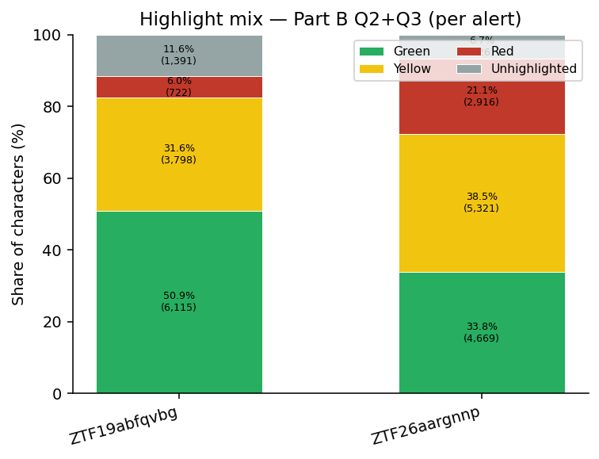
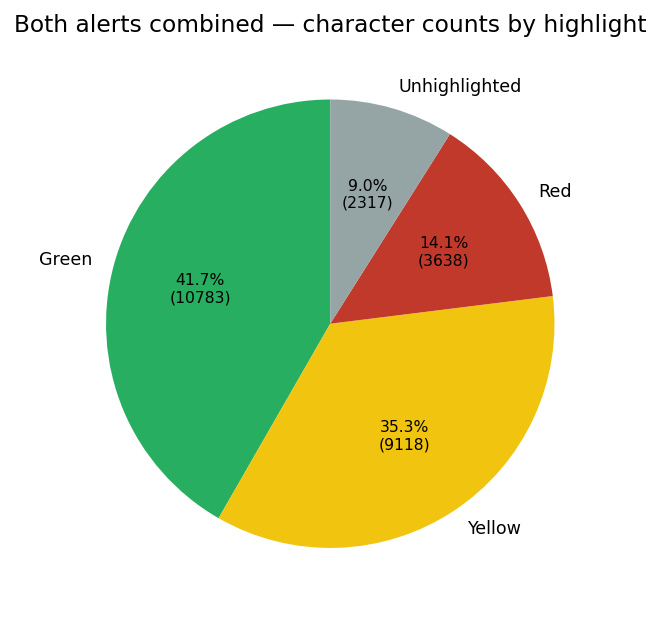
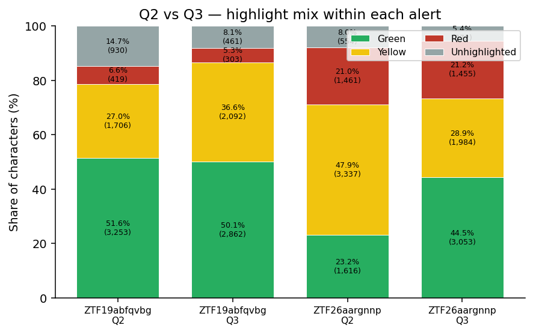
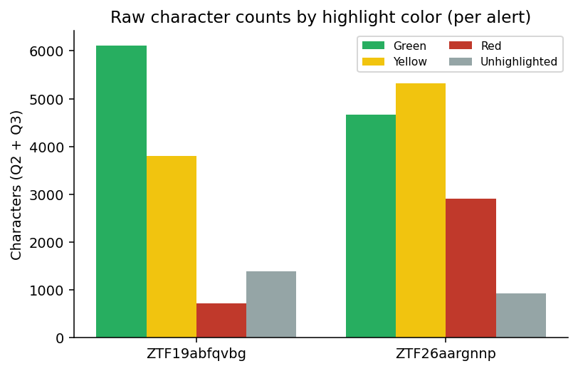
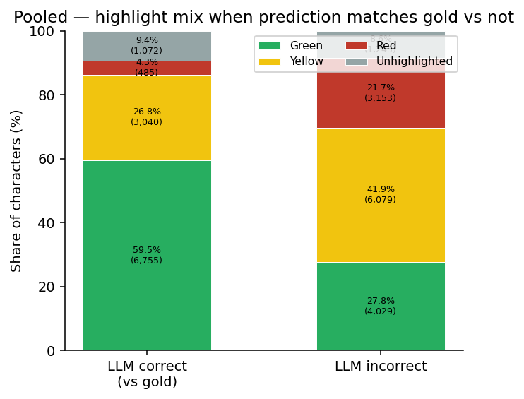
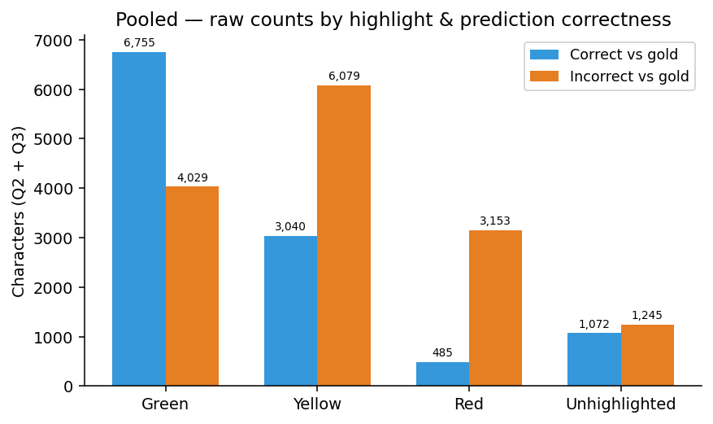
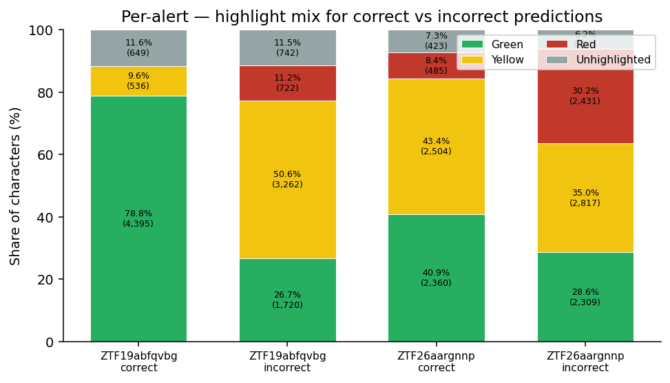

# Expert highlight coding — two grading `.docx` files (30 Apr 2026)

This note summarizes **character-level** use of the three highlight colors in:

- `LLM Answer Grading ZTF19abfqvbg.docx` (13 model blocks)
- `LLM Answer Grading ZTF26aargnnp.docx` (13 model blocks; **file corrected** after an earlier export had only 12 blocks)

## Can we read `.docx` and distinguish highlight colors?

**Yes**, but not via `python-docx`’s `run.font.highlight_color` for these files. Microsoft Word stored the colors as **paragraph/run shading** (`w:shd` with `w:fill` = RGB hex), not as the older `w:highlight` token. The script maps:

| `w:fill` (hex) | Label |
|---:|---|
| `FF0000` | **Red** — “Clearly flawed, contradictory, or hallucinatory” (per doc instruction; aligns with **low** end of the 0–5 quality rubric you use elsewhere) |
| `FFFF00` | **Yellow** — “Partially correct” |
| `00FF00` | **Green** — “Fully correct” |
| `FFFFFF` / missing | Treated as **unhighlighted** *within the two reasoning paragraphs* (often JSON keys, quotes, or text the expert did not mark) |

**Scope of counting:** Only text in paragraphs that start with `leading_interpretation_and_support` (**Part B, “second” field**) and `alternative_analysis` (**Part B, “third” field**) is included. Headings, `LLM's Classification`, `Your Grading`, and `Note:` lines are **excluded**.

**Regenerate numbers:** `python -m viz._analyze_llm_grading_docx_highlights` (implementation: `viz/_analyze_llm_grading_docx_highlights.py`).

**Regenerate figures:** `python -m viz._make_charts_llm_grading_docx_highlights` → `charts/llm_grading_docx_highlights_apr30/`.

| Fig | What it shows |
|---:|---|
| 1 | 100% stacked — highlight mix for **Q2+Q3** combined, **per alert** |
| 2 | Pie — **both alerts combined** (counts match §2) |
| 3 | 100% stacked — **Q2 vs Q3** for each alert |
| 4 | Grouped bars — **raw character counts** by color per alert |
| 5 | 100% stacked — **pooled** correct vs **incorrect** LLM class vs gold (Q2+Q3) |
| 6 | Grouped bars — **pooled** raw counts by color × correctness |
| 7 | 100% stacked — **per alert**, correct vs incorrect columns |

---

## Figures

*Fig 1. Share of reasoning characters by highlight color (Q2+Q3 pooled), **per alert**.*

*Fig 2. **Both alerts combined** — fraction of all counted reasoning characters (same totals as §2; **25,858** chars after ZTF26 correction).*

*Fig 3. **Q2 vs Q3** within each alert — 100% stacked columns (see §4 narrative).*

*Fig 4. **Absolute** character counts by color per alert (Q2+Q3), for comparison with Fig 1.*

*Fig 5. **Pooled** over both alerts: highlight mix in reasoning text for blocks where `LLM's Classification` **matches** `Correct Class` vs where it does **not** (see §3).*

*Fig 6. Same split as Fig 5 — **raw** character counts (not row-normalized).*

*Fig 7. **Per alert** — four columns: correct-answer blocks vs incorrect-answer blocks (percent of chars in each color).*

---

## 1. Per alert (each datapoint / each `.docx`)

### ZTF19abfqvbg — 13 model blocks

| Measure | `leading_interpretation` (Q2) | `alternative_analysis` (Q3) | Both fields |
|---|---:|---:|---:|
| Total characters | 6,308 | 5,718 | 12,026 |
| **Green** chars | 3,253 | 2,862 | 6,115 |
| **Yellow** chars | 1,706 | 2,092 | 3,798 |
| **Red** chars | 419 | 303 | 722 |
| **Unhighlighted** (white / none) chars | 930 | 461 | 1,391 |
| % of field that is **green** | 51.57% | 50.05% | 50.85% |
| % of field that is **yellow** | 27.05% | 36.59% | 31.58% |
| % of field that is **red** | 6.64% | 5.30% | 6.00% |
| % **any highlight** (R+Y+G) of reasoning text | 85.26% | 91.94% | **88.43%** |
| Avg total reasoning length per model (both fields) | — | — | **925** chars |

### ZTF26aargnnp — 13 model blocks

| Measure | `leading_interpretation` (Q2) | `alternative_analysis` (Q3) | Both fields |
|---|---:|---:|---:|
| Total characters | 6,968 | 6,864 | **13,832** |
| **Green** chars | 1,616 | 3,053 | 4,669 |
| **Yellow** chars | 3,337 | 1,984 | 5,321 |
| **Red** chars | 1,461 | 1,455 | 2,916 |
| **Unhighlighted** chars | 554 | 372 | 926 |
| % **green** | 23.19% | 44.48% | 33.76% |
| % **yellow** | 47.89% | 28.90% | 38.47% |
| % **red** | 20.97% | 21.20% | 21.08% |
| % **any highlight** (R+Y+G) | 92.05% | 94.58% | **93.31%** |
| Avg total reasoning length per model (both fields) | — | — | **1,064** chars |

---

## 2. Both alerts combined (26 model blocks)

| Color | Character count | % of all reasoning chars (both alerts, both fields) |
|---:|---:|---:|
| Green | 10,784 | 41.70% |
| Yellow | 9,119 | 35.27% |
| Red | 3,638 | 14.07% |
| Unhighlighted | 2,317 | 8.96% |
| **Total** | **25,858** | 100% |

- **Any colored highlight (R+Y+G):** 23,541 chars → **91.04%** of all counted reasoning characters.
- **Model blocks counted:** 26 (13 + 13).
- **Implied mean reasoning length per block:** 25,858 / 26 ≈ **995** characters (both Part B fields together).

### Approximate mean highlighted chars per model block (total / 26)

| | Green | Yellow | Red | Unhighlighted | Total |
|---:|---:|---:|---:|---:|---:|
| Mean chars / block | 415 | 351 | 140 | 89 | 995 |

(Averages differ slightly if you average within-file first because per-alert reasoning length differs.)

---

## 3. Split by LLM classification vs gold (correct vs incorrect)

For each of the 13 model blocks in a file, we compare the text on **`LLM's Classification:`** to **`Correct Class:`** (case-insensitive, normalized whitespace). All Q2+Q3 characters for that block are then accumulated into either a **correct** or **incorrect** pool. This is **independent** of the 0–5 reasoning score; it only reflects whether the model’s **stated** class label matched the key you provided as gold.

### ZTF19abfqvbg

| | **Correct** prediction (7 / 13 blocks) | **Incorrect** prediction (6 / 13 blocks) |
|---:|---:|---:|
| Total chars (Q2+Q3) | 5,580 | 6,446 |
| Green | 4,395 (78.76%) | 1,720 (26.68%) |
| Yellow | 536 (9.61%) | 3,262 (50.61%) |
| Red | 0 (0.00%) | 722 (11.20%) |
| Unhighlighted | 649 (11.63%) | 742 (11.51%) |
| % of text with **any** R/Y/G highlight | 88.37% | 88.49% |
| Mean chars / block (Q2+Q3) | 797 | 1,074 |

On this alert, **no red** highlight appears in any **correct**-prediction block; all red ink falls in **incorrect** blocks.

### ZTF26aargnnp

| | **Correct** prediction (6 / 13 blocks) | **Incorrect** prediction (7 / 13 blocks) |
|---:|---:|---:|
| Total chars (Q2+Q3) | 5,772 | 8,060 |
| Green | 2,360 (40.89%) | 2,309 (28.65%) |
| Yellow | 2,504 (43.38%) | 2,817 (34.95%) |
| Red | 485 (8.40%) | 2,431 (30.16%) |
| Unhighlighted | 423 (7.33%) | 503 (6.24%) |
| % of text with **any** R/Y/G highlight | 92.67% | 93.76% |
| Mean chars / block (Q2+Q3) | 962 | 1,151 |

### Pooled over both alerts (13 + 13 = 26 blocks)

| | **Correct** (13 blocks) | **Incorrect** (13 blocks) |
|---:|---:|---:|
| Total chars (Q2+Q3) | 11,352 | 14,506 |
| Green | 6,755 (59.50%) | 4,029 (27.77%) |
| Yellow | 3,040 (26.78%) | 6,079 (41.91%) |
| Red | 485 (4.27%) | 3,153 (21.74%) |
| Unhighlighted | 1,072 (9.44%) | 1,245 (8.58%) |
| % of text with **any** R/Y/G highlight | 90.56% | 91.42% |
| Mean chars / block (Q2+Q3) | 873 | 1,115 |

**Block balance:** On this combined sample, **half** the model runs (13 / 26) match gold and half do not — a side effect of aggregating the two hand-picked alerts, not a property of the rubric.

**Discrimination (pooled, descriptive only):**  
- **Red** share is **~5.1×** higher when the answer is **incorrect** (21.7% vs 4.3% of characters), consistent with the expert using red for flawed reasoning more often in wrong-answer runs.  
- **Green** share is **~2.1×** higher when the answer is **correct** (59.5% vs 27.8%).  
- **Yellow** is somewhat **more** prevalent when the answer is wrong (41.9% vs 26.8%).  
- **Length:** Incorrect blocks average **~28% more** characters per block (longer reasoning does not imply correctness here).

---

## 4. Interpretation (short)

The numeric **0–5** grades stored next to each answer are separate from the trichotomous highlight legend; this report only quantifies the **three colors** in the body text.

1. **Coverage:** Experts colored **most** of the reasoning text (≈ **88–94%** highlighted across the four section summaries above); remaining characters are often markup-adjacent runs left white.
2. **Quality vs alert:** On **ZTF19abfqvbg**, **green** is largest (~51% of Q2+Q3 chars). On **ZTF26aargnnp**, **yellow** is still the largest single bucket (~38%), **green** is second (~34%), and **red** remains much higher than on ZTF19 (~21% vs ~6%), consistent with more disputed or weaker reasoning on that cutout overall.
3. **Q2 vs Q3:** For ZTF19, green share is similar across the two fields. For ZTF26, **alternative_analysis** has a clearly higher **green** share than **leading_interpretation** (44% vs 23%), while **leading_interpretation** carries more **yellow** and **red** — the expert marked the second prose block as comparatively stronger once models stated an alternative.

4. **Correct vs incorrect classification:** When the LLM’s label matches gold (§3), **green** dominates and **red** is negligible across the pooled sample; when it does not match, **yellow** and especially **red** account for a much larger share — consistent with expert markup tracking disputed or flawed prose more heavily on wrong-final-label answers.
