# Zooniverse LLM response grading — ZTF26 §1 (X + Matthew); §2 includes **(D)** on ZTF25aaxmsns (3 May 2026)

**Exports:** `temporary_files/llm-for-astronomy-classifications (4).csv` and `(5).csv`, concatenated and **deduplicated by `classification_id`**. **LLM Response Grading (D)** maps to **`ZTF25aaxmsns` (SN)**, not ZTF26. **(D)** is **excluded from §1** and **included in §2** (see table). Gold OIDs / PNG bundle: `human_samples/llm_example_grading_zooniverse/README.md`.

| Workflow | OID | Role in this report |
|---|---|---|
| LLM Response Grading **(X)** | ZTF26aargnnp | **§1:** four Zooniverse raters (libai_astro, lukehandley, RickyN, theodlz). |
| Expert `.docx` | ZTF26aargnnp | **§1:** **Matthew** **Your Grading:** 0–5 per model (**equal** weight). |
| LLM Response Grading **(D)** | **ZTF25aaxmsns** (SN) | **§2** — Zooniverse grading lane (e.g. **theodlz**); **not** used in §1. |
| **(A)** | ZTF19aayhwvd (VS) | **§2** pooled (Zooniverse). |
| **(B)** | ZTF19abkdsaw (AGN) | **§2** pooled (Zooniverse). |
| **(C)** | ZTF25aahvsli (bogus) | **§2** pooled (Zooniverse). |
| Expert `.docx` | **ZTF19abfqvbg** (AGN) | **§2** pooled — **Matthew** **Your Grading** (not workflow **(X)**). |

## Annotators

**§1** uses **five** numeric lanes on **ZTF26aargnnp**: four on workflow **(X)** plus **Matthew** from `LLM Answer Grading ZTF26aargnnp.docx`. **(D)** is unrelated (SN alert **ZTF25aaxmsns**) and is excluded from §1. **§2** pools **five OIDs** (`ZTF19abfqvbg, ZTF19aayhwvd, ZTF19abkdsaw, ZTF25aahvsli, ZTF25aaxmsns`): expert **ZTF19abfqvbg** + Zooniverse **(A,B,C)** + **ZTF25aaxmsns** via **(D)**. Total **104** CSV rows with Zooniverse 0–5 scores (expert rows for §1/§2 are injected from `.docx`).

- **RickyN** also completed `LLM Response Grading (C)` → `ZTF25aahvsli`.
- **libai_astro** also completed `LLM Response Grading (B)` → `ZTF19abkdsaw`.
- **lukehandley** also completed `LLM Response Grading (A)` → `ZTF19aayhwvd`.

**Mean on ZTF26 (§1)** by rater: **libai_astro** μ=3.62, **lukehandley** μ=3.77, **RickyN** μ=2.15, **theodlz** μ=2.85, **Matthew (expert .docx)** μ=3.15.

R/Y/G markup: [`20260430_report_llm_grading_docx_highlights.md`](20260430_report_llm_grading_docx_highlights.md).

## 1. ZTF26aargnnp — Zooniverse **(X)** + Matthew `.docx`

### 1.1 13 models × five graders

**(D)** excluded from this matrix (counts only workflow **(X)** + Matthew). **Part C:** **C** = 5-way final class matches gold **asteroid**; **W** = mismatch; **—** = no parseable Part C in `run.jsonl`. **Mean** / **SD** = unweighted over the five grader columns.

| Idx | Model | libai_astro | lukehandley | RickyN | theodlz | Matthew (expert .docx) | Mean | SD | Part C |
| ---: | :--- | ---: | ---: | ---: | ---: | ---: | ---: | ---: | :---: |
| 1 | Gemini 2.5 Pro high | 2 | 2 | 0 | 3 | 4 | 2.20 | 1.33 | W |
| 2 | Gemini 2.5 Flash none | 2 | 3 | 1 | 2 | 3 | 2.20 | 0.75 | W |
| 3 | GPT-5.4 high | 5 | 5 | 4 | 5 | 4 | 4.60 | 0.49 | C |
| 4 | GPT-5.4 none | 4 | 5 | 4 | 4 | 4 | 4.20 | 0.40 | C |
| 5 | Opus 4.7 think | 4 | 5 | 5 | 5 | 4 | 4.60 | 0.49 | C |
| 6 | Opus 4.7 nothink | 3 | 2 | 0 | 0 | 1 | 1.20 | 1.17 | W |
| 7 | Kimi K2.5 think | 5 | 4 | 3 | 4 | 4 | 4.00 | 0.63 | C |
| 8 | Qwen3.5-4B think | 3 | 3 | 0 | 3 | 2 | 2.20 | 1.17 | W |
| 9 | Qwen3.5-4B nothink | 3 | 3 | 1 | 3 | 1 | 2.20 | 0.98 | W |
| 10 | Qwen3.5-35B think | 4 | 5 | 3 | 1 | 3 | 3.20 | 1.33 | C |
| 11 | Qwen3.5-35B nothink | 5 | 4 | 1 | 1 | 3 | 2.80 | 1.60 | W |
| 12 | Qwen3.5-397B think | 4 | 4 | 4 | 5 | 4 | 4.20 | 0.40 | C |
| 13 | Qwen3.5-397B nothink | 3 | 4 | 2 | 1 | 4 | 2.80 | 1.17 | W |

### 1.2 Reliability

- **Cronbach’s α** (13 models × **5** columns): **0.856**

- **Pairwise Pearson r** between grader columns (same 13 model vectors): libai_astro vs lukehandley **0.72**; libai_astro vs RickyN **0.62**; libai_astro vs theodlz **0.33**; libai_astro vs Matthew (expert .docx) **0.33**; lukehandley vs RickyN **0.88**; lukehandley vs theodlz **0.42**; lukehandley vs Matthew (expert .docx) **0.56**; RickyN vs theodlz **0.66**; RickyN vs Matthew (expert .docx) **0.65**; theodlz vs Matthew (expert .docx) **0.52**.

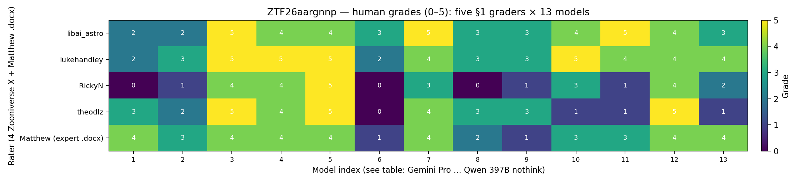

*Fig 1. Grades 0–5; rows = §1 raters; columns = model index.*

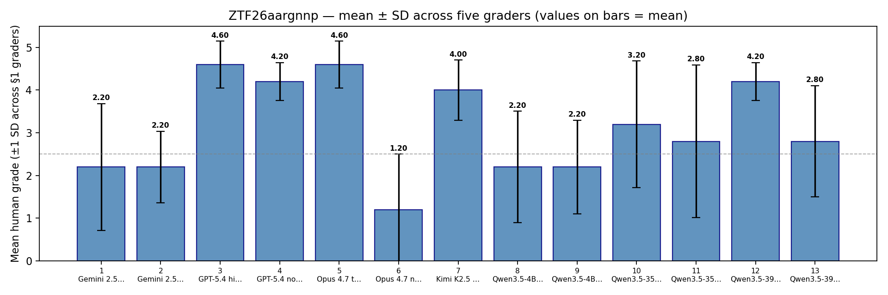

*Fig 2. Mean ±1 SD across **five** §1 graders.*

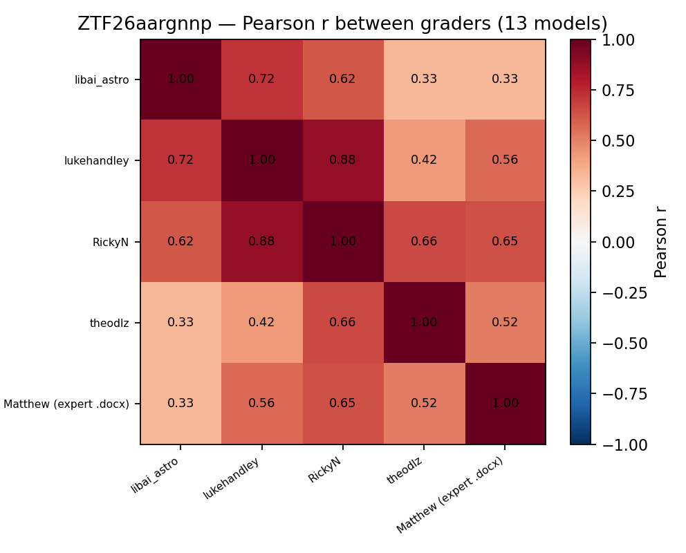

*Fig 3. Pearson **r** matrix between grader columns (legacy filename).*

### 1.3 Mean absolute pairwise disagreement

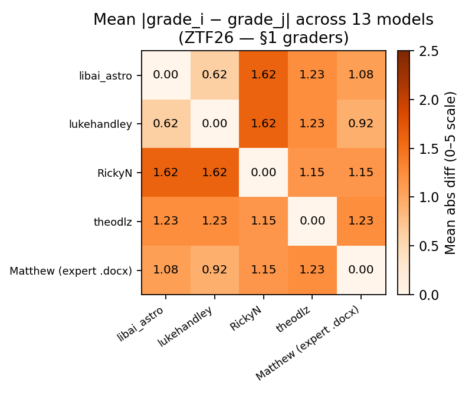

*Fig 1b. Off-diagonal mean |Δgrade|.*

### 1.4 Highlight tone vs blended §1 mean
- **Expert highlight tone vs blended §1 mean** (four Zooniverse **(X)** scores + **Matthew** `.docx` **Your Grading** per model, equal weight): Pearson r = **0.616**, p = 2.49e-02, n = 13. Tone = (green − red) / (R+Y+G) over Q2+Q3 highlight inventory (see Apr 30 highlight report for color semantics).

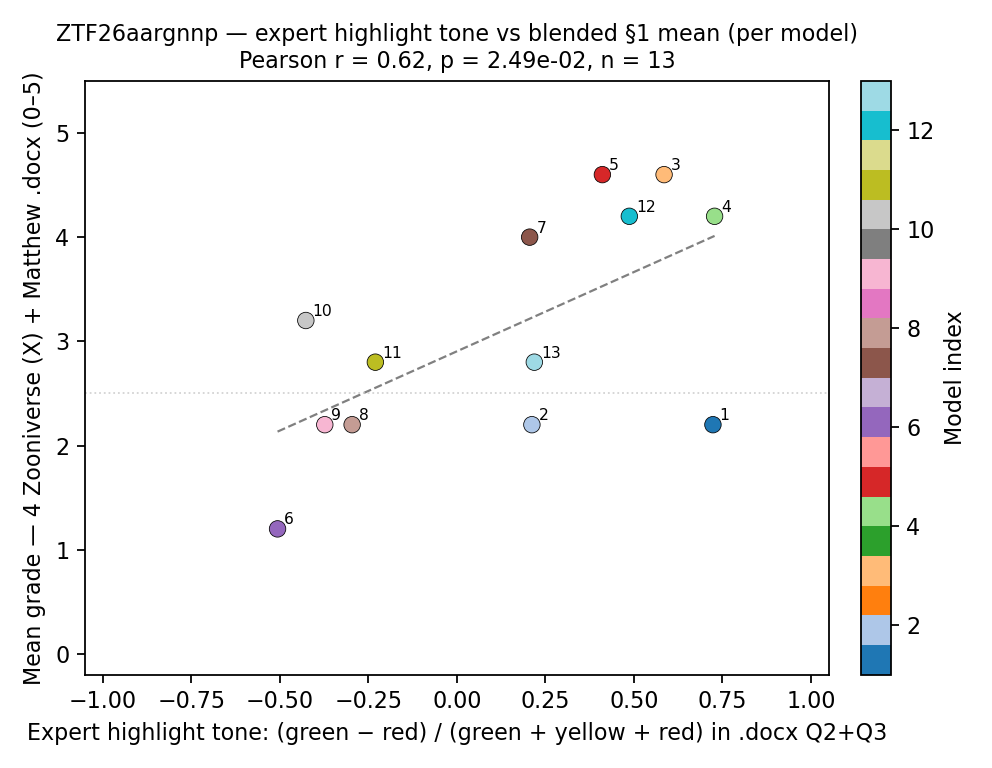

*Fig 1c. **y** = §1 blended mean (4× Zoon **X** + Matthew `.docx` **Your Grading**).*

### 1.5 Model index ↔ system

| Idx | Model |
|:---:|:---|
| 1 | Gemini 2.5 Pro high |
| 2 | Gemini 2.5 Flash none |
| 3 | GPT-5.4 high |
| 4 | GPT-5.4 none |
| 5 | Opus 4.7 think |
| 6 | Opus 4.7 nothink |
| 7 | Kimi K2.5 think |
| 8 | Qwen3.5-4B think |
| 9 | Qwen3.5-4B nothink |
| 10 | Qwen3.5-35B think |
| 11 | Qwen3.5-35B nothink |
| 12 | Qwen3.5-397B think |
| 13 | Qwen3.5-397B nothink |

## 2. Five-alerts §2 panel (workflow **(D)** → **ZTF25aaxmsns**)

**Streams:** expert **ZTF19abfqvbg** (`.docx`) plus Zooniverse **(A, B, C, D)**. **(X)** is **§1-only** on **ZTF26aargnnp**. **(D)** targets **`ZTF25aaxmsns` (SN)**, not ZTF26. Pooled plots use **five OIDs** × 13 models: `ZTF19abfqvbg, ZTF19aayhwvd, ZTF19abkdsaw, ZTF25aahvsli, ZTF25aaxmsns`.

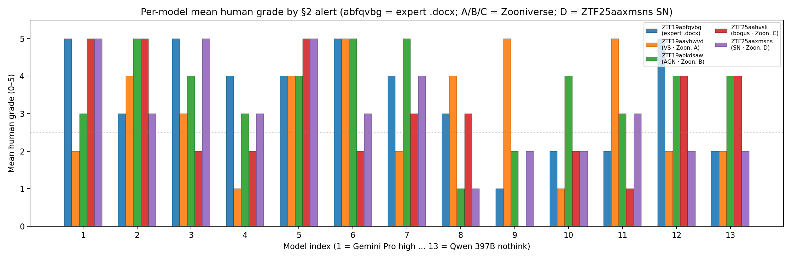

*Fig 13. Mean human grade on each §2 OID (**D** = SN **ZTF25aaxmsns**).*

## 3. Self-scores vs human grades (pooled and per-alert)

(OID, model) rows join Part B self-scores to **`human_mean`** from §2. **ZTF25aaxmsns** comes from workflow **(D)** only. **ZTF26aargnnp** appears only in §1 (X + Matthew); the figure below pairs that §1 human blend with ZTF26 self-scores from the same benchmark `run.jsonl`. **ZTF19abfqvbg** = expert `.docx`; **(A–C)** = Zooniverse.

### 3.0 ZTF26aargnnp only — human mean vs self-score (13 models)

- **Pearson r** (n = 12): §1 mean human (5 raters) vs mean Part B self (**leading + alternative** only) → **r = -0.023**, p = 9.43e-01

*On ZTF26, mean self-score (lead + alt) is missing for: idx **13** (Qwen3.5-397B nothink) (incomplete `parsed` Part B fields). Fig 14 omits the orange bar for that column; Pearson **r** uses n = 12.*

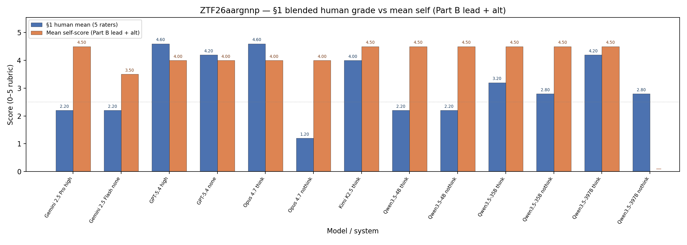

*Fig 14. One column per model (names on the axis, same order as §1.1); blue = §1 blended human grade (same **Mean** as §1.1); orange = mean of **Part B** `self_score_leading_interpretation_and_support` and `self_score_alternative_analysis` only.*

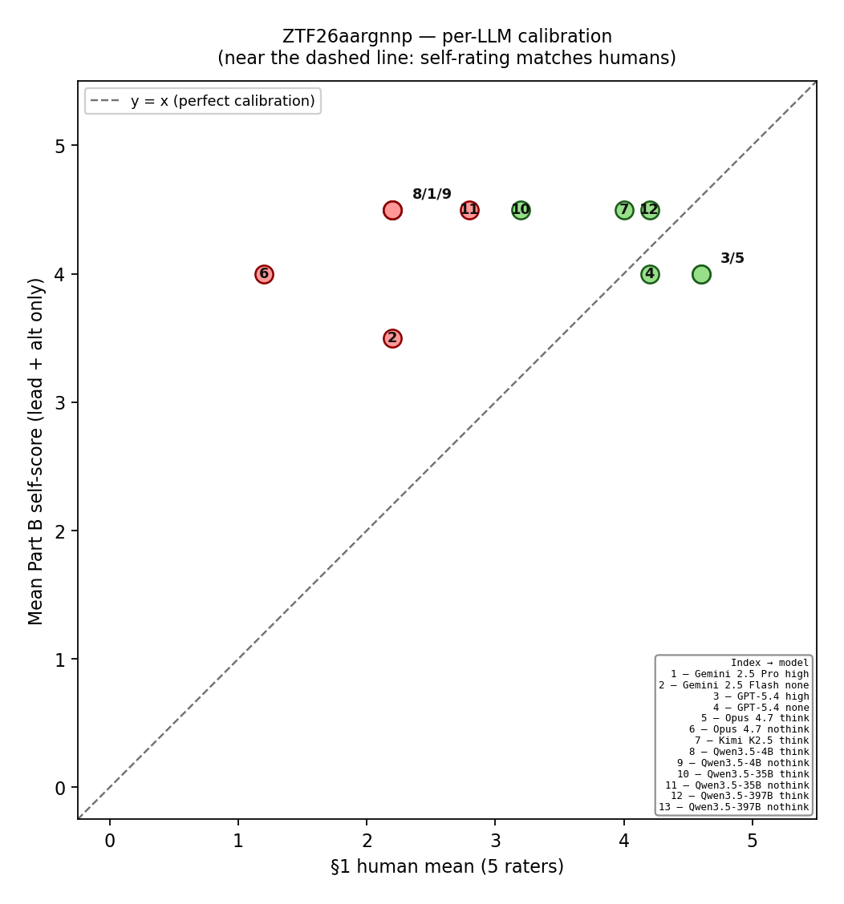

*Fig 15. **Calibration view:** most points show the §1 **index centered in the marker**; overlapping clusters use one offset label (**8/1/9** and **3/5** on this ZTF26 panel). **y** = mean self (lead + alt). Near **y = x** = self-rating close to human blend. **Key** = index → full name. Marker fill: **green** Part C correct, **red** incorrect, **gray** no parseable Part C.*

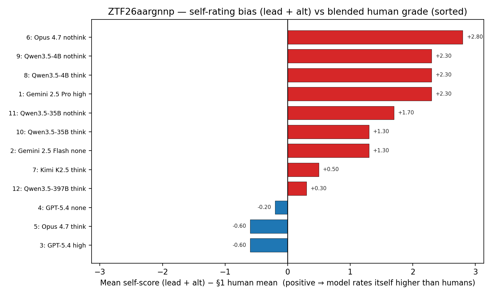

*Fig 16. **Bias view:** mean self (lead + alt) − §1 human mean, sorted. Positive = model’s self-scores more generous than humans on average; **blue** = self stricter than humans. Models without both lead and alt self-scores are omitted (same as Fig 14 / **r**).*

### 3.1 Pooled linear and ordinal summaries

- **Pooled Pearson r** (n = 65): mean self (**key + lead + alt**) vs human mean → **r = -0.211**, p = 9.11e-02
- **Pooled Spearman ρ** (n = 65): **ρ = -0.212**, p = 9.00e-02
- **Pooled Kendall τ** (n = 65): **τ = -0.172**, p = 9.83e-02

- **Pooled Pearson r** (n = 65): mean self (**lead + alt only**) vs human mean → **r = -0.189**, p = 1.31e-01
- **Pooled Spearman ρ** (n = 65): **ρ = -0.205**, p = 1.01e-01
- **Pooled Kendall τ** (n = 65): **τ = -0.164**, p = 1.16e-01

Self-reported Part B scores use the same 1–5 rubric as the human task, but need not track external graders; weak pooled linear correlation can coexist with a strong correctness signal (§4).

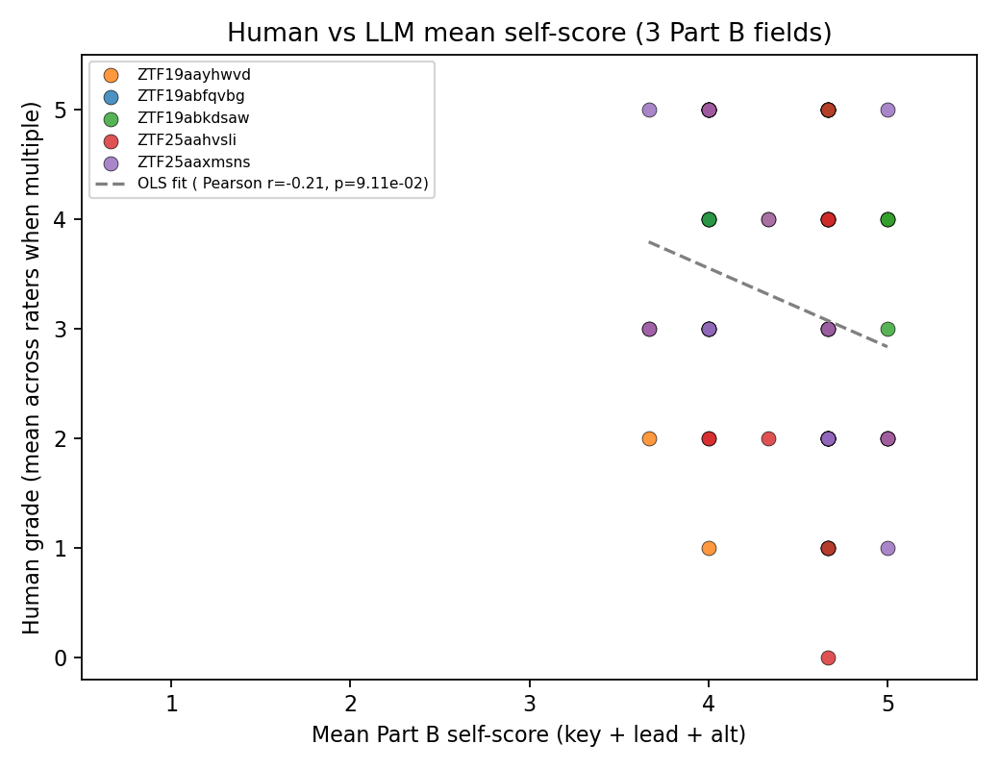

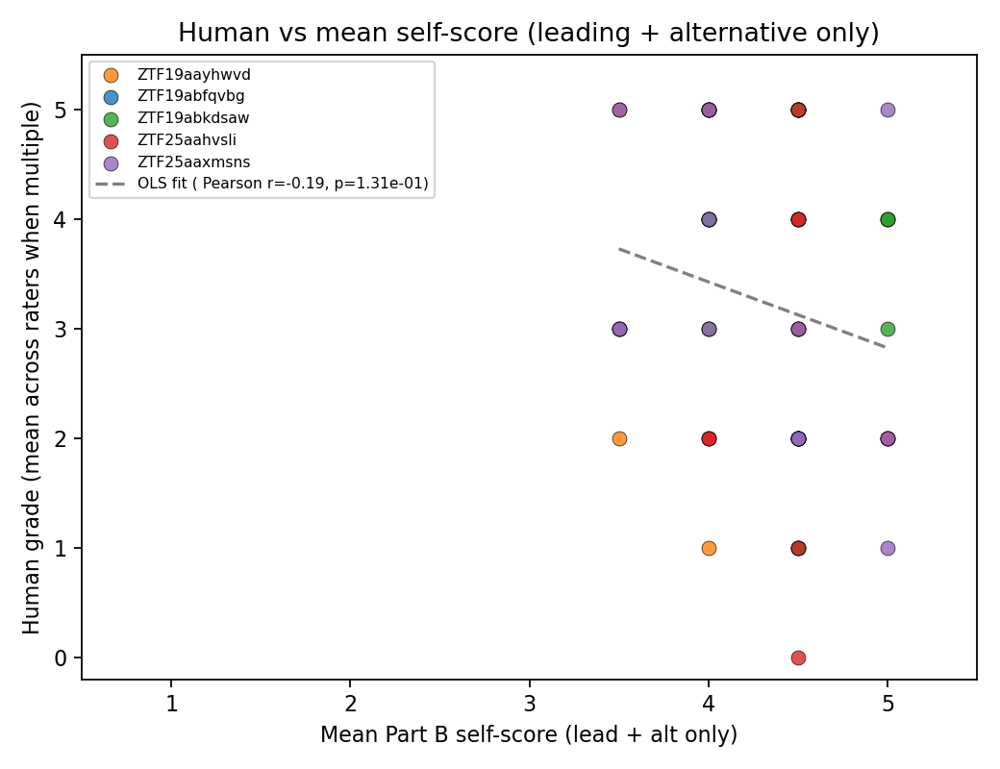

*Fig 4–5. One point per (OID, model); colors = OID.*

### 3.2 Per-model across-OID correlation (five OIDs per bar)

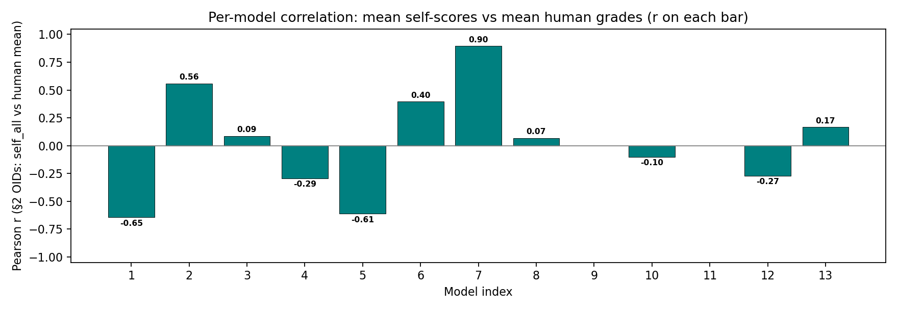

*Fig 6. Pearson r between mean self (3 fields) and human mean; bars labeled.*

### 3.3 Per-alert correlation (13 models per OID)

| OID | n (models with complete self + human) | Pearson r (self all vs human) |
|---|---:|---:|
| ZTF19abfqvbg | 13 | -0.437 |
| ZTF19aayhwvd | 13 | -0.012 |
| ZTF19abkdsaw | 13 | -0.138 |
| ZTF25aahvsli | 13 | -0.207 |
| ZTF25aaxmsns | 13 | -0.479 |

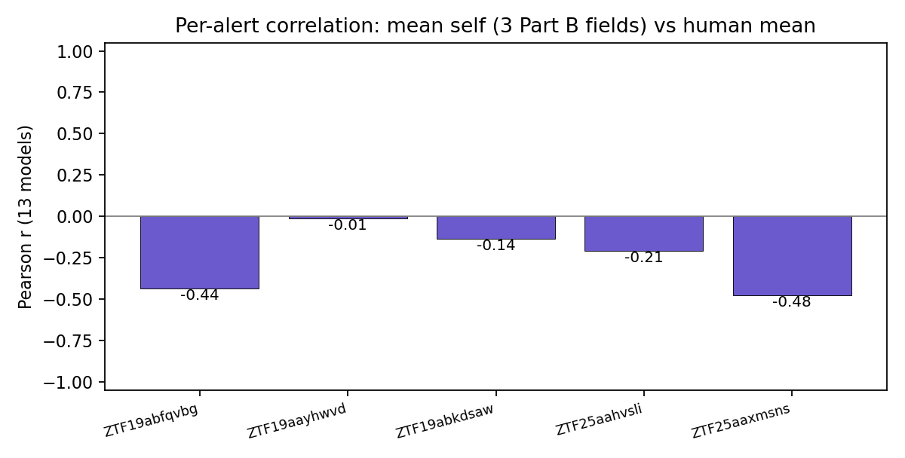

*Fig 6b. Same numbers as the table.*

## 4. Benchmark correctness vs human grades

- **Point-biserial r** (correctness × human mean): **r = 0.782**, p = 1.52e-14
- **Pooled mean human grade** when Part C is **correct** (n = 35): **4.23**; when **incorrect** (n = 30): **2.07** (same rows as Fig 7a).

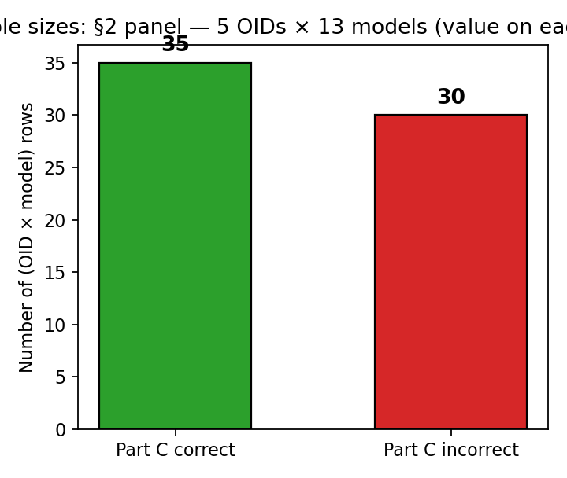

*Fig 7a. Pooled row counts (OID × model) with Part C correct vs incorrect; **n** on each bar.*

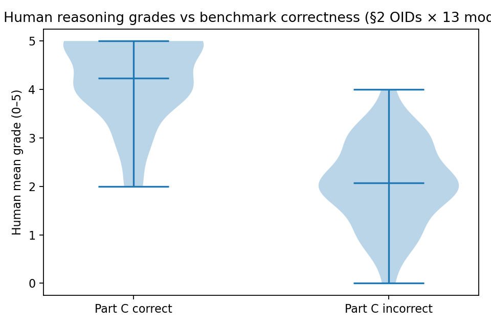

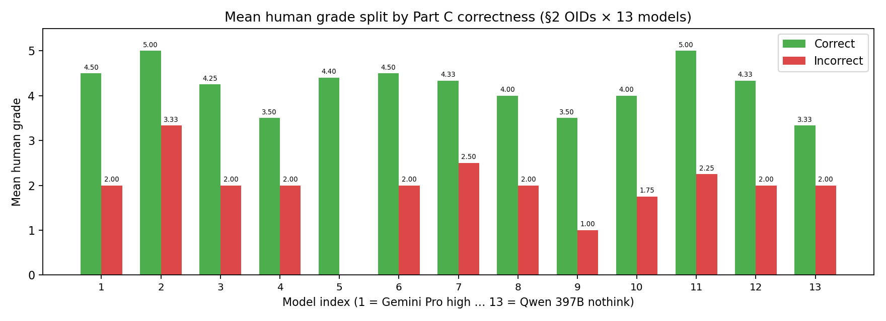

*Fig 7b–7c. Human grades are typically lower when Part C is incorrect.*

## 5. Expert highlight documents (qualitative)

Red / yellow / green markup for Part B reasoning is summarized in [`20260430_report_llm_grading_docx_highlights.md`](20260430_report_llm_grading_docx_highlights.md).

## 6. Extensions

- **ICC(2,1)** or many-facet Rasch if more subjects and raters are added.
- **Per-field** human scores if the UI separates key vs lead vs alt.
- **Alert difficulty**: separate calibration per `target_class`.
- **Ordinal mixed-effects** with rater random intercepts.

---

Regenerate: `python -m viz.build_20260503_zooniverse_grading_report`
