# Zooniverse LLM response grading — benchmark self-scores, correctness, four human views on ZTF26 (3 May 2026)

Source export: `temporary_files/llm-for-astronomy-classifications (4).csv`. Gold OIDs and PNG bundle are documented in `human_samples/llm_example_grading_zooniverse/README.md`.

| Workflow | OID | `target_class` (manifest) |
|---|---|---|
| LLM Response Grading (X) | ZTF26aargnnp | asteroid |
| LLM Response Grading (A) | ZTF19aayhwvd | VS |
| LLM Response Grading (B) | ZTF19abkdsaw | AGN |
| LLM Response Grading (C) | ZTF25aahvsli | bogus |

## Annotators (from export)

**3** Zooniverse users each grade **all 13 model snapshots** on **ZTF26aargnnp** (workflow X). Each also grades **one** of the other workflows (A/B/C) on its OID. Total **78** grading rows with a numeric 0–5 in annotations.

- **RickyN** also completed `LLM Response Grading (C)` → `ZTF25aahvsli`.
- **libai_astro** also completed `LLM Response Grading (B)` → `ZTF19abkdsaw`.
- **lukehandley** also completed `LLM Response Grading (A)` → `ZTF19aayhwvd`.

Overall mean grade on ZTF26 (0–5) by rater: **RickyN** μ=2.15, **libai_astro** μ=3.62, **lukehandley** μ=3.77.

A **fourth** perspective on ZTF26aargnnp is the expert-highlighted Word file (`temporary_files/LLM Answer Grading ZTF26aargnnp.docx` if present). It is not a fourth 0–5 Likert column, but §1.3 links highlight-derived tone to the mean Zooniverse score. Full highlight methodology and ZTF19 tables: [`20260430_report_llm_grading_docx_highlights.md`](20260430_report_llm_grading_docx_highlights.md) (`LLM Answer Grading ZTF19abfqvbg.docx` — separate AGN example **ZTF19abfqvbg**, not in the A/B/C/X Zooniverse set).

## 1. ZTF26aargnnp — four perspectives (three raters + expert markup)

### 1.1 Reliability and pairwise agreement (Zooniverse)

- **Cronbach’s α** (13 models × 3 raters): **0.863**

- **Pairwise Pearson r** between raters: RickyN vs libai_astro **0.62**, RickyN vs lukehandley **0.88**, libai_astro vs lukehandley **0.72**.

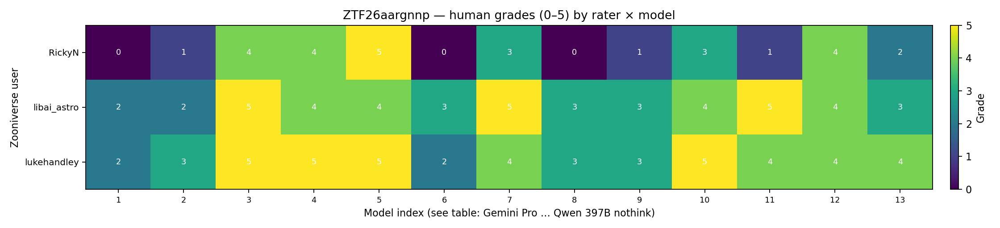

*Fig 1. Grades (0–5) for each rater (row) and model index (column). Numeric labels in cells. Order 1–13 matches `viz/build_llm_example_grading.py` `RUN_SPECS` and the Zooniverse README.*

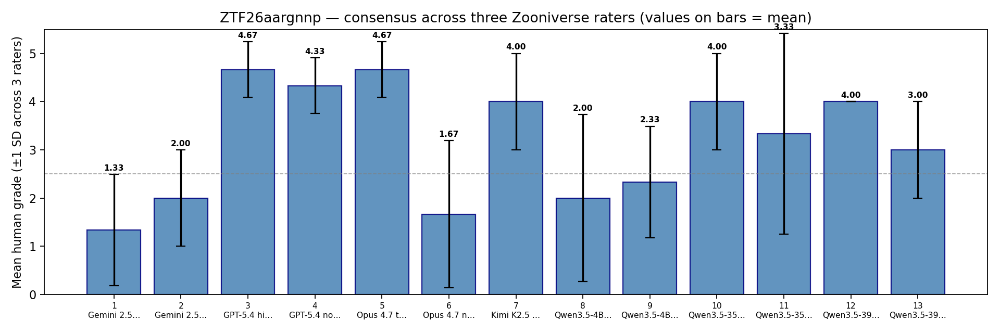

*Fig 2. Mean human score ±1 SD across raters; **each bar is labeled with the mean** (two decimals).*

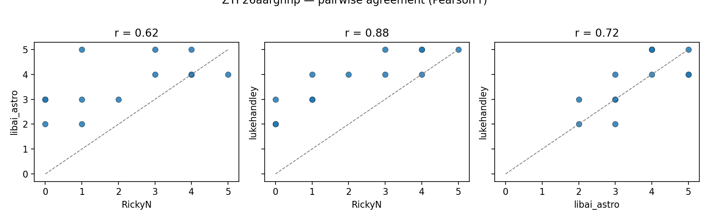

*Fig 3. Pairwise scatter (13 models per panel); dashed line y = x.*

### 1.2 Who disagrees how much? (mean absolute grade gap)

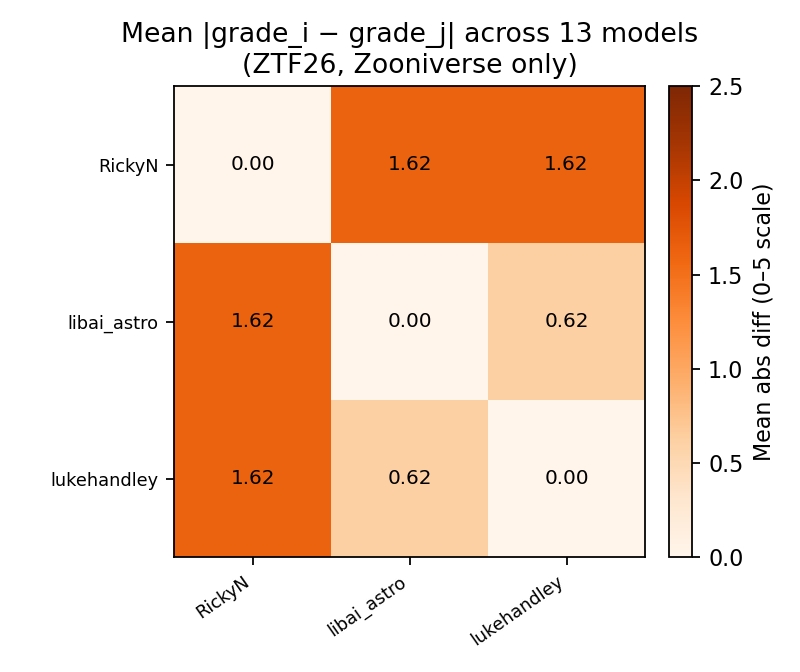

*Fig 1b. Off-diagonal entries: mean |grade_i − grade_j| across the 13 models. Diagonal is 0.*

### 1.3 Fourth perspective: expert highlight tone vs mean Zooniverse grade
- **Expert .docx vs Zooniverse mean** (same 13 model order as the grading PNGs): Pearson r = **0.360**, p = 2.27e-01, n = 13. Tone = (green − red) / (R+Y+G) over Q2+Q3 highlight inventory (see Apr 30 highlight report for color semantics).

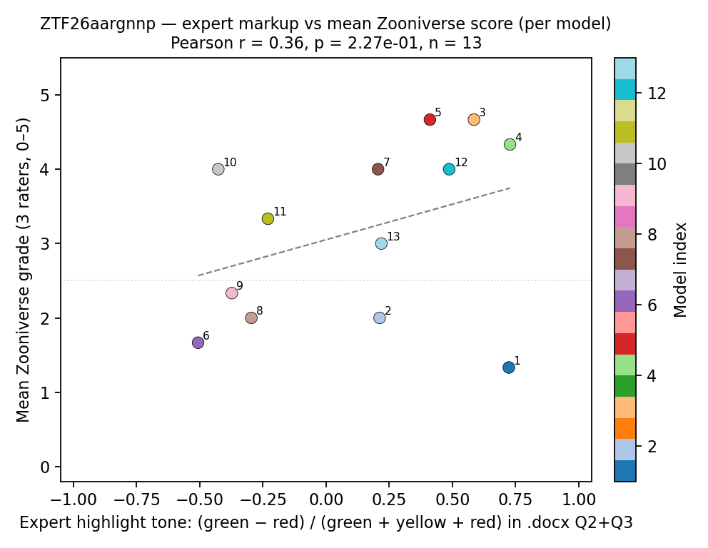

*Fig 1c. One point per model index; point labels show index. Color encodes model index.*

### 1.4 Model index ↔ system

| Idx | Model |
|:---:|:---|
| 1 | Gemini 2.5 Pro high |
| 2 | Gemini 2.5 Flash none |
| 3 | GPT-5.4 high |
| 4 | GPT-5.4 none |
| 5 | Opus 4.7 think |
| 6 | Opus 4.7 nothink |
| 7 | Kimi K2.5 think |
| 8 | Qwen3.5-4B think |
| 9 | Qwen3.5-4B nothink |
| 10 | Qwen3.5-35B think |
| 11 | Qwen3.5-35B nothink |
| 12 | Qwen3.5-397B think |
| 13 | Qwen3.5-397B nothink |

## 2. Self-scores vs human grades (pooled and per-alert)

For each (OID, model) we join benchmark `run.jsonl` **Part B** numeric self-scores with the **mean human** grade (ZTF26: mean of three raters; other OIDs: single rater).

Incomplete Part B self-scores in some `run.jsonl` `parsed` blocks exclude 1 row(s) from the Pearson summaries & scatter fits: `ZTF26aargnnp` · model 13 (Qwen3.5-397B nothink).

### 2.1 Pooled linear and ordinal summaries

- **Pooled Pearson r** (n = 51): mean self (**key + lead + alt**) vs human mean → **r = -0.086**, p = 5.50e-01
- **Pooled Spearman ρ** (n = 51): **ρ = -0.096**, p = 5.04e-01
- **Pooled Kendall τ** (n = 51): **τ = -0.080**, p = 4.92e-01

- **Pooled Pearson r** (n = 51): mean self (**lead + alt only**) vs human mean → **r = -0.069**, p = 6.31e-01
- **Pooled Spearman ρ** (n = 51): **ρ = -0.090**, p = 5.30e-01
- **Pooled Kendall τ** (n = 51): **τ = -0.076**, p = 5.14e-01

Self-reported Part B scores are on the same 1–5 rubric as the human task, but **LLM self-judgment need not track external graders**; the weak pooled linear correlation can coexist with a strong correctness signal (§3).

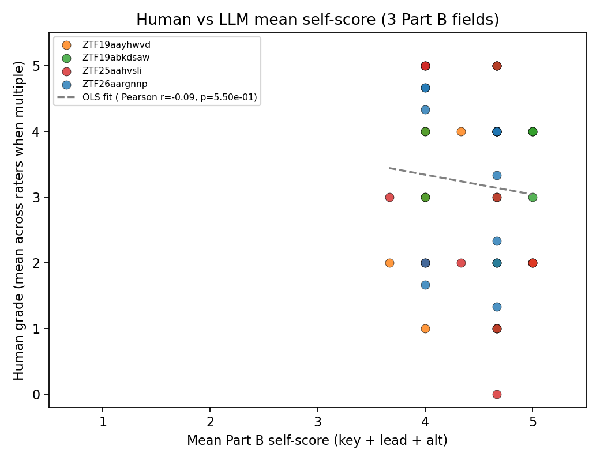

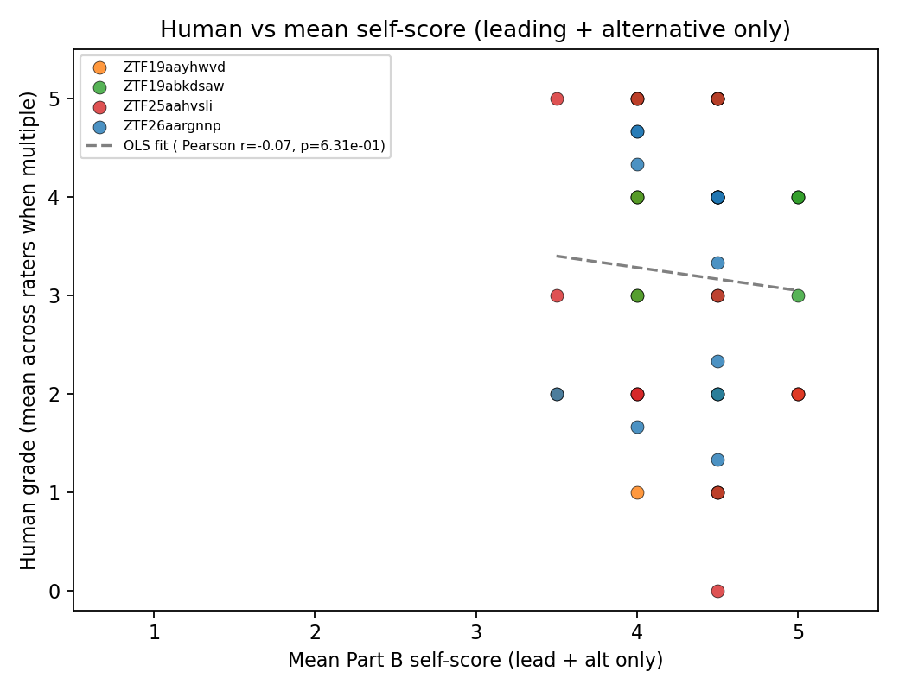

*Fig 4–5. One point per (OID, model); colors = OID.*

### 2.2 Per-model across-OID correlation (four points per bar)

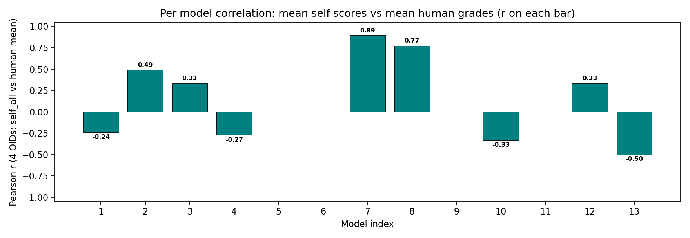

*Fig 6. Pearson r between mean self (3 fields) and human mean; **each bar labeled with r**.*

### 2.3 Per-alert correlation (13 models per OID)

| OID | n (models with complete self + human) | Pearson r (self all vs human) |
|---|---:|---:|
| ZTF19aayhwvd | 13 | -0.012 |
| ZTF19abkdsaw | 13 | -0.138 |
| ZTF25aahvsli | 13 | -0.207 |
| ZTF26aargnnp | 12 | -0.193 |

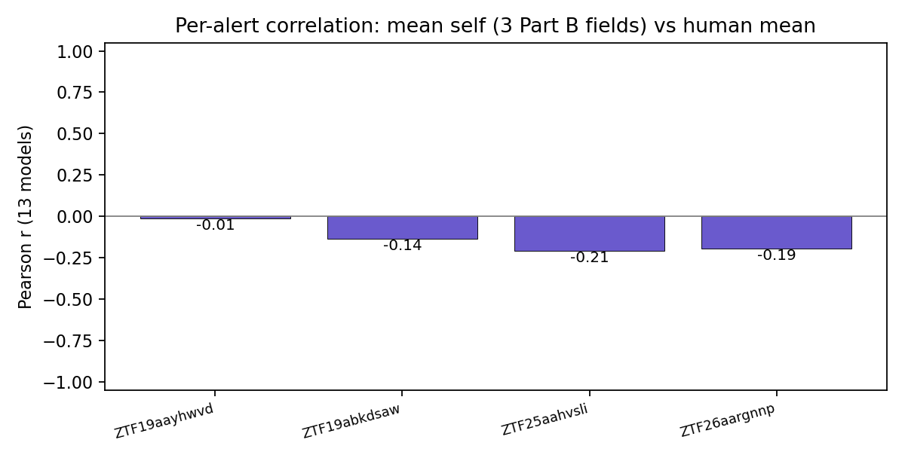

*Fig 6b. Same numbers as the table; labels on bars.*

## 3. Benchmark correctness vs human grades

- **Point-biserial r** (correctness × human mean): **r = 0.833**, p = 1.96e-14
- **Pooled mean human grade** when Part C is **correct** (n = 27): **4.28**; when **incorrect** (n = 25): **2.03** (same rows as Fig 7a).

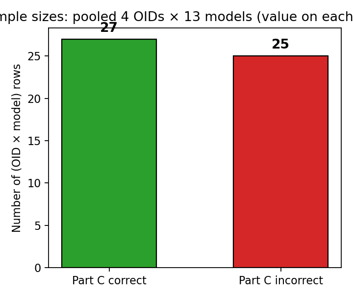

*Fig 7a. Pooled row counts (OID × model) with Part C correct vs incorrect; **n printed on each bar**.*

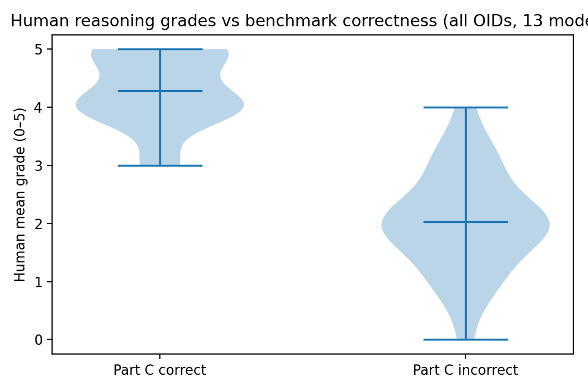

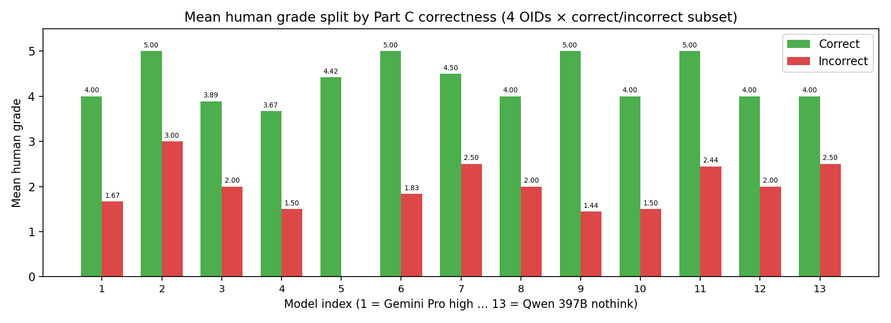

*Fig 7b–7c. Human grades are typically **lower** when Part C is incorrect; per-model paired bars show means with **numeric labels**.*

## 4. Expert highlight documents (qualitative)

Red / yellow / green markup for Part B reasoning is summarized in [`20260430_report_llm_grading_docx_highlights.md`](20260430_report_llm_grading_docx_highlights.md). Use it alongside §1.3–1.4 here for ZTF26aargnnp and alongside the Zooniverse bundle README for context.

## 5. Other angles worth extending

- **ICC(2,1)** or full many-facet Rasch if more subjects and raters are added.
- **Per-field human scores** if the UI later separates key vs lead vs alt.
- **Alert difficulty**: separate calibration per `target_class` (bogus vs asteroid vs AGN vs VS).
- **Joint model**: ordinal mixed-effects with rater random intercepts.

---

Regenerate: `python -m viz.build_20260503_zooniverse_grading_report`
