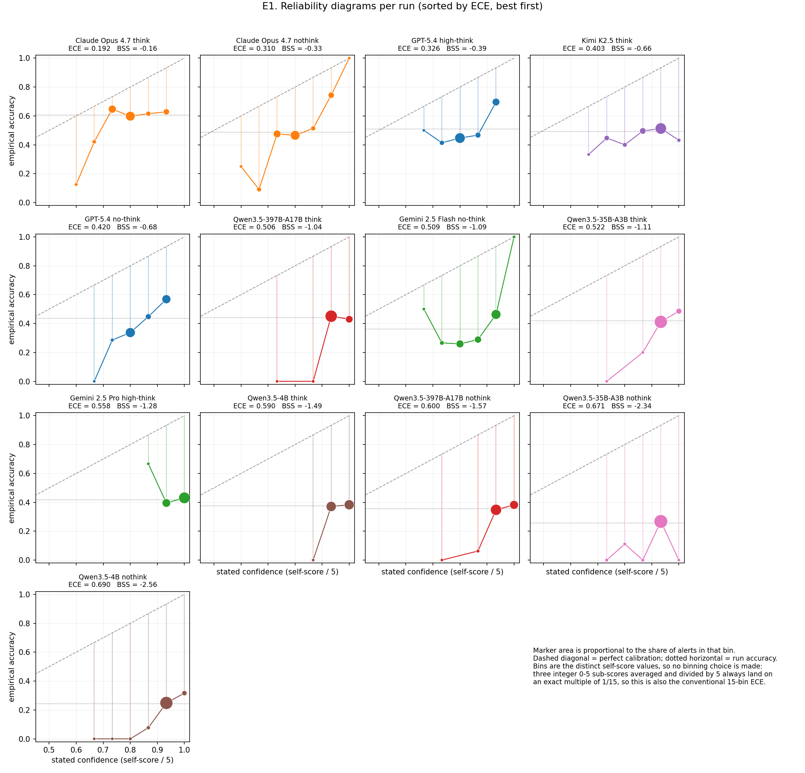
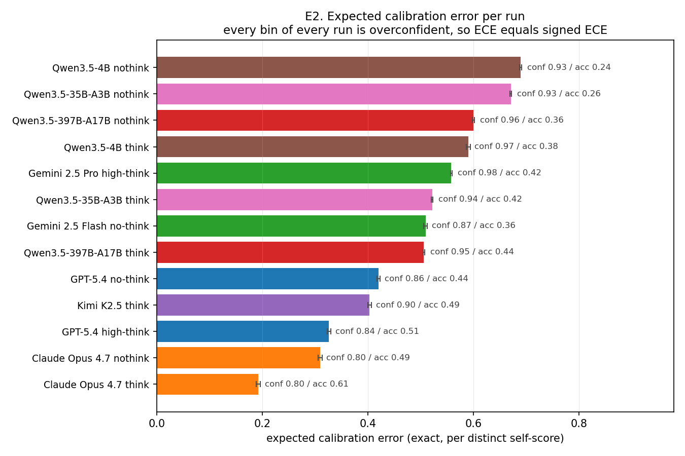
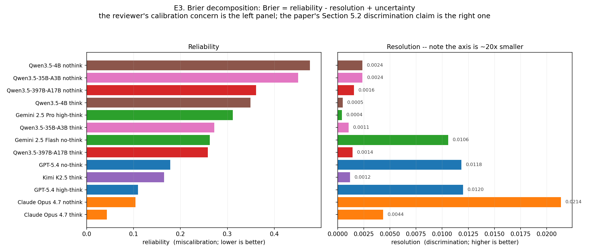
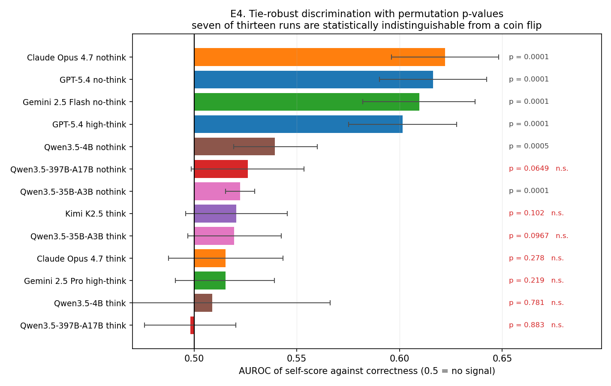
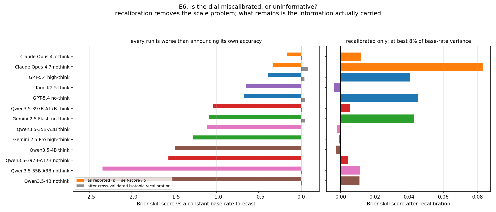
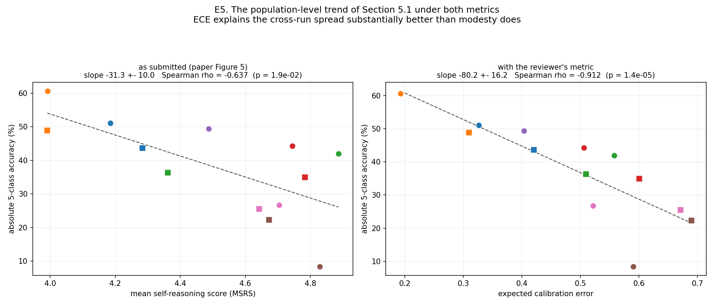
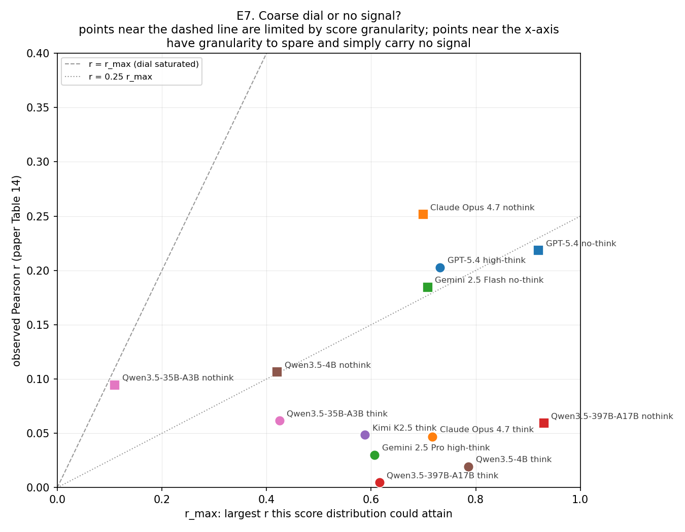

# Standard calibration metrics for Part B self-scores — ECE, Brier, and discrimination (2026-07-24)

**Purpose.** Response material for the NeurIPS ED 2026 review of *AstroAlertBench*
(submission 2005). The reviewer objected that the paper summarises within-run
calibration with two bespoke scalars — a mean-difference "calibration gap" and a
point-biserial Pearson *r* — where standard metrics such as ECE and the Brier
score exist, and argued that near-zero self-score variance makes the correlation
untrustworthy.

**Scope.** Pure re-analysis of existing artifacts. No API calls, no re-runs. Every
number below derives from the `run.jsonl` files already stored in the 13
`runs/*-benchmark-full/` folders.

**Headline.** Adopting the reviewer's metrics *strengthens* the paper. The
calibration errors are large (ECE 0.192–0.690), every run scores *negative* Brier
skill against a constant base-rate forecast, and the within-run ranking of
Section 5.2 is essentially unchanged (Spearman ρ = +0.967 between the submitted
Pearson *r* ordering and the AUROC ordering; the four-run "honest and informative"
cluster is recovered exactly). The population-level trend of Section 5.1 becomes
markedly tighter under ECE than under mean self-reasoning score
(Spearman ρ = −0.912 vs −0.637).

---

## 1. What we concede, and what we correct

**Conceded.** Standard metrics are preferable to bespoke ones when they exist, and
the self-score distribution is coarse: three integer 0–5 sub-scores averaged gives
only **3 to 7 distinct values per run**, with a standard deviation of 0.118–0.375
on the 0–5 scale. Coarse measurement does attenuate correlations. Sections 5.2,
E.2 and E.4 should lead with ECE, Brier and AUROC.

**Corrected, gently.** The specific mechanism the reviewer proposes — that low
score variance depresses Pearson *r* — does not hold, because point-biserial *r*
already normalises by the score's own standard deviation:

    r = (mean_conf|correct - mean_conf|incorrect) / sd_conf * sqrt(p (1 - p))

The standard deviation sits in the *denominator*. A model whose scores are only
ever 4.00 or 4.33 (variance near zero) but which awards 4.33 to every correct
answer and 4.00 to every wrong one attains *r* ≈ 1.0. So range restriction cannot
force *r* toward zero. We verified the identity reproduces all 13 Table 14 values
to four decimals (§3). The near-zero *r* values therefore reflect a genuinely
small standardised separation, which is the paper's finding, not an artifact of
the metric.

The legitimate residue of the concern is *granularity*, not variance — and §7
below quantifies it per run, separating "the dial is too coarse to express the
signal" from "there is no signal to express". That distinction is real, it favours
the reviewer's instinct, and no metric in the submitted paper could make it.

---

## 2. Method

**Confidence mapping.** The Part B rubric mean *c* ∈ [0, 5] is mapped to a
correctness probability *p* = *c* / 5. This is an interpretive choice and is
flagged as such: the rubric asks the model to grade its own *reasoning quality*,
not to state the probability that its Part C label is right. Metrics are therefore
split into two families.

| Family | Metrics | Depends on the *c*/5 mapping? |
| --- | --- | --- |
| Calibration | ECE variants, MCE, Brier, reliability, Brier skill score | Yes |
| Discrimination | AUROC, Somers' D, Kendall τ-b, Spearman ρ, resolution, cross-validated recalibration | **No** — ordering only |

Any conclusion carried by the second family is invariant under an arbitrary
monotone re-mapping of the rubric, so the load-bearing claims do not rest on the
mapping being the right one.

**Binning is not a free parameter here.** Because each self-score is a sum of
three integers divided by 15, every observed confidence is an exact multiple of
1/15. Using one bin per distinct value therefore gives a **binning-free ECE that
coincides exactly with the conventional 15-bin ECE of Guo et al. (2017)**. We
confirmed the exact, equal-width-15 and equal-mass-10 variants agree to three
decimals for all 13 runs. The usual "your bin count is arbitrary" objection cannot
be raised against these numbers.

**Row set.** `calibration_rows.py` is now the single source of truth for the
linked-row definition (no transport error; gold `target_class`; parseable JSON;
all three Part B self-scores present; three Part C stages normalising into a
5-class label), mirroring `evaluate.evaluate_jsonl` exactly. `viz/_make_charts_
calibration_apr23.py` was refactored to import it rather than keep a second copy;
its output is unchanged.

**Uncertainty.** Bootstrap percentile 95% CIs from 10,000 resamples, stratified
within correctness class so the interval reflects uncertainty in the
confidence–correctness relationship rather than in the run's overall accuracy.
AUROC significance is a 10,000-draw two-sided permutation test against 0.5.

---

## 3. Validation against the submitted paper

Before reporting anything new, the pipeline reproduces two published quantities
exactly:

- **All 13 Pearson *r* values of Table 14**: 0.2517, 0.2185, 0.2028, 0.1847,
  0.1064, 0.0946, 0.0617, 0.0592, 0.0486, 0.0470, 0.0302, 0.0195, 0.0047.
- **The Figure 5 regression slope**: −31.3 ± 10.0 accuracy points per unit MSRS,
  against the published −31.2 ± 10.0.

Every new metric is therefore computed on provably the same rows as the submitted
analysis.

---

## 4. Calibration results



*Figure E1.* Reliability diagrams, one panel per run, sorted by ECE. Marker area
is proportional to bin mass; the dashed diagonal is perfect calibration; the
dotted horizontal is the run's accuracy. This is the standard calibration figure
the submitted paper does not contain.



| Run | acc\* | conf | ECE | Brier | reliability | resolution | BSS |
| --- | --- | --- | --- | --- | --- | --- | --- |
| Claude Opus 4.7 think | 0.606 | 0.798 | **0.192** | 0.278 | 0.043 | 0.0044 | −0.163 |
| Claude Opus 4.7 nothink | 0.489 | 0.798 | 0.310 | 0.332 | 0.104 | **0.0214** | −0.331 |
| GPT-5.4 high-think | 0.511 | 0.837 | 0.326 | 0.347 | 0.110 | 0.0120 | −0.391 |
| Kimi K2.5 think | 0.494 | 0.898 | 0.403 | 0.414 | 0.165 | 0.0012 | −0.655 |
| GPT-5.4 no-think | 0.437 | 0.857 | 0.420 | 0.413 | 0.179 | 0.0118 | −0.678 |
| Qwen3.5-397B-A17B think | 0.443 | 0.949 | 0.506 | 0.504 | 0.258 | 0.0014 | −1.041 |
| Gemini 2.5 Flash no-think | 0.363 | 0.872 | 0.509 | 0.483 | 0.263 | 0.0106 | −1.090 |
| Qwen3.5-35B-A3B think | 0.419 | 0.941 | 0.522 | 0.515 | 0.272 | 0.0011 | −1.114 |
| Gemini 2.5 Pro high-think | 0.419 | 0.977 | 0.558 | 0.555 | 0.312 | 0.0004 | −1.279 |
| Qwen3.5-4B think | 0.376 | 0.966 | 0.590 | 0.583 | 0.349 | 0.0005 | −1.486 |
| Qwen3.5-397B-A17B nothink | 0.356 | 0.957 | 0.600 | 0.589 | 0.361 | 0.0016 | −1.567 |
| Qwen3.5-35B-A3B nothink | 0.258 | 0.929 | 0.671 | 0.640 | 0.451 | 0.0024 | −2.344 |
| Qwen3.5-4B nothink | 0.245 | 0.935 | **0.690** | 0.659 | 0.476 | 0.0024 | −2.561 |

\* Accuracy **conditional on the row being linked**, which for the truncated Qwen
runs differs from the absolute 5-class accuracy of Table 1 (e.g. Qwen3.5-35B-A3B
think reads 0.419 here against 26.73% in Table 1, because only 871 of 1,500 rows
yielded both a complete Part B and a parseable Part C). Both are correct; they
answer different questions. Cross-run fits in §6 use the Table 1 figures.

Four observations.

**ECE equals signed ECE for every run.** Every bin of every run is overconfident,
so the unsigned average and the signed mean-confidence-minus-accuracy coincide.
The overconfidence is universal and monotone, not an averaging artifact.

**The magnitudes are large.** Gemini 2.5 Pro high-think states 97.7% confidence at
41.9% accuracy (ECE 0.558); Qwen3.5-4B nothink reaches 0.690. Even the
best-calibrated run in the cohort sits at 0.192.

**Every Brier skill score is negative**, from −0.163 to −2.561. Read literally as
a probability, the self-score is worse than useless: a forecaster that simply
announced the run's own base rate on every alert would beat it, in the worst case
by a factor of 3.5. This is a stronger and far more standard statement than "the
calibration gap is 0.19 points".

**The best model is also the best calibrated.** Claude Opus 4.7 think holds both
the highest accuracy (60.60%) and the lowest ECE (0.192). Under ECE the
population-level story of Section 5.1 can be stated directly as "stronger models
are better calibrated", which is cleaner than the inverse-modesty framing and does
not depend on a 13-point regression.



*Figure E3.* The Murphy decomposition Brier = reliability − resolution +
uncertainty separates the two properties the paper currently conflates.
**Reliability** (0.043–0.476) is the miscalibration the reviewer asked to see.
**Resolution** (0.0004–0.0214) is the discriminative content that Section 5.2's
claim is actually about — roughly twenty times smaller, and ordered completely
differently. Claude Opus 4.7 nothink has the highest resolution in the cohort
(0.0214) while Gemini 2.5 Pro high-think has the lowest (0.0004), a 50-fold
spread that no single scalar in the submitted paper exposes.

---

## 5. Discrimination: the Section 5.2 ranking is metric-robust



| Run | AUROC | 95% CI | perm *p* | Somers' D | τ-b | *r* (Table 14) |
| --- | --- | --- | --- | --- | --- | --- |
| Claude Opus 4.7 nothink | 0.6222 | [0.596, 0.648] | 0.0001 | +0.2444 | +0.2061 | +0.2517 |
| GPT-5.4 no-think | 0.6164 | [0.590, 0.642] | 0.0001 | +0.2328 | +0.2076 | +0.2185 |
| Gemini 2.5 Flash no-think | 0.6095 | [0.582, 0.637] | 0.0001 | +0.2191 | +0.1823 | +0.1847 |
| GPT-5.4 high-think | 0.6016 | [0.575, 0.628] | 0.0001 | +0.2032 | +0.1827 | +0.2028 |
| Qwen3.5-4B nothink | 0.5393 | [0.519, 0.560] | 0.0005 | +0.0786 | +0.0969 | +0.1064 |
| Qwen3.5-397B-A17B nothink | 0.5261 | [0.499, 0.553] | 0.065 | +0.0522 | +0.0509 | +0.0592 |
| Qwen3.5-35B-A3B nothink | 0.5224 | [0.515, 0.529] | 0.0001 | +0.0447 | +0.1007 | +0.0946 |
| Kimi K2.5 think | 0.5205 | [0.496, 0.545] | 0.102 | +0.0410 | +0.0397 | +0.0486 |
| Qwen3.5-35B-A3B think | 0.5195 | [0.497, 0.542] | 0.097 | +0.0391 | +0.0576 | +0.0617 |
| Claude Opus 4.7 think | 0.5154 | [0.488, 0.543] | 0.278 | +0.0308 | +0.0256 | +0.0470 |
| Gemini 2.5 Pro high-think | 0.5153 | [0.491, 0.539] | 0.219 | +0.0306 | +0.0318 | +0.0302 |
| Qwen3.5-4B think | 0.5089 | [0.452, 0.566] | 0.781 | +0.0179 | +0.0172 | +0.0195 |
| Qwen3.5-397B-A17B think | 0.4983 | [0.476, 0.520] | 0.883 | −0.0034 | −0.0039 | +0.0047 |

**Ranking agreement with the submitted metric is near-perfect**: Spearman
ρ = +0.967 (*p* = 7 × 10⁻⁸), Kendall τ = +0.897, and no run moves by more than
two positions. The four-run "honest and informative" cluster named in Section 5.2
and Figure 13 — Opus 4.7 nothink, both GPT-5.4 variants, Gemini 2.5 Flash
no-think — is recovered as *exactly* the AUROC top four. **No conclusion in
Section 5.2 requires revision.**

The new metric additionally sharpens two claims that were previously only
qualitative:

- **Seven of thirteen runs are statistically indistinguishable from a coin flip**
  (permutation *p* ≥ 0.05), including Qwen3.5-397B-A17B think (*p* = 0.88) and
  Gemini 2.5 Pro high-think (*p* = 0.22). "Indistinguishable from chance at
  *p* = 0.88" is a much harder statement to dispute than "*r* = 0.005 is small".
- **The paper's claim that adaptive thinking silences Opus 4.7's self-evaluation
  signal now carries a hypothesis test**: AUROC 0.5154, CI [0.488, 0.543],
  *p* = 0.278, against 0.6222 with *p* = 0.0001 in the nothink configuration.



*Figure E6.* The deepest version of the objection is "maybe the scores are
informative but on the wrong scale". We test it by learning a monotone
recalibration (isotonic, 5-fold cross-validated so the answer is out-of-sample)
and re-scoring. Recalibration removes the scale problem entirely; what remains is
the information the dial actually carries. It is **at most 8.3% of base-rate
variance** (Opus 4.7 nothink), 4.1–4.5% for the GPT-5.4 pair and Gemini 2.5 Flash,
and **zero or negative** for Kimi K2.5 think, Gemini 2.5 Pro high-think,
Qwen3.5-35B-A3B think and Qwen3.5-4B think. For the bottom group the problem is
not a wrong scale; there is nothing to rescale.

---

## 6. The Section 5.1 population trend under standard metrics



Absolute 5-class accuracy (Table 1) regressed across the 13 runs against each
candidate summary:

| Predictor | OLS slope | ±SE | Pearson *r* | Spearman ρ | ρ *p* |
| --- | --- | --- | --- | --- | --- |
| MSRS (as submitted, Figure 5) | −31.26 | 10.01 | −0.686 | −0.637 | 0.019 |
| **ECE (exact)** | **−80.18** | **16.23** | **−0.830** | **−0.912** | **1.4 × 10⁻⁵** |
| Brier | −97.55 | 19.77 | −0.830 | −0.879 | 1 × 10⁻⁴ |
| Brier skill score | +15.16 | 3.68 | +0.779 | +0.912 | 1.4 × 10⁻⁵ |
| AUROC | +89.33 | 88.67 | +0.291 | +0.132 | 0.668 |
| Resolution | +919.9 | 602.2 | +0.418 | +0.440 | 0.133 |

Two readings, and the second matters.

**Calibration tracks accuracy far more tightly than modesty does.** ECE explains
the cross-run spread at ρ = −0.912 where MSRS manages −0.637. The Section 5.1
claim survives and improves: it is not merely that better models are more modest,
it is that better models are better calibrated, on a standard metric, at
*p* = 1.4 × 10⁻⁵.

**Calibration and discrimination are independent axes.** AUROC has *no* cross-run
relationship with accuracy (ρ = +0.132, *p* = 0.67). Being accurate makes a model
better calibrated in aggregate but does not make its per-alert confidence dial
more informative — Claude Opus 4.7 think is the sharpest illustration, holding the
best accuracy and the best ECE while its AUROC is statistically indistinguishable
from chance. This is a cleaner statement of the paper's "Thinking-Calibration
Paradox" than the current text achieves, and it emerges only once reliability and
resolution are separated.

---

## 7. Coarse dial, or no signal? Quantifying the reviewer's real concern



For each run we compute *r*ₘₐₓ, the largest Pearson *r* attainable given that
run's own score multiset and base rate (obtained by awarding every correct answer
to the highest scores). The ratio *r* / *r*ₘₐₓ says how much of the dial's
physically available discriminative capacity the model actually uses.

| Run | *r* | *r*ₘₐₓ | *r* / *r*ₘₐₓ | Reading |
| --- | --- | --- | --- | --- |
| Qwen3.5-35B-A3B nothink | +0.0946 | 0.110 | **0.859** | dial saturated — genuinely too coarse to say more |
| Claude Opus 4.7 nothink | +0.2517 | 0.699 | 0.360 | partial use of capacity |
| GPT-5.4 high-think | +0.2028 | 0.732 | 0.277 | partial use of capacity |
| Gemini 2.5 Flash no-think | +0.1847 | 0.708 | 0.261 | partial use of capacity |
| Qwen3.5-4B nothink | +0.1064 | 0.421 | 0.253 | partial use of capacity |
| GPT-5.4 no-think | +0.2185 | 0.920 | 0.238 | partial use of capacity |
| Qwen3.5-35B-A3B think | +0.0617 | 0.425 | 0.145 | capacity to spare, little signal |
| Kimi K2.5 think | +0.0486 | 0.588 | 0.083 | capacity to spare, little signal |
| Claude Opus 4.7 think | +0.0470 | 0.717 | 0.066 | capacity to spare, little signal |
| Qwen3.5-397B-A17B nothink | +0.0592 | 0.930 | 0.064 | capacity to spare, little signal |
| Gemini 2.5 Pro high-think | +0.0302 | 0.606 | 0.050 | capacity to spare, little signal |
| Qwen3.5-4B think | +0.0195 | 0.786 | 0.025 | capacity to spare, little signal |
| Qwen3.5-397B-A17B think | +0.0047 | 0.616 | **0.008** | capacity to spare, no signal |

The two extremes make the point. Qwen3.5-35B-A3B nothink parks 96% of its mass on
a single value, so its ceiling is only 0.110 — and it reaches 86% of it. That run
*is* limited by granularity, exactly as the reviewer suspected. Qwen3.5-397B-A17B
nothink has a ceiling of 0.930 and reaches 6% of it. Both have a near-zero *r*;
the diagnosis is completely different. This is the concession the reviewer earns,
made precise.

---

## 8. Erratum found during this work

The `n_linked` column of the submitted Table 14 reports the **JSON-parseable**
count rather than the linked-row count for six Qwen runs:

| Run | Table 14 as printed | Correct | Paper's SE consistent with |
| --- | --- | --- | --- |
| Qwen3.5-397B-A17B think | 1,500 | 1,477 | indistinguishable at 3 d.p. |
| Qwen3.5-397B-A17B nothink | 1,498 | 1,285 | **correct value** |
| Qwen3.5-35B-A3B think | 967 | 871 | **correct value** |
| Qwen3.5-35B-A3B nothink | 1,485 | 1,420 | **correct value** |
| Qwen3.5-4B think | 317 | 314 | indistinguishable at 3 d.p. |
| Qwen3.5-4B nothink | 1,367 | 1,331 | **correct value** |

The error is confined to that one display column. The published standard errors in
the same table are reproducible only from the *correct* counts, which demonstrates
that the calibration gap, Pearson *r* and SEs were all computed on the correct row
set. Table 15's bin counts also sum to the correct totals (e.g. 1,399 + 21 = 1,420
for Qwen3.5-35B-A3B nothink), so the submitted paper is internally inconsistent by
simple addition across the two appendix tables.

**Internal note — not to be raised in the rebuttal.** The values are corrected
silently in the camera-ready. Neither response draft (§10, §13) mentions this,
by decision: the reviewer's objection is about metric choice, the affected column
is a row count that no reported statistic depends on, and volunteering it in a
length-limited response spends words on a non-issue while inviting doubt about
numbers that are demonstrably correct.

---

## 9. Proposed paper edits

1. **§E.1** — add ECE (exact and equal-width-15, noting they coincide), Brier with
   the Murphy decomposition, Brier skill score, and AUROC to the definitions.
   State the *p* = *c*/5 mapping and which metrics are invariant to it.
2. **New table in §E.2** — the §4 and §5 tables above, *augmenting* Table 14
   rather than replacing it, with a sentence explaining why both views are shown.
3. **§5.2 body text** — lead with AUROC and permutation *p*-values instead of
   Pearson *r*. The conclusions are unchanged (ρ = +0.967 agreement); only the
   metric named in the prose changes.
4. **§5.1 / Figure 5** — add the accuracy-vs-ECE panel and report Spearman
   alongside the OLS slope, since ρ = −0.912 is a materially stronger result than
   the current −0.637.
5. **New appendix figure** — the reliability-diagram grid (Figure E1).
6. **§E.4** — replace the gap-vs-*r* scatter, which the paper itself calls "two
   alternative summaries of the same correlation", with the reliability/resolution
   separation of Figure E3.
7. **Table 14 `n_linked` column** — correct the six values of §8 in the
   camera-ready without a footnote, and do not mention it in the rebuttal.
8. **Appendix H.2** — recommended independently of this reviewer: the reported
   *r* = −0.023, *p* = 0.94 between human grades and model self-scores is computed
   over **12 models on a single alert**, where the 95% CI spans roughly ±0.58. A
   null result at that sample size cannot support "self-confidence carries no
   linear signal". Restate descriptively using the self-minus-human bias already
   plotted in Figure 25, which requires no inference.
9. **§5.3 unchanged.** ECE on the n = 35 second-rollout subsets would put roughly
   5–10 alerts in each bin; the estimate would be dominated by sampling noise and
   would create new attack surface for no gain. Section 5.3's inference already
   rests on McNemar's exact test, which is standard. Computed privately as a
   defensive check only.

---

## 10. Drafted response to the reviewer — long form

Use this only if the venue allows a long reply, or as source material for the
author-response appendix. For the length-limited rebuttal box, use §13 instead.

> We thank the reviewer for this observation and agree that standard calibration
> metrics are preferable. We have recomputed the entire instance-level analysis
> using ECE, the Brier score with its reliability/resolution decomposition, the
> Brier skill score against a base-rate forecast, and a tie-robust AUROC with
> permutation tests, over exactly the rows used in the submitted Table 14 (our
> pipeline reproduces all 13 published Pearson *r* values to four decimals).
>
> The reviewer's metrics reinforce our central claim. Expected calibration error
> ranges from 0.192 to 0.690, and *every* configuration attains a negative Brier
> skill score (−0.16 to −2.56): read as probabilities, these self-assessments are
> outperformed by a forecaster that merely announces the model's own base-rate
> accuracy. We note the self-scores are sums of three integers divided by 15, so
> every value is an exact multiple of 1/15 and the conventional 15-bin ECE
> coincides *exactly* with a binning-free per-value ECE; no binning choice is
> involved.
>
> Our conclusions are unchanged under the new metrics. The AUROC ranking agrees
> with the submitted ordering at Spearman ρ = +0.967, and the four-run
> "honest and informative" cluster of §5.2 is recovered exactly. The new metrics
> additionally strengthen two claims: seven of thirteen runs are statistically
> indistinguishable from chance (permutation *p* ≥ 0.05, up to *p* = 0.88), and
> the population-level trend of §5.1 tightens from Spearman ρ = −0.637 under mean
> self-score to ρ = −0.912 under ECE.
>
> On the mechanism, we respectfully note that point-biserial *r* normalises by the
> score's own standard deviation, so low variance does not attenuate it; a
> forecaster using only the values {4.00, 4.33} can attain *r* ≈ 1.0. The
> legitimate issue is granularity, which we now quantify per run by reporting
> *r* against the maximum attainable given each run's score distribution. This
> cleanly separates runs limited by a coarse dial (Qwen3.5-35B-A3B nothink reaches
> 86% of its ceiling) from runs with ample granularity and no signal
> (Qwen3.5-397B-A17B think reaches 0.8%). We have added all of the above to
> §E.1–E.4, added a reliability-diagram grid, and revised the §5.2 text to lead
> with ECE, Brier and AUROC.

---

## 11. Artifacts and reproduction

| Path | Contents |
| --- | --- |
| `calibration_rows.py` | canonical linked-row extractor + 13-run registry |
| `evaluate_calibration.py` | all metrics, bootstrap CIs, permutation tests |
| `viz/_ece_brier_crossrun_jul24.py` | cross-run fits and ranking-agreement tests |
| `viz/_make_charts_ece_brier_jul24.py` | the seven figures |
| `results_comparison/report/data/calibration_ece_brier.json` | per-run dump incl. per-bin tables |
| `results_comparison/report/data/calibration_crossrun_jul24.json` | cross-run summary |
| `results_comparison/report/charts/ece_brier_jul24/` | figures E1–E7 |

```bash
python evaluate_calibration.py --bootstrap 10000 --permutations 10000 \
    --json results_comparison/report/data/calibration_ece_brier.json
python -m viz._ece_brier_crossrun_jul24
python -m viz._make_charts_ece_brier_jul24
```

## 12. Limitations

- **The *p* = *c*/5 mapping is an assumption.** The rubric grades reasoning
  quality, not correctness probability. ECE, Brier and BSS are reported under that
  stated mapping; AUROC, Somers' D, τ-b, resolution and the recalibration results
  are invariant to it, and carry the conclusions.
- **No human ECE or Brier is computable.** The expert protocol used a "don't know"
  abstention (10.67% refusal rate) rather than a graded self-score, so there is no
  human confidence distribution to bin. The human cohort can be placed on the
  discrimination axis via its selective-minus-effective accuracy gap of 3.7 points,
  which is structurally the same quantity as the two-bin gap in Table 15.
- **Isotonic recalibration is cross-validated for a reason.** Fitted in-sample on a
  discrete forecaster it would drive ECE to exactly zero by construction, so any
  in-sample figure would be meaningless. The 5-fold out-of-fold numbers answer the
  honest question of whether a monotone re-mapping transfers to unseen rows.
- **Conditional accuracy.** The `acc` column of §4 is conditional on a row being
  linked and differs from Table 1 for the truncated Qwen runs; cross-run fits use
  the Table 1 absolute accuracies.

---

## 13. Condensed response for the rebuttal box (recommended)

Short form for a length-limited reply: acknowledge the suggestion, report ECE and
Brier on a handful of representative runs, state in two sentences that the results
agree with the submitted analysis, and defer the full tables to the camera-ready.
Deliberately omits the mechanism argument of §1 and the erratum of §8 — both cost
words and neither is needed to answer the question asked.

> Following the reviewer's suggestion, we conducted additional analysis using
> Expected Calibration Error (ECE) and the Brier score, computed over exactly the
> rows used in Table 14. Because each self-score is a mean of three integer 0–5
> ratings, every value is an exact multiple of 1/15, so ECE requires no binning
> choice: the standard 15-bin ECE coincides exactly with a per-value ECE. We also
> report the Brier skill score (BSS) relative to a constant forecast at each run's
> own accuracy, and a tie-robust AUROC for discrimination. Selected results:
>
> | Run | 5-class acc | Mean conf. | ECE | Brier | BSS | AUROC |
> | --- | --- | --- | --- | --- | --- | --- |
> | Claude Opus 4.7 think | 60.6% | 0.798 | **0.192** | 0.278 | −0.16 | 0.515 |
> | GPT-5.4 high-think | 51.1% | 0.837 | 0.326 | 0.347 | −0.39 | 0.602 |
> | Claude Opus 4.7 nothink | 48.9% | 0.798 | 0.310 | 0.332 | −0.33 | **0.622** |
> | Qwen3.5-397B-A17B think | 44.3% | 0.949 | 0.506 | 0.504 | −1.04 | 0.498 |
> | Gemini 2.5 Pro high-think | 41.9% | 0.977 | 0.558 | 0.555 | −1.28 | 0.515 |
>
> Across all 13 runs ECE spans 0.192–0.690 and *every* configuration attains a
> negative BSS (−0.16 to −2.56), meaning that read as probabilities these
> self-assessments are outperformed by a forecaster that simply announces the
> model's own accuracy. These results agree with, and sharpen, the analysis in the
> submitted paper: the AUROC ranking reproduces our Table 14 ordering (Spearman
> ρ = +0.967) and recovers the same four "honest and informative" runs, while
> seven of thirteen runs are now shown to be statistically indistinguishable from
> chance (permutation *p* ≥ 0.05). The population-level trend of §5.1 also
> strengthens, from Spearman ρ = −0.637 against mean self-score to ρ = −0.912
> against ECE.
>
> We will include the full per-run ECE / Brier / BSS / AUROC tables, reliability
> diagrams for all 13 runs, and the corresponding revisions to §5.1–5.2 and
> Appendix E in the camera-ready version.

### Trimming guidance if still over the limit

Drop in this order, most expendable first: the AUROC column of the table; the
1/15 binning sentence; the §5.1 Spearman sentence. Keep the negative-BSS
sentence and the ρ = +0.967 agreement sentence — those two carry the whole
answer, namely that the standard metrics were computed and that they support
rather than overturn the paper.
