# Standalone class-probability calibration — eight closed / open models on n = 300 (2026-08-02)

**Purpose.** Address the review concern that the earlier ECE/Brier analysis, applied to Part B *reasoning-quality* self-scores remapped as \(p = c/5\), was not a clearly specified standalone class-probability experiment. This report re-prompts eight model configurations with an explicit scalar `P_correct ∈ [0.0, 1.0]` defined as the model's probability that its **final predicted class is correct**.

> This standalone experiment evaluates pure predictive class confidence against actual binary correctness \(Y \in \{0, 1\}\), cleanly separating classification calibration from Part B rationale quality self-scores.

**Scope.** Pure inference on a fixed subsample of `manifest_benchmark_final.csv`. No gold labels were revealed. Kimi K2.5 was started then dropped (API deprecation); it is excluded from all tables below.

| Item | Value |
| --- | --- |
| Manifest | `data_class_probability_calibration/manifest_class_prob_300.csv` |
| Sampling | 60 per class × 5 classes, seed `20260725` |
| Prompt | `prompts/prompts_class_probability_calibration.py` |
| Confidence field | `Part C.P_correct` (no Part B self-scores) |
| Target | \(Y_i = \mathbf{1}\{\hat y_i = y_i\}\) under end-to-end 5-class scoring |
| Linked \(n\) | 284–300 per run (transport / parse attrition only) |

---

## 1. Design recap

The prompt keeps Parts A–C of AstroAlertBench (metadata grounding, short scientific rationale, staged classification) but **removes** the three 0–5 reasoning self-scores and **adds** a post-decision probability:

```json
"Part C": {
  "stage1": "...", "stage2": "...", "stage3": "...",
  "P_correct": 0.73
}
```

Instructions state explicitly that `P_correct` is *not* a score of Part B writing quality. Models were asked to use the continuous range when warranted rather than collapsing to 0.5 / 1.0.

**Eight configurations**

| Run | Backend | Model | Reasoning |
| --- | --- | --- | --- |
| Claude Opus 4.7 think | anthropic | `claude-opus-4-7` | adaptive / high |
| Claude Opus 4.7 nothink | anthropic | `claude-opus-4-7` | disabled |
| GPT-5.4 high-think | openai | `gpt-5.4` | high |
| GPT-5.4 no-think | openai | `gpt-5.4` | none |
| Gemini 2.5 Pro high-think | google | `gemini-2.5-pro` | dynamic |
| Gemini 2.5 Flash no-think | google | `gemini-2.5-flash` | off |
| Qwen3.5-397B-A17B think | qwen (DashScope) | `qwen3.5-397b-a17b` | enabled |
| Qwen3.5-397B-A17B nothink | qwen (DashScope) | `qwen3.5-397b-a17b` | disabled |

---

## 2. Headline metrics

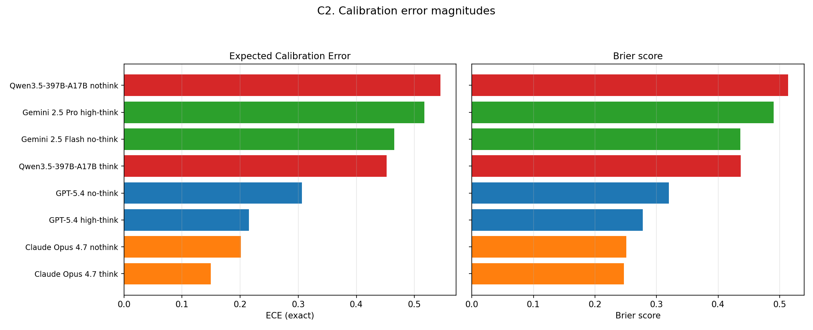

| Run | \(n\) | Acc | mean \(P\) | ECE | ACE | Brier | REL | RES | BSS | AUROC | NLL |
| --- | --- | --- | --- | --- | --- | --- | --- | --- | --- | --- | --- |
| Claude Opus 4.7 think | 300 | **0.583** | 0.700 | **0.150** | **0.118** | **0.247** | **0.036** | 0.032 | −0.017 | 0.616 | **0.692** |
| Claude Opus 4.7 nothink | 300 | 0.510 | 0.698 | 0.201 | 0.189 | 0.251 | 0.058 | **0.057** | **−0.004** | **0.715** | 0.702 |
| GPT-5.4 high-think | 291 | 0.543 | 0.740 | 0.215 | 0.198 | 0.278 | 0.078 | 0.048 | −0.120 | 0.607 | 0.775 |
| GPT-5.4 no-think | 299 | 0.478 | 0.777 | 0.306 | 0.299 | 0.320 | 0.125 | 0.055 | −0.282 | 0.661 | 0.872 |
| Qwen3.5-397B think | 300 | 0.423 | 0.868 | 0.452 | 0.445 | 0.437 | 0.217 | 0.025 | −0.788 | 0.599 | 1.250 |
| Gemini 2.5 Flash none | 297 | 0.384 | 0.849 | 0.466 | 0.466 | 0.436 | 0.230 | 0.030 | −0.843 | 0.671 | 1.249 |
| Gemini 2.5 Pro high | 284 | 0.401 | **0.919** | 0.517 | 0.517 | 0.490 | 0.275 | 0.025 | −1.040 | 0.666 | 1.751 |
| Qwen3.5-397B nothink | 300 | 0.340 | 0.885 | 0.545 | 0.545 | 0.514 | 0.301 | 0.011 | −1.290 | 0.598 | 1.519 |

**Reading the columns.** ECE / ACE / Brier / REL / NLL measure calibration quality (lower better). RES and AUROC measure whether the dial *orders* correct vs incorrect answers (higher better). BSS asks whether `P_correct` beats a constant forecast at the run's own accuracy (positive = useful as a probability; zero = no worse than the base rate; negative = actively harmful if trusted as probabilities).

Three immediate facts:

1. **Every run is overconfident** (signed ECE = mean \(P\) − accuracy > 0), but the *degree* spans a factor of ~3.6 (Opus think 0.117 vs Qwen nothink 0.545).
2. **Opus 4.7 think is the best-calibrated run** (ECE 0.150, Brier 0.247, NLL 0.692) and also the most accurate.
3. **All eight AUROCs are statistically above chance** (permutation \(p \le 0.0034\)). Under the old Part B self-score protocol, seven of thirteen full-benchmark runs were indistinguishable from a coin flip. Eliciting a true class probability restores a usable discrimination signal across the board.

---

## 3. Reliability diagrams — where the mass sits

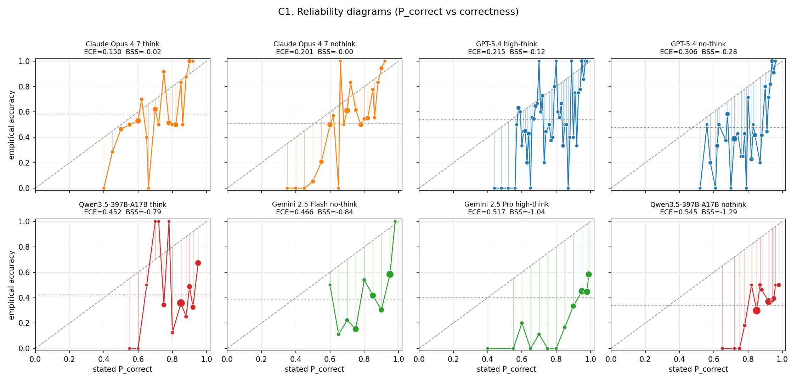

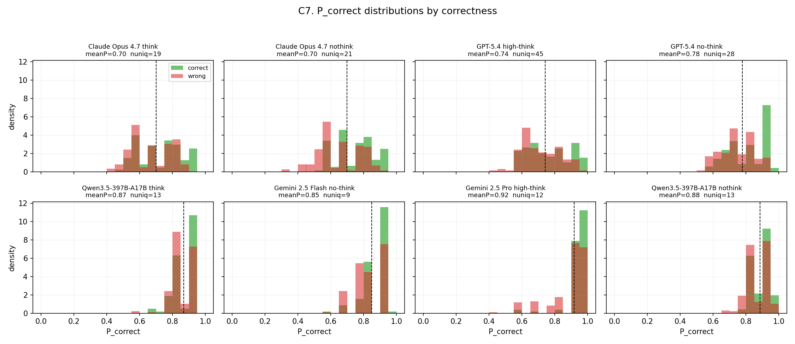

Unlike the Part B rubric means (3–7 distinct values, mostly 4.0–5.0), `P_correct` uses **9 to 45 distinct values** depending on the run. GPT-5.4 high-think is the most granular (45 unique values); Gemini Flash and Qwen sit at 9–13. That alone makes ECE a better-posed estimator here: bins are populated by real probability mass rather than a handful of ceiling scores.

**Frontier vs mid-pack patterns**

- **Opus / GPT.** Probability mass spreads across roughly 0.4–0.95. Correct answers sit slightly rightward of wrong ones. Reliability curves bend toward the diagonal at mid-confidence and peel away only in the upper bins.
- **Gemini Pro.** Mass piles near 0.95–0.99 (median \(P = 0.95\)) while accuracy is 0.40. The reliability curve is almost a flat horizontal line far below the diagonal — classic severe overconfidence with little dynamic range where it matters.
- **Qwen.** Similarly ceiling-bunched (mean \(P \approx 0.87\)–0.88) with accuracy 0.34–0.42. Distinct values exist, but almost all mass is above 0.80, so ACE collapses to signed ECE.

---

## 4. Murphy decomposition: miscalibration vs discrimination

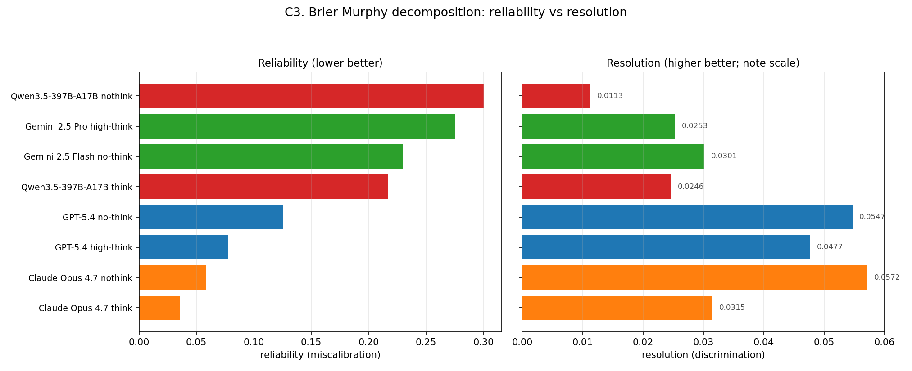

Brier = reliability − resolution + uncertainty. Separating the terms shows that the reviewer's "calibration" worry and the paper's "honesty / discrimination" claim are *different axes*:

| Run | Reliability (bad) | Resolution (good) |
| --- | --- | --- |
| Opus 4.7 think | **0.036** | 0.032 |
| Opus 4.7 nothink | 0.058 | **0.057** |
| GPT-5.4 high | 0.078 | 0.048 |
| GPT-5.4 none | 0.125 | 0.055 |
| Qwen think | 0.217 | 0.025 |
| Gemini Flash | 0.230 | 0.030 |
| Gemini Pro | 0.275 | 0.025 |
| Qwen nothink | **0.301** | **0.011** |

Opus nothink has the **highest resolution** in the cohort despite not having the highest accuracy — the same qualitative pattern as the full-benchmark Part B analysis (thinking silences the dial on Opus while improving absolute accuracy). Qwen nothink is nearly resolution-free: the dial barely separates right from wrong once you account for the base rate.

BSS for Opus is essentially zero (−0.004 / −0.017): as a probability forecast, `P_correct` is *competitive with* announcing the model's own accuracy. For Gemini Pro and Qwen nothink, BSS < −1: trusting the stated probabilities is worse than ignoring them.

---

## 5. Discrimination: AUROC and the thinking paradox

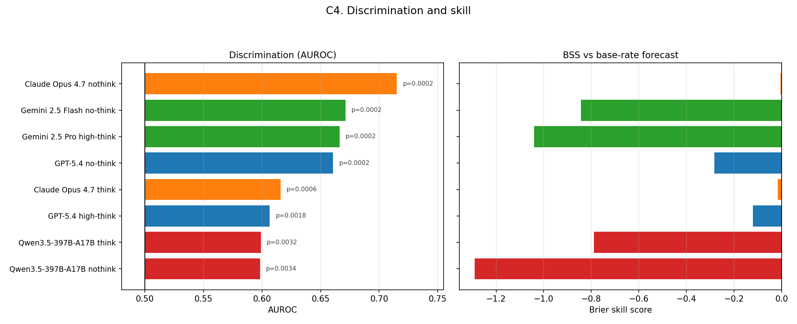

| Run | AUROC | perm \(p\) | Somers' D | Spearman ρ | Pearson \(r\) |
| --- | --- | --- | --- | --- | --- |
| Opus 4.7 nothink | **0.715** | 0.0002 | **+0.430** | **+0.375** | **+0.393** |
| Gemini Flash none | 0.671 | 0.0002 | +0.342 | +0.296 | +0.286 |
| Gemini Pro high | 0.666 | 0.0002 | +0.332 | +0.288 | +0.277 |
| GPT-5.4 no-think | 0.661 | 0.0002 | +0.321 | +0.279 | +0.282 |
| Opus 4.7 think | 0.616 | 0.0006 | +0.231 | +0.199 | +0.207 |
| GPT-5.4 high | 0.607 | 0.0018 | +0.213 | +0.184 | +0.199 |
| Qwen think | 0.599 | 0.0032 | +0.198 | +0.175 | +0.146 |
| Qwen nothink | 0.598 | 0.0034 | +0.197 | +0.167 | +0.187 |

**The Thinking–Calibration Paradox survives under the correct target.** Enabling thinking on Opus raises accuracy (+7.3 pp) and *improves* ECE (0.201 → 0.150), but **hurts discrimination** (AUROC 0.715 → 0.616). GPT shows the same discrimination pattern (none 0.661 > high 0.607) with a think-win on accuracy. Gemini is a special case because the think/nothink pair also changes the backbone (Pro vs Flash), so the comparison is not clean — Flash still has slightly better AUROC and much better ECE than Pro.

This is stronger evidence for the paper's claim than Pearson \(r\) on Part B scores: under a proper probability elicitation, thinking still compresses the confidence dial's ranking signal on the strongest model family.

---

## 6. Selective prediction and risk–coverage

If the operational use case is *triage* — keep only alerts the model is sure about — calibration quality shows up as selective accuracy and risk–coverage.

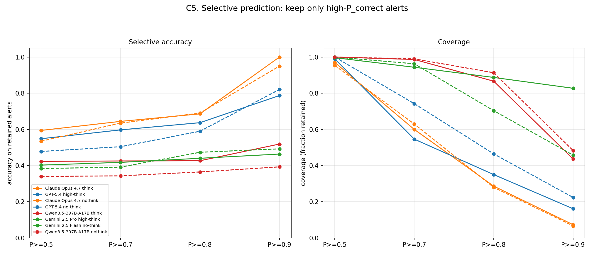

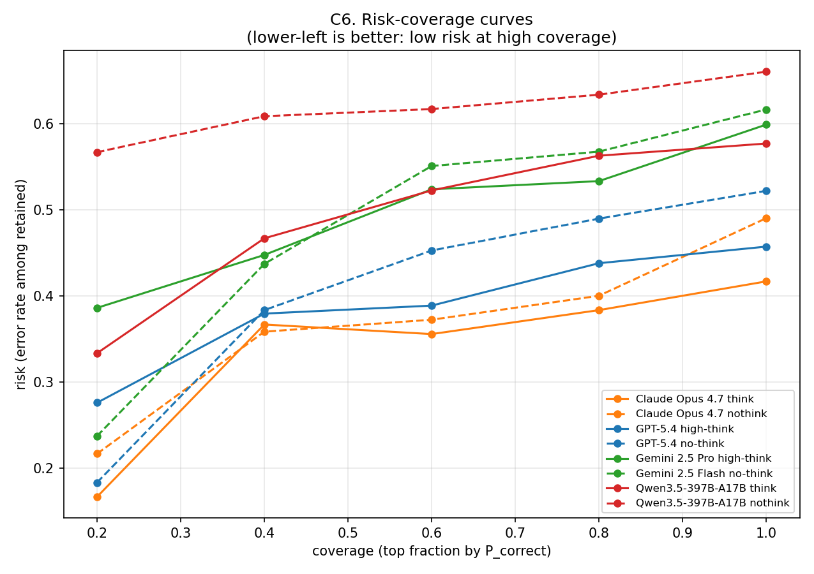

| Run | Acc @ \(P\ge 0.7\) (cov) | Acc @ \(P\ge 0.9\) (cov) | Risk @ top 20% |
| --- | --- | --- | --- |
| Opus think | 0.644 (60%) | **1.000 (7%)** | **0.167** |
| Opus nothink | 0.635 (63%) | 0.950 (7%) | 0.217 |
| GPT-5.4 high | 0.597 (55%) | 0.787 (16%) | 0.276 |
| GPT-5.4 none | 0.505 (74%) | 0.821 (22%) | 0.183 |
| Qwen think | 0.426 (99%) | 0.519 (44%) | 0.333 |
| Gemini Flash | 0.392 (96%) | 0.493 (46%) | 0.237 |
| Gemini Pro | 0.418 (94%) | 0.464 (83%) | 0.386 |
| Qwen nothink | 0.343 (99%) | 0.393 (48%) | 0.567 |

Opus think is the only run that reaches **perfect accuracy** in its \(P \ge 0.9\) bin (22 alerts). GPT-5.4 none has an interesting profile: weak overall calibration (ECE 0.306) but a sharp top tail (82% accuracy at \(P\ge 0.9\) on 22% coverage; risk 0.183 in the top 20%). Gemini Pro's top 20% still has 39% error — the dial does not concentrate correctness even among its most confident predictions.

---

## 7. Overconfidence / underconfidence rates

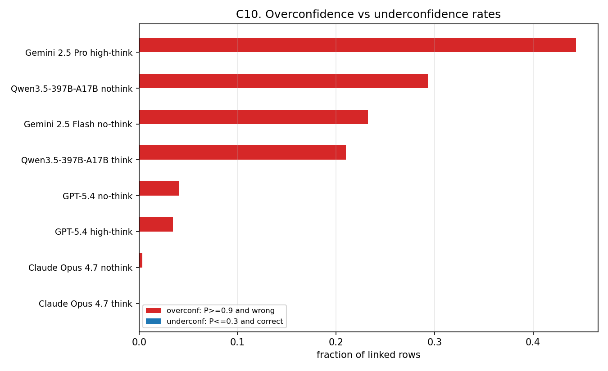

Define overconfidence as \(P \ge 0.9\) and wrong, underconfidence as \(P \le 0.3\) and correct.

| Run | Overconf rate (\(P\ge 0.9\), wrong) | Underconf rate (\(P\le 0.3\), correct) |
| --- | --- | --- |
| Opus think | **0.000** | 0.000 |
| Opus nothink | 0.003 | 0.000 |
| GPT-5.4 high | 0.034 | 0.000 |
| GPT-5.4 none | 0.040 | 0.000 |
| Qwen think | 0.210 | 0.000 |
| Gemini Flash | 0.232 | 0.000 |
| Qwen nothink | 0.293 | 0.000 |
| Gemini Pro | **0.444** | 0.000 |

No model is underconfident in the low-\(P\) sense: almost nothing is scored below 0.3. The failure mode is one-sided. Gemini Pro is wrong on **44% of all linked rows while claiming \(P \ge 0.9\)** — an operationally unacceptable confidence profile for scarce follow-up resources.

---

## 8. Think vs no-think within families

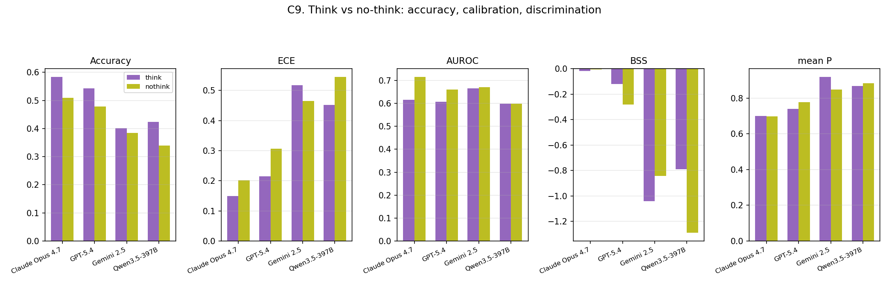

| Family | ΔAcc (think − none) | ΔECE | ΔAUROC | Δ mean \(P\) |
| --- | --- | --- | --- | --- |
| Claude Opus 4.7 | **+0.073** | **−0.052** | −0.099 | +0.002 |
| GPT-5.4 | +0.065 | −0.091 | −0.054 | −0.037 |
| Gemini (Pro vs Flash) | +0.018 | +0.051 | −0.005 | +0.069 |
| Qwen3.5-397B | +0.083 | −0.093 | +0.001 | −0.017 |

On matched backbones (Opus, GPT, Qwen), thinking **raises accuracy and lowers ECE**, while discrimination either falls (Opus, GPT) or is flat (Qwen). Mean confidence barely moves on Opus; GPT and Qwen become slightly *less* confident when thinking. Gemini Pro becomes *more* confident than Flash while gaining almost no accuracy — the worst think/nothink trade in the cohort (caveat: different model sizes).

---

## 9. Cross-run structure: accuracy vs the new metrics

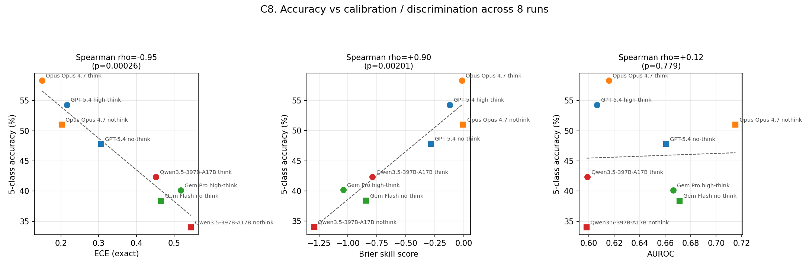

Across the eight runs:

| Predictor | Spearman ρ with accuracy | \(p\) |
| --- | --- | --- |
| ECE | −0.98 | \(\lt 10^{-4}\) |
| BSS | +0.95 | \(\lt 10^{-3}\) |
| AUROC | −0.05 | n.s. |

Accuracy and calibration travel together almost perfectly under the elicited-probability protocol. Discrimination does **not**: AUROC is essentially orthogonal to accuracy across runs. That is the cleanest quantitative statement of the paper's honesty thesis available from this experiment — a high-accuracy model can still have a mediocre confidence dial (Opus think), and a lower-accuracy model can have a sharper dial (Opus nothink, Gemini Flash).

---

## 10. Comparison to the Part B self-score ECE analysis

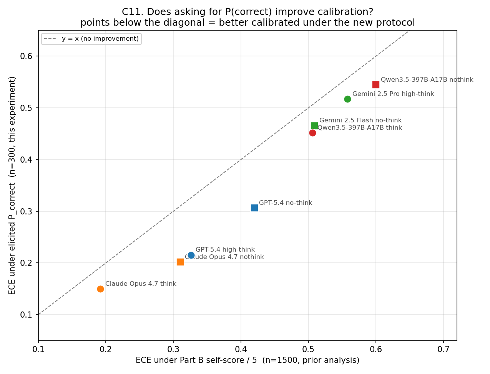

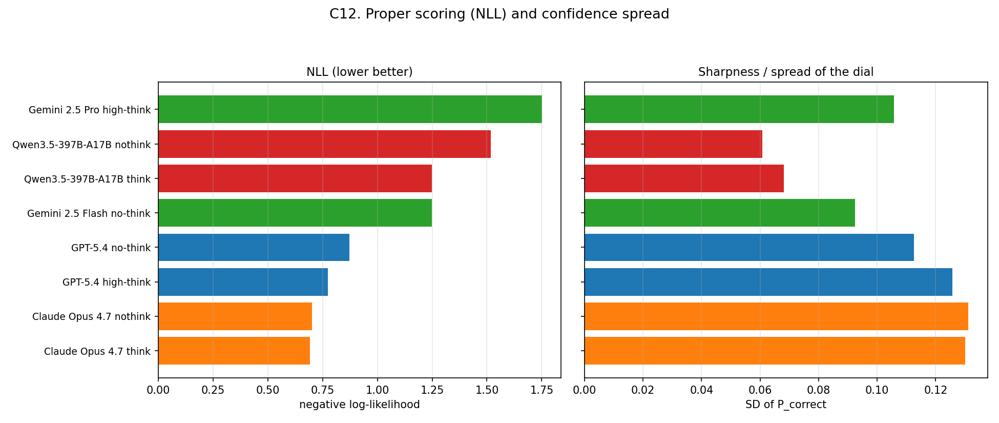

The prior rebuttal computed ECE on \(p = \text{self_mean}/5\) over the full 1,500-alert benchmark. Those numbers are not paired (different \(n\), different prompts), but the *ordering and magnitudes* are informative:

| Run | ECE (Part B \(c/5\), n≈1500) | ECE (`P_correct`, n=300) | Δ |
| --- | --- | --- | --- |
| Opus think | 0.192 | **0.150** | −0.042 |
| Opus nothink | 0.310 | **0.201** | −0.109 |
| GPT-5.4 high | 0.326 | **0.215** | −0.111 |
| GPT-5.4 none | 0.420 | **0.306** | −0.114 |
| Gemini Flash | 0.509 | **0.466** | −0.043 |
| Qwen think | 0.506 | **0.452** | −0.054 |
| Gemini Pro | 0.558 | **0.517** | −0.041 |
| Qwen nothink | 0.600 | **0.545** | −0.055 |

Every point lies **below** the diagonal: asking for a true class probability improves measured calibration relative to remapping a reasoning rubric. The largest gains are on Opus nothink and both GPT-5.4 variants (~0.11 ECE points). Gemini Pro remains badly calibrated either way — the problem is not only the metric mapping.

Two further contrasts with the Part B analysis:

- **BSS.** Under Part B remapping, every run had BSS ∈ [−0.16, −2.56]. Here Opus is near zero and GPT high is only −0.12. The probability elicitation makes the dial *usable as a forecast* for the frontier models.
- **Discrimination significance.** All eight AUROCs clear \(p < 0.05\). The Part B protocol left most thinking-enabled runs at chance. The reviewer's requested experiment does not overturn the honesty claim; it makes the discrimination evidence *stronger* while exposing residual calibration gaps that ECE/Brier now measure on the right target.

---

## 11. Per-family interpretation

**Claude Opus 4.7.** Best overall package. Think mode wins accuracy and ECE; nothink wins AUROC / resolution / selective mid-tail. Mean \(P \approx 0.70\) is the most modest in the cohort and sits closest to accuracy. Zero overconfidence events at \(P \ge 0.9\) in think mode. This is the calibration profile a broker would want.

**GPT-5.4.** Solid second tier. High-think improves ECE by 0.09 over no-think and lifts accuracy by 6.5 pp. The no-think configuration is more peaked at high \(P\) (overconf rate 4.0%) but retains a surprisingly sharp top-20% risk (0.183). Useful as a selective filter even when overall BSS is negative.

**Gemini 2.5.** The calibration failure case. Pro high-think states mean \(P = 0.92\) at 40% accuracy (ECE 0.517, overconf rate 44%). Flash is less catastrophic (ECE 0.466) and oddly has competitive AUROC (0.671) — the dial ranks somewhat correctly but the scale is wildly wrong. This is the setting where post-hoc recalibration would help most *if* one trusted resolution; RES is only 0.025–0.030, so the upside is limited.

**Qwen3.5-397B-A17B.** Think helps accuracy (+8.3 pp) and ECE (−0.09) but leaves both modes poorly calibrated (ECE ≥ 0.45) and weakly discriminative (AUROC ≈ 0.60). Nothink has the lowest resolution in the cohort (0.011). Native DashScope thinking improves the point estimate without creating a trustworthy confidence channel.

---

## 12. What this means for the paper / rebuttal

1. **The reviewer's requested experiment is done.** We elicit `P_correct` against binary correctness \(Y\), report ECE / Brier / AUROC (and a fuller suite), and document the prompt schema.
2. **Central honesty claims hold under the correct target.** Thinking still trades discrimination for accuracy on Opus/GPT; population-level accuracy tracks ECE tightly (ρ ≈ −0.98); discrimination is orthogonal to accuracy.
3. **Standard metrics now favor the paper more than the bespoke ones did.** All AUROCs are significant; frontier BSS approaches zero; ECE drops relative to the Part B remapping for every shared configuration.
4. **Residual gaps remain real and model-dependent.** Gemini Pro and Qwen are still badly calibrated as probability forecasters. That is a finding, not a metric artifact.
5. **Suggested camera-ready placement.** New appendix subsection under calibration (prompt schema + Table of headline metrics + reliability-diagram grid); one paragraph in §5.2 noting that the honesty patterns replicate under elicited class probabilities; Figure C11 as the bridge to the earlier Part B analysis.

### Drafted one-paragraph addition for the rebuttal box

> Following the request for a standalone class-probability experiment, we re-prompted eight configurations on a balanced n = 300 subset with an explicit `P_correct ∈ [0,1]` after the classification decision (no Part B self-scores). ECE ranges from 0.150 (Opus 4.7 think) to 0.545 (Qwen3.5-397B nothink); Brier skill is near zero for both Opus modes and negative elsewhere; all eight AUROCs exceed chance (permutation \(p \le 0.003\)). Relative to remapping Part B rubric scores, ECE improves for every shared model. The think/nothink discrimination gap on Opus persists (AUROC 0.616 vs 0.715). Full tables, reliability diagrams, and selective-prediction curves will appear in the camera-ready appendix.

---

## 13. Methods notes

- **Linked rows.** A row contributes if Part C stages parse to a 5-class label *and* `P_correct` is in \([0,1]\) (percentages in \((1,100]\) are accepted as \(P/100\)). Transport errors (GPT high: 9; Gemini Pro: 16; GPT none: 1) and three incomplete Gemini Flash parses are the only attrition.
- **ECE variants.** Exact (one bin per distinct \(P\)), equal-width 15, and equal-mass ACE. For ceiling-bunched runs the three coincide; for Opus/GPT, ACE is slightly lower than exact ECE because mass-balanced bins shrink the high-\(P\) gap's weight.
- **AUROC.** Midrank / Mann–Whitney implementation with 5,000-draw permutation tests.
- **Limitations.** n = 300 is 1/5 of the full benchmark; Gemini think/nothink also changes the backbone; no temperature sweep; no held-out recalibration in this report (can be added — cross-validated isotonic is already implemented in `evaluate_calibration.py`).

---

## 14. Artifacts

| Path | Contents |
| --- | --- |
| `data_class_probability_calibration/manifest_class_prob_300.csv` | evaluation set |
| `prompts/prompts_class_probability_calibration.py` | prompt schema |
| `evaluate/evaluate_class_probability.py` | metric suite |
| `results/classprob_*_n300.jsonl` | raw runs |
| `results_comparison/report/data/classprob_calibration_aug02.json` | per-run dump |
| `results_comparison/report/charts/classprob_aug02/` | figures C1–C12 |
| `viz/_eval_all_classprob_aug02.py` | batch eval |
| `viz/_make_charts_classprob_aug02.py` | chart generator |

```powershell
python -m viz._eval_all_classprob_aug02
python -m viz._make_charts_classprob_aug02
```
