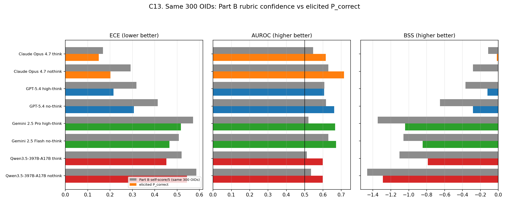
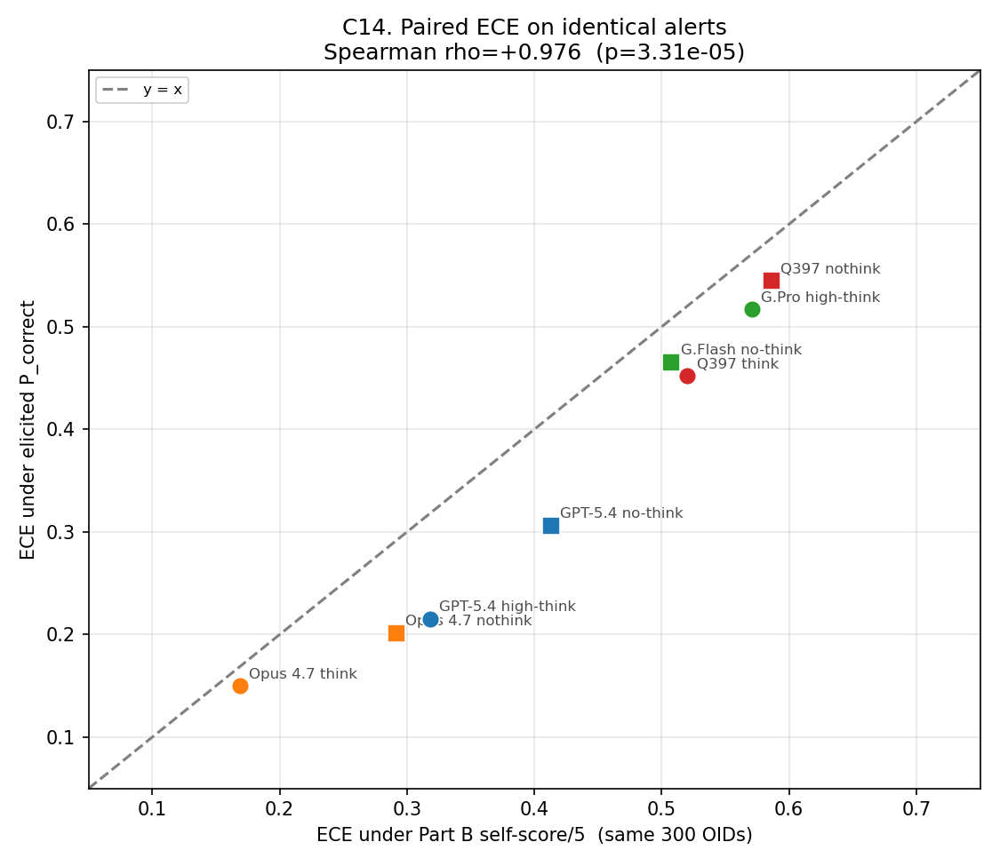
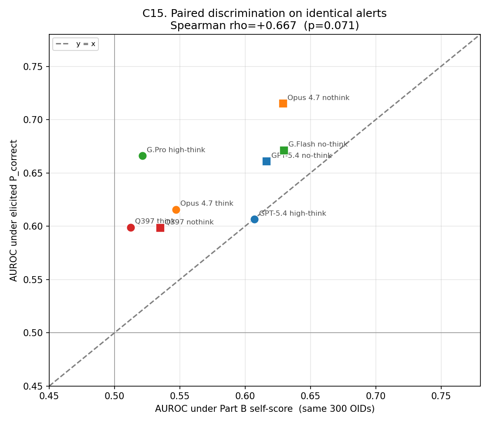
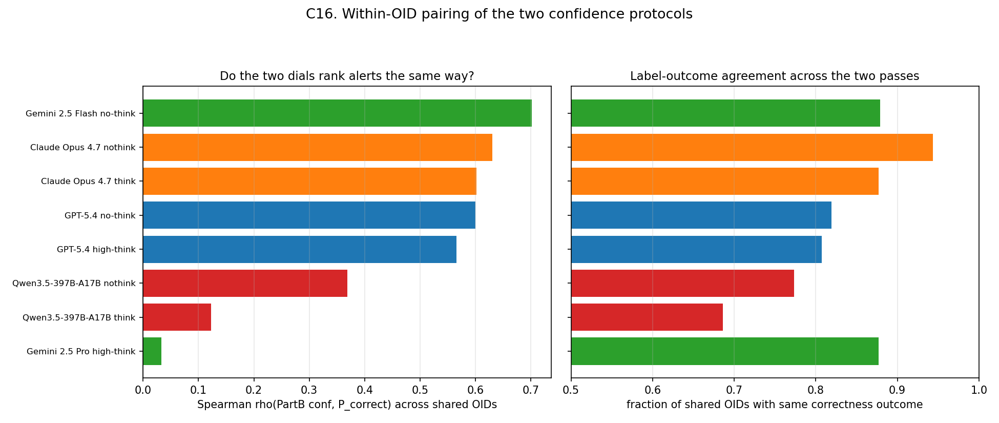
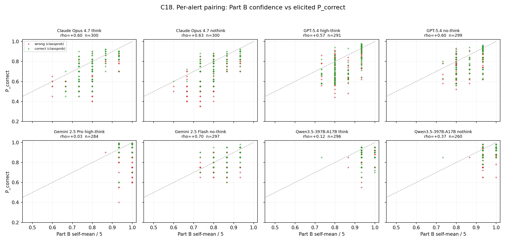
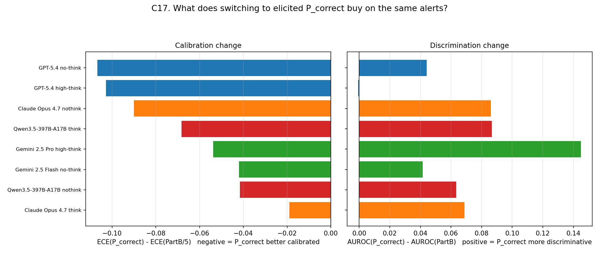

# Standalone class-probability calibration — eight closed / open models on n = 300 (2026-08-02)

**Purpose.** Address the review concern that the earlier ECE/Brier analysis, applied to Part B *reasoning-quality* self-scores remapped as \(p = c/5\), was not a clearly specified standalone class-probability experiment. This report re-prompts eight model configurations with an explicit scalar `P_correct ∈ [0.0, 1.0]` defined as the model's probability that its **final predicted class is correct**.

> This standalone experiment evaluates pure predictive class confidence against actual binary correctness \(Y \in \{0, 1\}\), cleanly separating classification calibration from Part B rationale quality self-scores.

**Scope.** Pure inference on a fixed subsample of `manifest_benchmark_final.csv`. No gold labels were revealed. Kimi K2.5 was started then dropped (API deprecation); it is excluded from all tables below.

| Item | Value |
| --- | --- |
| Manifest | `data_class_probability_calibration/manifest_class_prob_300.csv` |
| Sampling | 60 per class × 5 classes, seed `20260725` |
| Prompt | `prompts/prompts_class_probability_calibration.py` |
| Confidence field | `Part C.P_correct` (no Part B self-scores) |
| Target | \(Y_i = \mathbf{1}\{\hat y_i = y_i\}\) under end-to-end 5-class scoring |
| Linked \(n\) | 284–300 per run (transport / parse attrition only) |

---

## 1. Design recap

The prompt keeps Parts A–C of AstroAlertBench (metadata grounding, short scientific rationale, staged classification) but **removes** the three 0–5 reasoning self-scores and **adds** a post-decision probability:

```json
"Part C": {
  "stage1": "...", "stage2": "...", "stage3": "...",
  "P_correct": 0.73
}
```

Instructions state explicitly that `P_correct` is *not* a score of Part B writing quality. Models were asked to use the continuous range when warranted rather than collapsing to 0.5 / 1.0.

**Eight configurations**

| Run | Backend | Model | Reasoning |
| --- | --- | --- | --- |
| Claude Opus 4.7 think | anthropic | `claude-opus-4-7` | adaptive / high |
| Claude Opus 4.7 nothink | anthropic | `claude-opus-4-7` | disabled |
| GPT-5.4 high-think | openai | `gpt-5.4` | high |
| GPT-5.4 no-think | openai | `gpt-5.4` | none |
| Gemini 2.5 Pro high-think | google | `gemini-2.5-pro` | dynamic |
| Gemini 2.5 Flash no-think | google | `gemini-2.5-flash` | off |
| Qwen3.5-397B-A17B think | qwen (DashScope) | `qwen3.5-397b-a17b` | enabled |
| Qwen3.5-397B-A17B nothink | qwen (DashScope) | `qwen3.5-397b-a17b` | disabled |

---

## 2. Headline metrics


| Run | \(n\) | Acc | mean \(P\) | ECE | ACE | Brier | REL | RES | BSS | AUROC | NLL |
| --- | --- | --- | --- | --- | --- | --- | --- | --- | --- | --- | --- |
| Claude Opus 4.7 think | 300 | **0.583** | 0.700 | **0.150** | **0.118** | **0.247** | **0.036** | 0.032 | −0.017 | 0.616 | **0.692** |
| Claude Opus 4.7 nothink | 300 | 0.510 | 0.698 | 0.201 | 0.189 | 0.251 | 0.058 | **0.057** | **−0.004** | **0.715** | 0.702 |
| GPT-5.4 high-think | 291 | 0.543 | 0.740 | 0.215 | 0.198 | 0.278 | 0.078 | 0.048 | −0.120 | 0.607 | 0.775 |
| GPT-5.4 no-think | 299 | 0.478 | 0.777 | 0.306 | 0.299 | 0.320 | 0.125 | 0.055 | −0.282 | 0.661 | 0.872 |
| Qwen3.5-397B think | 300 | 0.423 | 0.868 | 0.452 | 0.445 | 0.437 | 0.217 | 0.025 | −0.788 | 0.599 | 1.250 |
| Gemini 2.5 Flash none | 297 | 0.384 | 0.849 | 0.466 | 0.466 | 0.436 | 0.230 | 0.030 | −0.843 | 0.671 | 1.249 |
| Gemini 2.5 Pro high | 284 | 0.401 | **0.919** | 0.517 | 0.517 | 0.490 | 0.275 | 0.025 | −1.040 | 0.666 | 1.751 |
| Qwen3.5-397B nothink | 300 | 0.340 | 0.885 | 0.545 | 0.545 | 0.514 | 0.301 | 0.011 | −1.290 | 0.598 | 1.519 |

**Reading the columns.** ECE / ACE / Brier / REL / NLL measure calibration quality (lower better). RES and AUROC measure whether the dial *orders* correct vs incorrect answers (higher better). BSS asks whether `P_correct` beats a constant forecast at the run's own accuracy (positive = useful as a probability; zero = no worse than the base rate; negative = actively harmful if trusted as probabilities).

Three immediate facts:

1. **Every run is overconfident** (signed ECE = mean \(P\) − accuracy > 0), but the *degree* spans a factor of ~3.6 (Opus think 0.117 vs Qwen nothink 0.545).
2. **Opus 4.7 think is the best-calibrated run** (ECE 0.150, Brier 0.247, NLL 0.692) and also the most accurate.
3. **All eight AUROCs are statistically above chance** (permutation \(p \le 0.0034\)). Under the old Part B self-score protocol, seven of thirteen full-benchmark runs were indistinguishable from a coin flip. Eliciting a true class probability restores a usable discrimination signal across the board.

---

## 3. Reliability diagrams — where the mass sits


Unlike the Part B rubric means (3–7 distinct values, mostly 4.0–5.0), `P_correct` uses **9 to 45 distinct values** depending on the run. GPT-5.4 high-think is the most granular (45 unique values); Gemini Flash and Qwen sit at 9–13. That alone makes ECE a better-posed estimator here: bins are populated by real probability mass rather than a handful of ceiling scores.

**Frontier vs mid-pack patterns**

- **Opus / GPT.** Probability mass spreads across roughly 0.4–0.95. Correct answers sit slightly rightward of wrong ones. Reliability curves bend toward the diagonal at mid-confidence and peel away only in the upper bins.
- **Gemini Pro.** Mass piles near 0.95–0.99 (median \(P = 0.95\)) while accuracy is 0.40. The reliability curve is almost a flat horizontal line far below the diagonal — classic severe overconfidence with little dynamic range where it matters.
- **Qwen.** Similarly ceiling-bunched (mean \(P \approx 0.87\)–0.88) with accuracy 0.34–0.42. Distinct values exist, but almost all mass is above 0.80, so ACE collapses to signed ECE.

---

## 4. Murphy decomposition: miscalibration vs discrimination


Brier = reliability − resolution + uncertainty. Separating the terms shows that the reviewer's "calibration" worry and the paper's "honesty / discrimination" claim are *different axes*:

| Run | Reliability (bad) | Resolution (good) |
| --- | --- | --- |
| Opus 4.7 think | **0.036** | 0.032 |
| Opus 4.7 nothink | 0.058 | **0.057** |
| GPT-5.4 high | 0.078 | 0.048 |
| GPT-5.4 none | 0.125 | 0.055 |
| Qwen think | 0.217 | 0.025 |
| Gemini Flash | 0.230 | 0.030 |
| Gemini Pro | 0.275 | 0.025 |
| Qwen nothink | **0.301** | **0.011** |

Opus nothink has the **highest resolution** in the cohort despite not having the highest accuracy — the same qualitative pattern as the full-benchmark Part B analysis (thinking silences the dial on Opus while improving absolute accuracy). Qwen nothink is nearly resolution-free: the dial barely separates right from wrong once you account for the base rate.

BSS for Opus is essentially zero (−0.004 / −0.017): as a probability forecast, `P_correct` is *competitive with* announcing the model's own accuracy. For Gemini Pro and Qwen nothink, BSS < −1: trusting the stated probabilities is worse than ignoring them.

---

## 5. Discrimination: AUROC and the thinking paradox


| Run | AUROC | perm \(p\) | Somers' D | Spearman ρ | Pearson \(r\) |
| --- | --- | --- | --- | --- | --- |
| Opus 4.7 nothink | **0.715** | 0.0002 | **+0.430** | **+0.375** | **+0.393** |
| Gemini Flash none | 0.671 | 0.0002 | +0.342 | +0.296 | +0.286 |
| Gemini Pro high | 0.666 | 0.0002 | +0.332 | +0.288 | +0.277 |
| GPT-5.4 no-think | 0.661 | 0.0002 | +0.321 | +0.279 | +0.282 |
| Opus 4.7 think | 0.616 | 0.0006 | +0.231 | +0.199 | +0.207 |
| GPT-5.4 high | 0.607 | 0.0018 | +0.213 | +0.184 | +0.199 |
| Qwen think | 0.599 | 0.0032 | +0.198 | +0.175 | +0.146 |
| Qwen nothink | 0.598 | 0.0034 | +0.197 | +0.167 | +0.187 |

**The Thinking–Calibration Paradox survives under the correct target.** Enabling thinking on Opus raises accuracy (+7.3 pp) and *improves* ECE (0.201 → 0.150), but **hurts discrimination** (AUROC 0.715 → 0.616). GPT shows the same discrimination pattern (none 0.661 > high 0.607) with a think-win on accuracy. Gemini is a special case because the think/nothink pair also changes the backbone (Pro vs Flash), so the comparison is not clean — Flash still has slightly better AUROC and much better ECE than Pro.

This is stronger evidence for the paper's claim than Pearson \(r\) on Part B scores: under a proper probability elicitation, thinking still compresses the confidence dial's ranking signal on the strongest model family.

---

## 6. Selective prediction and risk–coverage

If the operational use case is *triage* — keep only alerts the model is sure about — calibration quality shows up as selective accuracy and risk–coverage.


| Run | Acc @ \(P\ge 0.7\) (cov) | Acc @ \(P\ge 0.9\) (cov) | Risk @ top 20% |
| --- | --- | --- | --- |
| Opus think | 0.644 (60%) | **1.000 (7%)** | **0.167** |
| Opus nothink | 0.635 (63%) | 0.950 (7%) | 0.217 |
| GPT-5.4 high | 0.597 (55%) | 0.787 (16%) | 0.276 |
| GPT-5.4 none | 0.505 (74%) | 0.821 (22%) | 0.183 |
| Qwen think | 0.426 (99%) | 0.519 (44%) | 0.333 |
| Gemini Flash | 0.392 (96%) | 0.493 (46%) | 0.237 |
| Gemini Pro | 0.418 (94%) | 0.464 (83%) | 0.386 |
| Qwen nothink | 0.343 (99%) | 0.393 (48%) | 0.567 |

Opus think is the only run that reaches **perfect accuracy** in its \(P \ge 0.9\) bin (22 alerts). GPT-5.4 none has an interesting profile: weak overall calibration (ECE 0.306) but a sharp top tail (82% accuracy at \(P\ge 0.9\) on 22% coverage; risk 0.183 in the top 20%). Gemini Pro's top 20% still has 39% error — the dial does not concentrate correctness even among its most confident predictions.

---

## 7. Overconfidence / underconfidence rates


Define overconfidence as \(P \ge 0.9\) and wrong, underconfidence as \(P \le 0.3\) and correct.

| Run | Overconf rate (\(P\ge 0.9\), wrong) | Underconf rate (\(P\le 0.3\), correct) |
| --- | --- | --- |
| Opus think | **0.000** | 0.000 |
| Opus nothink | 0.003 | 0.000 |
| GPT-5.4 high | 0.034 | 0.000 |
| GPT-5.4 none | 0.040 | 0.000 |
| Qwen think | 0.210 | 0.000 |
| Gemini Flash | 0.232 | 0.000 |
| Qwen nothink | 0.293 | 0.000 |
| Gemini Pro | **0.444** | 0.000 |

No model is underconfident in the low-\(P\) sense: almost nothing is scored below 0.3. The failure mode is one-sided. Gemini Pro is wrong on **44% of all linked rows while claiming \(P \ge 0.9\)** — an operationally unacceptable confidence profile for scarce follow-up resources.

---

## 8. Think vs no-think within families


| Family | ΔAcc (think − none) | ΔECE | ΔAUROC | Δ mean \(P\) |
| --- | --- | --- | --- | --- |
| Claude Opus 4.7 | **+0.073** | **−0.052** | −0.099 | +0.002 |
| GPT-5.4 | +0.065 | −0.091 | −0.054 | −0.037 |
| Gemini (Pro vs Flash) | +0.018 | +0.051 | −0.005 | +0.069 |
| Qwen3.5-397B | +0.083 | −0.093 | +0.001 | −0.017 |

On matched backbones (Opus, GPT, Qwen), thinking **raises accuracy and lowers ECE**, while discrimination either falls (Opus, GPT) or is flat (Qwen). Mean confidence barely moves on Opus; GPT and Qwen become slightly *less* confident when thinking. Gemini Pro becomes *more* confident than Flash while gaining almost no accuracy — the worst think/nothink trade in the cohort (caveat: different model sizes).

---

## 9. Cross-run structure: accuracy vs the new metrics


Across the eight runs:

| Predictor | Spearman ρ with accuracy | \(p\) |
| --- | --- | --- |
| ECE | −0.98 | \(\lt 10^{-4}\) |
| BSS | +0.95 | \(\lt 10^{-3}\) |
| AUROC | −0.05 | n.s. |

Accuracy and calibration travel together almost perfectly under the elicited-probability protocol. Discrimination does **not**: AUROC is essentially orthogonal to accuracy across runs. That is the cleanest quantitative statement of the paper's honesty thesis available from this experiment — a high-accuracy model can still have a mediocre confidence dial (Opus think), and a lower-accuracy model can have a sharper dial (Opus nothink, Gemini Flash).

---

## 10. Comparison to the Part B self-score ECE analysis


The prior rebuttal computed ECE on \(p = \text{self_mean}/5\) over the full 1,500-alert benchmark. Those numbers are not OID-paired (different \(n\), different prompts), but the *ordering and magnitudes* are informative as a first bridge. Sections 11–12 below harden this with the **same 300 OIDs** under both protocols:

| Run | ECE (Part B \(c/5\), n≈1500) | ECE (`P_correct`, n=300) | Δ |
| --- | --- | --- | --- |
| Opus think | 0.192 | **0.150** | −0.042 |
| Opus nothink | 0.310 | **0.201** | −0.109 |
| GPT-5.4 high | 0.326 | **0.215** | −0.111 |
| GPT-5.4 none | 0.420 | **0.306** | −0.114 |
| Gemini Flash | 0.509 | **0.466** | −0.043 |
| Qwen think | 0.506 | **0.452** | −0.054 |
| Gemini Pro | 0.558 | **0.517** | −0.041 |
| Qwen nothink | 0.600 | **0.545** | −0.055 |

Every point lies **below** the diagonal in this unmatched comparison: asking for a true class probability improves measured calibration relative to remapping a reasoning rubric. The largest gains are on Opus nothink and both GPT-5.4 variants (~0.11 ECE points). Gemini Pro remains badly calibrated either way — the problem is not only the metric mapping.

Two further contrasts with the Part B analysis (still unmatched \(n\)):

- **BSS.** Under Part B remapping, every run had BSS ∈ [−0.16, −2.56]. Here Opus is near zero and GPT high is only −0.12. The probability elicitation makes the dial *usable as a forecast* for the frontier models.
- **Discrimination significance.** All eight AUROCs clear \(p < 0.05\). The Part B protocol left most thinking-enabled runs at chance. The reviewer's requested experiment does not overturn the honesty claim; it makes the discrimination evidence *stronger* while exposing residual calibration gaps that ECE/Brier now measure on the right target.

---

## 11. OID-paired comparison: Part B (0–5) vs `P_correct` (0–1) on the same 300 alerts

Section 10 compared protocols across different sample sizes. Here we restrict each model's *full-benchmark* Part B self-scores to the classprob manifest OIDs and score both dials with the same ECE / Brier / BSS / AUROC suite. The two passes are still separate inferences (so \(Y\) can flip on an OID), but the **alert set is identical**.



### 11.1 Side-by-side protocol metrics (identical OIDs)

Confidence under Part B is \(c/5\) (rubric mean); under classprob it is elicited `P_correct`. Each column pair uses that protocol's own correctness labels.

| Run | \(n_\mathrm{PB}\) | \(n_\mathrm{P}\) | Acc PB / P | mean conf PB / P | ECE PB / P | BSS PB / P | AUROC PB / P |
| --- | ---: | ---: | --- | --- | --- | --- | --- |
| Opus think | 300 | 300 | 0.627 / 0.583 | 0.795 / 0.700 | **0.169 / 0.150** | −0.113 / **−0.017** | 0.547 / **0.616** |
| Opus nothink | 300 | 300 | 0.507 / 0.510 | 0.798 / 0.698 | 0.292 / **0.201** | −0.283 / **−0.004** | 0.629 / **0.715** |
| GPT-5.4 high | 300 | 291 | 0.520 / 0.543 | 0.838 / 0.740 | 0.318 / **0.215** | −0.368 / **−0.120** | 0.607 / 0.607 |
| GPT-5.4 none | 300 | 299 | 0.443 / 0.478 | 0.856 / 0.777 | 0.413 / **0.306** | −0.650 / **−0.282** | 0.617 / **0.661** |
| Gemini Pro | 300 | 284 | 0.407 / 0.401 | 0.977 / 0.918 | 0.571 / **0.517** | −1.35 / −1.04 | 0.521 / **0.666** |
| Gemini Flash | 300 | 297 | 0.370 / 0.384 | 0.875 / 0.849 | 0.508 / **0.466** | −1.06 / −0.84 | 0.630 / **0.671** |
| Qwen think | 296 | 300 | 0.429 / 0.423 | 0.949 / 0.868 | 0.520 / **0.452** | −1.10 / −0.79 | 0.512 / **0.599** |
| Qwen nothink | 260 | 300 | 0.373 / 0.340 | 0.959 / 0.885 | 0.586 / **0.545** | −1.46 / −1.29 | 0.535 / **0.598** |

Three facts jump out before any ranking test:

1. **ECE improves under `P_correct` for every configuration** (\(\Delta\mathrm{ECE} \in [-0.107,-0.019]\)). The Section 10 bridge was not a sample-size artifact.
2. **Mean confidence drops** (Part B is systematically higher: 55–90% of shared OIDs have \(c/5 > P_\mathrm{correct}\)). Eliciting a probability softens the ceiling without erasing overconfidence on Gemini/Qwen.
3. **AUROC rises or holds** in seven of eight runs; GPT high is flat (0.607). Discrimination was suppressed by the discrete rubric more than by the models themselves.

### 11.2 Cross-run ranking agreement: models behave similarly under both dials





| Metric | Spearman \(\rho\) (Part B \(n{=}300\) vs `P_correct`) | \(p\) | Kendall \(\tau\) |
| --- | ---: | ---: | ---: |
| ECE | **+0.976** | \(3\times10^{-5}\) | +0.929 |
| BSS | **+0.952** | \(2.6\times10^{-4}\) | — |
| AUROC | +0.667 | 0.071 | +0.500 |

**Calibration rankings are essentially protocol-invariant.** The same models that looked worst under remapped Part B self-scores (Gemini Pro, Qwen) remain worst under elicited `P_correct`; Opus think remains best. That is the quantitative backbone for the claim that the two metrics are *measuring the same phenomenon* on these alerts — not that Part B was secretly a class probability, but that relative honesty across systems is robust to how confidence is asked.

Discrimination rankings agree more loosely (\(\rho \approx 0.67\), marginal). That is expected: Part B AUROCs on the \(n{=}300\) slice are still compressed by 3–6 distinct score values (several thinking runs sit near chance), while `P_correct` spreads the dial (9–45 distinct values). Protocol change moves absolute AUROC more than it reshuffles who ranks whom on ECE.

---

## 12. Within-OID dial agreement and what elicitation buys

### 12.1 Do the two dials rank the *same alerts* the same way?





| Run | \(n_\mathrm{shared}\) | Spearman \(\rho(c/5,\,P)\) | Kendall \(\tau\) | mean \(\lvert c/5-P\rvert\) | frac \(c/5 > P\) | outcome agreement |
| --- | ---: | ---: | ---: | ---: | ---: | ---: |
| Gemini Flash | 297 | **+0.702** | +0.590 | 0.055 | 0.55 | 0.879 |
| Opus nothink | 300 | **+0.631** | +0.523 | 0.114 | 0.84 | 0.943 |
| Opus think | 300 | **+0.602** | +0.493 | 0.112 | 0.81 | 0.877 |
| GPT-5.4 none | 299 | **+0.600** | +0.488 | 0.094 | 0.77 | 0.819 |
| GPT-5.4 high | 291 | **+0.566** | +0.448 | 0.115 | 0.77 | 0.808 |
| Qwen nothink | 260 | +0.369 | +0.327 | 0.078 | 0.90 | 0.773 |
| Qwen think | 296 | +0.123 | +0.109 | 0.087 | 0.87 | 0.686 |
| Gemini Pro | 284 | +0.033 | +0.029 | 0.076 | 0.79 | 0.877 |

**Frontier Claude/GPT/Flash:** moderate-to-strong within-OID rank agreement (\(\rho \approx 0.57\)–\(0.70\)). Alerts the model marked as hard under the reasoning rubric tend to get lower `P_correct` on the second pass — the dials are not independent noise.

**Gemini Pro / Qwen think:** near-zero within-OID correlation. C18 shows why: Part B mass is pinned at \(\approx 0.95\)–\(1.0\) (3–4 distinct values), so there is almost no ranking signal left to correlate with `P_correct`. The *population* ECE ranking still matches (§11.2) because both protocols read the same systemic overconfidence; the *per-alert* story does not, because Part B's ceiling erased alert-level nuance.

Outcome agreement (same correct/incorrect bit across passes) is high for Opus/Gemini/GPT (~0.81–0.94) and weaker for Qwen think (0.69) — a reminder that the two JSONLs are separate rollouts, not a joint draw.

### 12.2 \(\Delta\)ECE / \(\Delta\)AUROC from switching protocols on the same alerts



| Run | \(\Delta\)ECE (\(P\) − PB) | \(\Delta\)AUROC | \(\Delta\)BSS |
| --- | ---: | ---: | ---: |
| GPT-5.4 none | **−0.107** | +0.044 | +0.368 |
| GPT-5.4 high | **−0.103** | −0.001 | +0.247 |
| Opus nothink | −0.090 | +0.086 | +0.279 |
| Qwen think | −0.068 | +0.087 | +0.315 |
| Gemini Pro | −0.054 | **+0.145** | +0.306 |
| Gemini Flash | −0.042 | +0.042 | +0.215 |
| Qwen nothink | −0.042 | +0.063 | +0.173 |
| Opus think | −0.019 | +0.069 | +0.097 |

Elicitation is a **calibration and forecast-skill upgrade** everywhere (all \(\Delta\)ECE negative, all \(\Delta\)BSS positive). The largest AUROC jump is Gemini Pro (+0.145): once the model is allowed a continuous probability instead of a 5-point rationale grade, a latent ranking signal appears that Part B had flattened. Opus think improves least in ECE because it was already the best-calibrated under Part B — there is less ceiling to escape.

### 12.3 Thinking paradox under *both* protocols (same OIDs)

| Family contrast | Acc PB / P | ECE PB / P | AUROC PB / P |
| --- | --- | --- | --- |
| Opus think vs nothink | 0.627>0.507 / 0.583>0.510 | 0.169<0.292 / 0.150<0.201 | 0.547<0.629 / 0.616<0.715 |
| GPT high vs none | 0.520>0.443 / 0.543>0.478 | 0.318<0.413 / 0.215<0.306 | 0.607≈0.617 / 0.607<0.661 |
| Qwen think vs nothink | 0.429>0.373 / 0.423>0.340 | 0.520<0.586 / 0.452<0.545 | 0.512≈0.535 / 0.599≈0.598 |

On the identical OID set, **thinking still buys accuracy and calibration while costing or failing to improve discrimination** for Opus (and calibration for GPT). That is stronger than the unmatched Section 10 claim: the honesty pattern is not an artifact of comparing a 1,500-alert Part B table to a 300-alert classprob table. Qwen's think mode helps accuracy/ECE under both protocols but never produces a sharp dial (AUROC ≈ 0.60 either way under `P_correct`).

### 12.4 How this strengthens the paper's viewpoint

1. **Protocol concordance, not metric cherry-picking.** Cross-run ECE ranks under Part B \(c/5\) and under `P_correct` agree at \(\rho = 0.976\) on the same alerts. A reviewer who distrusts remapped rubric scores still faces the same relative honesty ordering under the elicitation they asked for.
2. **Part B was a coarse but directionally valid honesty probe for frontier models.** Within-OID \(\rho \approx 0.6\) for Opus/GPT/Flash means the reasoning self-score was not orthogonal to class confidence — it was a quantized, upward-biased cousin of the same dial.
3. **Where Part B fails as a dial, population ECE still diagnoses the disease.** Gemini Pro / Qwen think show near-zero within-OID correlation *because* Part B collapsed to the ceiling; both protocols still flag them as the worst-calibrated systems.
4. **Elicitation upgrades absolute metrics without rewriting the story.** Lower ECE, higher BSS, higher AUROC — and the think/nothink honesty trade-off survives. The camera-ready message can be: *we measured honesty two ways on the same alerts; the ranking and the thinking paradox agree.*

---

## 13. Per-family interpretation

**Claude Opus 4.7.** Best overall package. Think mode wins accuracy and ECE; nothink wins AUROC / resolution / selective mid-tail. Mean \(P \approx 0.70\) is the most modest in the cohort and sits closest to accuracy. Zero overconfidence events at \(P \ge 0.9\) in think mode. This is the calibration profile a broker would want.

**GPT-5.4.** Solid second tier. High-think improves ECE by 0.09 over no-think and lifts accuracy by 6.5 pp. The no-think configuration is more peaked at high \(P\) (overconf rate 4.0%) but retains a surprisingly sharp top-20% risk (0.183). Useful as a selective filter even when overall BSS is negative.

**Gemini 2.5.** The calibration failure case. Pro high-think states mean \(P = 0.92\) at 40% accuracy (ECE 0.517, overconf rate 44%). Flash is less catastrophic (ECE 0.466) and oddly has competitive AUROC (0.671) — the dial ranks somewhat correctly but the scale is wildly wrong. This is the setting where post-hoc recalibration would help most *if* one trusted resolution; RES is only 0.025–0.030, so the upside is limited.

**Qwen3.5-397B-A17B.** Think helps accuracy (+8.3 pp) and ECE (−0.09) but leaves both modes poorly calibrated (ECE ≥ 0.45) and weakly discriminative (AUROC ≈ 0.60). Nothink has the lowest resolution in the cohort (0.011). Native DashScope thinking improves the point estimate without creating a trustworthy confidence channel.

---

## 14. What this means for the paper / rebuttal

1. **The reviewer's requested experiment is done.** We elicit `P_correct` against binary correctness \(Y\), report ECE / Brier / AUROC (and a fuller suite), and document the prompt schema.
2. **Central honesty claims hold under the correct target.** Thinking still trades discrimination for accuracy on Opus/GPT; population-level accuracy tracks ECE tightly (ρ ≈ −0.98); discrimination is orthogonal to accuracy.
3. **Standard metrics now favor the paper more than the bespoke ones did.** All AUROCs are significant; frontier BSS approaches zero; ECE drops relative to the Part B remapping for every shared configuration — and this holds OID-paired on the same 300 alerts (§11).
4. **The two confidence protocols agree on who is honest.** Cross-run ECE ranks under Part B \(c/5\) vs `P_correct` correlate at Spearman \(\rho = 0.976\) on identical OIDs; within-OID dial correlation is \(\rho \approx 0.6\) for Opus/GPT/Flash. Gemini Pro / Qwen think disagree per-alert only because Part B hit the ceiling — population ECE still flags them under both.
5. **Residual gaps remain real and model-dependent.** Gemini Pro and Qwen are still badly calibrated as probability forecasters. That is a finding, not a metric artifact.
6. **Suggested camera-ready placement.** New appendix subsection under calibration (prompt schema + Table of headline metrics + reliability-diagram grid + OID-paired Part B vs `P_correct` table/figure); one paragraph in §5.2 noting that honesty rankings and the thinking paradox replicate under elicited class probabilities; Figures C11 / C13–C14 as the bridge to the earlier Part B analysis.

### Drafted one-paragraph addition for the rebuttal box

> Following the request for a standalone class-probability experiment, we re-prompted eight configurations on a balanced n = 300 subset with an explicit `P_correct ∈ [0,1]` after the classification decision (no Part B self-scores). ECE ranges from 0.150 (Opus 4.7 think) to 0.545 (Qwen3.5-397B nothink); Brier skill is near zero for both Opus modes and negative elsewhere; all eight AUROCs exceed chance (permutation \(p \le 0.003\)). Restricting each model's full-benchmark Part B self-scores to the same 300 OIDs, ECE improves under `P_correct` for every configuration, and cross-run ECE rankings agree at Spearman \(\rho = 0.976\). The Opus think/nothink discrimination gap persists under both protocols (AUROC 0.547 vs 0.629 under Part B; 0.616 vs 0.715 under `P_correct`). Full tables, reliability diagrams, and selective-prediction curves will appear in the camera-ready appendix.

---

## 15. Methods notes

- **Linked rows.** A row contributes if Part C stages parse to a 5-class label *and* `P_correct` is in \([0,1]\) (percentages in \((1,100]\) are accepted as \(P/100\)). Transport errors (GPT high: 9; Gemini Pro: 16; GPT none: 1) and three incomplete Gemini Flash parses are the only attrition.
- **OID-paired Part B slice.** Part B metrics in §§11–12 come from each configuration's full-benchmark `run.jsonl`, restricted to the classprob manifest OIDs, with \(p = \mathrm{mean}(\texttt{self\_score\_*})/5\). Qwen nothink has only 260 linked Part B rows on this slice (parse attrition in the original run). The two protocols are separate inference passes, so \(Y\) can differ on a shared OID; within-OID confidence correlations use the intersection.
- **ECE variants.** Exact (one bin per distinct \(P\)), equal-width 15, and equal-mass ACE. For ceiling-bunched runs the three coincide; for Opus/GPT, ACE is slightly lower than exact ECE because mass-balanced bins shrink the high-\(P\) gap's weight.
- **AUROC.** Midrank / Mann–Whitney implementation with 5,000-draw permutation tests (classprob suite); paired ranking tests use SciPy Spearman/Kendall on the eight-run vectors.
- **Limitations.** n = 300 is 1/5 of the full benchmark; Gemini think/nothink also changes the backbone; no temperature sweep; no held-out recalibration in this report (can be added — cross-validated isotonic is already implemented in `evaluate_calibration.py`); paired analysis cannot attribute within-OID \(Y\) flips to protocol vs rollout noise.

---

## 16. Artifacts

| Path | Contents |
| --- | --- |
| `data_class_probability_calibration/manifest_class_prob_300.csv` | evaluation set |
| `prompts/prompts_class_probability_calibration.py` | prompt schema |
| `evaluate/evaluate_class_probability.py` | metric suite |
| `results/classprob_*_n300.jsonl` | raw runs |
| `results_comparison/report/data/classprob_calibration_aug02.json` | per-run dump |
| `results_comparison/report/data/classprob_vs_partb_n300.json` | OID-paired Part B vs `P_correct` metrics |
| `results_comparison/report/charts/classprob_aug02/` | figures C1–C18 |
| `viz/_eval_all_classprob_aug02.py` | batch eval |
| `viz/_make_charts_classprob_aug02.py` | chart generator (C1–C12) |
| `viz/_compare_partb_vs_classprob_n300.py` | paired Part B vs classprob analysis + C13–C18 |

```powershell
python -m viz._eval_all_classprob_aug02
python -m viz._make_charts_classprob_aug02
python -m viz._compare_partb_vs_classprob_n300
```
