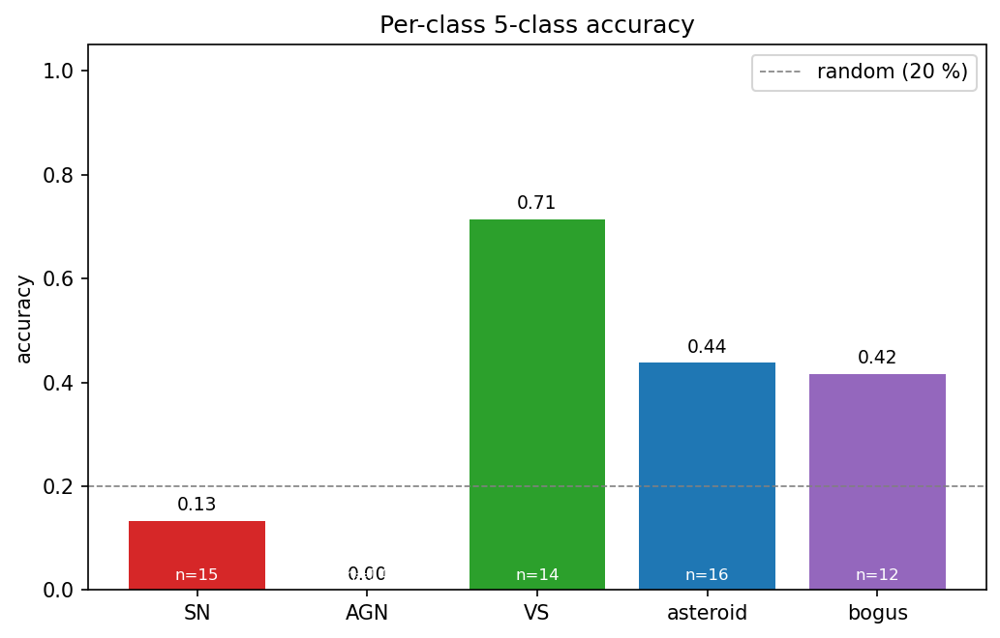
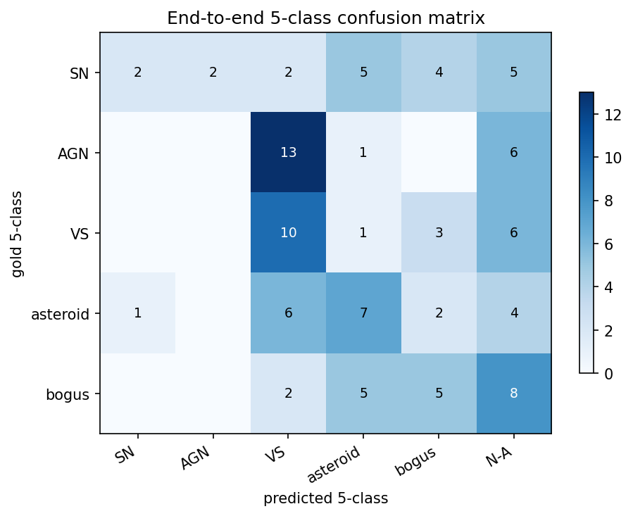
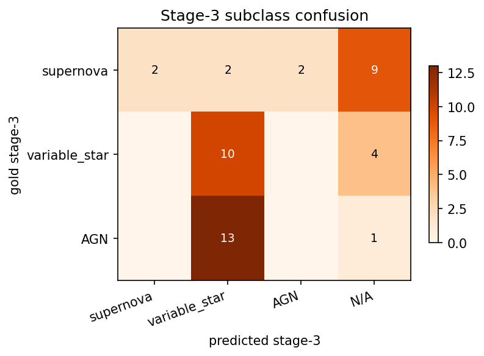
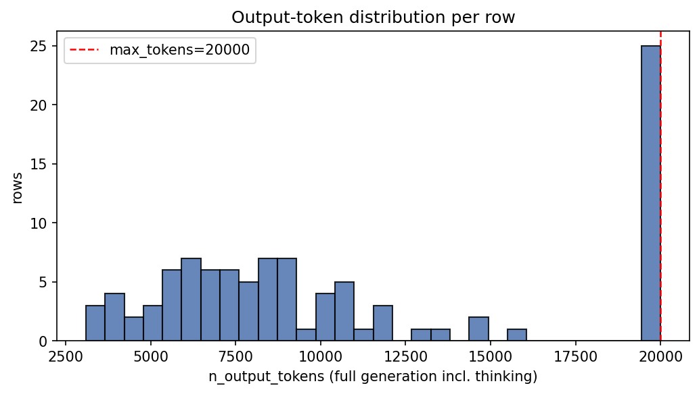
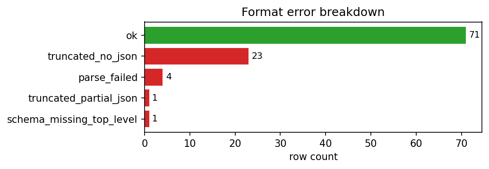
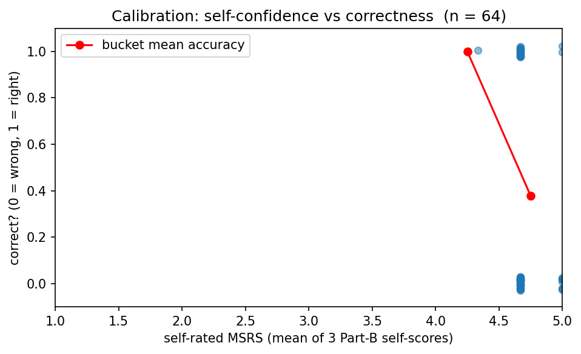

# Run report — Qwen/Qwen3.5-35B-A3B  (20260419-2047)

## Metadata
- **Run folder:** `20260419-2047-qwen35-35b-a3b-baseline`
- **Run timestamp:** 20260419-2047
- **Slug:** qwen35-35b-a3b-baseline
- **Status:** complete
- **Commit:** `8550e43`
- **Working tree dirty:** true
  - modified: runs/, viz/
- **Operator:** user

## Hypothesis

Establish a fresh Qwen3.5-35B-A3B baseline on the 100-datapoint few-shot set using the default `prompts` module, with the new error-categorization parser and per-row `n_output_tokens` / `truncated` tracking. Purpose: provide a control for the A/B comparison against `prompts_token_limit_instruction` and verify the new parser classifies format errors correctly for reasoning-model outputs. Expected outcome: ~30–35 % 5-class accuracy, ~70 % JSON parse rate, with `truncated_no_json` being the dominant format-error code.

## Baseline / Comparison

- **Compared to:** No prior `experiments/EXP-*.md` exists — this is the first logged run. The informal predecessor is `results/fewshot_qwen35_think.jsonl` (3-record sanity run earlier the same day).
- **What changed since the informal predecessor:**
  - JSONL now carries `error_category`, `value_errors`, `n_output_tokens`, `n_answer_tokens`, `truncated`, `max_tokens`.
  - `api_tinker.sample_vlm` now returns `raw_text` (full model output incl. thinking) **and** `answer_text` (post-thinking only), with a helper (`_extract_text_content`) that reads the cookbook renderer's structured parts list.
  - `effective_max` bumped 16 384 → 20 000 for reasoning renderers.
  - `prompts_new.py` renamed to `prompts.py` (the prior `prompts.py` was deleted).

## Configuration

| Field | Value |
|---|---|
| model | `Qwen/Qwen3.5-35B-A3B` |
| backend | `tinker` |
| renderer | `Qwen3_5Renderer` |
| reasoning_mode | `enabled` |
| max_tokens | `20000` |
| prompt_module | `prompts` |

## Data
- **Manifest:** `data\manifest_fewshot.csv`
- **Total records in run:** 100
- **Class distribution:**

| Class | Count |
|---|---|
| AGN | 20 |
| SN | 20 |
| VS | 20 |
| asteroid | 20 |
| bogus | 20 |

## Output

- **Predictions JSONL (in run folder):** `run.jsonl`
- **Original path:** `results\fewshot_qwen35_newparser.jsonl`
- **Records written:** 100
- **Records with parsed JSON:** 72 (72.00 %)

## Results

### 1. Run-level counts

| Metric | Value |
|---|---|
| n_examples | 100 |
| n_errors (runtime) | 0 |
| json_parseable | 72 |
| json_valid_rate | 72.00 % |

### 2. Token statistics

| Statistic | output_tokens (full) | answer_tokens (post-thinking) |
|---|---|---|
| mean | 10956.3 | 5345.3 |
| median | 8790 | 482 |
| min | 3096 | 346 |
| max | 20000 | 20000 |
| p95 | 20000 | — |
| n_truncated | 25 | — |
| truncated_rate | 25.00 % | — |

### 3. Error breakdown

**Format errors** (mutually exclusive, one code per row):

| Code | Count |
|---|---|
| ok | 71 |
| truncated_no_json | 23 |
| parse_failed | 4 |
| truncated_partial_json | 1 |
| schema_missing_top_level | 1 |

**Value errors** (top 10, can co-occur):

| Code | Count |
|---|---|
| part_b_missing | 1 |

Rows with ≥ 1 value error: **1**

### 4. Part A — metadata reading

| Field | Accuracy |
|---|---|
| filter_band | 100.00 % |
| subtraction_sign | 100.00 % |
| magpsf | 100.00 % |
| sigmapsf | 100.00 % |
| ndethist | 100.00 % |
| ncovhist | 100.00 % |
| **macro** | 100.00 % |
| **exact match (all 6)** | 100.00 % |

### 5. Part B — self-rated reasoning

- **MSRS (mean self-rated score):** 4.7135
- **Per-dimension mean self-score:**
  - key_evidence: 5
  - leading_interpretation: 4.9844
  - alternative_analysis: 4.1562
- **Self-pass rate (row-mean ≥ 4):** 100.00 %

### 6. Part B ↔ C — confidence-accuracy calibration

| Metric | Value |
|---|---|
| n_linked | 64 |
| mean_confidence_correct | 4.6812 |
| mean_confidence_incorrect | 4.7317 |
| calibration_gap | -0.0505 |
| pearson_r | -0.1866 |
| accuracy_high_confidence (conf ≥ 4) | 35.94 % |
| n_high_confidence | 64 |

### 7. Part C — stage-wise classification

| Metric | Value |
|---|---|
| n_evaluable | 71 |
| Stage 1 (real / artifact) | 77.46 % |
| Stage 2 (astrophysical / solar) | 57.75 % |
| Stage 3 (subclass) | 43.66 % |
| Stage 2 conditional on Stage 1 correct | 61.02 % |
| Stage 3 conditional on Stages 1+2 correct | 27.91 % |
| End-to-end staged accuracy | 33.80 % |
| **Final 5-class accuracy** | **33.80 %** |

### 8. Per-class breakdown

| Class | Accuracy | Correct | Total |
|---|---|---|---|
| AGN | 0.00 % | 0 | 14 |
| SN | 13.33 % | 2 | 15 |
| VS | 71.43 % | 10 | 14 |
| asteroid | 43.75 % | 7 | 16 |
| bogus | 41.67 % | 5 | 12 |

### 9. Binary precision/recall/F1 at stages 1 & 2

| Stage | Precision | Recall | F1 |
|---|---|---|---|
| Stage 1 (real_object=+) | 0.8772 | 0.8475 | 0.8621 |
| Stage 2 (astrophysical=+) | 0.7632 | 0.6744 | 0.716 |

### 10. Stage-3 subclass PRF

- **Macro F1:** 0.2494

| Class | Precision | Recall | F1 |
|---|---|---|---|
| supernova | 1 | 0.1333 | 0.2353 |
| variable_star | 0.4 | 0.7143 | 0.5128 |
| AGN | 0 | 0 | 0 |

### 11. Stage-3 confusion matrix

| gold \ pred | supernova | variable_star | AGN | N/A |
|---|---|---|---|---|
| **supernova** | 2 | 2 | 2 | 9 |
| **variable_star** | 0 | 10 | 0 | 4 |
| **AGN** | 0 | 13 | 0 | 1 |

## Plots

The following charts are saved under `./plots/` (see `plots/README.md` for descriptions):

- `plots/per_class_accuracy.png`

  

- `plots/five_class_confusion.png`

  

- `plots/stage3_confusion.png`

  

- `plots/token_distribution.png`

  

- `plots/error_breakdown.png`

  

- `plots/calibration.png`

  

## Per-datapoint HTML visualizations

Self-contained `logtree` HTML files, one per selected datapoint (top-10 by ALERCE probability within each class). Open any of them directly in a browser.

| Class | HTMLs in `viz/` |
|---|---|
| AGN | 10 (`viz/AGN/`) |
| SN | 10 (`viz/SN/`) |
| VS | 10 (`viz/VS/`) |
| asteroid | 10 (`viz/asteroid/`) |
| bogus | 10 (`viz/bogus/`) |

## Observations

- **Hypothesis matched?** Yes. 34 % 5-class accuracy and 72 % parse rate fell inside the predicted band, and `truncated_no_json` is indeed the dominant format-error code (23 / 29 failures).
- **Surprises:** Complete AGN collapse (0 / 14) is sharper than in prior Kimi / Qwen3-VL runs at similar parse rates. Value-error codes are essentially zero — when the model emits JSON, the schema and cross-stage consistency rules hold. The bottleneck is entirely structural / format, not semantic.
- **Notable failure modes:** The reasoning loop exhausts the 20 k-token cap on ~25 % of rows. When this happens the model never produces a `{`. The post-thinking `answer_text` length is only ~480 tokens median, so "more budget for the answer" is not the problem — it's "more budget for the thinking".
- **Suggested next experiment:** `prompts_agn_instruction` on this same config (Qwen3.5 with `Qwen3_5Renderer`, thinking enabled) — isolate whether the AGN-vs-VS guidance that helped Kimi also helps the reasoning variant. Alternatively, hard-cap `effective_max` at 10–12 k to force earlier termination and see whether it raises JSON emission paradoxically.

**See also:** companion A/B run `EXP-20260419-qwen35-tokenlimit.md` and the comparison report `report/report_qwen35_tokenlimit_vs_baseline_Apr19.md`.
