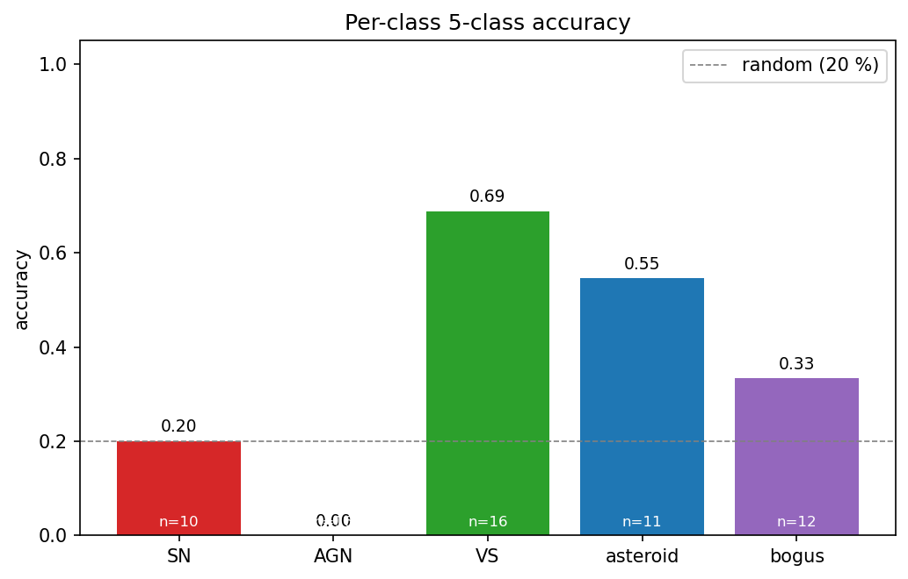
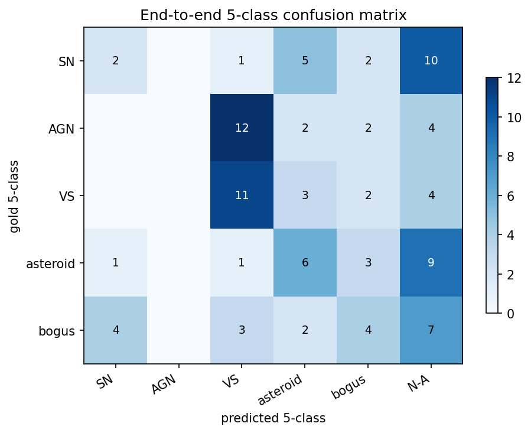
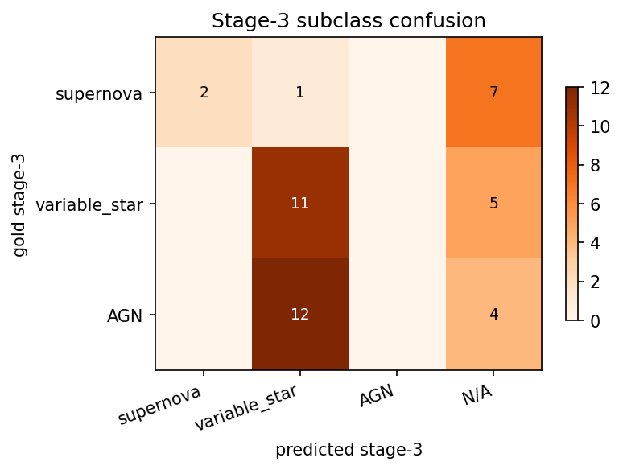
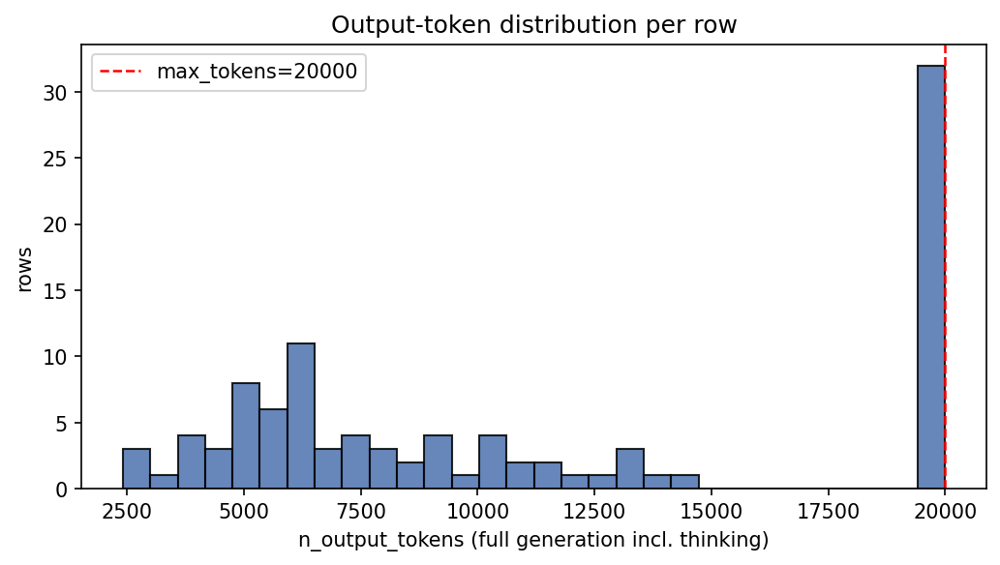
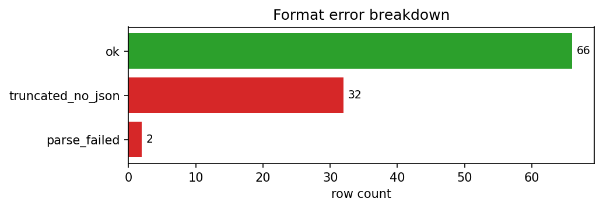
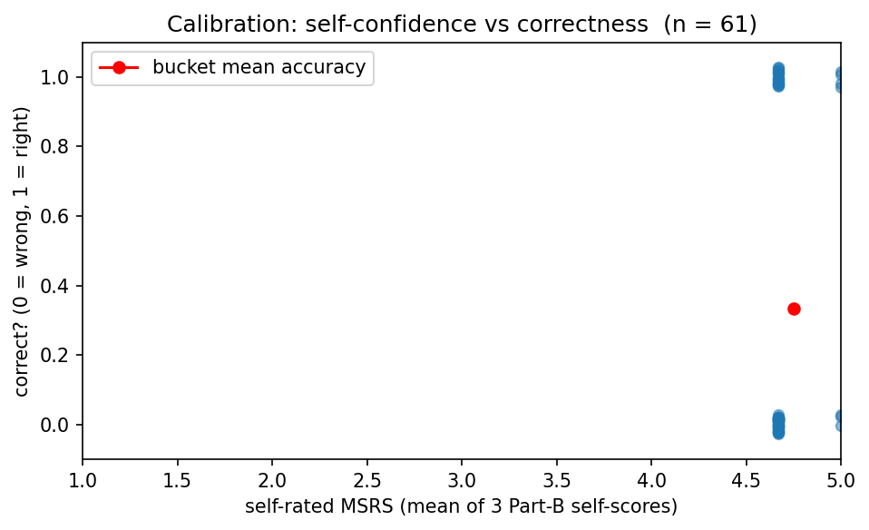

# Run report — Qwen/Qwen3.5-35B-A3B  (20260419-2047)

## Metadata
- **Run folder:** `20260419-2047-qwen35-35b-a3b-tokenlimit`
- **Run timestamp:** 20260419-2047
- **Slug:** qwen35-35b-a3b-tokenlimit
- **Status:** complete
- **Commit:** `8550e43`
- **Working tree dirty:** true
  - modified: runs/, viz/
- **Operator:** user

## Hypothesis

Qwen3.5-35B-A3B sometimes spirals in internal reasoning ("Wait, let me re-check…") and exhausts its 20 000-token budget before emitting any JSON. A prompt-level nudge — soft 8 k thinking budget, anti-spiral triggers, output-first commitment — *should* shorten the thinking phase and raise JSON emission rate versus the baseline, hopefully also lifting 5-class accuracy because more rows reach Stage 3.

## Baseline / Comparison

- **Compared to:** `EXP-20260419-qwen35-baseline-newparser` (same model, same manifest, same renderer, same `max_tokens`, same git commit; only difference is the prompt module).
- **What changed since baseline:**
  - `--prompts prompts` → `--prompts prompts_token_limit_instruction`.
  - `prompts_token_limit_instruction` imports `prompts.SYSTEM_PROMPT` and appends `REASONING_BUDGET_GUIDANCE` covering: soft 8 k thinking cap, two-pass evidence rule, anti-spiral trigger list, decision-forcing under uncertainty, output-first commitment, hard JSON-completion requirement.
  - No model, renderer, max_tokens, temperature, concurrency, or manifest changes.

## Configuration

| Field | Value |
|---|---|
| model | `Qwen/Qwen3.5-35B-A3B` |
| backend | `tinker` |
| renderer | `Qwen3_5Renderer` |
| reasoning_mode | `enabled` |
| max_tokens | `20000` |
| prompt_module | `prompts_token_limit_instruction` |

## Data
- **Manifest:** `data\manifest_fewshot.csv`
- **Total records in run:** 100
- **Class distribution:**

| Class | Count |
|---|---|
| AGN | 20 |
| SN | 20 |
| VS | 20 |
| asteroid | 20 |
| bogus | 20 |

## Output

- **Predictions JSONL (in run folder):** `run.jsonl`
- **Original path:** `results\fewshot_qwen35_tokenlimit.jsonl`
- **Records written:** 100
- **Records with parsed JSON:** 66 (66.00 %)

## Results

### 1. Run-level counts

| Metric | Value |
|---|---|
| n_examples | 100 |
| n_errors (runtime) | 0 |
| json_parseable | 66 |
| json_valid_rate | 66.00 % |

### 2. Token statistics

| Statistic | output_tokens (full) | answer_tokens (post-thinking) |
|---|---|---|
| mean | 11366.4 | 6692.0 |
| median | 9034 | 452 |
| min | 2414 | 334 |
| max | 20000 | 20000 |
| p95 | 20000 | — |
| n_truncated | 32 | — |
| truncated_rate | 32.00 % | — |

### 3. Error breakdown

**Format errors** (mutually exclusive, one code per row):

| Code | Count |
|---|---|
| ok | 66 |
| truncated_no_json | 32 |
| parse_failed | 2 |

**Value errors** (top 10, can co-occur):

| Code | Count |
|---|---|
| enum_violation_stage3 | 1 |

Rows with ≥ 1 value error: **1**

### 4. Part A — metadata reading

| Field | Accuracy |
|---|---|
| filter_band | 100.00 % |
| subtraction_sign | 100.00 % |
| magpsf | 100.00 % |
| sigmapsf | 100.00 % |
| ndethist | 100.00 % |
| ncovhist | 100.00 % |
| **macro** | 100.00 % |
| **exact match (all 6)** | 100.00 % |

### 5. Part B — self-rated reasoning

- **MSRS (mean self-rated score):** 4.7049
- **Per-dimension mean self-score:**
  - key_evidence: 5
  - leading_interpretation: 5
  - alternative_analysis: 4.1148
- **Self-pass rate (row-mean ≥ 4):** 100.00 %

### 6. Part B ↔ C — confidence-accuracy calibration

| Metric | Value |
|---|---|
| n_linked | 61 |
| mean_confidence_correct | 4.7273 |
| mean_confidence_incorrect | 4.6923 |
| calibration_gap | 0.035 |
| pearson_r | 0.158 |
| accuracy_high_confidence (conf ≥ 4) | 36.07 % |
| n_high_confidence | 61 |

### 7. Part C — stage-wise classification

| Metric | Value |
|---|---|
| n_evaluable | 65 |
| Stage 1 (real / artifact) | 73.85 % |
| Stage 2 (astrophysical / solar) | 55.38 % |
| Stage 3 (subclass) | 41.54 % |
| Stage 2 conditional on Stage 1 correct | 60.38 % |
| Stage 3 conditional on Stages 1+2 correct | 30.95 % |
| End-to-end staged accuracy | 35.38 % |
| **Final 5-class accuracy** | **35.38 %** |

### 8. Per-class breakdown

| Class | Accuracy | Correct | Total |
|---|---|---|---|
| AGN | 0.00 % | 0 | 16 |
| SN | 20.00 % | 2 | 10 |
| VS | 68.75 % | 11 | 16 |
| asteroid | 54.55 % | 6 | 11 |
| bogus | 33.33 % | 4 | 12 |

### 9. Binary precision/recall/F1 at stages 1 & 2

| Stage | Precision | Recall | F1 |
|---|---|---|---|
| Stage 1 (real_object=+) | 0.8462 | 0.8302 | 0.8381 |
| Stage 2 (astrophysical=+) | 0.7429 | 0.619 | 0.6753 |

### 10. Stage-3 subclass PRF

- **Macro F1:** 0.2944

| Class | Precision | Recall | F1 |
|---|---|---|---|
| supernova | 1 | 0.2 | 0.3333 |
| variable_star | 0.4583 | 0.6875 | 0.55 |
| AGN | 0 | 0 | 0 |

### 11. Stage-3 confusion matrix

| gold \ pred | supernova | variable_star | AGN | N/A |
|---|---|---|---|---|
| **supernova** | 2 | 1 | 0 | 7 |
| **variable_star** | 0 | 11 | 0 | 5 |
| **AGN** | 0 | 12 | 0 | 4 |

## Plots

The following charts are saved under `./plots/` (see `plots/README.md` for descriptions):

- `plots/per_class_accuracy.png`

  

- `plots/five_class_confusion.png`

  

- `plots/stage3_confusion.png`

  

- `plots/token_distribution.png`

  

- `plots/error_breakdown.png`

  

- `plots/calibration.png`

  

## Per-datapoint HTML visualizations

Self-contained `logtree` HTML files, one per selected datapoint (top-10 by ALERCE probability within each class). Open any of them directly in a browser.

| Class | HTMLs in `viz/` |
|---|---|
| AGN | 10 (`viz/AGN/`) |
| SN | 10 (`viz/SN/`) |
| VS | 10 (`viz/VS/`) |
| asteroid | 10 (`viz/asteroid/`) |
| bogus | 10 (`viz/bogus/`) |

## Observations

- **Hypothesis matched?** No. The token-limit guidance made the model *more* verbose, not less: mean output tokens rose by ~410, mean answer tokens rose by ~1 350, truncation rate rose by 7 pp, and JSON parse rate dropped 6 pp. 5-class accuracy ticked up 1.6 pp but this is noise-level on n=100.
- **Surprises:** (1) Simply adding prompt text increased thinking length — likely the model "reads" the anti-spiral instructions as one more topic to deliberate about. (2) AGN collapse persists (0 / 16 correct) exactly as in baseline, which rules out any AGN-specific interaction with the added guidance. (3) Value-error codes remain near-zero — when the model emits JSON, the schema and cross-stage consistency rules hold. The ceiling is structural (truncation), not semantic.
- **Notable failure modes:** `truncated_no_json` is 32 / 34 format errors (94 %). Natural-language self-budgeting is not a lever the model respects inside its CoT for this renderer / size. The model is also highly overconfident — near-5/5 on `confidence_overall` regardless of correctness (Pearson r conf×correct ≈ +0.16 here, −0.19 in baseline — both indistinguishable from zero at n≈60).
- **Suggested next experiment:** Stop pursuing natural-language thinking-budget prompts for Qwen3.5-35B-A3B. Either (a) hard-cap `effective_max` at 10–12 k at the API layer to force earlier exits, or (b) switch to `prompts_agn_instruction` on the reasoning renderer to see whether targeted subclass guidance can break the AGN→VS collapse independently of the truncation issue.

**See also:** baseline `EXP-20260419-qwen35-baseline-newparser.md` and the combined report `report/report_qwen35_tokenlimit_vs_baseline_Apr19.md`.
