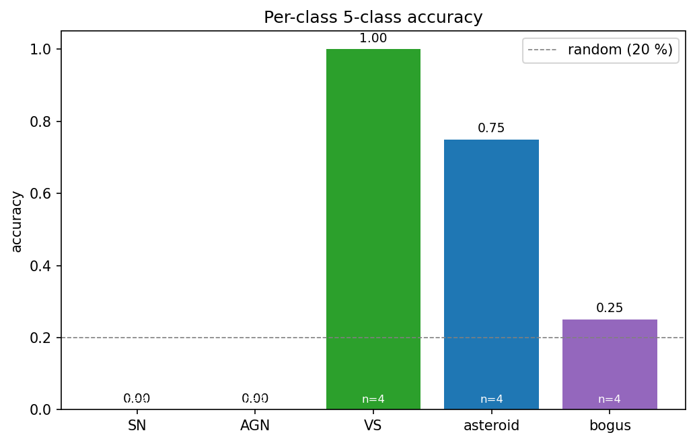
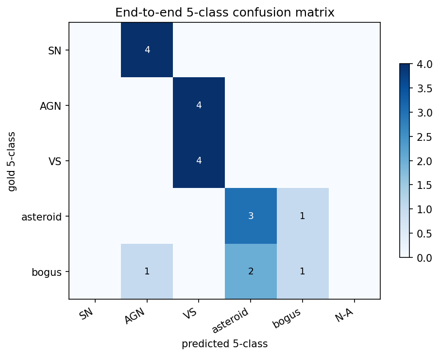
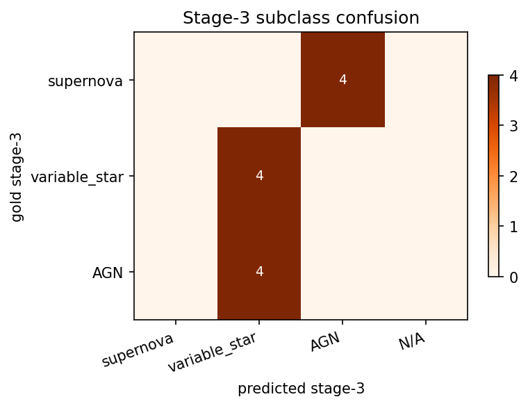
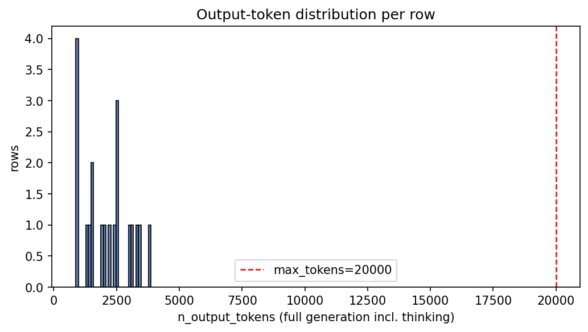
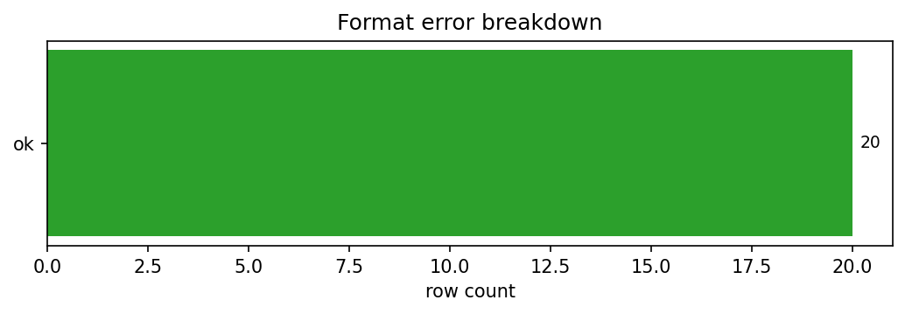
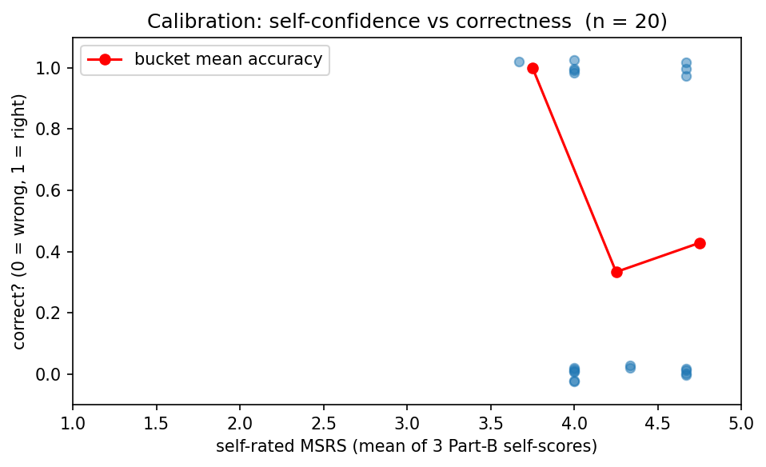

# Run report — gpt-5.4  (20260419-2230)

## Metadata
- **Run folder:** `20260419-2230-gpt-5.4-high`
- **Run timestamp:** 20260419-2230
- **Slug:** gpt-5.4-high
- **Status:** complete
- **Commit:** `8550e43`
- **Working tree dirty:** true
  - modified: runs/, viz/
- **Operator:** user

## Hypothesis

First closed-source benchmark in the project. Run GPT-5.4 with `reasoning_effort: high` on a 20-row subset (4 per class) to (a) verify the new `api_openai.py` backend and (b) get a closed-source ceiling estimate for the same task that the open-source models have been benchmarked on.

## Baseline / Comparison

- **Compared to:** `EXP-20260419-gpt54-none` (same model, `reasoning_effort: none` — A/B for the thinking dial).
- **What's new vs all prior runs:**
  - New backend: `api_openai.py` (Responses API), called via `--backend openai`.
  - Image input: PNG montage base64-encoded inside the request body (`data:image/png;base64,…`) rather than passed as a `PIL.Image`.
  - Token accounting comes from `response.usage` rather than from a local tokenizer; we record an additional `n_reasoning_tokens` field.
  - `truncated` is derived from `response.status == "incomplete"` + `incomplete_details.reason == "max_output_tokens"`.

## Configuration

| Field | Value |
|---|---|
| model | `gpt-5.4` |
| backend | `openai` |
| reasoning_effort | `high` |
| max_tokens | `20000` |
| prompt_module | `prompts` |

## Data
- **Manifest:** `data\manifest_fewshot_20.csv`
- **Total records in run:** 20
- **Class distribution:**

| Class | Count |
|---|---|
| AGN | 4 |
| SN | 4 |
| VS | 4 |
| asteroid | 4 |
| bogus | 4 |

## Output

- **Predictions JSONL (in run folder):** `run.jsonl`
- **Original path:** `results\fewshot20_gpt54_high.jsonl`
- **Records written:** 20
- **Records with parsed JSON:** 20 (100.00 %)

## Results

### 1. Run-level counts

| Metric | Value |
|---|---|
| n_examples | 20 |
| n_errors (runtime) | 0 |
| json_parseable | 20 |
| json_valid_rate | 100.00 % |

### 2. Token statistics

| Statistic | output_tokens (full) | answer_tokens (post-thinking) |
|---|---|---|
| mean | 2130.4 | 436.9 |
| median | 2132 | 435 |
| min | 880 | 400 |
| max | 3872 | 482 |
| p95 | 3484 | — |
| n_truncated | 0 | — |
| truncated_rate | 0.00 % | — |

### 3. Error breakdown

**Format errors** (mutually exclusive, one code per row):

| Code | Count |
|---|---|
| ok | 20 |

Rows with ≥ 1 value error: **0**

### 4. Part A — metadata reading

| Field | Accuracy |
|---|---|
| filter_band | 100.00 % |
| subtraction_sign | 100.00 % |
| magpsf | 100.00 % |
| sigmapsf | 100.00 % |
| ndethist | 100.00 % |
| ncovhist | 100.00 % |
| **macro** | 100.00 % |
| **exact match (all 6)** | 100.00 % |

### 5. Part B — self-rated reasoning

- **MSRS (mean self-rated score):** 4.25
- **Per-dimension mean self-score:**
  - key_evidence: 4.45
  - leading_interpretation: 4.35
  - alternative_analysis: 3.95
- **Self-pass rate (row-mean ≥ 4):** 95.00 %

### 6. Part B ↔ C — confidence-accuracy calibration

| Metric | Value |
|---|---|
| n_linked | 20 |
| mean_confidence_correct | 4.2083 |
| mean_confidence_incorrect | 4.2778 |
| calibration_gap | -0.0694 |
| pearson_r | -0.1027 |
| accuracy_high_confidence (conf ≥ 4) | 36.84 % |
| n_high_confidence | 19 |
| accuracy_low_confidence (conf < 4) | 100.00 % |
| n_low_confidence | 1 |

### 7. Part C — stage-wise classification

| Metric | Value |
|---|---|
| n_evaluable | 20 |
| Stage 1 (real / artifact) | 80.00 % |
| Stage 2 (astrophysical / solar) | 80.00 % |
| Stage 3 (subclass) | 55.00 % |
| Stage 2 conditional on Stage 1 correct | 93.75 % |
| Stage 3 conditional on Stages 1+2 correct | 33.33 % |
| End-to-end staged accuracy | 40.00 % |
| **Final 5-class accuracy** | **40.00 %** |

### 8. Per-class breakdown

| Class | Accuracy | Correct | Total |
|---|---|---|---|
| AGN | 0.00 % | 0 | 4 |
| SN | 0.00 % | 0 | 4 |
| VS | 100.00 % | 4 | 4 |
| asteroid | 75.00 % | 3 | 4 |
| bogus | 25.00 % | 1 | 4 |

### 9. Binary precision/recall/F1 at stages 1 & 2

| Stage | Precision | Recall | F1 |
|---|---|---|---|
| Stage 1 (real_object=+) | 0.8333 | 0.9375 | 0.8824 |
| Stage 2 (astrophysical=+) | 0.9231 | 1 | 0.96 |

### 10. Stage-3 subclass PRF

- **Macro F1:** 0.2222

| Class | Precision | Recall | F1 |
|---|---|---|---|
| supernova | 0 | 0 | 0 |
| variable_star | 0.5 | 1 | 0.6667 |
| AGN | 0 | 0 | 0 |

### 11. Stage-3 confusion matrix

| gold \ pred | supernova | variable_star | AGN | N/A |
|---|---|---|---|---|
| **supernova** | 0 | 0 | 4 | 0 |
| **variable_star** | 0 | 4 | 0 | 0 |
| **AGN** | 0 | 4 | 0 | 0 |

## Plots

The following charts are saved under `./plots/` (see `plots/README.md` for descriptions):

- `plots/per_class_accuracy.png`

  

- `plots/five_class_confusion.png`

  

- `plots/stage3_confusion.png`

  

- `plots/token_distribution.png`

  

- `plots/error_breakdown.png`

  

- `plots/calibration.png`

  

## Per-datapoint HTML visualizations

Self-contained `logtree` HTML files, one per selected datapoint (top-10 by ALERCE probability within each class). Open any of them directly in a browser.

| Class | HTMLs in `viz/` |
|---|---|
| AGN | 4 (`viz/AGN/`) |
| SN | 4 (`viz/SN/`) |
| VS | 4 (`viz/VS/`) |
| asteroid | 4 (`viz/asteroid/`) |
| bogus | 4 (`viz/bogus/`) |

## Observations

- **Hypothesis matched?** Mixed. Backend works flawlessly (100 % parse, 0 truncation, clean schema), but **all 4 SNe got predicted as AGN** — a failure pattern unique to this run and the opposite of the open-source SN→VS confusion. The reasoning-on variant *underperformed* the reasoning-off variant on this 20-row slice (40 % vs 50 %; see `EXP-20260419-gpt54-none`).
- **Surprises:** (1) GPT-5.4 with `effort: high` spent a median 1 660 hidden CoT tokens per row — roughly 4× the visible answer length — yet ended up classifying every SN as AGN. (2) AGN itself remains 0/4 (universal pattern across all models). (3) The token economy is *much* tighter than open-source: median 2 132 total tokens vs 4 825 for Qwen3.5-397B and 3 652 for Kimi K2.5-think.
- **Notable failure modes:** SN→AGN confusion (4/4) is the dominant error and worth a deeper look. The model evidently sees galactic-scale variability cues in SN cutouts that push it past variable_star into AGN.
- **Caveats:** n=20 is small. A 4-row class flips per-class accuracy by 25 pp per record; treat numbers as smoke signal not statistical comparison vs the open-source 100-row runs.
- **Suggested next experiment:** scale up to the full 100-row `manifest_fewshot.csv` to confirm whether the SN→AGN collapse is real or sampling noise.

**See also:** `report/report_gpt54_high_vs_none_Apr19.md`.
