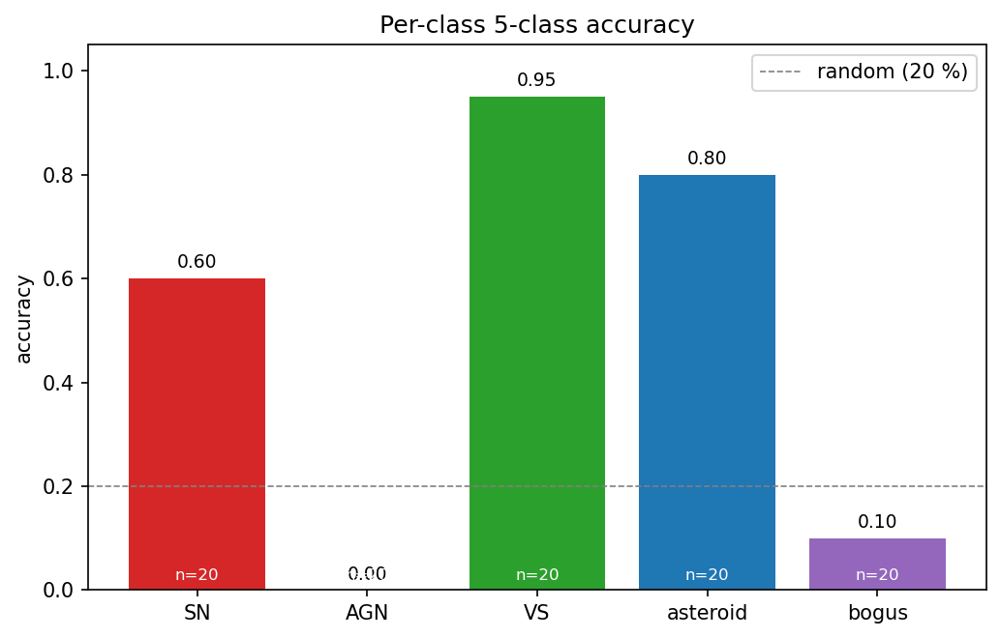
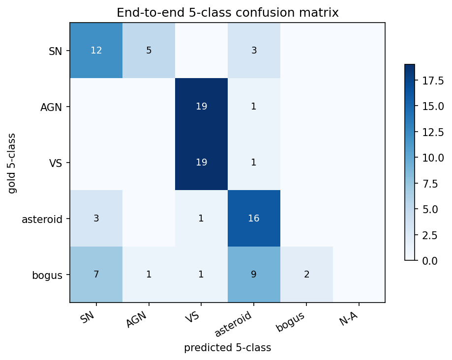
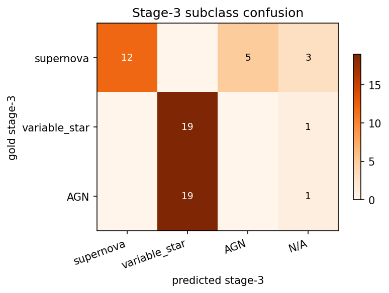
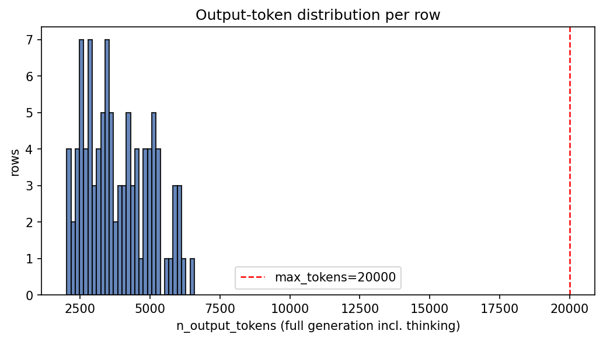
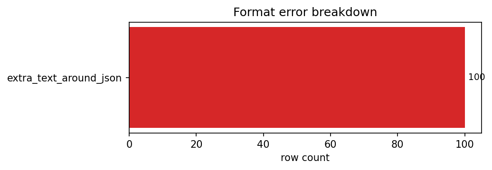
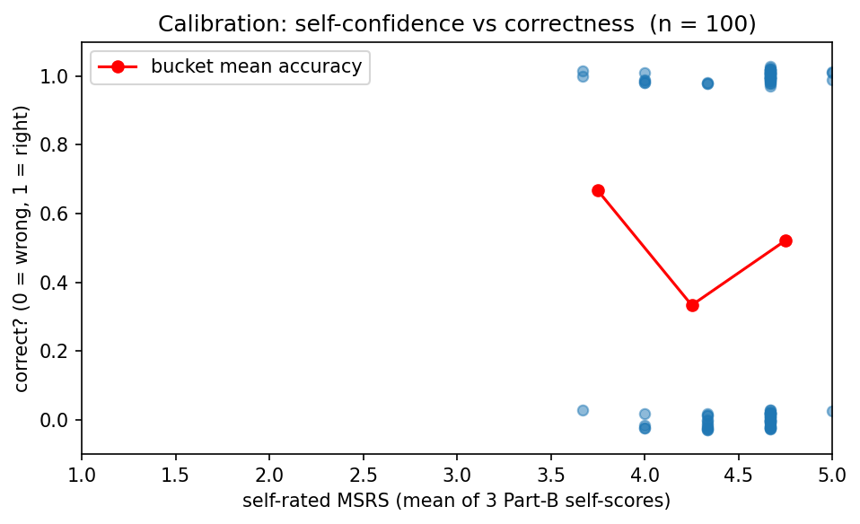

# Run report — moonshotai/Kimi-K2.5  (20260419-2230)

## Metadata
- **Run folder:** `20260419-2230-kimi-k25-think`
- **Run timestamp:** 20260419-2230
- **Slug:** kimi-k25-think
- **Status:** complete
- **Commit:** `8550e43`
- **Working tree dirty:** true
  - modified: runs/, viz/
- **Operator:** user

## Hypothesis

Switch Kimi K2.5 from DisableThinking to thinking-enabled renderer; expect parse rate stays ~100%, 5-class accuracy lifts.

## Baseline / Comparison

Compared to prior Kimi DisableThinking run. Only renderer changed.

## Configuration

| Field | Value |
|---|---|
| model | `moonshotai/Kimi-K2.5` |
| backend | `tinker` |
| renderer | `KimiK25Renderer` |
| reasoning_mode | `enabled` |
| max_tokens | `20000` |
| prompt_module | `prompts` |

## Data
- **Manifest:** `data\manifest_fewshot.csv`
- **Total records in run:** 100
- **Class distribution:**

| Class | Count |
|---|---|
| AGN | 20 |
| SN | 20 |
| VS | 20 |
| asteroid | 20 |
| bogus | 20 |

## Output

- **Predictions JSONL (in run folder):** `run.jsonl`
- **Original path:** `results\fewshot_kimi_think_newparser.jsonl`
- **Records written:** 100
- **Records with parsed JSON:** 100 (100.00 %)

## Results

### 1. Run-level counts

| Metric | Value |
|---|---|
| n_examples | 100 |
| n_errors (runtime) | 0 |
| json_parseable | 100 |
| json_valid_rate | 100.00 % |

### 2. Token statistics

| Statistic | output_tokens (full) | answer_tokens (post-thinking) |
|---|---|---|
| mean | 3868.2 | 3867.2 |
| median | 3652 | 3651 |
| min | 2021 | 2020 |
| max | 6582 | 6581 |
| p95 | 5898 | — |
| n_truncated | 0 | — |
| truncated_rate | 0.00 % | — |

### 3. Error breakdown

**Format errors** (mutually exclusive, one code per row):

| Code | Count |
|---|---|
| extra_text_around_json | 100 |

Rows with ≥ 1 value error: **0**

### 4. Part A — metadata reading

| Field | Accuracy |
|---|---|
| filter_band | 100.00 % |
| subtraction_sign | 100.00 % |
| magpsf | 100.00 % |
| sigmapsf | 100.00 % |
| ndethist | 100.00 % |
| ncovhist | 100.00 % |
| **macro** | 100.00 % |
| **exact match (all 6)** | 100.00 % |

### 5. Part B — self-rated reasoning

- **MSRS (mean self-rated score):** 4.54
- **Per-dimension mean self-score:**
  - key_evidence: 4.96
  - leading_interpretation: 4.73
  - alternative_analysis: 3.93
- **Self-pass rate (row-mean ≥ 4):** 97.00 %

### 6. Part B ↔ C — confidence-accuracy calibration

| Metric | Value |
|---|---|
| n_linked | 100 |
| mean_confidence_correct | 4.5578 |
| mean_confidence_incorrect | 4.5229 |
| calibration_gap | 0.0349 |
| pearson_r | 0.0638 |
| accuracy_high_confidence (conf ≥ 4) | 48.45 % |
| n_high_confidence | 97 |
| accuracy_low_confidence (conf < 4) | 66.67 % |
| n_low_confidence | 3 |

### 7. Part C — stage-wise classification

| Metric | Value |
|---|---|
| n_evaluable | 100 |
| Stage 1 (real / artifact) | 82.00 % |
| Stage 2 (astrophysical / solar) | 73.00 % |
| Stage 3 (subclass) | 58.00 % |
| Stage 2 conditional on Stage 1 correct | 88.75 % |
| Stage 3 conditional on Stages 1+2 correct | 51.67 % |
| End-to-end staged accuracy | 49.00 % |
| **Final 5-class accuracy** | **49.00 %** |

### 8. Per-class breakdown

| Class | Accuracy | Correct | Total |
|---|---|---|---|
| AGN | 0.00 % | 0 | 20 |
| SN | 60.00 % | 12 | 20 |
| VS | 95.00 % | 19 | 20 |
| asteroid | 80.00 % | 16 | 20 |
| bogus | 10.00 % | 2 | 20 |

### 9. Binary precision/recall/F1 at stages 1 & 2

| Stage | Precision | Recall | F1 |
|---|---|---|---|
| Stage 1 (real_object=+) | 0.8163 | 1 | 0.8989 |
| Stage 2 (astrophysical=+) | 0.8088 | 0.9167 | 0.8594 |

### 10. Stage-3 subclass PRF

- **Macro F1:** 0.4684

| Class | Precision | Recall | F1 |
|---|---|---|---|
| supernova | 1 | 0.6 | 0.75 |
| variable_star | 0.5 | 0.95 | 0.6552 |
| AGN | 0 | 0 | 0 |

### 11. Stage-3 confusion matrix

| gold \ pred | supernova | variable_star | AGN | N/A |
|---|---|---|---|---|
| **supernova** | 12 | 0 | 5 | 3 |
| **variable_star** | 0 | 19 | 0 | 1 |
| **AGN** | 0 | 19 | 0 | 1 |

## Plots

The following charts are saved under `./plots/` (see `plots/README.md` for descriptions):

- `plots/per_class_accuracy.png`

  

- `plots/five_class_confusion.png`

  

- `plots/stage3_confusion.png`

  

- `plots/token_distribution.png`

  

- `plots/error_breakdown.png`

  

- `plots/calibration.png`

  

## Per-datapoint HTML visualizations

Self-contained `logtree` HTML files, one per selected datapoint (top-10 by ALERCE probability within each class). Open any of them directly in a browser.

| Class | HTMLs in `viz/` |
|---|---|
| AGN | 10 (`viz/AGN/`) |
| SN | 10 (`viz/SN/`) |
| VS | 10 (`viz/VS/`) |
| asteroid | 10 (`viz/asteroid/`) |
| bogus | 10 (`viz/bogus/`) |

## Observations

Best open-source result so far: 49.0% 5-class, 100% parse, 0% truncation. bogus collapsed to 10%. AGN still 0/20 — universal failure mode.
