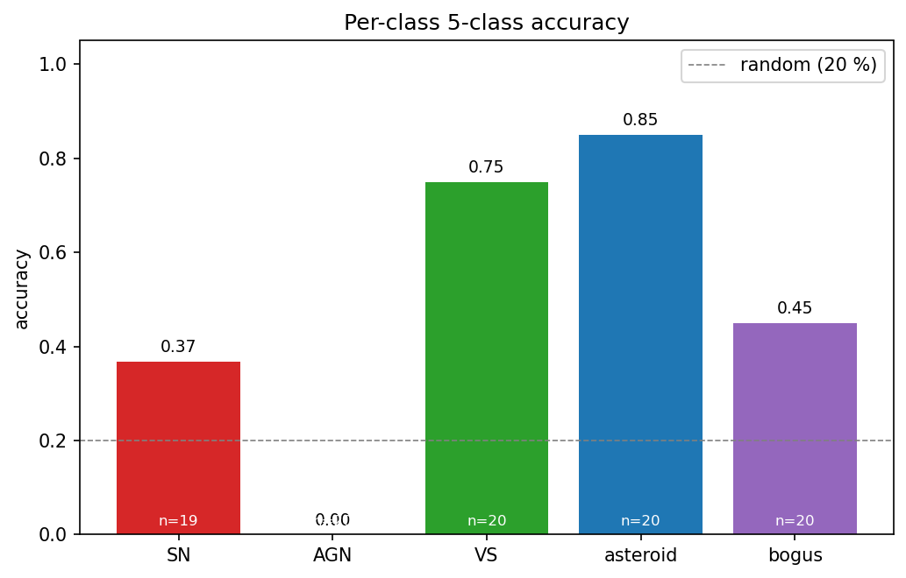
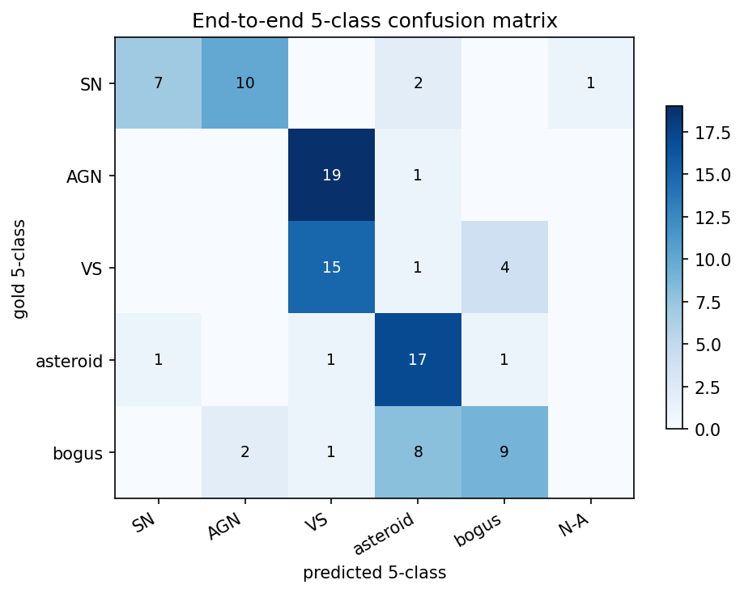
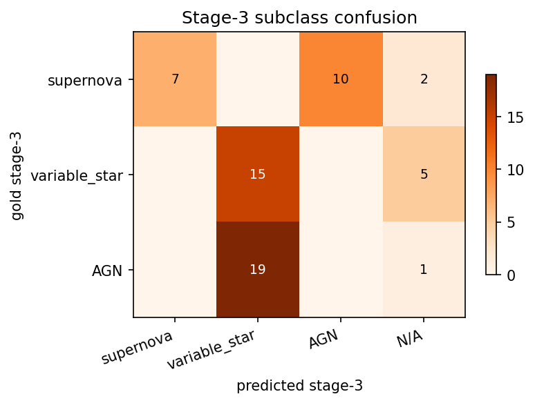
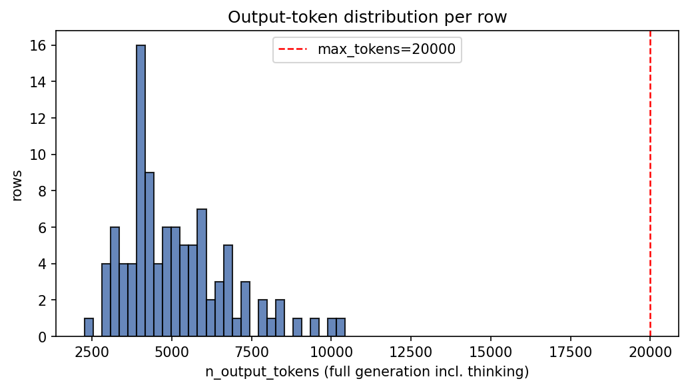
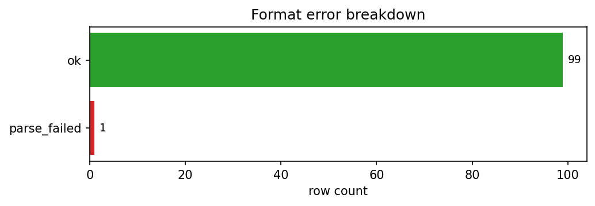
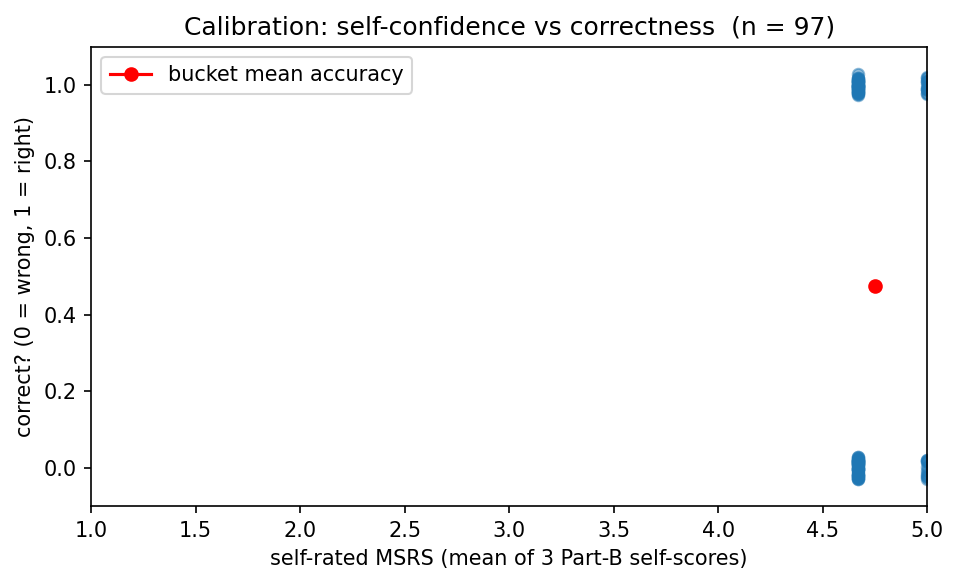

# Run report — Qwen/Qwen3.5-397B-A17B  (20260419-2230)

## Metadata
- **Run folder:** `20260419-2230-qwen35-397b-a17b`
- **Run timestamp:** 20260419-2230
- **Slug:** qwen35-397b-a17b
- **Status:** complete
- **Commit:** `8550e43`
- **Working tree dirty:** true
  - modified: runs/, viz/
- **Operator:** user

## Hypothesis

The Qwen3.5-35B-A3B baseline was hard-capped by truncation (25 % of rows hit the 20 k token wall before emitting JSON). The much larger 397B-A17B variant should be more decisive in its CoT and therefore produce *more compact* thinking, raising both parse rate and 5-class accuracy.

## Baseline / Comparison

- **Compared to:** `EXP-20260419-qwen35-baseline-newparser` (Qwen3.5-35B-A3B, same renderer, same prompts, same manifest).
- **What changed:** model id only — `Qwen/Qwen3.5-35B-A3B` → `Qwen/Qwen3.5-397B-A17B`. Renderer, max_tokens (auto-bumped to 20 000), temperature, concurrency, prompts: identical.

## Configuration

| Field | Value |
|---|---|
| model | `Qwen/Qwen3.5-397B-A17B` |
| backend | `tinker` |
| renderer | `Qwen3_5Renderer` |
| reasoning_mode | `enabled` |
| max_tokens | `20000` |
| prompt_module | `prompts` |

## Data
- **Manifest:** `data\manifest_fewshot.csv`
- **Total records in run:** 100
- **Class distribution:**

| Class | Count |
|---|---|
| AGN | 20 |
| SN | 20 |
| VS | 20 |
| asteroid | 20 |
| bogus | 20 |

## Output

- **Predictions JSONL (in run folder):** `run.jsonl`
- **Original path:** `results\fewshot_qwen35_397b_newparser.jsonl`
- **Records written:** 100
- **Records with parsed JSON:** 99 (99.00 %)

## Results

### 1. Run-level counts

| Metric | Value |
|---|---|
| n_examples | 100 |
| n_errors (runtime) | 0 |
| json_parseable | 99 |
| json_valid_rate | 99.00 % |

### 2. Token statistics

| Statistic | output_tokens (full) | answer_tokens (post-thinking) |
|---|---|---|
| mean | 5138.9 | 458.8 |
| median | 4825 | 456 |
| min | 2262 | 379 |
| max | 10434 | 623 |
| p95 | 8321 | — |
| n_truncated | 0 | — |
| truncated_rate | 0.00 % | — |

### 3. Error breakdown

**Format errors** (mutually exclusive, one code per row):

| Code | Count |
|---|---|
| ok | 99 |
| parse_failed | 1 |

Rows with ≥ 1 value error: **0**

### 4. Part A — metadata reading

| Field | Accuracy |
|---|---|
| filter_band | 100.00 % |
| subtraction_sign | 100.00 % |
| magpsf | 100.00 % |
| sigmapsf | 100.00 % |
| ndethist | 100.00 % |
| ncovhist | 100.00 % |
| **macro** | 100.00 % |
| **exact match (all 6)** | 100.00 % |

### 5. Part B — self-rated reasoning

- **MSRS (mean self-rated score):** 4.7388
- **Per-dimension mean self-score:**
  - key_evidence: 5
  - leading_interpretation: 5
  - alternative_analysis: 4.2165
- **Self-pass rate (row-mean ≥ 4):** 100.00 %

### 6. Part B ↔ C — confidence-accuracy calibration

| Metric | Value |
|---|---|
| n_linked | 97 |
| mean_confidence_correct | 4.7447 |
| mean_confidence_incorrect | 4.7333 |
| calibration_gap | 0.0113 |
| pearson_r | 0.0413 |
| accuracy_high_confidence (conf ≥ 4) | 48.45 % |
| n_high_confidence | 97 |

### 7. Part C — stage-wise classification

| Metric | Value |
|---|---|
| n_evaluable | 99 |
| Stage 1 (real / artifact) | 83.84 % |
| Stage 2 (astrophysical / solar) | 77.78 % |
| Stage 3 (subclass) | 57.58 % |
| Stage 2 conditional on Stage 1 correct | 86.08 % |
| Stage 3 conditional on Stages 1+2 correct | 37.29 % |
| End-to-end staged accuracy | 48.48 % |
| **Final 5-class accuracy** | **48.48 %** |

### 8. Per-class breakdown

| Class | Accuracy | Correct | Total |
|---|---|---|---|
| AGN | 0.00 % | 0 | 20 |
| SN | 36.84 % | 7 | 19 |
| VS | 75.00 % | 15 | 20 |
| asteroid | 85.00 % | 17 | 20 |
| bogus | 45.00 % | 9 | 20 |

### 9. Binary precision/recall/F1 at stages 1 & 2

| Stage | Precision | Recall | F1 |
|---|---|---|---|
| Stage 1 (real_object=+) | 0.8706 | 0.9367 | 0.9024 |
| Stage 2 (astrophysical=+) | 0.9107 | 0.8644 | 0.887 |

### 10. Stage-3 subclass PRF

- **Macro F1:** 0.3647

| Class | Precision | Recall | F1 |
|---|---|---|---|
| supernova | 1 | 0.3684 | 0.5385 |
| variable_star | 0.4412 | 0.75 | 0.5556 |
| AGN | 0 | 0 | 0 |

### 11. Stage-3 confusion matrix

| gold \ pred | supernova | variable_star | AGN | N/A |
|---|---|---|---|---|
| **supernova** | 7 | 0 | 10 | 2 |
| **variable_star** | 0 | 15 | 0 | 5 |
| **AGN** | 0 | 19 | 0 | 1 |

## Plots

The following charts are saved under `./plots/` (see `plots/README.md` for descriptions):

- `plots/per_class_accuracy.png`

  

- `plots/five_class_confusion.png`

  

- `plots/stage3_confusion.png`

  

- `plots/token_distribution.png`

  

- `plots/error_breakdown.png`

  

- `plots/calibration.png`

  

## Per-datapoint HTML visualizations

Self-contained `logtree` HTML files, one per selected datapoint (top-10 by ALERCE probability within each class). Open any of them directly in a browser.

| Class | HTMLs in `viz/` |
|---|---|
| AGN | 10 (`viz/AGN/`) |
| SN | 10 (`viz/SN/`) |
| VS | 10 (`viz/VS/`) |
| asteroid | 10 (`viz/asteroid/`) |
| bogus | 10 (`viz/bogus/`) |

## Observations

- **Hypothesis matched?** Strongly yes. Truncation went from 25 % → 0 % and 5-class accuracy nearly matched the much-bigger Kimi K2.5 thinking run (48.5 % vs 49.0 %). The 397B is markedly more *concise* in its CoT (median output 4 825 vs 8 790 tokens for 35B) — model scale brings decision-making efficiency, not just raw capability.
- **Surprises:** (1) Mean answer tokens (459) is *lower* than the 35B baseline median, confirming the renderer cleanly separates thinking from answer. (2) The model now confuses SN with AGN (10 SNe → AGN) — a different failure pattern than the 35B (which mostly N/A'd SNe due to truncation). The bigger model is wrong in a more "considered" way. (3) Bogus accuracy 45 % is the best we've seen; small-model runs collapse this class.
- **Notable failure modes:** AGN 0/20 again (universal pattern). New SN→AGN confusion deserves a focused look.
- **Suggested next experiment:** add `prompts_agn_instruction` on this 397B config to attack both the AGN→VS and SN→AGN forks at once.

**See also:** `report/report_opensource_5class_Apr19.md`.
