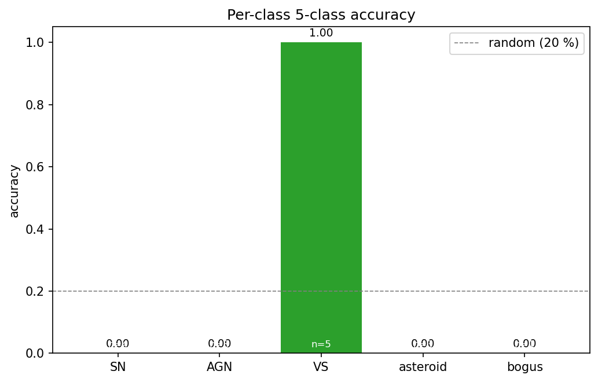
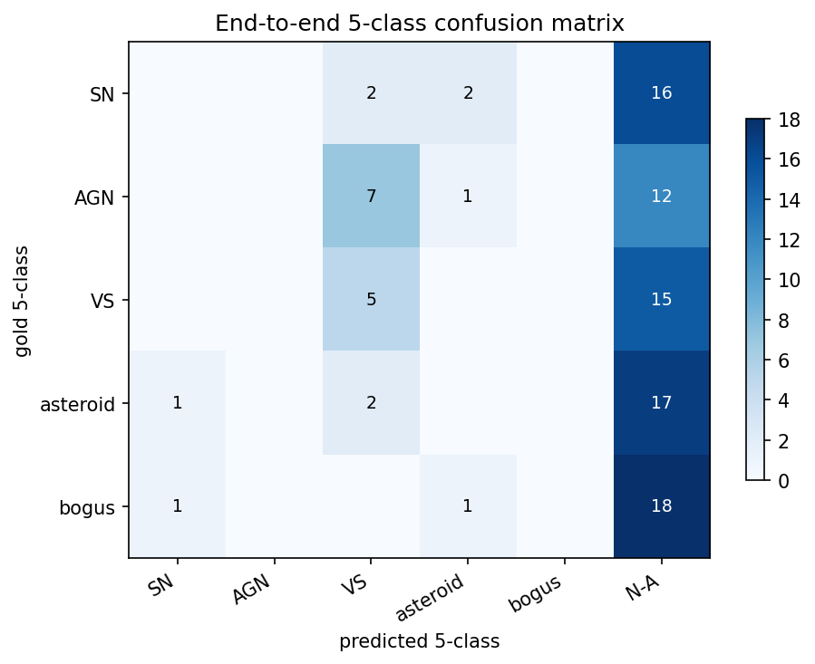
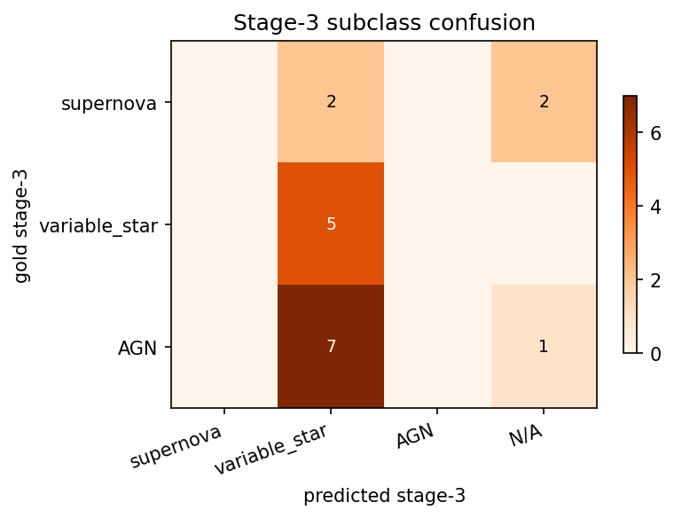
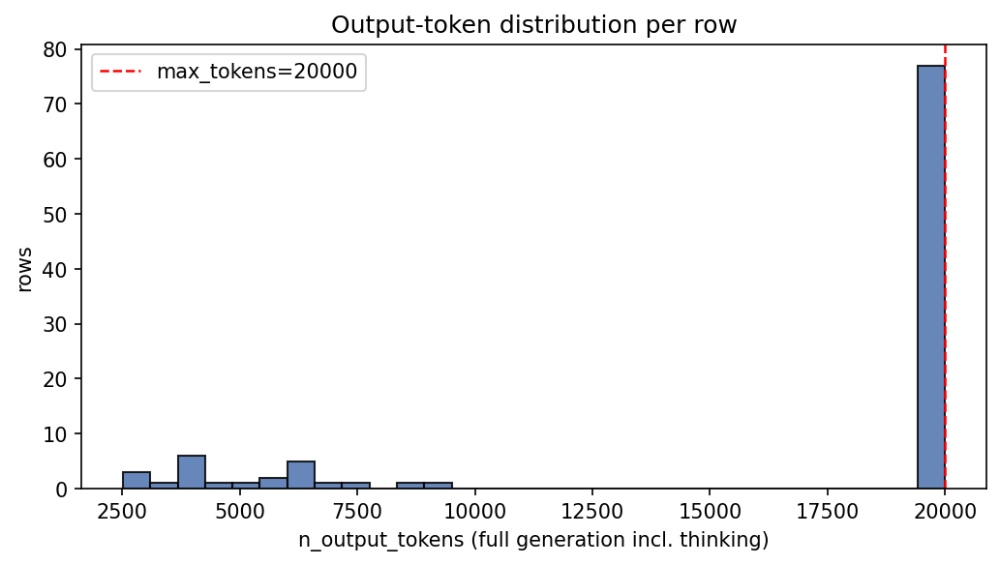
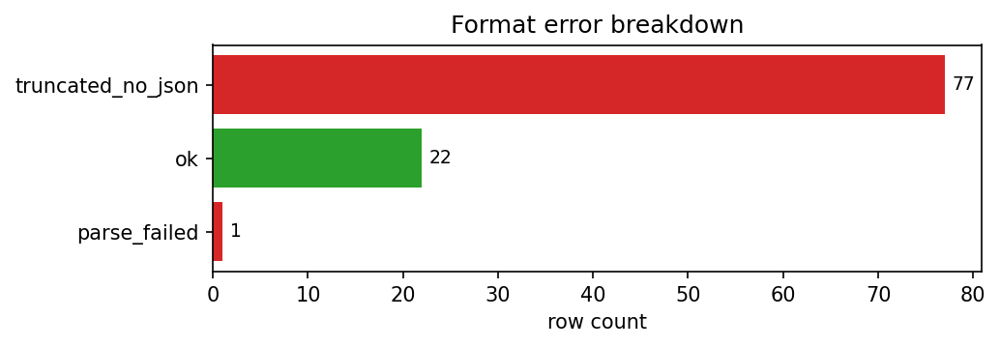
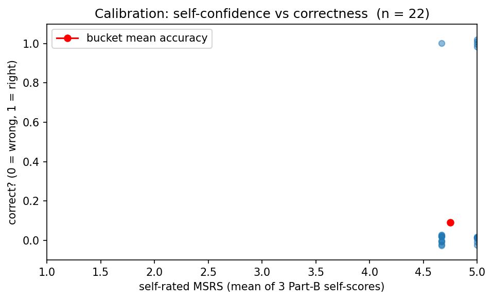

# Run report — Qwen/Qwen3.5-4B  (20260419-2230)

## Metadata
- **Run folder:** `20260419-2230-qwen35-4b`
- **Run timestamp:** 20260419-2230
- **Slug:** qwen35-4b
- **Status:** complete
- **Commit:** `8550e43`
- **Working tree dirty:** true
  - modified: runs/, viz/
- **Operator:** user

## Hypothesis

Test the smallest dense Qwen3.5 variant (4B) on the same benchmark as 35B and 397B. Expectation: substantially worse than 35B, both because of capacity and because small reasoning models often spiral in CoT. Useful as a lower bound and to confirm the truncation-then-no-JSON failure mode scales inversely with model size.

## Baseline / Comparison

- **Compared to:** `EXP-20260419-qwen35-baseline-newparser` and `EXP-20260419-qwen35-397b`. Same prompts module, same renderer, same manifest, same commit; only the model id changes.

## Configuration

| Field | Value |
|---|---|
| model | `Qwen/Qwen3.5-4B` |
| backend | `tinker` |
| renderer | `Qwen3_5Renderer` |
| reasoning_mode | `enabled` |
| max_tokens | `20000` |
| prompt_module | `prompts` |

## Data
- **Manifest:** `data\manifest_fewshot.csv`
- **Total records in run:** 100
- **Class distribution:**

| Class | Count |
|---|---|
| AGN | 20 |
| SN | 20 |
| VS | 20 |
| asteroid | 20 |
| bogus | 20 |

## Output

- **Predictions JSONL (in run folder):** `run.jsonl`
- **Original path:** `results\fewshot_qwen35_4b_newparser.jsonl`
- **Records written:** 100
- **Records with parsed JSON:** 22 (22.00 %)

## Results

### 1. Run-level counts

| Metric | Value |
|---|---|
| n_examples | 100 |
| n_errors (runtime) | 0 |
| json_parseable | 22 |
| json_valid_rate | 22.00 % |

### 2. Token statistics

| Statistic | output_tokens (full) | answer_tokens (post-thinking) |
|---|---|---|
| mean | 16615.3 | 15497.6 |
| median | 20000 | 20000 |
| min | 2514 | 328 |
| max | 20000 | 20000 |
| p95 | 20000 | — |
| n_truncated | 77 | — |
| truncated_rate | 77.00 % | — |

### 3. Error breakdown

**Format errors** (mutually exclusive, one code per row):

| Code | Count |
|---|---|
| truncated_no_json | 77 |
| ok | 22 |
| parse_failed | 1 |

**Value errors** (top 10, can co-occur):

| Code | Count |
|---|---|
| enum_violation_stage3 | 1 |

Rows with ≥ 1 value error: **1**

### 4. Part A — metadata reading

| Field | Accuracy |
|---|---|
| filter_band | 100.00 % |
| subtraction_sign | 100.00 % |
| magpsf | 100.00 % |
| sigmapsf | 100.00 % |
| ndethist | 100.00 % |
| ncovhist | 100.00 % |
| **macro** | 100.00 % |
| **exact match (all 6)** | 100.00 % |

### 5. Part B — self-rated reasoning

- **MSRS (mean self-rated score):** 4.8333
- **Per-dimension mean self-score:**
  - key_evidence: 5
  - leading_interpretation: 5
  - alternative_analysis: 4.5
- **Self-pass rate (row-mean ≥ 4):** 100.00 %

### 6. Part B ↔ C — confidence-accuracy calibration

| Metric | Value |
|---|---|
| n_linked | 21 |
| mean_confidence_correct | 4.9333 |
| mean_confidence_incorrect | 4.7917 |
| calibration_gap | 0.1417 |
| pearson_r | 0.3624 |
| accuracy_high_confidence (conf ≥ 4) | 23.81 % |
| n_high_confidence | 21 |

### 7. Part C — stage-wise classification

| Metric | Value |
|---|---|
| n_evaluable | 21 |
| Stage 1 (real / artifact) | 95.24 % |
| Stage 2 (astrophysical / solar) | 66.67 % |
| Stage 3 (subclass) | 23.81 % |
| Stage 2 conditional on Stage 1 correct | 70.00 % |
| Stage 3 conditional on Stages 1+2 correct | 29.41 % |
| End-to-end staged accuracy | 23.81 % |
| **Final 5-class accuracy** | **23.81 %** |

### 8. Per-class breakdown

| Class | Accuracy | Correct | Total |
|---|---|---|---|
| AGN | 0.00 % | 0 | 8 |
| SN | 0.00 % | 0 | 4 |
| VS | 100.00 % | 5 | 5 |
| asteroid | 0.00 % | 0 | 3 |
| bogus | 0.00 % | 0 | 1 |

### 9. Binary precision/recall/F1 at stages 1 & 2

| Stage | Precision | Recall | F1 |
|---|---|---|---|
| Stage 1 (real_object=+) | 0.9524 | 1 | 0.9756 |
| Stage 2 (astrophysical=+) | 0.7778 | 0.8235 | 0.8 |

### 10. Stage-3 subclass PRF

- **Macro F1:** 0.1754

| Class | Precision | Recall | F1 |
|---|---|---|---|
| supernova | 0 | 0 | 0 |
| variable_star | 0.3571 | 1 | 0.5263 |
| AGN | 0 | 0 | 0 |

### 11. Stage-3 confusion matrix

| gold \ pred | supernova | variable_star | AGN | N/A |
|---|---|---|---|---|
| **supernova** | 0 | 2 | 0 | 2 |
| **variable_star** | 0 | 5 | 0 | 0 |
| **AGN** | 0 | 7 | 0 | 1 |

## Plots

The following charts are saved under `./plots/` (see `plots/README.md` for descriptions):

- `plots/per_class_accuracy.png`

  

- `plots/five_class_confusion.png`

  

- `plots/stage3_confusion.png`

  

- `plots/token_distribution.png`

  

- `plots/error_breakdown.png`

  

- `plots/calibration.png`

  

## Per-datapoint HTML visualizations

Self-contained `logtree` HTML files, one per selected datapoint (top-10 by ALERCE probability within each class). Open any of them directly in a browser.

| Class | HTMLs in `viz/` |
|---|---|
| AGN | 10 (`viz/AGN/`) |
| SN | 10 (`viz/SN/`) |
| VS | 10 (`viz/VS/`) |
| asteroid | 10 (`viz/asteroid/`) |
| bogus | 10 (`viz/bogus/`) |

## Observations

- **Hypothesis matched?** More extreme than expected. 77 % of rows truncate before producing any JSON — Qwen3.5-4B essentially cannot complete the task within a 20 k-token budget. The CoT loops indefinitely on most inputs.
- **Surprises:** (1) Median output tokens is exactly 20 000 — i.e., on more than half of all rows the model uses every single token of its budget without emitting JSON. (2) Of the 22 rows that *did* parse, only VS gets predicted correctly; every other class is collapsed. This is not a "useful smaller model" — it's effectively unusable on this benchmark.
- **Notable failure modes:** structural failure dominates entirely. Per-class denominators are too small to read into; e.g. the 21-row Stage-1 accuracy of 95 % is meaningless because it averages over only ~4 rows per class.
- **Suggested next experiment:** none with this model. Either (a) test even smaller non-reasoning models that won't spiral, or (b) skip and move to a 7B–14B reasoning-capable Qwen variant.

**See also:** `report/report_opensource_5class_Apr19.md`.
